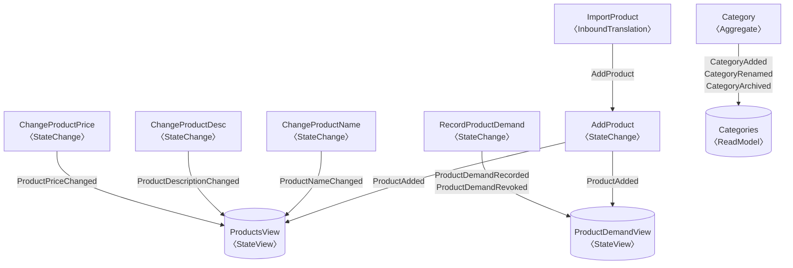
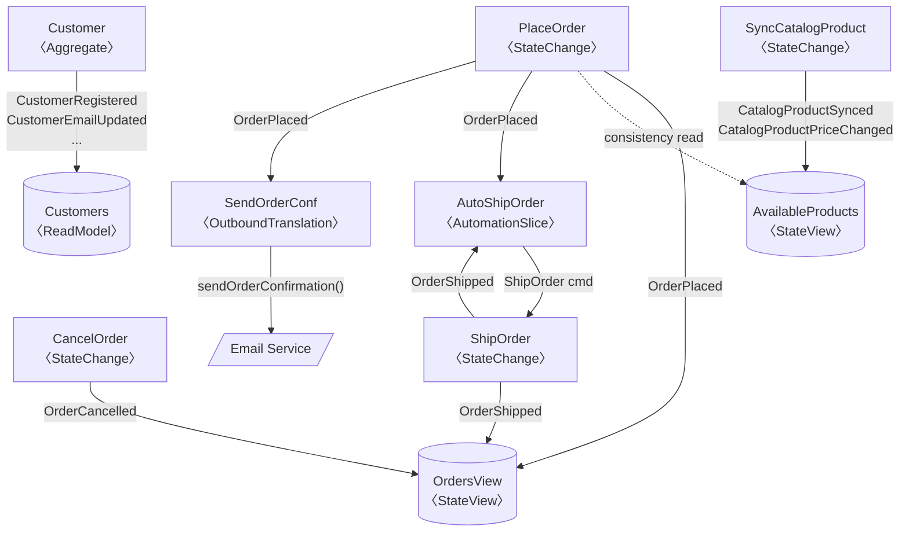
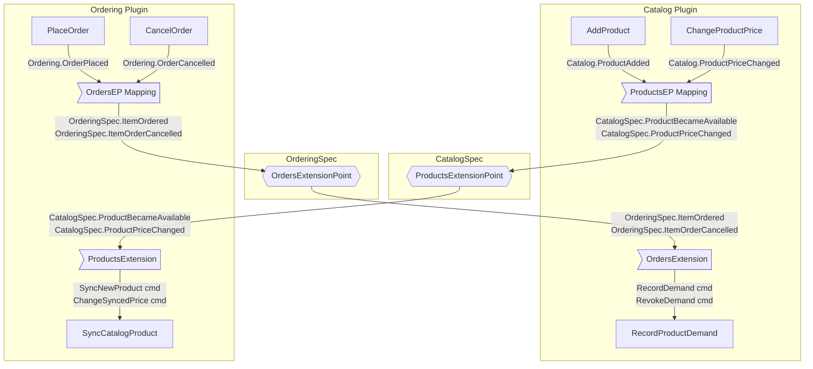

# Event Graph Linking

**Status:** Analysis — no implementation yet

---

## The Core Insight

An event-sourced system is, by definition, a directed graph: write-side components produce events, read-side components consume them. This graph is already latent in the Reventless type system — encoded in `@schema type event` and `@schema type consumedEvent` declarations on every component. No additional annotations are needed. The framework already holds enough information to materialise the full graph at plugin composition time.

This analysis asks: is that information complete, how would it be extracted and computed, and what could be built on top of it?

---

## Information Availability

The graph information is available in four distinct tiers. Understanding which tier each piece of data falls into determines how much implementation work is required to surface it.

---

### Tier 1 — Already in `uiDefinition` (implemented today)

The current `uiDefinition` type captures:

```rescript
type uiDefinition = {
  readModels: array<uiQueryableDef>,       // name, queryField, state schema
  stateViewSlices: array<uiQueryableDef>,  // name, queryField, state schema
  stateChangeSlices: array<uiWritableDef>, // name, command variant names + schemas
  aggregates: array<uiWritableDef>,        // name, command variant names + schemas
}
```

| Component | What is available |
|---|---|
| Aggregate | Name, command variant names and field schemas |
| ReadModel | Name, GraphQL query field, state schema |
| StateViewSlice | Name, GraphQL query field, state schema |
| StateChangeSlice | Name, command variant names and field schemas |

Everything else — consumed event types, produced event types, cross-component linkage, and all other component types — is absent.

---

### Tier 2 — Extractable today, no spec changes needed

All information in this tier is already present in module types or builder functor parameters. No changes to `Spec` interfaces are required. The only work is extracting it in `makeAutoUIDefinition` (or an equivalent function) and adding it to `uiDefinition`.

#### 2a — Data already in the Spec module types passed to `makeAutoUIDefinition`

These can be extracted by adding calls to `extractVariantNames` on schemas that are already accessible:

| Component | Data | Source |
|---|---|---|
| Aggregate | Produced event type names | `extractVariantNames(Spec.eventSchema)` |
| Aggregate | `level: Collection\|Instance` per command | Schema analysis: does the command variant include the state's `@id` field? |
| Aggregate | `aggregateIdField` per command | Same schema analysis — yields the field name |
| StateChangeSlice | Consumed event type names | `extractVariantNames(Spec.consumedEventSchema)` — PPX generates `consumedEventSchema` from `@schema type consumedEvent` |
| StateChangeSlice | Produced event type names | `extractVariantNames(Spec.eventSchema)` — PPX generates `eventSchema` from `@schema type event` |
| StateViewSlice | Consumed event type names | `extractVariantNames(Spec.consumedEventSchema)` |

The `StateViewSlice_Builder` already calls `DcbDecode.makeDecoder(Spec.consumedEventSchema)` at runtime — confirming the schema is accessible. The only missing step is calling `extractVariantNames` on it and surfacing the result.

#### 2b — Data in builder functor parameters not yet passed to `makeAutoUIDefinition`

These component types are wired in `Plugin.res` but are not currently passed to `makeAutoUIDefinition`. No spec changes are needed — only a new parameter on `makeAutoUIDefinition` for each type, and the generated `Plugin.res` must pass the modules through.

| Component | Data extractable | What to add to `makeAutoUIDefinition` |
|---|---|---|
| EventMapper | Source aggregate name(s) + source event types; target aggregate name | `~eventMappers: array<module(EventMapper.T)>` — `Mapping.Source.name`, `extractVariantNames(Mapping.Source.eventSchema)`, `Target.name` are all accessible |
| EventMapper | ReadModel source names (cross-reference Target with ReadModel list) | Same — `Target.name` matches the ReadModel name |
| SideEffect | Source aggregate name + triggered event type names | `~sideEffects: array<module(SideEffect.T)>` — `Source.name` and `extractVariantNames(Source.eventSchema)` |
| AutomationSlice | Consumed event type names; produced command type names | `~automationSlices: array<module(AutomationSlice.T)>` — `Spec.consumedEventSchema` and `Spec.commandSchema` |
| OutboundTranslationSlice | Consumed event type names; optional return command type names | `~outboundTranslationSlices: array<module(OutboundTranslationSlice.T)>` |
| InboundTranslationSlice | Produced command type names | `~inboundTranslationSlices: array<module(InboundTranslationSlice.T)>` |
| Extension | EP event type names; delegate (target) component name | `~extensions: array<module(Extension.T)>` — `ExtensionPoint.Spec.eventSchema`, `Delegate.name` |

EventMapper is the highest-value addition: it gives the only statically-typed, bidirectionally-named aggregate→aggregate edge in the system, and also resolves ReadModel source names as a side effect.

---

### Tier 3 — Extractable after extending component Specs

These gaps require adding a new field to a `Spec` module type. The field would be a simple string constant (`let targetName: string`) declared by the app developer alongside the existing command and event type declarations. No new annotation system is needed.

#### AutomationSlice — command target

The target aggregate or slice is currently injected at assembly via `~publishJsons`. Adding a `let targetName: string` to `AutomationSlice.Spec` would make the destination statically declarable:

```rescript
// in AutoShipOrder.res
let targetName = "ShipOrder"  // names the StateChangeSlice receiving the command
```

`makeAutoUIDefinition` can then expose this as the outbound command edge.

#### OutboundTranslationSlice — optional return command target

Same pattern: add `let targetName: option<string>` to `OutboundTranslationSlice.Spec` for slices that publish a command back into the system after the external call completes.

#### InboundTranslationSlice — command target

Add `let targetName: string` to `InboundTranslationSlice.Spec` to declare which component receives the translated commands.

#### Why these are Tier 3 and not Tier 2

The target is wired at assembly via `~publishJsons` — a runtime function reference, not a module. The Spec has no field that captures the destination. Even if `makeAutoUIDefinition` received these component modules, it could not determine the target from what the Spec currently exposes. A new `let targetName` constant is the minimal change that closes this gap without restructuring the assembly model.

#### Can targetName be auto-generated?

No. The `~publishJsons` function is an opaque function reference passed at plugin composition time — neither the PPX nor the `generate-plugin` generator can see across to the assembly context where this wiring is defined. The PPX operates at the individual spec file level; the generator sees module names but not how callbacks are constructed.

The declaration remains the developer's responsibility. However, `generate-plugin` can **validate** a declared `targetName` against the list of known component names at generation time, failing with a clear error if the name does not match any known aggregate, StateChangeSlice, or other command receiver. This narrows the maintenance gap: the developer declares the name once; the toolchain confirms it is valid on every generation pass.

---

### Tier 4 — Permanent gap (not resolvable statically)

These cannot be surfaced in the graph regardless of spec changes, because the information is only determined at runtime.

#### Task → aggregate routing

`Task.bucketCallback` returns `array<taskAction>` where a `taskAction` is `PublishCommands(aggregateName: string, array<Message.commandJson>)`. Both the target name (a plain string) and the command payload (raw JSON, not a schema type) are runtime values. Even with a `targetName` constant on `Task.Spec`, the actual `bucketCallback` is free to route to any aggregate at runtime based on the S3 event content.

#### EventMapping `PublishAsync` actions

The `EventMapping.action` type includes `PublishAsync(promise<array<(id, cmd)>>)`. The commands produced by this action are resolved asynchronously at runtime. Their types and targets are not statically knowable.

#### External side-effect behavior

`SideEffect.execute` and the external call in `OutboundTranslationSlice.translate` are opaque `promise<unit>` computations. What they do externally (HTTP requests, emails, third-party APIs) is intentionally outside the domain model and cannot be represented in the graph.

#### Transitive / saga-like flows

If `CommandA → EventA → AutomationSlice → CommandB → EventB → ReadModelY`, the indirect dependency between `CommandA` and `ReadModelY` is not representable without runtime trace data. The graph captures only direct, one-hop relationships (component produces event → component consumes event). Transitive relationships require execution tracing, not static analysis.

### Alternatives and What Is Missing

**Task → aggregate routing**: As an opt-in convention, `Task.Spec` could expose `let targetNames: array<string>` listing the aggregates a task typically routes to. This is advisory metadata — the actual `bucketCallback` remains free to route to any aggregate at runtime, so declared names are not enforced. The graph would represent these as soft edges (distinguished from the hard edges derived from types) to signal their advisory nature. Without this, commands issued by Tasks are invisible to impact analysis for event type changes and cannot be surfaced in Auto UI command linking.

**EventMapping `PublishAsync` actions**: No static alternative exists. Async callbacks are opaque by design; their resolved commands are unknowable at composition time. Flows involving `PublishAsync` appear in the graph with a terminal edge at the EventMapper node — downstream effects are invisible. In practice this affects a minority of event mappings.

**External side-effect behavior**: By design out of scope. The graph documents the domain model; what external systems do in response to a `SideEffect.execute` or `OutboundTranslationSlice.translate` call is intentionally outside the framework's knowledge boundary.

**Net missing coverage**: The gaps affect Tasks and async event mappings only. All interactive command flows — Aggregate, StateChangeSlice, AutomationSlice (with Tier 3 `targetName`), InboundTranslationSlice (with Tier 3 `targetName`) — and all read-side projections are fully representable. The missing edges do not prevent Auto UI command linking, impact analysis on DCB event types, or projection rebuild routing for the common cases.

---

## Building the Event Graph

### Intra-Plugin Graph (fully computable today)

At `makeAutoUIDefinition` time, `Plugin_Builder` already holds references to all component spec modules. Extracting the graph requires adding schema traversal for consumed/produced event types — no new language features, no new annotations, no runtime data collection.

The adjacency is computed by a combination of direct name references (for EventMapper and SideEffect) and event type name string matching (for DCB slice wiring):

```
Aggregate A produces event types {E1, E2} → A's own EventLog (not DcbEventLog)
StateChangeSlice SCS consumes {E1*} → produces {E3}   (* via SVS, see below)
StateViewSlice SVS consumes {E1, E2, E3}               (from DcbEventLog)
EventMapper EM: Source=A (E1,E2) → Target=B            ← explicit name reference
SideEffect SE: Source=A (E1)     → terminal            ← explicit name reference
AutomationSlice AS: consumedEvent={E3}, command=Cmd    ← target unknown from Spec

Resolved edges:
  A --[EM]--> SVS (via E1, E2 — EventMapper bridges A's EventLog into DcbEventLog;
                   SVS string-matches E1, E2 from the DCB log)
  SCS → SVS  (via E3 — string match in DcbEventLog)
  SVS ←-- SCS consistency read (SCS reads SVS as its DCB decision model — the
                                 arrow points FROM SVS TO SCS as a data dependency)
  A → B (via EM.Source.name / EM.Target.name — direct, collision-proof)
  A → SE (via SE.Source.name — direct, terminal node)
  AS → ? (command type known; target aggregate not resolvable from Spec)
```

**Can a StateViewSlice be connected to an Aggregate, or a StateChangeSlice to an Aggregate directly?**

No. Aggregates write to their own per-aggregate EventLog (a separate DynamoDB table per aggregate type). StateViewSlices and StateChangeSlices read from a shared DcbEventLog — a distinct storage mechanism. Events cannot cross between these two stores without an explicit bridge.

The only valid bridge is **EventMapper**: it consumes events from an Aggregate's EventLog and emits them as DCB events into the shared DcbEventLog. Only after that bridging step can a StateViewSlice pick up those events by string matching. The pattern `A → SVS` is always shorthand for `A → EventMapper → DcbEventLog → SVS`.

Similarly, a StateChangeSlice never reads directly from an Aggregate — it reads from a StateViewSlice to obtain its DCB consistency boundary. The path `A → SCS` (if it appears in an abstract diagram) means: *A's events, after bridging through EventMapper, populate a StateViewSlice which SCS then reads for consistency*. The graph edges are `A → EventMapper`, `EventMapper → SVS`, and `SVS ←→ SCS (consistency read)`, not a direct `A → SCS` edge.

EventMapping edges are the most reliable: they use explicit module name references rather than event type string matching, making them immune to name collisions. They should be extracted first and preferred over string-matched adjacency.

The `DcbTag.extractVariantNames` function performs schema traversal for string-matched edges. The full intra-plugin graph (including EventMapper and SideEffect edges) is computable in a few additional lines in `makeAutoUIDefinition`.

**Collection vs instance classification** for commands follows from whether the command schema includes the aggregate's `@id` field. This annotation is already present on state schemas; matching it against command field names is deterministic.

### Cross-Plugin Graph

The platform-level graph requires correlating event type strings across all registered plugins. Three mechanisms carry this information:

1. **Extension Point / Extension wiring** — explicit by construction. Each Extension names its source ExtensionPoint (in another plugin) and its target Delegate. These edges are unambiguous and carry full type information.

2. **EventMapping / EventMapper** — also explicit by construction. `Source.name` and `Target.name` are module references, not strings. When an EventMapper in Plugin B wires a `Source` from Plugin A, the cross-plugin edge is named precisely. This is the preferred mechanism for cross-aggregate event-to-command routing and should be treated as a first-class graph edge at the platform level.

3. **Event type name matching** — for cross-plugin event sharing without an explicit Extension or EventMapping, the same string-matching algorithm applies across plugin boundaries. This requires both plugins to share the same DcbEventLog instance — each plugin normally owns its own DcbEventLog, so this case only arises when two plugins are intentionally co-located on a single log.

   Co-location is deliberately uncommon. When it occurs, a StateViewSlice in Plugin B may consume `ProductAdded` events that were produced by Plugin A's StateChangeSlice, with no Extension or EventMapper in between. The graph can detect these edges automatically using the `{pluginName}.{variantName}` qualified names: only event names sharing the same plugin prefix and the same variant string are matched, making false positives from name coincidences across plugins structurally impossible.

   However, cross-plugin event sharing without explicit wiring is an architectural coupling smell — it creates an implicit dependency between two plugins that is invisible to the Extension Point contract system. The graph should surface these edges, but distinguish them from first-class Extension and EventMapping edges (e.g., with an `implicit` flag or a different visual weight). This gives maintainers visibility into accidental coupling rather than letting it pass silently.

The platform-level Admin already aggregates deployed plugin schemas. The cross-plugin graph can be computed at plugin registration time by the `Platform_Admin` aggregate, stored in a read model, and served via GraphQL.

---

## How and When to Compute It

### Option 1 — At Plugin Composition Time (deploy-time, per-plugin)

`makeAutoUIDefinition` (or a parallel `makeEventGraphDefinition`) computes intra-plugin edges when the plugin functor is applied. The result is a serialised graph fragment stored alongside the plugin's `uiDefinition` in the deployed schema registry.

**Advantage**: No runtime overhead; graph is static and matches the deployed code exactly.  
**Disadvantage**: Cross-plugin edges are not available at per-plugin composition time.

### Option 2 — At Platform Registration Time (deploy-time, platform-level)

When a plugin registers with the `Platform_Admin` aggregate (the existing `Plugin` aggregate), the platform aggregates all deployed graph fragments and computes cross-plugin edges by matching event type names and Extension wiring.

**Advantage**: Full cross-plugin graph with a single computation pass.  
**Disadvantage**: Requires platform deployment in its full form. For in-memory, an equivalent is available: when all plugin functors are applied inside `InMemory_Platform.Make(plugins)`, every plugin's graph fragment (produced at Option 1 composition time) is already in memory as a first-class value. A single pass over all collected `pluginDefinition` records resolves cross-plugin event type matches and Extension Point wiring, producing the same cross-plugin graph without any event sourcing infrastructure. The result is stored as a plain record in the platform value and is available immediately in local dev and test environments.

### Option 3 — Lazily at Query Time (runtime)

A `Platform_UIDefinitions` query resolver walks the plugin registry and computes edges on demand. This is the simplest to implement and appropriate for a first version, given that the graph is static (only changes when code is redeployed).

**Recommendation**: Start with Option 1 (intra-plugin, at composition time) to expose the data without requiring a full platform deployment. Add Option 2 to fill in cross-plugin edges when a platform is running. Option 3 is a reasonable interim for the resolver layer.

### Plugin Connect/Disconnect Behaviour

All three options handle late-connecting and reconnecting plugins correctly, because the underlying mechanism is event-sourced:

- **Initial registration**: a `PluginRegistered` event records the graph fragment; the `Platform_EventGraph` StateViewSlice picks it up on the next projection pass.
- **Plugin version update**: a new `PluginRegistered` event replaces the previous fragment for that plugin; the StateViewSlice rebuilds the relevant graph portion.
- **New plugin connecting to an existing platform**: registers normally; cross-plugin edges to already-registered plugins are computed when the StateViewSlice processes the new event.
- **Plugin deregistration**: requires a `PluginDeregistered` (or `PluginDeprecated`) event to tombstone the fragment. This event is not currently modelled in the platform spec and would need to be added if formal deregistration is required.

On any full replay (e.g., after a schema migration or a StateViewSlice bug fix), the graph is rebuilt from the complete `PluginRegistered` / `PluginDeregistered` history — no manual state reconstruction is needed. The in-memory equivalent is simpler: because all plugins are wired at startup, graph recomputation is just re-running the `InMemory_Platform.Make(plugins)` constructor.

---

## How to Provide It to Clients

### Function and Type Naming

`makeAutoUIDefinition` was named for its original use case: generating data for the Auto UI. As the graph extraction adds use cases — event graph queries, MCP tool enrichment, impact analysis, projection rebuild routing — the name no longer describes what the function does. It produces a structural description of the entire plugin: components, schemas, and connections. A more accurate name is `makePluginDefinition`, with the return type renamed from `uiDefinition` to `pluginDefinition`. Sub-types (`uiQueryableDef`, `uiWritableDef`, `uiCommandDef`) would follow: `queryableDef`, `writableDef`, `commandDef`.

This is a breaking change to the public API and would be versioned as a `feat!:` commit. A parallel `makeEventGraphDefinition` function is not recommended — it would split conceptually identical data into two functions and require callers to invoke both. Renaming the single function and updating callers is the cleaner approach.

The code examples below use the proposed `pluginDefinition` / `queryableDef` / `writableDef` / `commandDef` names.

---

The natural extension of `uiDefinition` is to add linkage fields to the existing types:

```rescript
// In Plugin.res (reventless-spec)
type commandLevel = Collection | Instance

type uiQueryableDef = {
  name: string,
  queryField: string,
  schema: string,
  linkedWriteSide: array<string>,    // names of aggregates/slices that produce events this view consumes
}

type uiWritableDef = {
  name: string,
  commands: array<uiCommandDef>,
  linkedViews: array<string>,        // names of state views / read models this write-side feeds
  consistencyRead: option<string>,   // for StateChangeSlices: the view that provides the DCB consistency boundary
}

type uiCommandDef = {
  name: string,
  schema: string,
  level: commandLevel,               // derived without heuristics — from schema field analysis
  aggregateIdField: option<string>,  // field name carrying the entity id, for row context menus
}
```

The `consistencyRead` field on `uiWritableDef` is the DCB-specific relationship: it names the StateViewSlice a StateChangeSlice reads to build its decision model. This is the most semantically valuable relationship for UI placement — the command panel belongs adjacent to the view it reads.

### Serving It via a StateViewSlice

The event graph data is naturally a platform-level read model. A `Platform_EventGraph` StateViewSlice on the Admin plugin could project plugin registration events into a queryable graph structure, making the graph available via GraphQL without a dedicated resolver.

This also means the graph is live: when a new plugin version is deployed (new events registered), the StateViewSlice automatically rebuilds the graph view. No manual cache invalidation.

```
Platform.Plugin (aggregate) → PluginRegistered event → Platform_EventGraph (StateViewSlice)
  └── queryable via: platformEventGraph { nodes { name kind } edges { from to viaEvents } }
```

---

## Additional Opportunities

The event graph is not only for Auto UI command linking. Several capabilities fall out of the same data. The opportunities covered here are part of the open-source framework scope. Commercial and tooling extensions (Impact Analysis, Projection Rebuild Routing, Testing Scaffolding) are analysed separately in the business repo at `docs/analysis/event-graph-commercial-extensions.md`.

### Accurate Auto UI Without Naming Conventions

The primary motivation from the UI analysis. With `linkedViews` and `consistencyRead` populated by the framework, the Auto UI can place command buttons and panels with zero naming heuristics. This is covered in the UI analysis; the core contribution here is generating the data.

### Zero-Configuration Command Panels

Knowing which StateChangeSlice commands target which StateViewSlice, and having `level: Collection | Instance` per command, the framework can generate a basic command panel layout without any configuration:

- Collection-level commands → header button on the list view
- Instance-level commands → row context menu, with the aggregate id injected from the selected row

This requires no plugin developer input beyond the schemas already written. A correct, navigable, command-capable domain UI is a zero-configuration output of the framework.

### MCP Tool Descriptions

The framework already generates MCP tools from command schemas. The event graph adds context: an MCP tool description can state "this command will update the Products and Orders views" rather than describing only the command payload. This makes AI-assisted command usage significantly more grounded.

---

## Open-Source Scope

The event graph computation belongs in the open-source framework for the same reason `@schema` and auto-generated GraphQL belong there: it falls directly out of the type system that every Reventless plugin already uses. It requires no annotations, no configuration, and no opt-in. The graph is a structural property of correct Reventless code.

The following capabilities are part of the open-source scope:

- **Graph extraction** in `makePluginDefinition` / `Plugin_Builder` — intra-plugin edges from schema traversal
- **Platform-level graph aggregation** in `Platform_Admin` — cross-plugin edges from plugin registration
- **`Platform_EventGraph` StateViewSlice** — queryable graph read model via GraphQL
- **`pluginDefinition` extensions** — `linkedViews`, `consistencyRead`, `level`, `aggregateIdField` fields
- **Zero-Configuration Command Panels** — Auto UI command linking for both aggregates and DCB slices, with correct collection/instance classification and aggregate id injection

---

## Concrete Example: online-shop-hybrid

The hybrid online shop (`examples/online-shop-hybrid/`) has two plugins — **Catalog** and **Ordering** — that interact via two Extension Points. This example covers every component type discussed in this analysis and serves as the reference for what a fully-computed event graph looks like in practice.

### Namespaced Event and Command Inventory

| Plugin | Component | Type | Produces | Consumes |
|---|---|---|---|---|
| Catalog | Category | Aggregate | `Catalog.CategoryAdded` `Catalog.CategoryRenamed` `Catalog.CategoryArchived` | commands: `Add` `Rename` `Archive` |
| Catalog | AddProduct | StateChangeSlice | `Catalog.ProductAdded` | `Catalog.ProductAdded` (self-check), commands: `AddProduct` |
| Catalog | ChangeProductName | StateChangeSlice | `Catalog.ProductNameChanged` | `Catalog.ProductAdded` `Catalog.ProductNameChanged` |
| Catalog | ChangeProductDescription | StateChangeSlice | `Catalog.ProductDescriptionChanged` | `Catalog.ProductAdded` `Catalog.ProductDescriptionChanged` |
| Catalog | ChangeProductPrice | StateChangeSlice | `Catalog.ProductPriceChanged` | `Catalog.ProductAdded` `Catalog.ProductPriceChanged` |
| Catalog | RecordProductDemand | StateChangeSlice | `Catalog.ProductDemandRecorded` `Catalog.ProductDemandRevoked` | `Catalog.ProductDemandRecorded` `Catalog.ProductDemandRevoked` |
| Catalog | ImportProduct | InboundTranslationSlice | commands: `AddProduct` (→ AddProduct SCS) | external CSV/API input |
| Catalog | CategoriesReadModel | ReadModel | — | `Catalog.CategoryAdded` `Catalog.CategoryRenamed` `Catalog.CategoryArchived` (via EventMapper) |
| Catalog | ProductsView | StateViewSlice | — | `Catalog.ProductAdded` `Catalog.ProductNameChanged` `Catalog.ProductDescriptionChanged` `Catalog.ProductPriceChanged` |
| Catalog | ProductDemandView | StateViewSlice | — | `Catalog.ProductAdded` `Catalog.ProductDemandRecorded` `Catalog.ProductDemandRevoked` |
| CatalogSpec | ProductsExtensionPoint | ExtensionPoint | `CatalogSpec.ProductBecameAvailable` `CatalogSpec.ProductPriceChanged` | — |
| Ordering | Customer | Aggregate | `Ordering.CustomerRegistered` `Ordering.CustomerEmailUpdated` `Ordering.CustomerAddressUpdated` `Ordering.CustomerDeactivated` | commands: `Register` `UpdateEmail` `UpdateAddress` `Deactivate` |
| Ordering | PlaceOrder | StateChangeSlice | `Ordering.OrderPlaced` | `Ordering.OrderPlaced` `Ordering.CatalogProductSynced` (consistency) |
| Ordering | CancelOrder | StateChangeSlice | `Ordering.OrderCancelled` `Ordering.OrderReopened` | `Ordering.OrderPlaced` `Ordering.OrderShipped` `Ordering.OrderCancelled` `Ordering.OrderReopened` |
| Ordering | ShipOrder | StateChangeSlice | `Ordering.OrderShipped` | `Ordering.OrderPlaced` `Ordering.OrderShipped` `Ordering.OrderCancelled` |
| Ordering | RefundOrder | StateChangeSlice | `Ordering.RefundIssued` | `Ordering.OrderPlaced` `Ordering.OrderCancelled` `Ordering.RefundIssued` |
| Ordering | SyncCatalogProduct | StateChangeSlice | `Ordering.CatalogProductSynced` `Ordering.CatalogProductPriceChanged` | `Ordering.CatalogProductSynced` `Ordering.CatalogProductPriceChanged` |
| Ordering | AutoShipOrder | AutomationSlice | commands: `ShipOrder` (→ ShipOrder SCS) | `Ordering.OrderPlaced` `Ordering.OrderShipped` |
| Ordering | SendOrderConfirmation | OutboundTranslationSlice | external email call | `Ordering.OrderPlaced` |
| Ordering | CustomersReadModel | ReadModel | — | `Ordering.CustomerRegistered` `Ordering.CustomerEmailUpdated` `Ordering.CustomerAddressUpdated` `Ordering.CustomerDeactivated` (via EventMapper) |
| Ordering | OrdersView | StateViewSlice | — | `Ordering.OrderPlaced` `Ordering.OrderShipped` `Ordering.OrderCancelled` |
| Ordering | AvailableProducts | StateViewSlice | — | `Ordering.CatalogProductSynced` `Ordering.CatalogProductPriceChanged` |
| OrderingSpec | OrdersExtensionPoint | ExtensionPoint | `OrderingSpec.ItemOrdered` `OrderingSpec.ItemOrderCancelled` | — |

### Cross-Plugin Wiring

| Direction | Mechanism | Source events | Target commands | Target component |
|---|---|---|---|---|
| Catalog → Ordering | Extension: `ProductsExtension` | `CatalogSpec.ProductBecameAvailable` `CatalogSpec.ProductPriceChanged` | `SyncNewProduct` `ChangeSyncedPrice` | `SyncCatalogProduct` SCS |
| Ordering → Catalog | Extension: `OrdersExtension` | `OrderingSpec.ItemOrdered` `OrderingSpec.ItemOrderCancelled` | `RecordDemand` `RevokeDemand` | `RecordProductDemand` SCS |

Note that `CatalogSpec.ProductPriceChanged` (the EP event) and `Catalog.ProductPriceChanged` (the DCB event in the Catalog log) share the same constructor name but are distinct namespaced events. Without plugin and spec qualification these are indistinguishable.

### Event Graph Diagrams

Intra-plugin diagrams use short event names (namespace omitted). The cross-plugin diagram uses fully-qualified names (`Plugin.EventName` / `PluginSpec.EventName`).

#### Catalog Plugin — intra-plugin event flows



#### Ordering Plugin — intra-plugin event flows



#### Cross-plugin wiring



### What the Graph Reveals

**Fully typed, no inference needed:**
- Category → CategoriesReadModel (EventMapper: source and target both named in module types)
- Customer → CustomersReadModel (EventMapper: same)
- ProductsExtensionPoint → SyncCatalogProduct (Extension: EP and Delegate both named)
- OrdersExtensionPoint → RecordProductDemand (Extension: EP and Delegate both named)

**Resolved by event type string matching (namespaced, collision-free within plugin):**
- All DCB StateChangeSlice → StateViewSlice edges
- AutomationSlice consumed events (OrderPlaced, OrderShipped → AutoShipOrder)

**Half-open edges (command type known, target aggregate not in Spec):**
- AutoShipOrder produces `ShipOrder cmd` → target is wired at assembly, not typed in Spec
- SendOrderConfirmation: terminal (calls external email service, no domain return)
- ImportProduct produces `AddProduct cmd` → target wired at assembly

**Not resolvable from schemas:**
- Email API call from SendOrderConfirmation (intentionally external)

---

## Challenges

### Event and Command Namespacing

`DcbTag.extractVariantNames` returns bare constructor strings — `"ProductAdded"`, `"OrderPlaced"` — with no plugin prefix. This is sufficient within a single plugin (names are unique within one DcbEventLog by construction) but is ambiguous at the platform level. The graph metadata must qualify every event and command type with its origin:

- **DCB events / commands**: `{pluginName}.{variantName}` — e.g. `Catalog.ProductAdded`, `Ordering.OrderPlaced`
- **Aggregate events / commands**: same scheme — `Catalog.CategoryAdded`, `Ordering.CustomerRegistered`
- **Extension Point events**: `{specPackageName}.{variantName}` — e.g. `CatalogSpec.ProductBecameAvailable`, `OrderingSpec.ItemOrdered`

The plugin name is available as a parameter to `makeAutoUIDefinition`, so the `Plugin_Builder` can produce fully-qualified event type names without any app-developer annotation.

**A concrete collision without namespacing**: the `online-shop-hybrid` example has `ProductPriceChanged` as both a DCB event in Catalog's log (produced by `ChangeProductPrice`) and as an event on the `CatalogSpec.ProductsExtensionPoint`. Without the `Catalog.` and `CatalogSpec.` prefixes, a naive string-matching graph would treat them as the same node and produce incorrect edges.

### Event Type Name Collisions Across Plugins

Two different plugins could define a DCB event named `ItemAdded` in their respective logs. Cross-plugin matching via bare string equality would incorrectly link unrelated components. The Extension Point / Extension mechanism is the correct cross-plugin linkage — it is explicit and does not rely on name matching. Cross-plugin event type matching should be avoided unless constrained to the same DcbEventLog scope. The `{pluginName}.{variantName}` qualification makes this constraint enforceable: only names sharing the same plugin prefix can be matched by string equality.

### Indirect / Mediated Relationships

Event sourcing systems often have automation slices or outbound translation slices that consume Event A and produce Event B. Transitive graph traversal would link the original command to a distant read model, even if the relationship is indirect (mediated by a saga or integration). A depth limit of one hop (direct event sharing only) is the correct default.

### Many-to-Many Relationships

A StateChangeSlice may produce events consumed by multiple StateViewSlices. The `linkedViews` array handles this correctly. The UI must decide which view is primary — the `consistencyRead` field provides this tiebreaker for DCB slices: the view a slice reads for consistency is the view its command panel belongs adjacent to.

### Incremental Build Cost

At deploy time, graph extraction adds one pass over all component schemas per plugin. This is negligible. At platform registration time, the cross-plugin correlation is O(P × E) where P is the number of plugins and E is the number of distinct event types — acceptable for all realistic deployment sizes.

---

## Summary

The full event graph — intra-plugin and cross-plugin — is computable from information already present in the type system. The gaps are not information gaps but extraction gaps: the data exists in `@schema type consumedEvent` and `@schema type event` declarations on every component, but is not yet serialised into `uiDefinition` or any queryable structure.

Adding extraction to `makeAutoUIDefinition` yields intra-plugin edges with no new language features. Adding a `Platform_EventGraph` StateViewSlice on the Admin plugin yields a platform-wide queryable graph updated automatically on plugin registration. The `uiDefinition` extensions (`linkedViews`, `consistencyRead`, `level`, `aggregateIdField`) give clients the pre-computed result without requiring them to traverse the raw graph.

The core investment is small. The surface it unlocks — accurate Auto UI command linking, auth UI, impact analysis, projection rebuild routing, MCP tool enrichment — is large.
