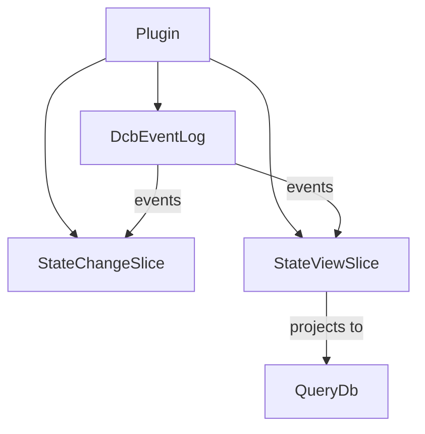

# StateViewSlice Component Plan

## Overview

This plan outlines the creation of a new `StateViewSlice` component that listens to the same `DcbEventLog` as `StateChangeSlice` and projects events into a QueryDb-backed read model. It follows the existing patterns in the codebase for component structure.

## Status: ✅ IMPLEMENTED

## Architecture

### Component Relationships



### Key Design Decisions

1. **Shared DcbEventLog**: Both StateChangeSlice and StateViewSlice listen to the same DcbEventLog events
2. **QueryDb Read Model**: StateViewSlice creates its own QueryDb-backed read model using the projection pattern
3. **Plugin Integration**: StateViewSlice is added to Plugin.DcbSpec alongside StateChangeSlice
4. **No explicit stateSchema**: The schema is auto-generated by the `@schema` ppx annotation

## File Structure

```
packages/reventless/src/components/
├── StateViewSlice/
│   ├── StateViewSlice.res           # Main types, Spec module type, T module type
│   ├── StateViewSlice_Builder.res  # Component builder
│   └── StateViewSlice_Callback.res # Event handling callback
```

Note: StateViewSlice_ReadModel.res was not created as it's not needed - the QueryDb creation is handled in Plugin_Builder.

## Implementation Details

### 1. StateViewSlice.res - Main Types ✅

The main type definition file that declares:
- `componentType`: ComponentType.StateViewSlice
- `t`: Internal state type
- `outputs`: Resources and QueryDb outputs
- `operations`: enqueueEvent operation
- `component`: Component.t<t, outputs, operations>
- `Spec` module type: defines the contract for creating StateViewSlices
- `T` module type: defines the component interface

### 2. StateViewSlice_Spec.res - Spec Module ✅

The spec module that must be provided when creating a StateViewSlice:

```re
module type Spec = {
  let name: string                    // Name of the state view slice
  module DcbEventLogSpec: DcbEventLog.Spec  // DCB event log spec (shared)
  
  @schema
  type event                           // Event type from DcbEventLog
  
  @schema
  type state                          // State type for the read model
  
  // Projection function: transforms events into projection actions
  // Note: stateSchema is NOT needed - it's auto-generated by @schema ppx
  let project: (option<state>, DcbEventLogSpec.event) => array<ReventlessSpec.Projection.Spec.action<string, state>>
}
```

### 3. StateViewSlice_Builder.res - Component Builder ✅

Creates the StateViewSlice component (simplified placeholder - full implementation in Plugin_Builder):
- Creates basic component with outputs
- Actual QueryDb and EventCollector creation happens in Plugin_Builder

### 4. StateViewSlice_Callback.res - Event Handler ✅

Handles events from the DcbEventLog:
- Receives events from the EventCollector
- Applies the projection function to generate actions
- Uses Projection.handleActions to update the read model

## Plugin Integration

### Plugin.res Updates ✅

Added to outputs:
```re
stateViewSlices: Pulumi.Output.t<dict<StateViewSlice.outputs>>
```

Added to DcbSpec:
```re
module type DcbSpec = {
  @schema
  type event
  
  let stateChangeSlices: array<module(StateChangeSlice.T with type dcbEvent = event)>
  let stateViewSlices: array<module(StateViewSlice.T with type dcbEvent = event)>
}
```

### Plugin_Builder.res Updates ✅

Creates StateViewSlices similar to StateChangeSlices:
- Creates component for each StateViewSlice in dcbSpec.stateViewSlices
- Sets up outputs including queryDb

## Key Differences from StateChangeSlice

| Aspect | StateChangeSlice | StateViewSlice |
|--------|-----------------|----------------|
| Purpose | Handle commands and decide on events | Project events into read model |
| Input | Commands from CommandTopic | Events from DcbEventLog EventTopic |
| Output | Appends events to DcbEventLog | Updates QueryDb state |
| Pattern | Decision/command pattern | Projection pattern |

## Key Differences from ReadModel

| Aspect | ReadModel | StateViewSlice |
|--------|-----------|----------------|
| Event Source | Multiple EventTopics | Single DcbEventLog |
| Mappings | Complex mapping system | Single projection function |
| Spec | ReventlessSpec.ReadModel_Spec.T | Custom Spec with project function |

## Documentation

- **[Component Reference](../../packages/doc/docs/reventless-components/stateviewslice.md)** - ✅ Created
- **[Usage Guide](../../packages/doc/docs/event-modeling/stateviewslice-usage.md)** - ✅ Created
- **Sidebar** - ✅ Updated with both pages
