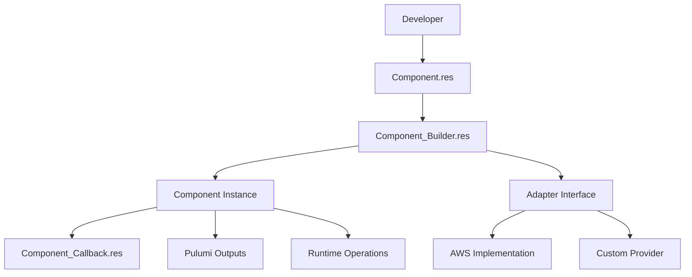
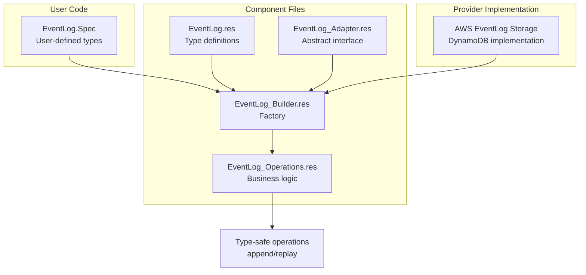

# Plan: Document Component Structure Pattern in Reventless

## Overview

This plan outlines how to document the **Component Structure Pattern** used throughout the Reventless framework. This pattern is currently only mentioned in [`CLAUDE.md`](../CLAUDE.md) but not in the user-facing documentation.

## Current State Analysis

### Pattern Discovered

The Reventless framework follows a consistent multi-file pattern for components. The core files are required, while optional files are used based on component needs:

**Core Files (Required):**
1. **`Component.res`** - Type definitions, outputs, and component interface
2. **`Component_Builder.res`** - Factory pattern using first-class modules to create component instances

**Optional Files:**
3. **`Component_Adapter.res`** - Provider-agnostic adapter interface for infrastructure dependencies
4. **`Component_Operations.res`** - Runtime business logic implementation (type-safe operations)
5. **`Component_Callback.res`** - Runtime callback handling (for components that handle events/commands)

### Examples in Codebase

**Aggregate Component:**
- `Aggregate.res` - Defines types (`outputs`, `operations`, `component`), module type `T`, helper functions
- `Aggregate_Builder.res` - `Make` functor that constructs aggregate instances
- `Aggregate_Callback.res` - `Make` functor that creates command handlers

**ReadModel Component:**
- `ReadModel.res` - Defines types and module type `T`
- `ReadModel_Builder.res` - `Make` functor for construction

**EventLog Component (Complete Example with All Optional Files):**
- `EventLog.res` - Defines types (`outputs`, `append`, `replay`), module type `Spec` and `T`
- `EventLog_Builder.res` - `Make` functor that wires together Storage adapter and EventTopic
- `EventLog_Adapter.res` - Defines provider-agnostic `Storage` module type for persistence
- `EventLog_Operations.res` - Implements type-safe `append` and `replay` operations with encoding/decoding

**CommandTopic Component:**
- `CommandTopic.res` - Type definitions
- `CommandTopic_Builder.res` - Factory implementation

### Key Architectural Patterns

1. **First-class modules with module types**: Components use `module type T` for type-safe configuration
2. **Builder pattern**: `Component_Builder.res` files contain `Make` functors
3. **Pulumi.Output.t wrapping**: All infrastructure values wrapped for deploy-time/runtime separation
4. **Generic Component wrapper**: `Component.t<'component, 'outputs, 'operations>` provides unified interface
5. **Separation of concerns**: 
   - `.res` = interface & types
   - `_Builder.res` = construction logic
   - `_Callback.res` = runtime handlers

## Documentation Plan

### 1. Create New Document

**Location:** `packages/doc/docs/inner-workings/component-structure-pattern.md`

**Target Audience:**
- Framework contributors
- Advanced users extending the framework
- Developers creating custom components

**Document Outline:**

```markdown
---
title: Component Structure Pattern
date: 2026-01-24
draft: false
---

## Overview
Brief explanation of the standardized component structure

## The Three-File Pattern

### Component.res - Interface & Types
- Purpose: Define the component's public interface
- Contains: type definitions, module types, helper functions
- Example structure from Aggregate

### Component_Builder.res - Factory & Construction
- Purpose: Create component instances using builder pattern
- Contains: Make functor with all dependencies
- Example: EventLog_Builder.Make
- Explanation of first-class modules pattern

### Component_Adapter.res - Provider-Agnostic Interface (Optional)
- Purpose: Define abstract interface for infrastructure dependencies
- When used: When component needs external storage, messaging, or other infrastructure
- Contains: Module types that abstract away provider-specific implementations
- Example: EventLog_Adapter.Storage

### Component_Operations.res - Runtime Business Logic (Optional)
- Purpose: Implement type-safe runtime operations
- When used: When component has complex business logic that operates on typed data
- Contains: Make functor that transforms generic adapter operations into type-safe operations
- Example: EventLog_Operations.Make

### Component_Callback.res - Runtime Handlers (Optional)
- Purpose: Implement runtime behavior (event/command handlers)
- When used: For components that process messages at runtime
- Example: Aggregate_Callback.Make

## Generic Component Wrapper

### Component.t<'component, 'outputs, 'operations>
- Unified interface for all components
- How it integrates with Pulumi
- outputs vs operations distinction

## Adapter Pattern Integration

### Separation from Components
- Adapters live in adapter/ directories
- Provider-agnostic vs provider-specific
- Deploy-time vs runtime separation

## Creating a New Component

### Step-by-step guide
1. Define types in Component.res
2. Create module type T
3. Implement Builder with Make functor
4. Add Callback if needed
5. Create adapter interface

### Code Template
Minimal working example

## Rationale

### Why This Pattern?
- Type safety through module types
- Clear separation of concerns
- Testability
- Provider independence
- Pulumi integration

## Examples in Codebase
Links to existing components demonstrating the pattern
```

### 2. Update Existing Documentation

#### `packages/doc/docs/inner-workings/framework-inner-workings.md`

Add introductory section with links:

```markdown
## Framework Architecture Patterns

Reventless follows several key architectural patterns:

### Component Structure Pattern

All framework components follow a standardized structure pattern using a three-file organization:
- `Component.res` - Interface and type definitions
- `Component_Builder.res` - Factory and construction logic  
- `Component_Callback.res` - Runtime behavior handlers (when applicable)

[Learn more about the Component Structure Pattern →](./component-structure-pattern.md)

### Other Patterns

- [Messages](./messages.md) - How messages flow through the system
- [Pulumi Integration](./pulumi.md) - Deploy-time vs runtime separation
- [AWS Adapters](./aws-adapters/) - Provider-specific implementations
```

#### Update Component-Specific Docs

Add callout boxes to:
- `packages/doc/docs/reventless-components/aggregate.md`
- `packages/doc/docs/reventless-components/readmodel.md`
- `packages/doc/docs/reventless-components/plugin.md`

Example callout:

```markdown
:::info Framework Implementation
This component follows the Reventless [Component Structure Pattern](../inner-workings/component-structure-pattern.md), using separate files for interface definitions, builder logic, and runtime callbacks.
:::
```

### 3. Enhance CLAUDE.md

Update the "Component structure pattern" section to reference the new documentation:

```markdown
### Component Structure Pattern

Components follow a standardized three-file pattern (documented in `packages/doc/docs/inner-workings/component-structure-pattern.md`):

- `Component.res` - Type definitions, outputs, and module type `T`
- `Component_Builder.res` - Factory using first-class modules
- `Component_Callback.res` - Runtime handlers (where applicable)

See the documentation for detailed explanations and examples.
```

### 4. Add Mermaid Diagrams

Include visual representations in the new document:



### 5. Code Examples to Include

1. **Minimal Component** - Show all three files for a simple example
2. **EventLog** - Demonstrate the pattern with a real component
3. **Module Type Usage** - Show the `module type T` pattern
4. **Builder Functor** - Explain the `Make` functor signature
5. **Component.t wrapper** - Show how generic wrapper is used

## Implementation Steps

1. Create `component-structure-pattern.md` with full content
2. Update `framework-inner-workings.md` with links
3. Add callout boxes to component docs (aggregate.md, readmodel.md, etc.)
4. Update `CLAUDE.md` to reference new docs
5. Review and refine with examples from codebase
6. Add to sidebar navigation in `packages/doc/sidebars.js`

## Benefits

- **Onboarding**: New contributors understand codebase organization quickly
- **Consistency**: Clear pattern for creating new components
- **Maintainability**: Documents design decisions and rationale
- **Extension**: Easier for users to create custom components
- **Knowledge sharing**: Bridges gap between user docs and implementation details

## Related Documentation

- [Messages](../inner-workings/messages.md) - Message flow patterns
- [Pulumi Integration](../inner-workings/pulumi.md) - Infrastructure as code
- [ReScript Syntax](../rescript-syntax.md) - Language features used (functors, first-class modules)
- [Aggregate Component](../reventless-components/aggregate.md) - Example usage
- [ReadModel Component](../reventless-components/readmodel.md) - Example usage

## Notes

- The pattern is consistent across core components (Aggregate, ReadModel, EventLog, CommandTopic, QueryDb, etc.)
- Adapter implementations follow similar but slightly different patterns (separate directory structure)
- Not all components need `_Callback.res` - only those with runtime message handlers
- The `Component.res` generic wrapper is defined in `packages/reventless/src/components/Component.res`

---

## Detailed Example: EventLog Component

The EventLog component demonstrates the complete pattern with all optional files. Here's how each file contributes:

### File Structure

```
packages/reventless/src/components/EventLog/
├── EventLog.res           # Core types and interface
├── EventLog_Builder.res   # Factory/construction
├── EventLog_Adapter.res   # Provider-agnostic adapter interface
└── EventLog_Operations.res # Runtime business logic
```

### 1. EventLog.res - Interface & Types

Defines the component's public interface:

```rescript
// Type definitions
type outputs = {resources: array<resource>, eventTopic: EventTopic.outputs}
type append<'id, 'event> = (int, 'id, array<'event>) => promise<result<unit, string>>
type replay<'id, 'event> = 'id => promise<array<'event>>

// Spec module type - what users provide
module type Spec = {
  module Id: ReventlessSpec.Id.T
  let name: string
  @schema type event
}

// T module type - what the component exposes
module type T = {
  module Spec: Spec
  type operations = {
    append: append<Spec.Id.t, Message.event'<Spec.Id.t, Spec.event>>,
    replay: replay<Spec.Id.t, Spec.event>,
  }
  let make: (~name: string, ~opts: Pulumi.ComponentResource.options=?) => component
}
```

### 2. EventLog_Adapter.res - Provider-Agnostic Interface

Defines abstract interface for storage implementations:

```rescript
// Generic operations using string/JSON - provider-agnostic
type operations = {
  append: EventLog.append<string, Js.Json.t>,
  replay: EventLog.replay<string, Js.Json.t>,
}

// Storage type returned by adapter implementations
type storage = {
  resources: array<ReventlessSpec.Adapter.resource>,
  operations: Pulumi.Output.t<operations>,
}

// Module type that adapter implementations must satisfy
module type Storage = {
  let make: (~name: string, ~opts: Pulumi.CustomResourceOptions.t) => storage
}
```

**Key insight:** The adapter uses `string` for IDs and `Js.Json.t` for events - these are generic types that any provider can work with. The type-safe conversion happens in Operations.

### 3. EventLog_Operations.res - Runtime Business Logic

Transforms generic adapter operations into type-safe operations:

```rescript
// Dependencies module type
module type Ops = {
  module Spec: EventLog.Spec
  module EventTopic: EventTopic.T with module Spec.Id = Spec.Id
  let eventTopic: EventTopic.operations
  let storage: EventLog_Adapter.operations  // Generic operations
}

// Output module type
module type T = {
  module Spec: EventLog.Spec
  let append: EventLog.append<Spec.Id.t, Message.event'<Spec.Id.t, Spec.event>>
  let replay: EventLog.replay<Spec.Id.t, Spec.event>
}

// Make functor - transforms generic to type-safe
module Make = (Spec: EventLog.Spec, Ops: Ops with module Spec = Spec): T => {
  // Encoding: Spec.event -> Js.Json.t
  let encodeEvent' = (id, event') => { ... }
  
  // Decoding: Js.Json.t -> Spec.event
  let decodeEvent = (id, json) => { ... }
  
  // Type-safe append using generic storage
  let append = async (sequenceNr, id, events') => {
    let eventsJson = events'->encodeEvents'(id)
    await Ops.storage.append(sequenceNr, id->Spec.Id.toString, eventsJson)
  }
  
  // Type-safe replay using generic storage
  let replay = async id => {
    let eventsJson = await Ops.storage.replay(id->Spec.Id.toString)
    eventsJson->decodeEvents(id->Spec.Id.toString)
  }
}
```

**Key insight:** Operations handles serialization/deserialization, converting between type-safe domain types and generic JSON that adapters work with.

### 4. EventLog_Builder.res - Factory & Construction

Wires everything together:

```rescript
module Make = (
  Spec: EventLog.Spec,
  Storage: EventLog_Adapter.Storage,      // Adapter interface
  EventTopicPublisher: EventTopic_Adapter.Publisher,
): EventLog.T => {
  
  let construct = (self, name) => {
    // Create storage using adapter
    let storage = Storage.make(~name, ~opts)
    
    // Create event topic
    module SpecificEventTopic = EventTopic_Builder.Make(Spec, EventTopicPublisher)
    let eventTopic = SpecificEventTopic.make(~name, ~storageResources=storage.resources, ~opts)
    
    // Wire operations at runtime
    self->Component.setOperations(
      (storage.operations, eventTopic->Component.operations)
      ->Pulumi.Output.all2
      ->Pulumi.Output.apply(((storage, eventTopic)) => {
        // Create Ops module with runtime values
        module Ops = {
          module Spec = Spec
          module EventTopic = SpecificEventTopic
          let eventTopic = eventTopic
          let storage = storage
        }
        // Create type-safe operations
        module Runtime = EventLog_Operations.Make(Spec, Ops)
        {append: Runtime.append, replay: Runtime.replay}
      }),
    )
  }
}
```

### Data Flow Diagram



### Why This Pattern?

1. **Type Safety**: User works with `Spec.event` types, never raw JSON
2. **Provider Independence**: Swap AWS for another provider by implementing `EventLog_Adapter.Storage`
3. **Separation of Concerns**:
   - `EventLog.res` - What the component is
   - `EventLog_Adapter.res` - What infrastructure it needs
   - `EventLog_Operations.res` - How it processes data
   - `EventLog_Builder.res` - How it's constructed
4. **Testability**: Each layer can be tested independently
5. **Pulumi Integration**: Builder handles deploy-time vs runtime separation via `Pulumi.Output.t`