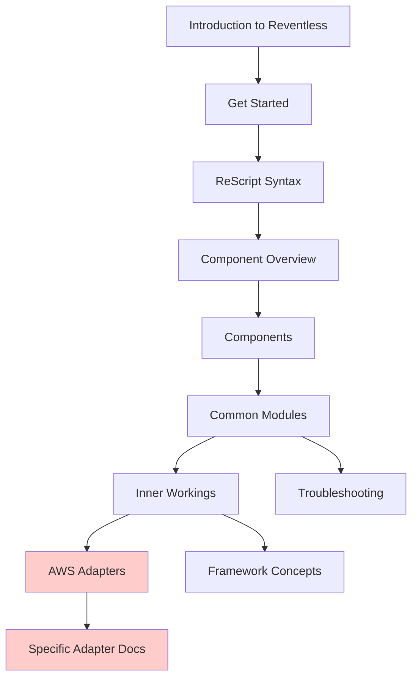
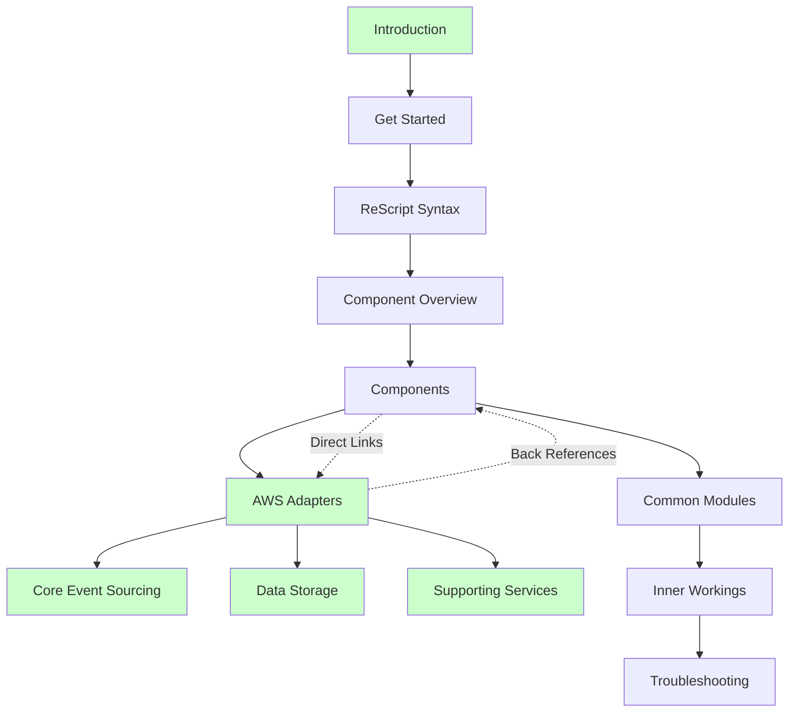
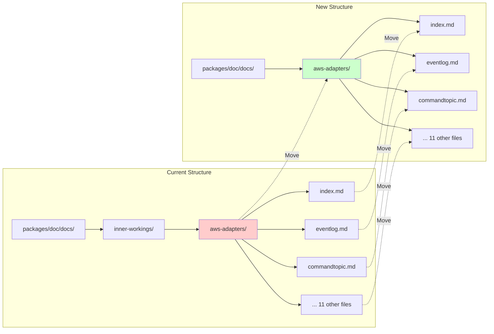
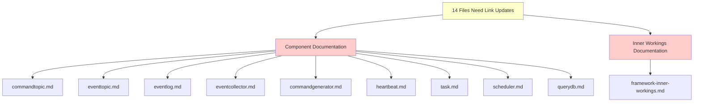
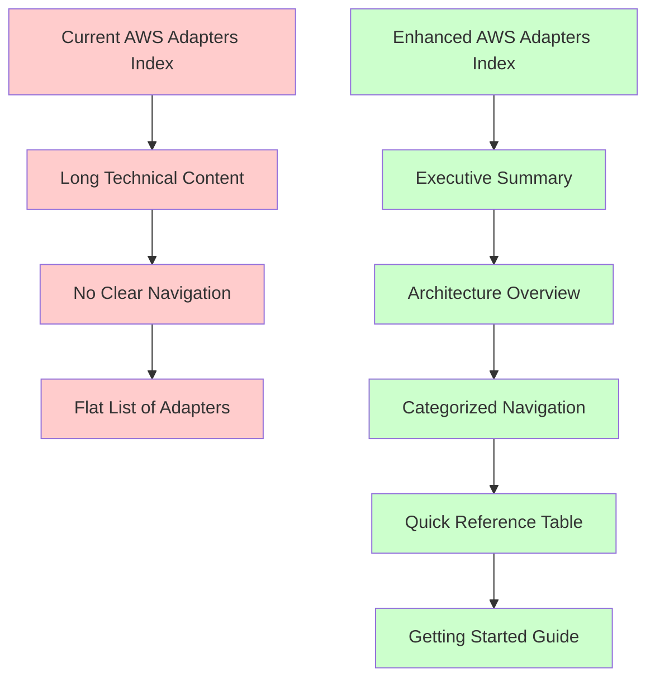
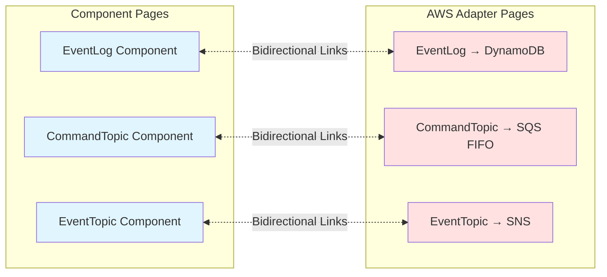
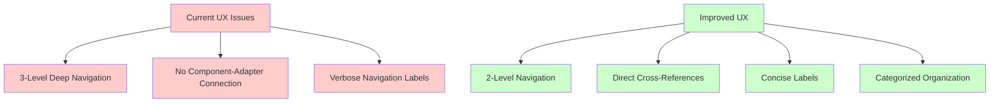
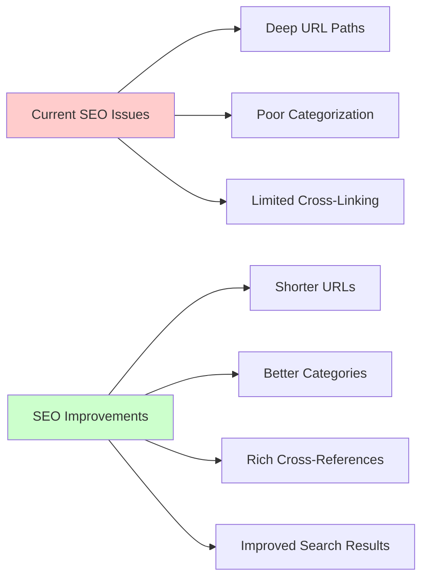
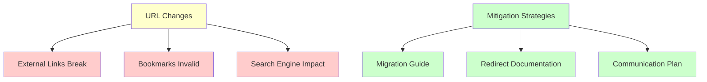

# Documentation Restructuring Implementation Guide

## Current vs Proposed Structure

### Current Navigation Structure



**Problems with Current Structure:**
- AWS Adapters buried 3 levels deep
- No direct connection between Components and their AWS implementations
- "Introduction to Reventless" is verbose for navigation

### Proposed Navigation Structure



**Improvements:**
- AWS Adapters at top level (2 levels instead of 3)
- Direct connection between Components and AWS Adapters
- Cleaner "Introduction" title
- Categorized AWS adapters for better organization

## File Structure Changes

### Directory Migration



### Link Update Impact



## Sidebar Configuration Changes

### Current Sidebar Structure

```javascript
// Current problematic structure
{
  type: 'category',
  label: 'Inner Workings',
  items: [
    'inner-workings/framework-inner-workings',
    // ... other items
    {
      type: 'category',
      label: 'AWS Adapters', // Buried too deep
      items: [
        'inner-workings/aws-adapters/index',
        'inner-workings/aws-adapters/commandgenerator',
        // ... all adapters in flat list
      ],
    },
  ],
}
```

### Proposed Sidebar Structure

```javascript
// New improved structure
{
  type: 'category',
  label: 'AWS Adapters', // Top-level visibility
  items: [
    'aws-adapters/index',
    {
      type: 'category',
      label: 'Core Event Sourcing',
      items: [
        'aws-adapters/eventlog',
        'aws-adapters/commandtopic',
        'aws-adapters/eventtopic',
        'aws-adapters/eventcollector',
      ],
    },
    {
      type: 'category',
      label: 'Data Storage',
      items: [
        'aws-adapters/querydb',
        'aws-adapters/task',
      ],
    },
    {
      type: 'category',
      label: 'Supporting Services',
      items: [
        'aws-adapters/commandgenerator',
        'aws-adapters/counter',
        'aws-adapters/heartbeat',
        'aws-adapters/queryengine',
        'aws-adapters/scheduledpublisher',
        'aws-adapters/statetopic',
      ],
    },
  ],
}
```

## Content Enhancement Plan

### AWS Adapters Landing Page Improvements



### Cross-Reference Enhancement



## Implementation Steps

### Phase 1: Core Structure Changes

```mermaid
gantt
    title Documentation Restructuring Timeline
    dateFormat  X
    axisFormat %s
    
    section Phase 1
    Rename Introduction Title    :done, rename, 0, 1
    Move AWS Adapters Directory  :active, move, 1, 2
    Update Sidebar Config        :update-sidebar, 2, 3
    
    section Phase 2
    Update Component Links       :update-links, 3, 5
    Update Inner Workings Links  :update-inner, 4, 6
    
    section Phase 3
    Enhance AWS Adapters Index   :enhance-index, 5, 7
    Add Cross-References         :cross-ref, 6, 8
    
    section Phase 4
    Test All Links              :test, 7, 9
    Create Migration Guide      :migration, 8, 10
```



### Phase 2: Link Updates

**Files requiring link updates:**

1. **Component Documentation (9 files):**
   - Change `../inner-workings/aws-adapters/` → `../aws-adapters/`

2. **Inner Workings Documentation (1 file):**
   - Change `./aws-adapters/` → `../aws-adapters/`

### Phase 3: Content Enhancements

**AWS Adapters Index Page Structure:**

```markdown
# AWS Adapters

## Quick Start
- How to use AWS adapters in your project
- Configuration examples
- Common patterns

## Architecture Overview
- Deploy-time vs Runtime separation
- Pulumi integration
- AWS service mappings

## Adapter Categories

### Core Event Sourcing
- EventLog → DynamoDB
- CommandTopic → SQS FIFO
- EventTopic → SNS
- EventCollector → SQS + DynamoDB Streams

### Data Storage
- QueryDb → DynamoDB
- Task → S3

### Supporting Services
- CommandGenerator → AppSync
- Counter → DynamoDB Streams
- Heartbeat → CloudWatch Events
- QueryEngine → DynamoDB
- ScheduledPublisher → CloudWatch Events
- StateTopic → DynamoDB Streams

## Quick Reference
| Component | AWS Service | Purpose |
|-----------|-------------|---------|
| EventLog | DynamoDB | Event storage |
| CommandTopic | SQS FIFO | Command queues |
| ... | ... | ... |
```

## Benefits Analysis

### User Experience Improvements



### SEO and Discoverability



## Risk Mitigation

### URL Changes Impact



## Success Metrics

### Navigation Efficiency
- **Before**: 3 clicks to reach AWS adapter (Home → Inner Workings → AWS Adapters → Specific Adapter)
- **After**: 2 clicks to reach AWS adapter (Home → AWS Adapters → Specific Adapter)
- **Improvement**: 33% reduction in navigation depth

### Content Discoverability
- **Before**: AWS adapters hidden in "Inner Workings"
- **After**: AWS adapters prominent at top level
- **Improvement**: Increased visibility and better categorization

### Cross-Reference Quality
- **Before**: No direct links between components and implementations
- **After**: Bidirectional links between all related content
- **Improvement**: Better content connectivity and user flow

This implementation guide provides a clear roadmap for executing the documentation improvements while maintaining content quality and user experience.