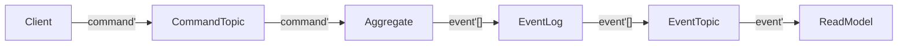

# Messages Documentation Plan

## Overview
This plan outlines the comprehensive documentation for the Messages system in the reventless framework, focusing on conceptual understanding of message flow patterns and their role in the event-sourcing architecture while serving both newcomers and experienced developers.

## Target Audience
- **Primary**: Mixed audience of newcomers learning concepts and experienced users needing reference material
- **Focus**: Conceptual understanding of message flow patterns in event-sourcing architecture
- **Approach**: Start with concepts, provide practical examples, include detailed reference

## Current State Analysis
- **File**: `packages/doc/docs/inner-workings/messages.md`
- **Status**: Mostly empty with TODO placeholders
- **Structure**: Basic title and two TODO sections (Message type, Event`)

## Proposed Documentation Structure

### 1. Introduction & Conceptual Overview
**Purpose**: Help newcomers understand the role of messages in reventless
- What are messages in event-sourcing?
- How messages enable decoupled, scalable systems
- The journey from command to event
- Message types overview (command, event, meta, context)

### 2. Core Message Types
**Purpose**: Detailed explanation of each message type and its architectural role

#### 2.1 Meta Type (`meta`)
- **Definition**: Message metadata for tracing and correlation
- **Fields**: service, time, ip, user, msgId, correlationId
- **Purpose**: Distributed tracing, audit trails, debugging
- **Usage patterns**: How meta flows through the system

#### 2.2 Context Type (`context`)
- **Definition**: Command processing context
- **Fields**: id, meta
- **Purpose**: Providing context to command handlers
- **Usage patterns**: How context is used in aggregates

#### 2.3 Event' Type (`event'<'id, 'event>`)
- **Definition**: Structured event with metadata
- **Fields**: id, meta, event
- **Purpose**: Immutable facts about what happened
- **Usage patterns**: Event storage, replay, projections

#### 2.4 Command' Type (`command'<'id, 'command>`)
- **Definition**: Structured command with metadata
- **Fields**: id, meta, command
- **Purpose**: Intent to change state
- **Usage patterns**: Command validation, processing, routing

#### 2.5 CommandJson Type (`commandJson`)
- **Definition**: Serialized command for transport
- **Fields**: id, meta, commandJson, delay?
- **Purpose**: Message queue transport, delayed execution
- **Usage patterns**: Queue serialization, network transport

### 3. Message Flow Patterns
**Purpose**: Show how messages move through the system

#### 3.1 Command-to-Event Flow


#### 3.2 Message Correlation
- How msgId and correlationId work
- Tracing message chains
- Debugging distributed flows

#### 3.3 Message Transformation
- Command' to CommandJson serialization
- Event' encoding/decoding
- Schema evolution considerations

### 4. Practical Examples
**Purpose**: Show real-world usage patterns

#### 4.1 Creating and Sending Commands
```rescript
// Example: Creating a command with proper meta
let command' = {
  id: "customer-123",
  meta: Message.generateMeta(~service="CustomerService", ~user="john.doe"),
  command: Customer.Create({name: "John Doe", email: "john@example.com"})
}
```

#### 4.2 Processing Events
```rescript
// Example: Event handler processing
let handleEvent = (event': Message.event'<string, CustomerEvent.t>) => {
  switch event'.event {
  | CustomerCreated(data) => 
    // Update read model
    updateCustomerView(event'.id, data, event'.meta)
  | CustomerUpdated(data) =>
    // Handle update
    updateCustomerView(event'.id, data, event'.meta)
  }
}
```

#### 4.3 Message Correlation Example
```rescript
// Show how messages are correlated through the system
let originalCommand = {
  id: "order-456",
  meta: {
    service: "OrderService",
    msgId: "msg-001",
    correlationId: "msg-001",
    // ... other fields
  },
  command: Order.Create(orderData)
}

// Resulting event maintains correlation
let resultingEvent = {
  id: "order-456", 
  meta: {
    service: "OrderService",
    msgId: "msg-002",
    correlationId: "msg-001", // Links back to original command
    // ... other fields
  },
  event: Order.Created(orderData)
}
```

### 5. Message Utility Functions
**Purpose**: Document key utility functions and their architectural purposes

#### 5.1 Message Creation
- `generateMeta()` - Creating message metadata
- `uuid()` - Generating unique identifiers
- `nowAsISOString()` - Timestamp generation

#### 5.2 Message Encoding/Decoding
- `encode()` / `decode()` - Schema-based serialization
- `encodeEvent'()` / `decodeEvent'()` - Event message handling
- `encodeCommand'()` / `decodeCommand'()` - Command message handling

#### 5.3 Message Analysis
- `serviceNameOfMsg()` - Extract service from message
- `eventNameOfEvent'Json()` - Get event type name
- `variantNameOfJson()` - Extract variant information

### 6. Advanced Patterns
**Purpose**: Complex message patterns for experienced developers

#### 6.1 Message Splitting and Combining
- `splitMessage()` - Decompose messages
- `combineMessage()` - Reconstruct messages
- Use cases: Message transformation, routing

#### 6.2 Error Handling Patterns
- Error propagation through message chains
- Dead letter queue patterns
- Retry mechanisms

#### 6.3 Message Versioning
- Schema evolution strategies
- Backward compatibility
- Migration patterns

### 7. Reference Section
**Purpose**: Quick reference for experienced developers

#### 7.1 Type Definitions
Complete type definitions from both packages:
- `reventless-spec/src/Message.res`
- `reventless/src/Message.res`

#### 7.2 Function Reference
Alphabetical listing of all message-related functions with signatures and brief descriptions.

#### 7.3 Common Patterns
Quick reference for common message patterns and their implementations.

## Implementation Notes

### Diagrams
- Use Mermaid for message flow diagrams
- Avoid double quotes and parentheses in square brackets
- Focus on conceptual clarity over technical detail

### Code Examples
- Use realistic, domain-specific examples (Customer, Order, etc.)
- Show complete message structures, not just fragments
- Include error handling where relevant
- Demonstrate correlation patterns

### Writing Style
- Start each section with conceptual explanation
- Follow with practical examples
- End with technical details for reference
- Use clear, concise language
- Explain the "why" not just the "what"

### Cross-References
- Link to relevant component documentation
- Reference AWS adapter implementations
- Connect to broader framework concepts

## Success Criteria
1. **Newcomers** can understand the role of messages in event-sourcing
2. **Experienced developers** can quickly find type definitions and patterns
3. **System architects** can understand message flow for system design
4. **All users** can trace messages through the system for debugging

## File Structure
The documentation will be organized in the existing file:
- `packages/doc/docs/inner-workings/messages.md`

This maintains consistency with the existing documentation structure while providing comprehensive coverage of the message system.