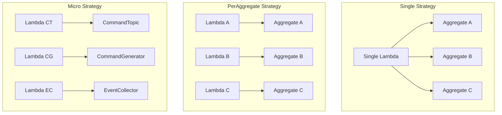
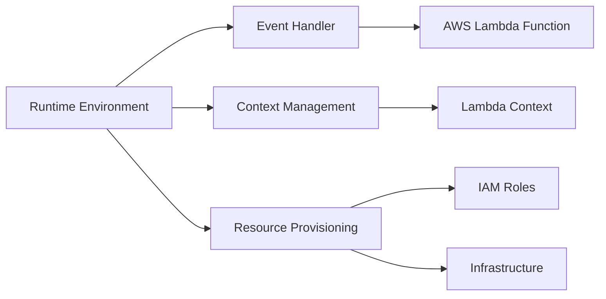
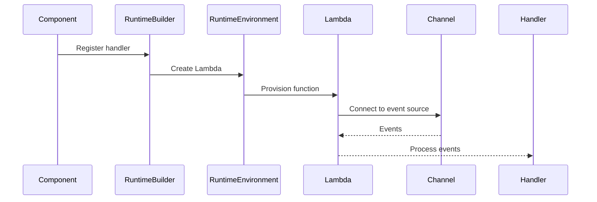

# Runtime and Runtime Environment Documentation Plan

## Overview
Plan for creating comprehensive documentation about Runtime and Runtime Environment concepts in Reventless, including different deployment granularities and configuration options.

## Analysis Summary

### Key Concepts Identified

1. **Runtime Environment** - Provider-specific execution environment (e.g., AWS Lambda)
   - Defined in [`Runtime.res`](../packages/reventless/src/adapter/Runtime/Runtime.res)
   - AWS implementation in [`RuntimeEnvironment_Lambda.res`](../packages/reventless-aws/src/adapter/Runtime/RuntimeEnvironment_Lambda.res)
   - Provides: event handling, context, resource management

2. **Runtime Builders** - Deployment strategy implementations
   - **Aggregate Runtime Builders**:
     - `Single` - All aggregates in one Lambda
     - `PerAggregate` - One Lambda per aggregate type
     - `Micro` - One Lambda per component (CommandGenerator, CommandTopic, EventCollector)
   
   - **EventCollector Runtime Builders**:
     - `Single` - All event collectors in one Lambda
     - `PerEventCollector` - One Lambda per event collector
   
   - **Plugin Runtime Builders**:
     - `Single` - Plugin components grouped
     - `Micro` - Separate Lambdas per component

3. **Runtime Configuration**
   - Memory size (default: 1024 MB)
   - Timeout (default: 30 seconds)
   - Event handler types
   - Resource connections

### Deployment Granularity Hierarchy

```
Core/Plugin
  ├─ Single Deployment (All aggregates/read models in one Lambda)
  ├─ PerAggregate/PerReadModel (One Lambda per aggregate/read model)
  └─ Micro Deployment (One Lambda per component: CommandTopic, EventCollector, etc.)
```

## Documentation Structure

### Proposed Document: `packages/doc/docs/inner-workings/runtime.md`

#### Sections

1. **Introduction**
   - What is a Runtime Environment?
   - Why different deployment granularities?
   - Trade-offs between strategies

2. **Runtime Environment Concept**
   - Module type definition
   - Key responsibilities:
     - Event handling abstraction
     - Context management
     - Resource provisioning
   - AWS Lambda implementation example

3. **Deployment Granularity Strategies**
   
   **3.1 Single Deployment**
   - All components of same type share one Lambda
   - Pros: Lower cold start count, simpler infrastructure
   - Cons: Less isolation, larger Lambda size
   - Use cases: Development, small-scale deployments
   - Configuration approach

   **3.2 Per-Component Deployment**
   - One Lambda per aggregate/read model/extension point
   - Pros: Better isolation, independent scaling
   - Cons: More infrastructure resources, more cold starts
   - Use cases: Production with multiple aggregates

   **3.3 Micro Deployment**
   - One Lambda per internal component (CommandTopic, EventCollector, etc.)
   - Pros: Maximum granularity, independent optimization
   - Cons: Most complex, highest resource count
   - Use cases: Large-scale production, specific optimization needs

4. **Runtime Builders**
   - What are Runtime Builders?
   - How they connect components to runtime environments
   - Builder module types:
     - `AggregateRuntime_Builder.T`
     - `EventCollectorRuntime_Builder.T`
     - `PluginRuntime_Builder.T`
     - `TaskRuntime_Builder.T`
     - `ExtensionPointRuntime_Builder.T`

5. **Configuration Options**
   - Memory size tuning
   - Timeout configuration
   - Handler registration
   - Resource connections
   - Event routing

6. **Choosing a Deployment Strategy**
   - Decision matrix
   - Performance considerations
   - Cost considerations
   - Operational complexity
   - Migration paths between strategies

7. **Implementation Examples**
   
   **7.1 Using Single Strategy**
   ```rescript
   // Example from Aggregate_Builder_Single.res
   module AggregateRuntimeBuilder = Reventless.AggregateRuntime_Builder_Single.Make(
     RuntimeEnvironment,
     CommandTopicChannel,
     EventCollectorChannel,
   )
   ```

   **7.2 Using Micro Strategy**
   ```rescript
   // Example from Aggregate_Builder_Micro.res
   module AggregateRuntimeBuilder = Reventless.AggregateRuntime_Builder_Micro.Make(
     RuntimeEnvironment,
     CommandTopicChannel,
     EventCollectorChannel,
   )
   ```

8. **Advanced Topics**
   - Custom runtime environments
   - Event batching and grouping
   - Resource optimization
   - Handler composition
   - Multi-region deployments

9. **Troubleshooting**
   - Common configuration issues
   - Performance debugging
   - Cold start optimization
   - Memory and timeout tuning

10. **Related Documentation**
    - Links to Component Structure Pattern
    - Links to AWS Lambda documentation
    - Links to specific component documentation

## Visual Diagrams

### Diagram 1: Deployment Strategy Comparison


### Diagram 2: Runtime Environment Architecture


### Diagram 3: Handler Registration Flow


## Code Examples to Include

1. Basic RuntimeEnvironment implementation
2. Single strategy configuration
3. PerAggregate strategy configuration
4. Micro strategy configuration
5. Custom memory/timeout configuration
6. Handler registration patterns
7. Event grouping logic

## Related Files for Reference

### Core Runtime Files
- [`Runtime.res`](../packages/reventless/src/adapter/Runtime/Runtime.res) - Core types
- [`RuntimeEnvironment_Lambda.res`](../packages/reventless-aws/src/adapter/Runtime/RuntimeEnvironment_Lambda.res) - AWS implementation

### Runtime Builders
- Aggregate: `AggregateRuntime_Builder_Single.res`, `AggregateRuntime_Builder_PerAggregate.res`, `AggregateRuntime_Builder_Micro.res`
- EventCollector: `EventCollectorRuntime_Builder_Single.res`, `EventCollectorRuntime_Builder_PerEventCollector.res`
- Plugin: `PluginRuntime_Builder_Single.res`, `PluginRuntime_Builder_Micro.res`
- Task: `TaskRuntime_Builder_PerBucket.res`
- ExtensionPoint: `ExtensionPointRuntime_Builder_PerExtensionPoint.res`

### Component Builders (usage examples)
- AWS Aggregate Builders: `Aggregate_Builder_Single.res`, `Aggregate_Builder_PerAggregate.res`, `Aggregate_Builder_Micro.res`
- AWS ReadModel Builders: `ReadModel_Builder_Single.res`, `ReadModel_Builder_PerReadModel.res`
- Plugin Builder: `Plugin.res` (uses Micro strategy)
- Core Builder: `Core_Builder.res`

## Integration with Existing Documentation

### Add to framework-inner-workings.md
Add new section linking to runtime documentation:
```markdown
- [**Runtime & Deployment**](./runtime.md) - Runtime environments and deployment strategies
```

### Update aws-lambda.md
Expand the currently minimal aws-lambda.md to include:
- Lambda-specific runtime details
- Lambda layer information
- Cold start optimization
- Cross-reference to runtime.md

## Questions for User

1. Should we include performance benchmarks for different deployment strategies?
2. How detailed should the cost analysis be for different strategies?
3. Should we include migration guides between strategies?
4. Are there specific real-world use cases we should document?
5. Should we document non-Lambda runtime environments (if planned)?
6. Level of technical depth for custom runtime environment creation?

## Success Criteria

- Clear explanation of runtime environment concept
- Comprehensive coverage of all three deployment strategies
- Practical examples for each strategy
- Decision framework for choosing strategies
- Integration with existing documentation
- Visual diagrams for complex concepts
- Code examples from actual codebase