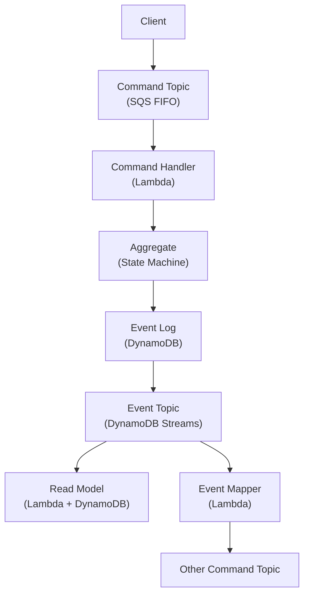

# Aggregate-Based Plugin

An Aggregate-Based Plugin uses the traditional Domain-Driven Design Aggregate pattern. Each aggregate maintains its own private event stream and processes commands sequentially against a state machine.

## When to Use

Choose the Aggregate-Based approach when:
- You need strong consistency within a single aggregate
- Commands are processed one at a time per aggregate instance
- You have clear, isolated bounded contexts
- A simpler consistency model is preferred

## Architecture



## Building an Aggregate-Based Plugin

The following example builds a **CatalogItem** plugin step by step. A catalog item can be created, updated, and archived.

### Step 1: Define the Aggregate Spec

The Spec defines the aggregate's **identity**, **commands**, **events**, and **errors**. It lives in its own file so both the behavior and any event mappings can reference it without creating circular dependencies.

```rescript
// CatalogItemSpec.res
let name = "CatalogItem"

module Id = ReventlessSpec.Id.String

@schema
type command =
  | CreateItem({itemId: string, name: string, description: string})
  | UpdateItem({itemId: string, name: string, description: string})
  | ArchiveItem({itemId: string})

@schema
type event =
  | ItemCreated({itemId: string, name: string, description: string})
  | ItemUpdated({itemId: string, name: string, description: string})
  | ItemArchived({itemId: string})

@schema
type error =
  | ItemAlreadyExists
  | ItemNotFound
  | ItemAlreadyArchived
```

The `@schema` annotation generates JSON serialization code via the [Sury `ppx`](./rescript-syntax.md#ppx). Every `command`, `event`, and `error` type must be annotated.

### Step 2: Implement the Behavior

The Behavior implements the aggregate's state machine. It defines four functions:

- **`init`** — creates the initial state from the very first event ever emitted for this aggregate instance
- **`apply`** — evolves the state when a subsequent event is applied
- **`create`** — handles commands when the aggregate does **not yet exist**
- **`execute`** — handles commands on an **existing** aggregate

```rescript
// CatalogItemBehavior.res
module Spec = CatalogItemSpec

// The internal state of a catalog item
@schema
type state =
  | Active({name: string, description: string})
  | Archived

// Which AppSync mutations map to this aggregate's commands
let resolverConfig: Behavior.resolverConfig<Spec.command> = {
  commandSchema: CatalogItemSpec.commandSchema,
  fields: ["CatalogItem_CreateItem", "CatalogItem_UpdateItem", "CatalogItem_ArchiveItem"],
}

// Called with the first event to establish the initial state
let init: Behavior.init<state, Spec.event> = event =>
  switch event {
  | CatalogItemSpec.ItemCreated({name, description}) => Active({name, description})
  | _ => throw(Message.InvalidEvent(event->Message.encode(CatalogItemSpec.eventSchema)))
  }

// Transitions the state when subsequent events are applied
let apply: Behavior.apply<state, Spec.event> = (state, event) =>
  switch (state, event) {
  | (Active(_), CatalogItemSpec.ItemUpdated({name, description})) =>
    Active({name, description})
  | (Active(_), CatalogItemSpec.ItemArchived(_)) => Archived
  | _ => throw(Message.InvalidEvent(event->Message.encode(CatalogItemSpec.eventSchema)))
  }

// Handles commands when no aggregate instance exists yet
let create: Behavior.create<Spec.command, Spec.event, Spec.error> = (command, context, error) =>
  switch command {
  | CatalogItemSpec.CreateItem({itemId, name, description}) =>
    [CatalogItemSpec.ItemCreated({itemId, name, description})]
  | CatalogItemSpec.UpdateItem(_) | CatalogItemSpec.ArchiveItem(_) =>
    error(CatalogItemSpec.ItemNotFound, command, context)
  }

// Handles commands on an existing aggregate instance
let execute: Behavior.execute<state, Spec.command, Spec.event, Spec.error> = (
  state,
  command,
  context,
  error,
) =>
  switch state {
  | Active(_) =>
    switch command {
    | CatalogItemSpec.CreateItem(_) =>
      error(CatalogItemSpec.ItemAlreadyExists, command, context)
    | CatalogItemSpec.UpdateItem({itemId, name, description}) =>
      [CatalogItemSpec.ItemUpdated({itemId, name, description})]
    | CatalogItemSpec.ArchiveItem({itemId}) =>
      [CatalogItemSpec.ItemArchived({itemId})]
    }
  | Archived =>
    switch command {
    | CatalogItemSpec.CreateItem(_) | CatalogItemSpec.UpdateItem(_) =>
      error(CatalogItemSpec.ItemAlreadyArchived, command, context)
    | CatalogItemSpec.ArchiveItem(_) => []
    }
  }
```

The `error` callback is `(errorValue, command, context) => array<event>`. It publishes error events for logging and monitoring—it does **not** throw.

### Step 3: Define the ReadModel Spec

The ReadModel Spec defines the **shape of the read-side state** stored in the query database.

```rescript
// CatalogItemReadModelSpec.res
module Id = ReventlessSpec.Id.String

@schema
type state = {
  itemId: string,
  name: string,
  description: string,
  archived: bool,
}

let name = "CatalogItem"

open ReventlessSpec.ReadModel_Spec
let config = config()
let subIdConfig = None
```

### Step 4: Implement the Projection

The Projection maps aggregate events to actions on the read model. Use `Projection.Mapping.Make` with three arguments: the **source spec**, the **target read model spec**, and an anonymous module with a `map` function.

```rescript
// CatalogItemProjection.res
open ReventlessSpec.Projection.Spec

module ItemMapping = Reventless.Projection.Mapping.Make(
  CatalogItemSpec,         // Source: name, Id, @schema type event
  CatalogItemReadModelSpec, // Target: name, Id, @schema type state, subIdConfig
  {
    // map receives {id, meta, event} and returns a single Projection action
    let map = ({event, id, meta: _}) =>
      switch event {
      | CatalogItemSpec.ItemCreated({name, description}) =>
        Set(id, {CatalogItemReadModelSpec.itemId: id, name, description, archived: false})
      | CatalogItemSpec.ItemUpdated({name, description}) =>
        Update(id, state => {...state, name, description})
      | CatalogItemSpec.ItemArchived(_) =>
        Update(id, state => {...state, archived: true})
      }
  },
)

// Create a helper to generate the Mapping module type for this read model
module MappingsHelper = Reventless.Projection.Mappings.Make(CatalogItemReadModelSpec)

// The concrete mappings list used when assembling the plugin
let mappings: array<module(MappingsHelper.Mapping)> = [module(ItemMapping)]
```

The available `action` variants are: `Create`, `Set`, `Update`, `UpdateWithDefault`, `Delete`, `DeleteIf`, `Ignore`, and others. See `ReventlessSpec.Projection.Spec` for the full list.

### Step 5: Define Event Mappings (Optional)

Event Mappings let one aggregate's events trigger commands in another aggregate. Implement `ReventlessSpec.EventMapping.T`:

```rescript
// CatalogItemEventMapping.res

// When an item is created, notify another aggregate
module ItemCreatedMapping: ReventlessSpec.EventMapping.T = {
  module Source = CatalogItemSpec    // source aggregate: name, Id, @schema type event
  module Target = NotificationSpec   // target aggregate: name, Id, @schema type command

  let map = (id, event, _queryEngine) =>
    switch event {
    | CatalogItemSpec.ItemCreated({name}) =>
      let notificationId = id->ReventlessSpec.Id.String.toString
      [
        ReventlessSpec.EventMapping.Publish(
          ReventlessSpec.Id.String.makeFromString(notificationId),
          NotificationSpec.SendCreationAlert({message: `New item "${name}" is available`}),
        ),
      ]
    | _ => []
    }
}

// Package mappings into the EventMapper.Mappings module type
module EventMappings: Reventless.EventMapper.Mappings with module Target := NotificationSpec = {
  module Target = NotificationSpec
  module type Mapping = ReventlessSpec.EventMapping.T with module Target := NotificationSpec
  let mappings = [module(ItemCreatedMapping: Mapping)]
  let counter = None
}
```

If you have no event mappings, use `Reventless.NoEventMappings.Make(CatalogItemSpec)`.

### Step 6: Assemble the Plugin

The Plugin is assembled as a **[module function](./rescript-syntax.md#functors) over `Platform.T`**. This keeps your application code decoupled from the AWS infrastructure—only the composition root imports `reventless-aws`.

```rescript
// CatalogItemPlugin.res
// Imports only `reventless`, not `reventless-aws`

module Make = (Platform: Reventless.Platform.T) => {
  // Build the aggregate component from spec + behavior + event mappings
  module ItemAggregate = Platform.Aggregate.Make(
    CatalogItemSpec,
    CatalogItemBehavior,
    Reventless.NoEventMappings.Make(CatalogItemSpec),
  )

  // Wire the read model projection into a concrete Mappings module
  module MappingsHelper = Reventless.Projection.Mappings.Make(CatalogItemReadModelSpec)
  module Mappings: ReventlessSpec.Projection.Mappings with module Target := CatalogItemReadModelSpec = {
    module Target = CatalogItemReadModelSpec
    module type Mapping = MappingsHelper.Mapping
    let mappings = CatalogItemProjection.mappings
  }

  // Build the read model component from spec + mappings
  module ItemReadModel = Platform.ReadModel.Make(CatalogItemReadModelSpec, Mappings)
}
```

## Deploying the Plugin

The composition root is the only file that imports `reventless-aws`. It instantiates the Platform with AWS config and passes it to the [plugin module function](./rescript-syntax.md#functors), then calls `ReventlessAws.Plugin.make` to create the Pulumi infrastructure.

```rescript
// index.res — composition root

// Create the AWS platform (wires DynamoDB, Lambda, SQS, SNS, etc.)
module Platform = ReventlessAws.Platform.Make(Config)

// Instantiate the plugin module function with the AWS platform
module App = CatalogItemPlugin.Make(Platform)

// Deploy the plugin as a Pulumi component resource
let plugin = ReventlessAws.Plugin.make(
  ~name="catalog-plugin",
  ~version="1.0.0",
  ~heartbeatInterval=30,
  ~aggregates=[module(App.ItemAggregate)],
  ~readModels=[module(App.ItemReadModel)],
  ~scheduler,
)
```

## Next Steps

- [Plugin System Overview](./plugin-system.md) - Understand the full plugin system
- [DCB-Based Plugin](./dcb-based-plugin.md) - Learn about the alternative DCB approach
