## Component Relationship Diagram

The following diagram shows how all Reventless components work together in a complete system:

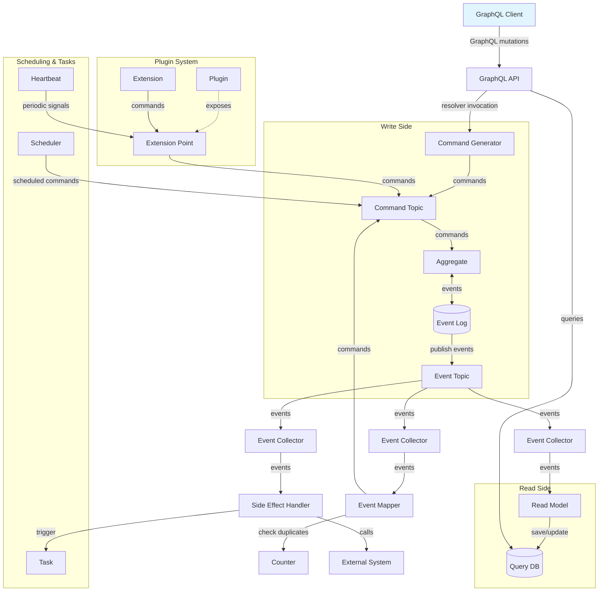

This diagram illustrates the complete Reventless architecture showing:

- **Command Flow**: Client → API → CommandGenerator → CommandTopic → Aggregate
- **Event Flow**: Aggregate → EventLog → EventTopic → EventCollectors → Processing Components
- **Read Side**: EventCollector → ReadModel → QueryDb ← API ← Client
- **Event Processing**: EventMapper and SideEffectHandler consuming events
- **Plugin System**: Cross-plugin communication via ExtensionPoints and Extensions
- **Scheduling**: Time-based command generation and health monitoring

### Aggregate

[*Aggregate*s](https://www.martinfowler.com/bliki/DDD_Aggregate.html) are the transactional units in your system.  
An Aggregate receives Commands and outputs Events based on the current State. A single Command can result in _any number_ of Events.  
Only the Aggregate's Events will be stored. If a new Command gets handled the actual State will be calculated based on the previous Events ([Event Sourcing](https://martinfowler.com/eaaDev/EventSourcing.html)). The current State will never be persisted to storage.

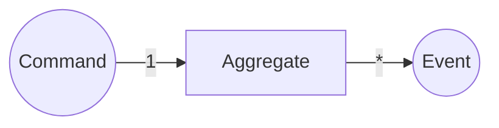

- **responsibility**: ensure only valid Commands create Events having the necessary information attached; emit Events
- **in**: Command
- **out**: Events

[Read more about the Aggregate component.](./components/aggregate.md)

### EventLog

The **EventLog** is the foundational storage component for event sourcing in Reventless. It provides append-only event storage with efficient replay capabilities, ensuring that all domain events are durably persisted and can be replayed to reconstruct aggregate state.

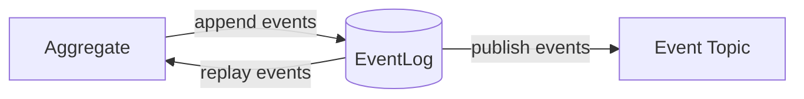

- **responsibility**: durably store events in append-only fashion; provide event replay for aggregate state reconstruction; publish events to EventTopic for distribution
- **in**: Events from Aggregate (via `append` operation)
- **out**: Events to EventTopic (automatic); Events to Aggregate (via `replay` operation)

[Read more about the EventLog component.](./components/eventlog.md)

### DcbEventLog

The **DcbEventLog** (Dynamic Consistency Boundary Event Log) is the shared event storage component used by DCB state change slices. It provides tag-based querying and optimistic concurrency control for handling commands across multiple slices that share the same event log.

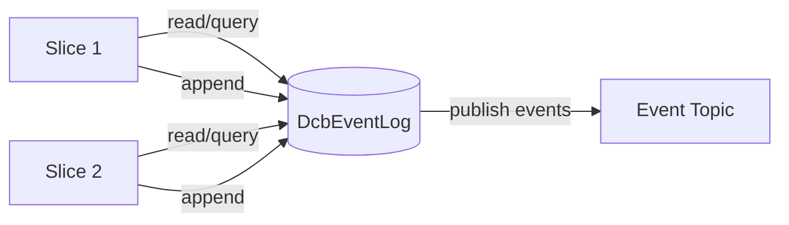

- **responsibility**: tag-based event queries for decision model building; optimistic concurrency control; shared event storage for DCB slices
- **in**: Events from StateChangeSlices (via `append` operation)
- **out**: Events to EventTopic (automatic); Events to StateChangeSlices (via `read` operation)

[Read more about the DcbEventLog component.](./components/dcbeventlog.md)

### CommandTopic

The **CommandTopic** is the message queue component that delivers commands to Aggregates with strict ordering guarantees and reliable delivery. It ensures commands are processed exactly once per aggregate instance, in the order they were sent.

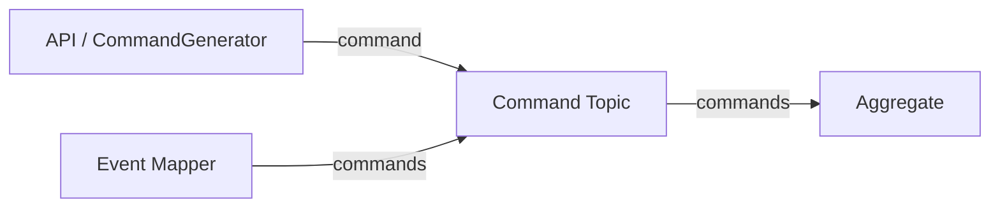

- **responsibility**: queue commands for delivery to Aggregates; ensure FIFO ordering per aggregate; provide exactly-once delivery guarantees; handle retries and dead letter processing
- **in**: Commands from API (via CommandGenerator), EventMapper, Extensions, or ExtensionPoints
- **out**: Commands to Aggregate command handlers

[Read more about the CommandTopic component.](./components/commandtopic.md)

### EventTopic

The **EventTopic** is the event distribution component that enables fan-out delivery of events to multiple subscribers. It receives events from the EventLog and distributes them to EventCollectors, which then deliver events to ReadModels, EventMappers, and SideEffectHandlers.

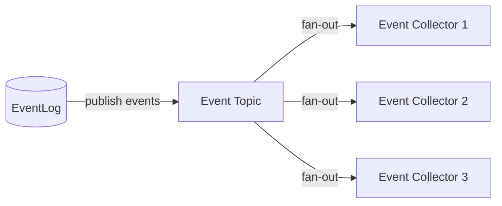

- **responsibility**: distribute events from EventLog to multiple subscribers; enable fan-out pattern for event-driven architecture; provide ordering guarantees per aggregate
- **in**: Events from EventLog (via `publish` operation)
- **out**: Events to EventCollectors (via SNS subscriptions)

[Read more about the EventTopic component.](./components/eventtopic.md)

### EventCollector

The **EventCollector** is the event consumption component that receives events from EventTopics. It provides a unified interface for components like ReadModels, EventMappers, and SideEffectHandlers to consume events with ordering guarantees.

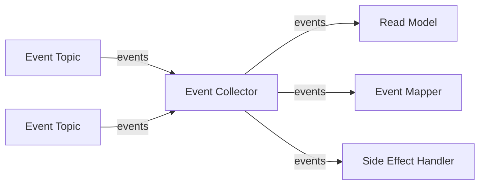

- **responsibility**: subscribe to EventTopics; buffer events; deliver events to handlers with ordering guarantees; handle retries and dead letter processing
- **in**: Events from EventTopics
- **out**: Events to ReadModel projections, EventMapper mappings, or SideEffectHandler functions

[Read more about the EventCollector component.](./components/eventcollector.md)

### QueryDb

The **QueryDb** is the read model storage component that provides efficient querying of projected state. It stores denormalized views of aggregate data, enabling fast queries without replaying events. QueryDb integrates with AWS AppSync for GraphQL APIs and supports configurable indexes, TTL, and batch operations.

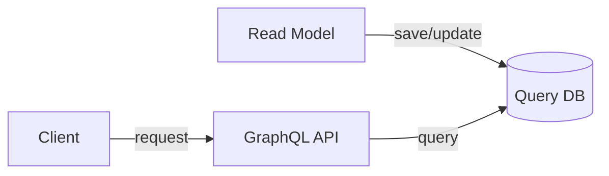

- **responsibility**: store projected read model state; provide efficient query operations; support multiple access patterns via indexes; integrate with GraphQL APIs; handle automatic data expiration via TTL
- **in**: State updates from ReadModel projections (via `save`, `saveBatch` operations)
- **out**: Query results to API resolvers (via `load` operation)

[Read more about the QueryDb component.](./components/querydb.md)

### CommandGenerator

The **CommandGenerator** bridges the gap between external clients and event-sourced aggregates by transforming GraphQL mutations into Reventless commands. It enables web and mobile applications to interact with aggregates through a type-safe GraphQL API.

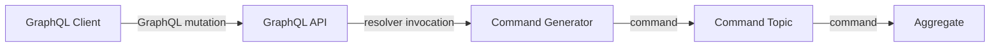

- **responsibility**: transform GraphQL mutations into aggregate commands; validate and enrich command metadata; publish commands to CommandTopic; provide type-safe API for external clients
- **in**: GraphQL mutations from clients (via API Gateway/AppSync)
- **out**: Commands to target aggregate's CommandTopic

[Read more about the CommandGenerator component.](./components/commandgenerator.md)

### Counter

The **Counter** component provides atomic counting operations and deduplication capabilities for event processing. It's primarily used by EventMappers to prevent duplicate command generation and maintain accurate event processing metrics.

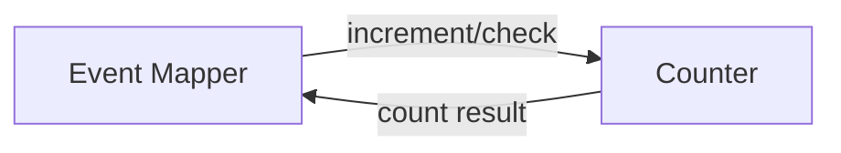

- **responsibility**: provide atomic increment/decrement operations; prevent duplicate event processing; maintain processing metrics; support conditional operations based on count values
- **in**: Count operations from EventMapper or other components
- **out**: Count results and deduplication status

[Read more about the Counter component.](./components/counter.md)

### ReadModel

A _ReadModel_ is a queryable persisted state: It takes Events from one or more Aggregates and persists a newly calculated state. The new state is based on the previous state and the incoming Event.

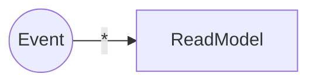

- **responsibility**: create and persist State to be queried
- **in**: Events
- **out**: -

[Read more about the ReadModel component.](./components/readmodel.md)

### EventMapper

An EventMapper attached to an Aggregate maps Events of (potentially multiple Aggregates) to Commands for this Aggregate. This is always needed if some Event in one Aggregate needs to trigger a reaction in another.

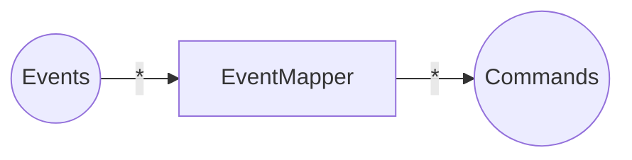

- **responsibility**: generate Commands for a given Aggregate based on (multiple) other Aggregates' Events
- **in**: Events
- **out**: Commands

[Read more about the EventMapper component.](./components/eventmapper.md)

### Task

Tasks are the "escape-hatch" of the dogmatic Command/Event paradigm. They allow to implement logic loosely coupled to Events (or even not at all). An example would be some calculation, which needs to be done in some specific interval.

Another intention of Tasks is to interface with the outside world (e.g. other systems). An example of this would be up-/downloads or calling foreign APIs.

Tasks may be implemented provider specific, since it's not possible to provide adapter for any possible scenario.

[Read more about the Task component.](./components/task.md)

### Scheduler

The Scheduler component provides time-based command publishing capabilities, enabling scheduled workflows, periodic tasks, and cron-like event generation. It allows applications to create and manage schedules dynamically at runtime.

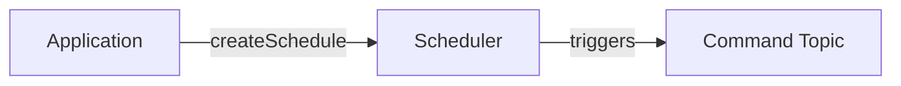

- **responsibility**: manage time-based event scheduling and command publishing
- **in**: schedule definitions with timing patterns and payloads
- **out**: scheduled events/commands published to configured targets

[Read more about the Scheduler component.](./components/scheduler.md)

### Heartbeat

The Heartbeat component provides periodic health check signals and keepalive mechanisms, specifically designed to integrate with the Core Plugin's ExtensionPoint system. It enables health monitoring, periodic extension invocations, and watchdog timer functionality.

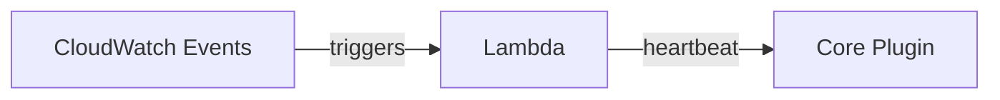

- **responsibility**: generate periodic heartbeat signals for health monitoring and extension triggering
- **in**: timeout configuration and Core Plugin connection details
- **out**: periodic heartbeat messages sent to Core Plugin ExtensionPoint

[Read more about the Heartbeat component.](./components/heartbeat.md)

#### SideEffectHandler

A `SideEffectHandler` is similar to an `EventMapper`, but targeting `Task`s (and functions) outside of the Command/Event paradigm. For example: calling a foreign API everytime a specific `Event` occurs.
It takes `Event`s of (potentially multiple) `Aggregate`s as input and calls functions dependent on the `Event`.

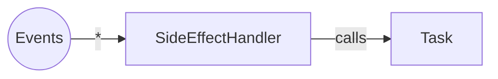

- **responsibility**: execute `functions` of a given `task` based on (multiple) `aggregate`s' `Events`
- **in**: `Event`s
- **out**: -

[Read more about the SideEffectHandler component.](./components/sideeffecthandler.md)

### Plugin

A `Plugin` usually corresponds to a [`Bounded Context`](https://www.martinfowler.com/bliki/BoundedContext.html) in `DDD` (Domain Driven Design) as well to a single deployment unit. A `Plugin` is defined by it's configuration (name, version, etc) and it's child-components (`Aggregate`s, `ReadModel`s, `Task`s, etc)

[Read more about the Plugin component.](./components/plugin.md)

### ExtensionPoint

`ExtensionPoint`s (together with their relatign `Extension`s) are the mechanics to share data between several `Plugin`s. The `ExtensionPoint`'s `Spec` defines the `Event`s, which will be sent and the `Command`s which will be received by it.

[Read more about the ExtensionPoint component.](./components/extensionpoint.md)

#### ExtensionPointMapping

An `ExtensionPointMapping` defines a `Plugin`s border. It maps `Event`s from single `Aggregate`s to `Event`s of the `ExtensionPoint`. These are totally different Events (and therefore types), although they may seem similar. This is done to decouple outside dependencies from changes of the plugin and provide a simple interface to interact with.
A `Command` sent to the `ExtensionPoint` will be mapped to a specific `Command` inside the plugin by this component.

- **responsibility**: map plugin specific Command & Events to those of the `ExtensionPoint`
- **in**: `Plugin` sepcific `Event`s (from inside the `Plugin`) / `ExtensionPoint` Command`s (from `Extension`s)
- **out**: `ExtensionPoint` `Event`s (to `Extension`s) / `Plugin` specific `Command`s (to components inside the `Plugin`)

### Extension

An `Extension` enables a `Plugin` to consume events from and send commands to another `Plugin`'s `ExtensionPoint`. It acts as the consumer side of cross-Plugin communication, translating external events into internal commands and optionally forwarding internal events back to the `ExtensionPoint`.

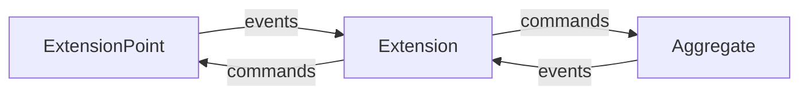

- **responsibility**: consume events from remote `ExtensionPoint`s and generate commands for local `Aggregate`s; optionally forward local events back to `ExtensionPoint`s
- **in**: `ExtensionPoint` `Event`s (from remote `Plugin`s)
- **out**: `Aggregate` `Command`s (to local `Aggregate`s) / `ExtensionPoint` `Command`s (to remote `Plugin`s)

[Read more about the Extension component.](./components/extension.md)

#### ExtensionMapping

An `ExtensionMapping` defines how a `Plugin` interacts with a remote `ExtensionPoint`. It maps incoming `ExtensionPoint` `Event`s to local `Aggregate` `Command`s and optionally maps outgoing `Aggregate` `Event`s to `ExtensionPoint` `Command`s.

- **responsibility**: translate between remote `ExtensionPoint` events/commands and local `Aggregate` commands/events
- **in**: `ExtensionPoint` `Event`s (from remote `Plugin`) / `Aggregate` `Event`s (from local `Aggregate`s)
- **out**: `Aggregate` `Command`s (to local `Aggregate`s) / `ExtensionPoint` `Command`s (to remote `Plugin`)

[Read more about Extension Mappings.](./components/extension.md#extension-mappings)
