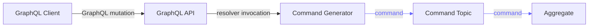
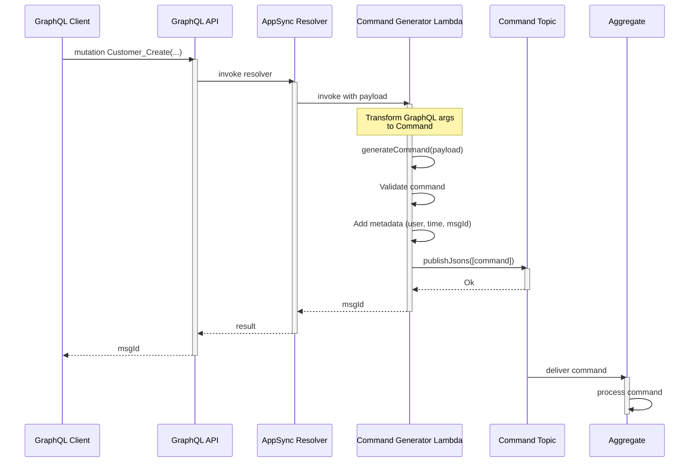
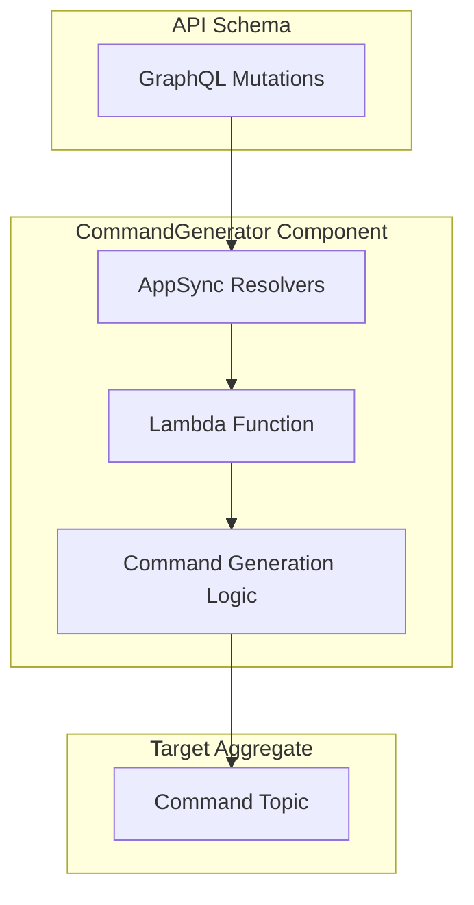

For a short summary of CommandGenerator, see [Reventless Components Overview.](../component-overview.md#commandgenerator)

:::info Framework Implementation
This component follows the Reventless [Component Structure Pattern](/framework/inner-workings/component-structure-pattern), using separate files for interface definitions ([`CommandGenerator.res`](../../reventless/src/components/CommandGenerator/CommandGenerator.res)), builder logic ([`CommandGenerator_Builder.res`](../../reventless/src/components/CommandGenerator/CommandGenerator_Builder.res)), and runtime callbacks ([`CommandGenerator_Callback.res`](../../reventless/src/components/CommandGenerator/CommandGenerator_Callback.res)).
:::

## Overview



The **CommandGenerator** bridges the gap between external clients and event-sourced aggregates by transforming GraphQL mutations into Reventless commands. It enables web and mobile applications to interact with aggregates through a type-safe GraphQL API.

## Purpose and Responsibilities

- **Responsibility**: Transform GraphQL mutations into aggregate commands; validate and enrich command metadata; publish commands to CommandTopic; provide type-safe API for external clients
- **In**: GraphQL mutations from clients (via API Gateway/AppSync)
- **Out**: Commands to target aggregate's CommandTopic

## Component Configuration

The CommandGenerator requires configuration that defines the GraphQL schema and command generation behavior:

### Behavior Configuration

The Aggregate's Behavior module must define a `resolverConfig` that specifies which GraphQL mutations map to which commands:

```rescript
module type Behavior = {
  module Spec: ReventlessSpec.Aggregate.Spec
  
  type resolverConfig = {
    fields: array<string>,              // GraphQL mutation field names
    commandSchema: Sury.schema<command>, // Command schema for validation
  }
  
  let resolverConfig: resolverConfig
}
```

### API Schema Definition

Define the GraphQL schema for your aggregate's mutations (see [API](./api.md) for complete details):

```rescript title="Customer_Api.res"
let typesSchema = "
  type Customer {
    id: ID!
    name: String!
    address: String!
  }

  input CustomerInput {
    name: String!
    address: String!
  }
"

let mutationsSchema = "
  Customer_Create(id: ID!, customer: CustomerInput!): String!
  Customer_ChangeAddress(id: ID!, address: String!): String!
  Customer_ChangeName(id: ID!, name: String!): String!
  Customer_Delete(id: ID!): String!
"
```

## Usage Pattern

### Defining Command Generation

Configure how GraphQL mutations are transformed into commands:

```rescript title="Customer_Behavior.res"
module Spec = Customer

type state = option<Customer.customer>

type resolverConfig = {
  fields: array<string>,
  commandSchema: Sury.schema<Customer.command>,
}

// Define which GraphQL mutations this aggregate handles
let resolverConfig = {
  fields: [
    "Customer_Create",
    "Customer_ChangeAddress",
    "Customer_ChangeName",
    "Customer_Delete",
  ],
  commandSchema: Customer.commandSchema,
}

// Behavior functions: init, apply, execute
let init = (event: Customer.event) =>
  switch event {
  | Created(customer) => Some(customer)
  | _ => None
  }

let apply = (state, event: Customer.event) =>
  switch (state, event) {
  | (Some(customer), AddressChanged(newAddress)) =>
    Some({...customer, address: newAddress})
  | (Some(customer), NameChanged(newName)) =>
    Some({...customer, name: newName})
  | (Some(_), Deleted) => None
  | _ => state
  }

let execute = (state, command: Customer.command) =>
  switch (state, command) {
  | (None, Create(customer)) => [Created(customer)]
  | (Some(_), ChangeAddress(address)) => [AddressChanged(address)]
  | (Some(_), ChangeName(name)) => [NameChanged(name)]
  | (Some(_), Delete) => [Deleted]
  | _ => [Unchanged]
  }
```

### Automatic Command Generation

The CommandGenerator automatically transforms GraphQL mutations to commands:

```rescript title="GraphQL Mutation Example"
mutation CreateCustomer {
  Customer_Create(
    id: "customer-123"
    customer: {
      name: "John Doe"
      address: "123 Main St"
    }
  )
}
```

**This mutation is automatically transformed to:**

```rescript
// Command published to Customer CommandTopic
{
  id: "customer-123",
  command: Create({
    name: "John Doe",
    address: "123 Main St"
  }),
  meta: {
    service: "Customer",
    msgId: "uuid-generated",
    correlationId: "uuid-generated",
    ip: "192.168.1.1",
    user: "john.doe@example.com",
    time: "2026-01-26T18:30:00.000Z"
  }
}
```

### Integration with Aggregate

The CommandGenerator is automatically created when defining an Aggregate:

```rescript title="Customer.res"
// Define aggregate with behavior
include ReventlessAws.Aggregate.Make(
  Config,
  Customer,          // Spec
  Customer_Behavior, // Behavior (includes resolverConfig)
  Customer_EventMappings,
)

// The framework automatically creates:
// - Customer CommandTopic
// - Customer CommandGenerator (with resolvers)
// - Customer Aggregate
// - Customer EventLog
```

## Runtime Behavior

### Command Generation Flow



### Command Payload Structure

The Lambda receives a structured payload from the GraphQL resolver:

```rescript
type payload = {
  command: string,                    // "Create", "Update", "Delete"
  arguments: {
    id: string,                       // Aggregate ID
    // ... other GraphQL arguments
  },
  meta: {
    ip: array<string>,                // Client IP addresses
    user: string,                     // Authenticated username
    info: string,                     // "Mutation.Customer_Create"
  }
}
```

### Command Generation Logic

The CommandGenerator callback transforms the payload into a command:

```rescript
let generateCommand = async (payload: CommandGenerator.payload) => {
  // 1. Generate message ID for tracing
  let msgId = Message.uuid()
  let id = payload.arguments.id
  
  // 2. Create command metadata
  let meta = {
    Message.service: AggregateSpec.name,
    ip: payload.meta.ip->Array.shift->Option.getOr(""),
    user: payload.meta.user,
    time: Message.nowAsISOString(),
    msgId,
    correlationId: msgId,
  }
  
  // 3. Extract command parameters (skip 'id' field)
  let params = payload.arguments
    ->toDict
    ->Dict.toArray
    ->Array.sliceToEnd(~start=1)  // Skip first param (id)
  
  // 4. Construct command JSON
  let commandJson = switch params->Array.length {
  | 0 => Js.Json.string(payload.command)  // Simple command
  | _ => 
    // Variant command with parameters
    [("TAG", Js.Json.string(payload.command))]
    ->Array.concat(params)
    ->Js.Dict.fromArray
    ->Js.Json.object_
  }
  
  // 5. Validate command against schema
  switch commandJson->Message.decode(Behavior.resolverConfig.commandSchema) {
  | command => 
    // 6. Publish to CommandTopic
    await publishJsons([{id, meta, commandJson}])
    msgId  // Return message ID to client
  | exception err =>
    Js.Exn.raiseError("Invalid command: " ++ err)
  }
}
```

## Integration Points

### With GraphQL API

The CommandGenerator integrates with your GraphQL schema:



### With Aggregate CommandTopic

Commands are published to the target aggregate's CommandTopic:

```rescript
// CommandGenerator publishes commands
await publishJsons([
  {
    id: customerId,
    meta: {...},
    commandJson: createCommandJson(...)
  }
])

// CommandTopic delivers to Aggregate
```

## Common Patterns

### Simple CRUD Operations

```graphql
# Create
mutation {
  Customer_Create(
    id: "cust-1"
    customer: {name: "John", address: "123 Main"}
  )
}

# Update
mutation {
  Customer_ChangeAddress(
    id: "cust-1"
    address: "456 Oak Ave"
  )
}

# Delete
mutation {
  Customer_Delete(id: "cust-1")
}
```

### Batch Operations

```rescript title="Order_Api.res"
let mutationsSchema = "
  Order_CreateBatch(orders: [OrderInput!]!): [String!]!
"
```

```graphql
mutation CreateMultipleOrders {
  Order_CreateBatch(orders: [
    {customerId: "c1", items: [...]},
    {customerId: "c2", items: [...]}
  ])
}
```

### Async Command Generation

```rescript title="Order_Behavior.res"
// Generate command after external validation
let resolverConfig = {
  fields: ["Order_CreateWithValidation"],
  commandSchema: Order.commandSchema,
}

// The CommandGenerator can perform async operations
// before publishing commands (e.g., validate inventory)
```

### Enriching Commands with User Context

```rescript
// Metadata automatically includes:
// - User ID from authentication token
// - Client IP address
// - Request timestamp
// - Unique message ID for tracing

// This enables audit trails:
{
  command: Create(...),
  meta: {
    user: "john.doe@example.com",
    ip: "192.168.1.1",
    time: "2026-01-26T18:30:00Z",
    msgId: "msg-uuid-123"
  }
}
```

## Error Handling

The CommandGenerator includes comprehensive error handling:

**Command Validation Errors:**
- Invalid command JSON → rejected, error returned to client
- Schema validation failure → rejected with validation error
- Missing required parameters → caught by GraphQL layer

**Publishing Errors:**
- CommandTopic publish failure → logged, error returned to client
- Network errors → retried by Lambda runtime
- Timeout errors → returned to client for retry

**Client Response:**
```graphql
mutation {
  Customer_Create(id: "cust-1", customer: {...})
}

# Success: returns msgId
"msg-uuid-123"

# Error: returns GraphQL error
{
  "errors": [{
    "message": "Invalid command: missing required field 'name'",
    "path": ["Customer_Create"]
  }]
}
```

## Pulumi

The CommandGenerator component creates these infrastructure resources:

```rescript
type outputs = {
  resources: array<resource>  // AppSync Resolver resources
}
```

**Resource Naming:**
- Component type: `reventless:CommandGenerator`
- Resource name pattern: `{aggregateName}CommandGenerator`

**Infrastructure Created:**
- AppSync DataSource (Lambda integration)
- AppSync Resolvers (one per mutation field)
- Lambda function permissions
- IAM roles for AppSync and Lambda

**Configuration:**
- Defined via Behavior's `resolverConfig.fields`
- Automatically wired to CommandTopic during deployment

## Best Practices

### Keep Mutations Aligned with Commands

```rescript
// ✅ Good: Direct mapping
let mutationsSchema = "
  Customer_Create(id: ID!, customer: CustomerInput!): String!
  Customer_Delete(id: ID!): String!
"

let resolverConfig = {
  fields: ["Customer_Create", "Customer_Delete"],
  commandSchema: Customer.commandSchema
}

// Command variants match mutation names
type command =
  | Create(customer)
  | Delete
```

### Use Descriptive Field Names

```rescript
// ✅ Good: Clear aggregate prefix
"Customer_Create", "Order_Cancel", "Invoice_Generate"

// ❌ Bad: Ambiguous without prefix
"Create", "Cancel", "Generate"
```

### Validate at GraphQL Layer

```rescript
// ✅ Good: Use GraphQL types for validation
let typesSchema = "
  input CustomerInput {
    name: String!         # Required
    address: String!      # Required
    email: String         # Optional
  }
"

// GraphQL validates before Lambda invocation
```

### Return Message IDs for Tracing

```rescript
// ✅ Good: Return msgId for tracking
let mutationsSchema = "
  Customer_Create(...): String!  # Returns msgId
"

// Client can use msgId to:
// - Track command processing
// - Correlate with events
// - Debug issues
```

### Handle Authentication Context

```rescript
// Metadata includes authenticated user
// Use it for authorization and audit trails

let generateCommand = async (payload) => {
  let user = payload.meta.user
  // ... generate command with user context
}
```

## Related Components

- **[Aggregate](./aggregate.md)** - Receives commands from CommandGenerator
- **[CommandTopic](./commandtopic.md)** - Receives generated commands for delivery
- **[API](./api.md)** - Defines GraphQL schema for mutations
- **[Behavior](./aggregate.md#behavior)** - Defines resolverConfig for command generation
- **[EventMapper](./eventmapper.md)** - Alternative command source (from events)

## AWS Implementation

For detailed AWS implementation, see [CommandGenerator AWS Adapter Documentation](/aws/adapters/commandgenerator).