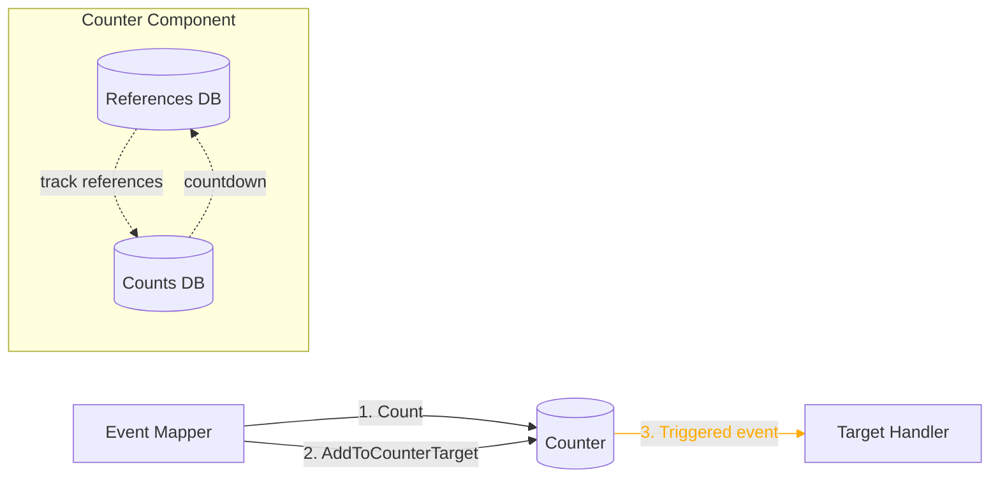
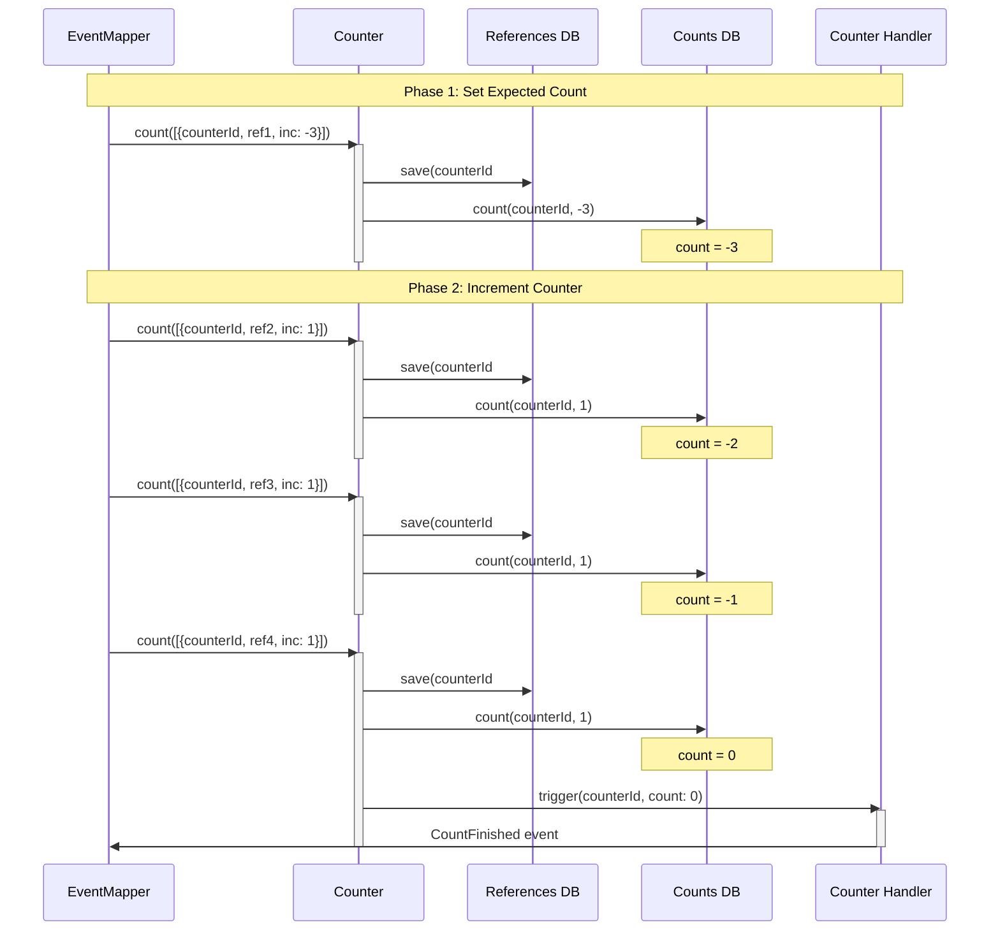
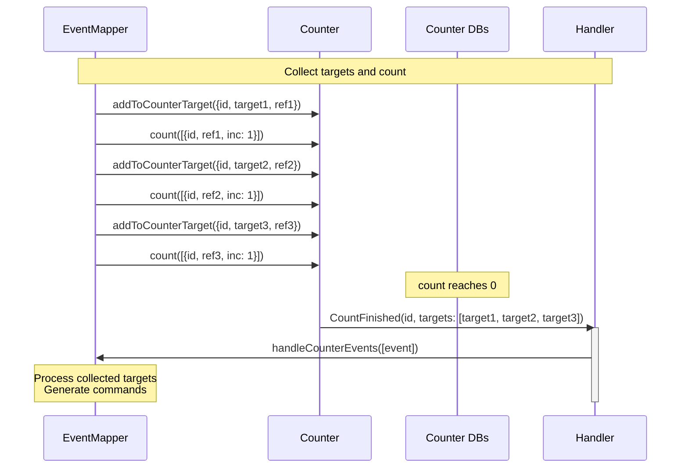

For a short summary of Counter, see [Reventless Components Overview.](../component-overview.md#counter)

:::info Framework Implementation
This component follows the Reventless [Component Structure Pattern](/framework/inner-workings/component-structure-pattern), using separate files for interface definitions ([`Counter.res`](../../reventless/src/components/Counter/Counter.res)), builder logic ([`Counter_Builder.res`](../../reventless/src/components/Counter/Counter_Builder.res)), runtime operations ([`Counter_Operations.res`](../../reventless/src/components/Counter/Counter_Operations.res)), and runtime callbacks ([`Counter_Callback.res`](../../reventless/src/components/Counter/Counter_Callback.res)).
:::

## Overview



The **Counter** component enables coordination across multiple events by counting references and triggering actions when a target count is reached. It's primarily used in EventMappers to implement patterns like "wait for N events before proceeding" or collecting data from multiple sources before generating a command.

## Purpose and Responsibilities

- **Responsibility**: Track event references by counter ID; countdown to zero when references are collected; emit Triggered events when count reaches zero; collect target data from multiple events; enable multi-event coordination patterns
- **In**: Count operations and target data from EventMapper
- **Out**: Triggered events (Counter.CountFinished) when count reaches zero

## Counter Operations

The Counter provides two main operations:

### Count Operation

Tracks references and increments/decrements counters:

```rescript
type countItem = {
  counterId: string,      // Unique counter identifier
  reference: string,      // Reference (typically correlationId)
  inc: int,              // Increment value (positive or negative)
}

type count = array<countItem> => promise<unit>
```

**Usage:**
```rescript
// Increment counter by 1
await count([{
  counterId: "order-123",
  reference: "correlation-abc",
  inc: 1
}])

// Set expected count (negative value)
await count([{
  counterId: "order-123",
  reference: "expected-count",
  inc: -5  // Expect 5 items
}])
```

### AddToCounterTarget Operation

Associates target data with a counter for later retrieval:

```rescript
type counterTargetRef = {
  counterId: string,      // Counter identifier
  target: 'a,            // Target data to collect
  targetRef: string,     // Reference for this target
}

type addToCounterTarget = counterTargetRef => promise<unit>
```

**Usage:**
```rescript
// Collect order items
await addToCounterTarget({
  counterId: "order-123",
  target: {itemId: "item-1", quantity: 2, price: 19.99},
  targetRef: "correlation-abc"
})
```

## Usage Pattern

### Counter in EventMappings

The Counter is typically used within EventMapper configurations:

```rescript title="Invoice_EventMappings.res"
open ReventlessSpec

module Target = Invoice

// Map Order events to Invoice commands
module OrderMapping = {
  module Source = Order
  
  let map = (. orderId, event, _queryEngine) =>
    switch event {
    | Order.Created({expectedItems}) => [
        // Set the expected count (negative number)
        EventMapping.CountMulti(
          orderId->Order.Id.toString,
          -expectedItems  // Expect this many items
        ),
      ]
    | Order.ItemAdded({itemId, quantity, price}) => [
        // Add item data to counter targets
        EventMapping.AddToCounterTarget({
          counterId: orderId->Order.Id.toString,
          target: {itemId, quantity, price}
        }),
        // Increment counter by 1
        EventMapping.Count(orderId->Order.Id.toString),
      ]
    | Order.ItemRemoved(_) => [
        // Decrement counter when item removed
        EventMapping.CountMulti(
          orderId->Order.Id.toString,
          -1
        ),
      ]
    | _ => []
    }
}

// Handle Counter.Triggered events
module CounterMapping = {
  module Source = Counter.Source
  
  let map = (. counterId, event, _queryEngine) =>
    switch event {
    | Counter.Source.CountFinished => {
        // Counter reached zero - all items collected
        // Targets contain all the collected item data
        [
          EventMapping.Publish(
            counterId->Invoice.Id.fromString,
            Invoice.Generate
          ),
        ]
      }
    }
}

module type Mapping = EventMapping.T with module Target := Target

let mappings: array<module(Mapping)> = [
  module(OrderMapping),
  module(CounterMapping),
]

// Enable counter for this EventMapper
let counter = Some(module(Invoice_Counter: Counter.T))
```

## Runtime Behavior

### Counter Countdown Sequence



### With Target Collection



## Integration Points

### With EventMapper

The Counter is created as part of an EventMapper when the EventMappings specify a counter:

```rescript
// In EventMappings file
let counter = Some(module(MyCounter: Counter.T))
```

The EventMapper automatically wires the Counter and handles its Triggered events through a special CounterMapping.

### Counter Event Source

The Counter emits events as `Counter.Source`:

```rescript
module Counter.Source = {
  module Id = ReventlessSpec.Id.String
  let name = "Counter"
  
  type event = 
    | CountFinished
}
```

These events can be mapped like any other aggregate events.

## Common Patterns

### Wait for Multiple Events

```rescript
// Wait for 3 confirmations before proceeding
module ConfirmationMapping = {
  module Source = Confirmation
  
  let map = (. requestId, event, _queryEngine) =>
    switch event {
    | Confirmation.RequestCreated => [
        // Set expected count to 3
        EventMapping.CountMulti(requestId, -3),
      ]
    | Confirmation.Approved(_) => [
        // Each approval increments counter
        EventMapping.Count(requestId),
      ]
    | _ => []
    }
}

module CounterMapping = {
  module Source = Counter.Source
  
  let map = (. requestId, event, _queryEngine) =>
    switch event {
    | Counter.Source.CountFinished => [
        // All 3 approvals received
        EventMapping.Publish(
          requestId,
          Request.Execute
        ),
      ]
    }
}
```

### Collect Data from Multiple Sources

```rescript
// Collect order items before generating invoice
module OrderItemMapping = {
  module Source = OrderItem
  
  let map = (. itemId, event, _queryEngine) =>
    switch event {
    | OrderItem.Added({orderId, quantity, price}) => [
        // Store item data
        EventMapping.AddToCounterTarget({
          counterId: orderId,
          target: {itemId, quantity, price}
        }),
        // Increment counter
        EventMapping.Count(orderId),
      ]
    | OrderItem.Removed({orderId}) => [
        // Decrement counter if item removed
        EventMapping.CountMulti(orderId, -1),
      ]
    | _ => []
    }
}

module CounterMapping = {
  module Source = Counter.Source
  
  let map = (. orderId, event, _queryEngine) =>
    switch event {
    | Counter.Source.CountFinished => {
        // Counter provides collected targets
        // Generate invoice with all collected items
        [
          EventMapping.Publish(
            orderId->Invoice.Id.fromString,
            Invoice.GenerateFromItems
          ),
        ]
      }
    }
}
```

### Saga Coordination

```rescript
// Coordinate multi-step process
module SagaMapping = {
  module Source = Process
  
  let map = (. processId, event, _queryEngine) =>
    switch event {
    | Process.Started({steps}) => [
        // Set expected count to number of steps
        EventMapping.CountMulti(processId, -steps),
      ]
    | Process.StepCompleted(_) => [
        // Each step completion increments
        EventMapping.Count(processId),
      ]
    | Process.StepFailed(_) => [
        // On failure, reset counter (set to 0)
        // This prevents completion
        EventMapping.CountMulti(processId, 1000),
      ]
    | _ => []
    }
}

module CounterMapping = {
  module Source = Counter.Source
  
  let map = (. processId, event, _queryEngine) =>
    switch event {
    | Counter.Source.CountFinished => [
        // All steps completed successfully
        EventMapping.Publish(
          processId,
          Process.Complete
        ),
      ]
    }
}
```

### Dynamic Count Targets

```rescript
// Handle variable number of items
module OrderMapping = {
  module Source = Order
  
  let map = (. orderId, event, _queryEngine) =>
    switch event {
    | Order.Created({items}) => [
        // Set count based on number of items
        EventMapping.CountMulti(
          orderId->Order.Id.toString,
          -(items->Array.length)
        ),
      ]
    | Order.ItemShipped({itemId}) => [
        EventMapping.AddToCounterTarget({
          counterId: orderId->Order.Id.toString,
          target: {itemId, shippedAt: Date.now()}
        }),
        EventMapping.Count(orderId->Order.Id.toString),
      ]
    | _ => []
    }
}
```

## Error Handling

The Counter includes error handling for common scenarios:

**Reference Tracking Errors:**
- Failed to save reference → raises `NotCounted` exception
- EventMapper retries count operation
- References are stored with TTL to prevent stale data

**Count Errors:**
- Failed to decrement count → logged and retried
- Count never reaches zero → TTL causes cleanup
- Duplicate references → each counted separately

**Recovery:**
- Counter references have configurable TTL (default: 1 week)
- Stale counters are automatically cleaned up
- Failed count operations are retried with backoff

## Pulumi

The Counter component creates these infrastructure resources:

```rescript
type outputs = {
  referencesDb: QueryDb.outputs,  // Stores count references
  countsDb: QueryDb.outputs,       // Stores counter values
}

type operations = {
  count: count,                        // Count operation
  addToCounterTarget: addToCounterTarget, // Target collection operation
}
```

**Resource Naming:**
- Component type: `reventless:Counter`
- Resource name pattern: `{targetAggregateName}Counter`
- References DB: `{name}References`
- Counts DB: `{name}Counts`

**Configuration:**
- `ttl` - Time-to-live for counter data (default: 1 week)
- Prevents stale counters from accumulating
- Configurable per Counter instance

## Data Storage

### References Database

Tracks individual count operations:

```rescript
type referencesState = {
  id: string,     // "counterId#reference"
  inc: int,       // Increment value
}
```

### Counts Database

Maintains current count values:

```rescript
type countsState = {
  id: string,     // counterId
  count: int,     // Current count value
}
```

**When count reaches 0:**
- Triggered event is emitted
- Counter handler invokes `counterEventsHandler`
- EventMapper processes CountFinished event

## Best Practices

### Use Negative Numbers for Expected Counts

```rescript
// ✅ Good: Set expected count as negative
EventMapping.CountMulti(orderId, -5)  // Expect 5 items

// Then increment with positive numbers
EventMapping.Count(orderId)  // +1 each time

// Counter triggers when: -5 + 1 + 1 + 1 + 1 + 1 = 0
```

### Use Correlation IDs as References

```rescript
// ✅ Good: Use event correlation ID
EventMapping.Count(orderId)  
// Internally uses event.meta.correlationId as reference

// This ensures each event is counted exactly once
```

### Clean Up with TTL

```rescript
// ✅ Good: Set appropriate TTL
let counter = Counter.make(
  ~name="OrderCounter",
  ~ttl=24 * 60 * 60,  // 1 day
  ~counterEventsHandler,
)

// Prevents accumulation of abandoned counters
```

### Handle Counter Completion

```rescript
// ✅ Good: Always handle Counter.Source events
module CounterMapping = {
  module Source = Counter.Source
  
  let map = (. counterId, event, _queryEngine) =>
    switch event {
    | Counter.Source.CountFinished => [
        // Take action when counter completes
        EventMapping.Publish(id, SomeCommand)
      ]
    }
}

// Include in mappings
let mappings = [
  module(CounterMapping),
  // ... other mappings
]
```

## Related Components

- **[EventMapper](./eventmapper.md)** - Primary user of Counter for event coordination
- **[Aggregate](./aggregate.md)** - Defines EventMappings that may use Counter
- **[QueryDb](./querydb.md)** - Underlying storage for counter data
- **[EventCollector](./eventcollector.md)** - Delivers Counter.Source events

## AWS Implementation

For detailed AWS implementation, see Counter AWS adapter documentation (TBD).

## Replacing the Old counter.md

:::note Migration
This documentation replaces the stub at [`packages/doc/do../common-modules/counter.md`](../common-modules/counter.md). The Counter is a full component, not just a common module, and its primary use is within EventMappings for multi-event coordination patterns.
:::