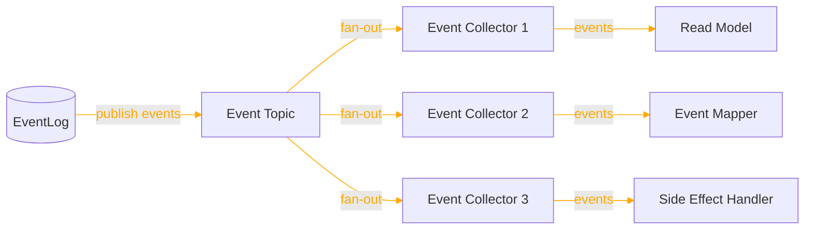
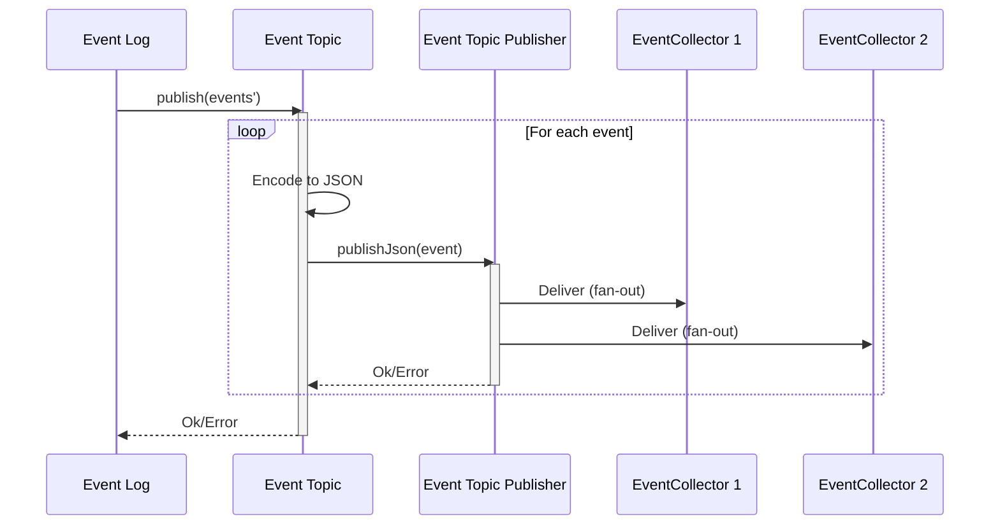
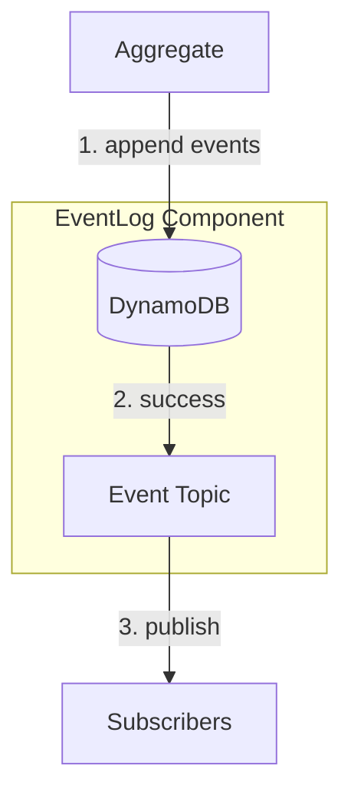
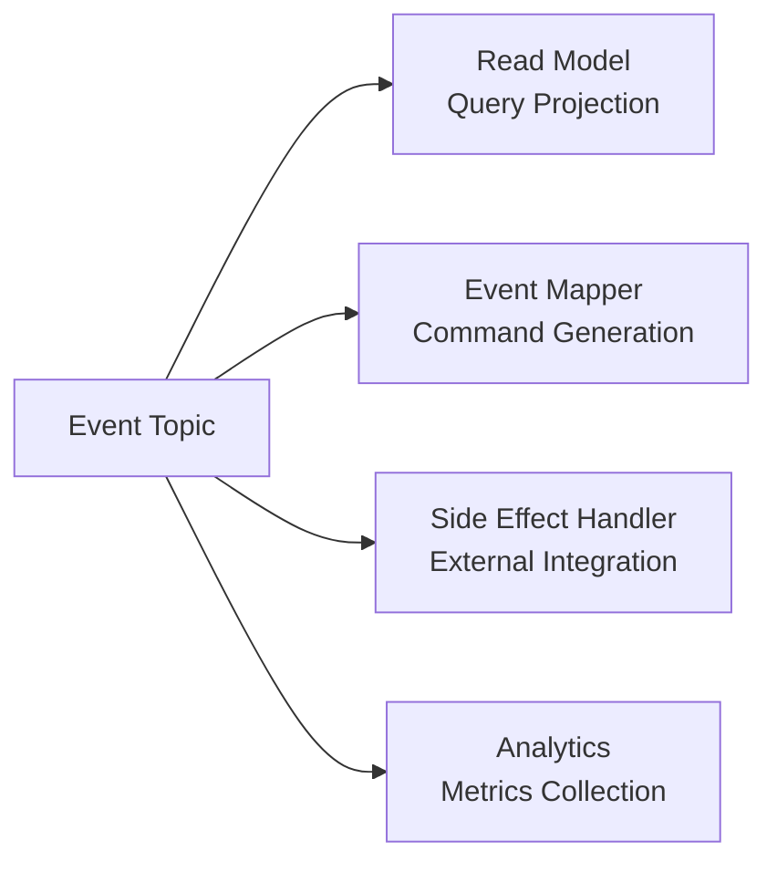

For a short summary of EventTopic, see [Reventless Components Overview.](../component-overview.md#eventtopic)

:::info Framework Implementation
This component follows the Reventless [Component Structure Pattern](/framework/inner-workings/component-structure-pattern), using separate files for interface definitions ([`EventTopic.res`](../../reventless/src/components/EventTopic/EventTopic.res)), builder logic ([`EventTopic_Builder.res`](../../reventless/src/components/EventTopic/EventTopic_Builder.res)), adapter interface ([`EventTopic_Adapter.res`](../../reventless/src/components/EventTopic/EventTopic_Adapter.res)), and runtime operations ([`EventTopic_Operations.res`](../../reventless/src/components/EventTopic/EventTopic_Operations.res)).
:::

## Overview



The **EventTopic** is the event distribution component that enables fan-out delivery of events to multiple subscribers. It receives events from the EventLog and distributes them to EventCollectors, which then deliver events to ReadModels, EventMappers, and SideEffectHandlers.

## Purpose and Responsibilities

- **Responsibility**: Distribute events from EventLog to multiple subscribers; enable fan-out pattern for event-driven architecture; provide ordering guarantees per aggregate
- **In**: Events from EventLog (via `publish` operation)
- **Out**: Events to EventCollectors (via SNS subscriptions)

## Component Spec

The EventTopic requires a spec defining the aggregate's id type and event type:

```rescript
module type Spec = {
  module Id: ReventlessSpec.Id.T

  @schema
  type event
}
```

For example, a Customer aggregate might define its spec as follows:

```rescript title="Customer.res"
module Id = ReventlessSpec.Id.String

@schema
type event =
  | Created({name: string, address: string})
  | AddressChanged(string)
  | NameChanged(string)
  | Deleted
```

This spec is used to create a type-safe EventTopic for the Customer aggregate.

## Usage Pattern

EventTopics are typically created as part of an EventLog component and are not used directly by application code. The EventLog handles all interactions with the EventTopic internally.

### Creating an EventTopic

```rescript title="Customer_EventLog.res"
module CustomerEventTopic = Reventless.EventTopic_Builder.Make(
  Customer,
  EventTopicPublisher_SNS,
)

let eventTopic = CustomerEventTopic.make(
  ~name="Customer",
  ~storageResources=eventLogResources,
  ~opts=pulumiOptions,
)
```

### EventTopic Operations

The EventTopic provides operations for publishing events:

#### Publish Operation

The `publish` operation sends events to the topic for distribution:

```rescript
type publish<'id, 'event> = (
  array<Message.event'<'id, 'event>>
) => promise<unit>
```

**Usage:**

```rescript
let events' = [
  {
    Message.id: customerId,
    event: Created({name: "John Doe", address: "123 Main St"}),
    meta: {...},
  },
]

await eventTopic.publish(events')
```

#### Publish JSON Operation

The `publishJson` operation publishes a single event in JSON format:

```rescript
type publishJson = (
  string,           // aggregate id
  Message.meta,     // event metadata
  Js.Json.t         // event JSON
) => promise<unit>
```

This is used internally by the EventLog after storing events.

## Runtime Behavior

### Event Publishing Flow



## Integration with EventLog

The EventTopic is automatically created and managed by the EventLog component:



**Flow:**
1. Aggregate appends events to EventLog storage
2. After successful storage, EventLog publishes to EventTopic
3. EventTopic distributes events to all subscribers

## Event Metadata

All events published to the EventTopic include metadata:

```rescript
type event'<'id, 'event> = {
  id: 'id,                // Aggregate instance ID
  meta: meta,             // Metadata
  event: 'event,          // The actual domain event
}

type meta = {
  service: service,       // service name that created event or is addressed by command
  time: string,           // when message was created
  ip: string,             // IP of service that created message
  user: string,           // user name that initiated message (if any)
  msgId: string,          // unique message id
  correlationId: string,  // id of message that caused this message
}
```

This metadata enables:
- **Event tracing** across the system
- **Debugging** event flows
- **Auditing** who initiated events
- **Causality tracking** for event sourcing

## Common Patterns

### Event Fan-out to Multiple Consumers



### Event-Driven Saga Pattern

```rescript
// Order aggregate publishes OrderCreated event
// EventTopic distributes to:
// 1. Inventory EventMapper -> Reserve inventory
// 2. Payment EventMapper -> Process payment
// 3. Notification SideEffectHandler -> Send confirmation email
```

### Cross-Plugin Event Distribution

```rescript
// Plugin A's EventTopic publishes events
// Plugin B's Extension subscribes via ExtensionPoint
// Events flow across plugin boundaries
```

## Pulumi

The EventTopic component creates these infrastructure resources:

```rescript
type outputs = {
  resources: array<resource>,    // adapter resources
}
```

**Resource Naming:**
- Component type: `reventless:EventTopic`
- Resource name pattern: `{aggregateName}EventTopic`

**Dependencies:**
- EventLog depends on EventTopic (events published after storage)
- EventCollectors subscribe to EventTopic

## Related Components

- **[EventLog](./eventlog.md)** - Publishes events to EventTopic after storage
- **[EventCollector](./eventcollector.md)** - Subscribes to EventTopic for event consumption
- **[ReadModel](./readmodel.md)** - Consumes events via EventCollector
- **[EventMapper](./eventmapper.md)** - Consumes events via EventCollector
- **[SideEffectHandler](./sideeffecthandler.md)** - Consumes events via EventCollector
- **[CommandTopic](./commandtopic.md)** - Similar pattern for command distribution

## AWS Implementation

For detailed implementation, see [EventTopic AWS Adapter Documentation](/aws/adapters/eventtopic).

