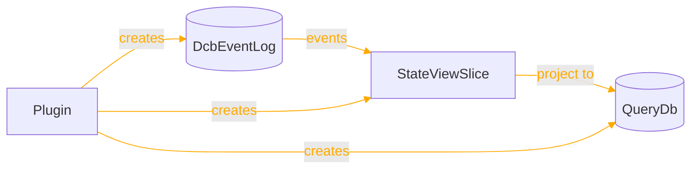
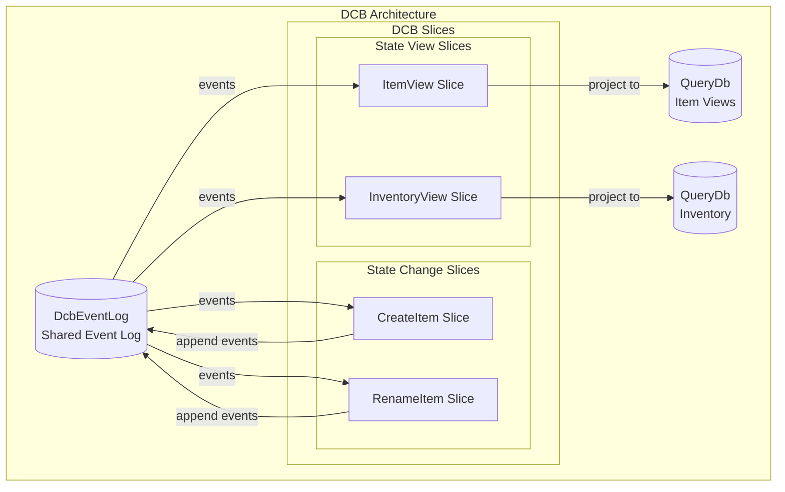
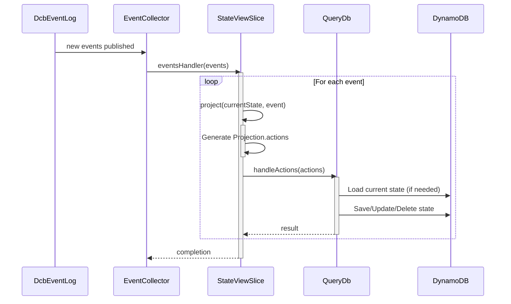

For a short summary of StateViewSlice, see [Reventless Components Overview.](../component-overview.md#stateviewslice)

:::info Framework Implementation
This component follows the Reventless [Component Structure Pattern](/framework/inner-workings/component-structure-pattern), using separate files for interface definitions ([`StateViewSlice.res`](../../reventless/src/components/StateViewSlice/StateViewSlice.res)), builder logic ([`StateViewSlice_Builder.res`](../../reventless/src/components/StateViewSlice/StateViewSlice_Builder.res)), and callback/handler logic ([`StateViewSlice_Callback.res`](../../reventless/src/components/StateViewSlice/StateViewSlice_Callback.res)).
:::

## Overview



The **StateViewSlice** is a DCB (Dynamic Consistency Boundary) component that projects events from a shared DcbEventLog into a QueryDb-backed read model. It implements the projection pattern where events are transformed into state updates.

## Purpose and Responsibilities

- **Responsibility**: Listen to events from DcbEventLog and project them into a QueryDb for efficient reading
- **In**: Events from DcbEventLog (subscribed via EventCollector)
- **Out**: State updates to QueryDb
- **Key Feature**: Complements StateChangeSlice by providing read-optimized views of the event-sourced state

## Relationship with DCB

StateViewSlice works alongside StateChangeSlice in the DCB architecture:



## Component Spec

The StateViewSlice component requires a spec that defines its name, state type, and projection logic. The spec type is defined in [`StateViewSlice.res`](../../reventless/src/components/StateViewSlice/StateViewSlice.res) as `StateViewSlice.Spec`:

```rescript
module MySpec: StateViewSlice.Spec = {
  let name = "MyStateViewSlice"

  module DcbEventLogSpec = MyDcbEventLogSpec

  @schema
  type event = 
    | Created({id: string, name: string})
    | Updated({id: string, name: string})
    | Deleted({id: string})

  @schema
  type state = {
    items: dict<item>,
  }

  let project = (state, event) =>
    switch event {
    | Created({id, name}) => [Projection.Action.Set(id, {name})]
    | Updated({id, name}) => [Projection.Action.Set(id, {name})]
    | Deleted({id}) => [Projection.Action.Delete(id)]
    }
}
```

Or import the spec from the file:
```rescript
module MySpec = MyStateViewSliceSpec  // defines module matching StateViewSlice.Spec

### Spec Fields Explained

| Field | Type | Description |
|-------|------|-------------|
| `name` | `string` | Unique identifier for this view slice |
| `DcbEventLogSpec` | `module(DcbEventLog.Spec)` | Reference to the shared event log spec |
| `event` | `@schema type` | Event type using `@schema` ppx for auto-generated schema |
| `state` | `@schema type` | State type for the read model (schema auto-generated) |
| `project` | `(option<state>, event) => array<Projection.action<state>>` | Function to transform event into state actions |

## Runtime Behavior

### Event Processing Flow



### Projection Actions

StateViewSlice uses Projection actions to update state:

```rescript
// Example projection actions
let project = (currentState, event) =>
  switch event {
  | ItemCreated({itemId, name}) =>
    [Projection.Create(itemId, {name, createdAt: Js.Date.now()})]
    
  | ItemRenamed({itemId, newName}) =>
    [Projection.Update(itemId, state => {...state, name: newName})]
    
  | ItemDeleted({itemId}) =>
    [Projection.Delete(itemId)]
    
  | StockAdjusted({itemId, delta}) =>
    // UpdateWithDefault handles case where item doesn't exist yet
    [Projection.UpdateWithDefault(itemId, {count: 0}, state => 
      {...state, count: state.count + delta}
    )]
  }
```

## Comparison with ReadModel

| Aspect | ReadModel | StateViewSlice |
|--------|-----------|----------------|
| **Event Source** | Multiple EventTopics | Single DcbEventLog |
| **Mappings** | Complex mapping system | Single projection function |
| **Spec** | ReventlessSpec.ReadModel_Spec.T | Custom Spec with project function |
| **Use Case** | General-purpose read models | DCB-specific view projections |

## Comparison with StateChangeSlice

| Aspect | StateChangeSlice | StateViewSlice |
|--------|-----------------|----------------|
| **Purpose** | Handle commands and decide on events | Project events into read model |
| **Input** | Commands from CommandTopic | Events from DcbEventLog EventTopic |
| **Output** | Appends events to DcbEventLog | Updates QueryDb state |
| **Pattern** | Decision/command pattern | Projection pattern |

## Pulumi Outputs

```rescript
type outputs = {
  resources: array<ReventlessSpec.Adapter.resource>,
  queryDb: QueryDb.outputs,
}
```

The StateViewSlice creates its own QueryDb:
- DynamoDB table for state storage
- AppSync resolvers for querying
- Related IAM roles and policies

## Related Components

- **[DcbEventLog](./dcbeventlog.md)** - Shared event log for DCB slices
- **[StateChangeSlice](./statechangeslice.md)** - Processes commands and appends events
- **[QueryDb](./querydb.md)** - Read model storage
- **[ReadModel](./readmodel.md)** - General-purpose read model component
- **[Plugin](./plugin.md)** - Hosts DCB slices and creates shared infrastructure
- **[EventCollector](./eventcollector.md)** - Consumes events for projection
- **[Event Modeling: Usage](./event-modeling-stateviewslice-usage.md)** - How to use StateViewSlice in your application
