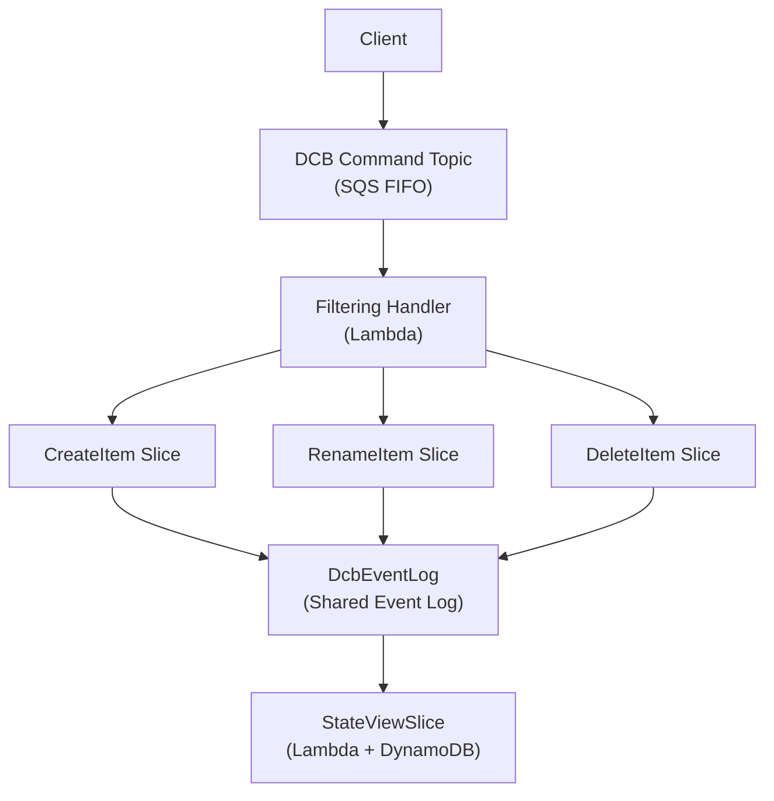

# DCB-Based Plugin

A DCB-Based Plugin (Dynamic Consistency Boundary) uses a **shared event log** across multiple state change slices with optimistic concurrency control. Instead of a per-aggregate event stream, all slices share one log and use **DCB tags** to filter relevant events.

## When to Use

Choose the DCB-Based approach when:
- You need consistency across multiple related operations within a plugin
- Multiple commands might affect the same entities concurrently
- You want optimistic concurrency control rather than sequential processing
- A single event log should serve multiple independent state change operations

## Architecture



## Key Concepts

### DCB Tags

Fields annotated with `@s.matches(DcbTag.string)` or `@s.matches(DcbTag.int)` become **DCB tags** that are indexed in the shared event log. Tags allow each slice to efficiently query only the events relevant to its decision model (e.g., all events for a specific `itemId`).

### Decision Model

Each `StateChangeSlice` builds a **decision model** by reading and folding relevant events from the shared log. The model captures the minimal state needed to accept or reject a command.

### Optimistic Concurrency

When appending events, the DCB event log checks that no conflicting events were written since the decision model was built. If a conflict is detected, the command handler retries.

## Building a DCB-Based Plugin

The following example builds an **Item Catalog** plugin using DCB. Items can be created, renamed, and deleted.

### Step 1: Define the Shared Event Log Spec

The `DcbEventLog_Spec.T` requires only a single `@schema type event`. Every field that should act as a DCB tag must be annotated with `@s.matches(DcbTag.string)` (or `DcbTag.int`). These tags are extracted and stored alongside each event for efficient querying.

```rescript
// ItemEventLogSpec.res
@schema
type event =
  | ItemCreated({itemId: @s.matches(DcbTag.string) string, name: string})
  | ItemRenamed({itemId: @s.matches(DcbTag.string) string, newName: string})
  | ItemDeleted({itemId: @s.matches(DcbTag.string) string})
```

All variant constructors must have a payload. Payload-less variants (e.g., `| SomeEvent`) serialize as JSON strings and are not handled correctly by the DCB infrastructure.

### Step 2: Implement StateChangeSlice Specs

Each `StateChangeSlice` handles one command type (or a related group). The spec implements `ReventlessSpec.StateChangeSlice_Spec.T`:

- **`decisionModel`** / **`initialDecisionModel`** — the minimal state built from past events
- **`reduce`** — folds a DCB event into the decision model
- **`decide`** — accepts or rejects the command, returning events or an error

The `@schema` annotation on `type command` automatically generates `commandSchema`, which the framework uses to route commands to the correct slice.

```rescript
// CreateItemSpec.res
let name = "CreateItem"

module DcbEventLogSpec = ItemEventLogSpec

@schema
type command =
  | CreateItem({itemId: @s.matches(DcbTag.string) string, name: string})

@schema
type error =
  | ItemAlreadyExists

type decisionModel = {exists: bool}
let initialDecisionModel = {exists: false}

// Build the decision model by folding relevant events
let reduce = (model, event) =>
  switch event {
  | ItemEventLogSpec.ItemCreated(_) => {exists: true}
  | ItemEventLogSpec.ItemDeleted(_) => {exists: false}
  | _ => model
  }

// Accept or reject the command based on the decision model
let decide = (model, command) =>
  switch command {
  | CreateItem({itemId, name}) =>
    if model.exists {
      Error(ItemAlreadyExists)
    } else {
      Ok([ItemEventLogSpec.ItemCreated({itemId, name})])
    }
  }
```

```rescript
// RenameItemSpec.res
let name = "RenameItem"

module DcbEventLogSpec = ItemEventLogSpec

@schema
type command =
  | RenameItem({itemId: @s.matches(DcbTag.string) string, newName: string})

@schema
type error =
  | ItemNotFound

type decisionModel = {exists: bool}
let initialDecisionModel = {exists: false}

let reduce = (model, event) =>
  switch event {
  | ItemEventLogSpec.ItemCreated(_) => {exists: true}
  | ItemEventLogSpec.ItemDeleted(_) => {exists: false}
  | _ => model
  }

let decide = (model, command) =>
  switch command {
  | RenameItem({itemId, newName}) =>
    if !model.exists {
      Error(ItemNotFound)
    } else {
      Ok([ItemEventLogSpec.ItemRenamed({itemId, newName})])
    }
  }
```

```rescript
// DeleteItemSpec.res
let name = "DeleteItem"

module DcbEventLogSpec = ItemEventLogSpec

@schema
type command =
  | DeleteItem({itemId: @s.matches(DcbTag.string) string})

@schema
type error =
  | ItemNotFound

type decisionModel = {exists: bool}
let initialDecisionModel = {exists: false}

let reduce = (model, event) =>
  switch event {
  | ItemEventLogSpec.ItemCreated(_) => {exists: true}
  | ItemEventLogSpec.ItemDeleted(_) => {exists: false}
  | _ => model
  }

let decide = (model, command) =>
  switch command {
  | DeleteItem({itemId}) =>
    if !model.exists {
      Error(ItemNotFound)
    } else {
      Ok([ItemEventLogSpec.ItemDeleted({itemId})])
    }
  }
```

### Step 3: Implement a StateViewSlice Spec

A `StateViewSlice` projects events from the shared log into a queryable read model state. The spec implements `ReventlessSpec.StateViewSlice_Spec.T`.

The `project` function takes an `option<state>` (existing state or `None` if the entry doesn't exist yet) and a DCB event, and returns an **array** of `Projection_Spec.action` values.

```rescript
// ItemViewSpec.res
let name = "ItemView"

module DcbEventLogSpec = ItemEventLogSpec

// Re-export the event type for the framework to use
@schema
type event = ItemEventLogSpec.event

// The read-side state stored per item
@schema
type state = {
  itemId: string,
  name: string,
}

// Project DCB events into read model actions
let project = (existingState, event) =>
  switch event {
  | ItemEventLogSpec.ItemCreated({itemId, name}) =>
    [ReventlessSpec.Projection.Spec.Set(itemId, {itemId, name})]
  | ItemEventLogSpec.ItemRenamed({itemId, newName}) =>
    switch existingState {
    | Some(state) =>
      [ReventlessSpec.Projection.Spec.Set(itemId, {...state, name: newName})]
    | None => []
    }
  | ItemEventLogSpec.ItemDeleted({itemId}) =>
    [ReventlessSpec.Projection.Spec.Delete(itemId)]
  }
```

### Step 4: Assemble the Plugin

The Plugin is assembled as a **[module function](./rescript-syntax.md#functors) over `Platform.T`**. Slices are built using `Platform.StateChangeSlice.Make` and `Platform.StateViewSlice.Make`, then bundled into a `DcbSpec` that the plugin infrastructure uses to wire up the shared event log and filtering handler.

```rescript
// ItemCatalogPlugin.res
// Imports only `reventless`, not `reventless-aws`

module Make = (Platform: Reventless.Platform.T) => {
  // Build each StateChangeSlice from its spec
  module CreateItem = Platform.StateChangeSlice.Make(CreateItemSpec)
  module RenameItem = Platform.StateChangeSlice.Make(RenameItemSpec)
  module DeleteItem = Platform.StateChangeSlice.Make(DeleteItemSpec)

  // Build the StateViewSlice
  module ItemView = Platform.StateViewSlice.Make(ItemViewSpec)

  // Bundle into a DcbSpec for the plugin
  // The event type must match the shared DcbEventLogSpec.event
  module DcbSpec: Reventless.Plugin.DcbSpec = {
    @schema
    type event = ItemEventLogSpec.event

    let stateChangeSlices: array<module(Reventless.StateChangeSlice.T with type dcbEvent = event)> = [
      module(CreateItem),
      module(RenameItem),
      module(DeleteItem),
    ]

    let stateViewSlices: array<module(Reventless.StateViewSlice.T with type dcbEvent = event)> = [
      module(ItemView),
    ]
  }
}
```

## Deploying the Plugin

```rescript
// index.res — composition root

module Platform = ReventlessAws.Platform.Make(Config)
module App = ItemCatalogPlugin.Make(Platform)

let plugin = ReventlessAws.Plugin.make(
  ~name="item-catalog-plugin",
  ~version="1.0.0",
  ~heartbeatInterval=30,
  ~dcbSpec=module(App.DcbSpec),
  ~scheduler,
)
```

## Comparison: StateChangeSlice vs Aggregate

| Aspect | Aggregate | StateChangeSlice |
|--------|-----------|------------------|
| Event log | One per aggregate | Shared across all slices |
| Consistency boundary | Per aggregate instance | Per command (optimistic) |
| Concurrency | Sequential per instance | Optimistic concurrency |
| Decision logic | State machine (init/apply) | Decision model (reduce/decide) |
| Cross-entity consistency | No | Yes (via shared log) |

## Next Steps

- [Plugin System Overview](./plugin-system.md) - Understand the full plugin system
- [Aggregate-Based Plugin](./aggregate-based-plugin.md) - Learn about the alternative Aggregate approach
