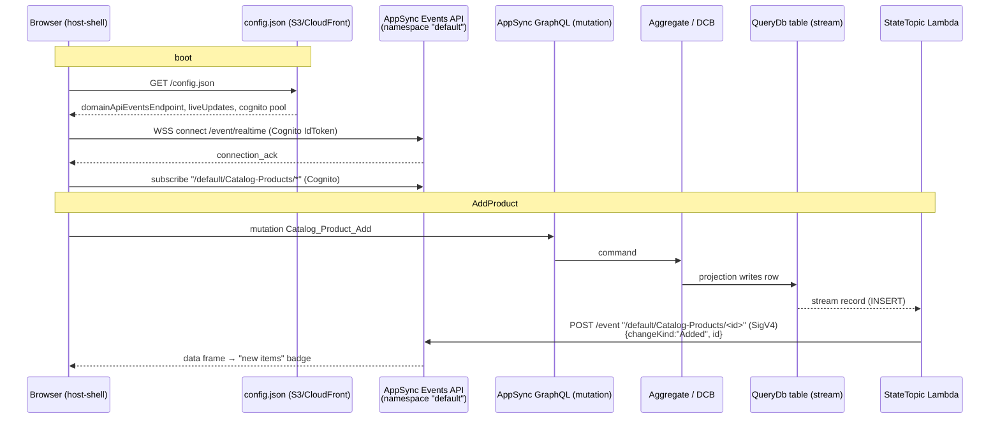

# AppSync Events & Live Updates

How Reventless pushes real-time read-model changes to the browser, why it uses an
AWS AppSync **Events** API (not GraphQL subscriptions), and the channel/namespace/auth
contract that the publisher and subscriber **must** agree on.

> **Audience:** anyone touching the live-update path — `reventless-aws` adapters,
> the `Platform.res` wiring, the host-shell / `reventless-ui` subscribe code, or
> debugging "the AutoUI list doesn't refresh after a command".

---

## TL;DR — the three invariants

Live updates only work when **all three** of these line up between the server
(publisher) and the browser (subscriber). Each one is an independent failure mode;
each has historically broken on its own:

| # | Invariant | Publisher side | Subscriber side |
|---|-----------|----------------|-----------------|
| 1 | **Auth** | Lambda publishes with **AWS_IAM** (SigV4) | Browser connects/subscribes with **Cognito** IdToken — the Events API must list **both** providers, and its Cognito pool must match `config.json` |
| 2 | **Channel root** | `topicName` = read model's **list field name** (`Catalog_Products`) | `readModel.queryField` = the same **list field name** |
| 3 | **Namespace** | publishes to `/default/<root>/<entityKey>` | subscribes to `/default/<root>/*` — the leading `/default/` segment is **required** |

If lists refresh only on a full page reload, walk these three in order. The
[Debugging](#debugging-checklist) section gives a copy-paste verification for each.

---

## What is AppSync Events (and how it differs from GraphQL subscriptions)

AWS AppSync exposes **two unrelated real-time products**:

| | **AppSync GraphQL subscriptions** | **AppSync Events (Pub/Sub)** |
|---|---|---|
| Resource | `aws.appsync.GraphQLApi` + `@aws_subscribe` resolvers | `aws-native:appsync/Api` with an `eventConfig` |
| Model | subscribe to a GraphQL field; server resolves a mutation→subscription mapping | publish/subscribe to free-form **channels**; no schema, no resolvers |
| Endpoint | `wss://<host>.appsync-realtime-api.<region>…/graphql` | `wss://<host>.appsync-realtime-api.<region>…/event/realtime` |
| Publish | implicit (a mutation triggers the subscription) | explicit HTTP `POST /event` to a channel |
| Reventless usage | **Source C** (command-result subscriptions, `onX_…`) | **Sources A & B** (raw events + read-model state changes) |

Reventless uses the **Events** API for live read-model updates because the
publisher is a **Lambda reacting to a DynamoDB Stream**, not a GraphQL mutation.
There is no GraphQL operation to hang a subscription off — the change originates
in the projection store. A plain pub/sub channel is the natural fit: the Lambda
POSTs a small "something changed" descriptor to a channel, and any browser viewing
that read model is subscribed to it.

A single AppSync Events API per platform serves **both** domain and platform
read-model channels (see [`AppSync_EventsApi.res`](https://github.com/ReventlessDev/reventless-core/blob/main/reventless/reventless-aws/src/adapter/Api/AppSync_EventsApi.res)).

### The two server-side sources

| Source | Trigger | Adapter | Channel root | Payload |
|--------|---------|---------|--------------|---------|
| **B — state changes** | QueryDb DynamoDB **Stream** | [`StateTopic_AppSync.res`](https://github.com/ReventlessDev/reventless-core/blob/main/reventless/reventless-aws/src/adapter/StateTopic/StateTopic_AppSync.res) | read model **list field name** | change descriptor `{changeKind, id, sortKeyValue?}` |
| **A — raw events** | SNS EventTopic → SQS | [`EventLogSubscription_AppSync.res`](https://github.com/ReventlessDev/reventless-core/blob/main/reventless/reventless-aws/src/adapter/EventLogSubscription/EventLogSubscription_AppSync.res) | event log **displayName** | `{position, eventType, payload, originatorSlice}` |

AutoUI list/detail views consume **Source B**. The rest of this guide focuses on
Source B; Source A follows the same namespace/auth rules with a different channel
root and payload.

---

## Channel namespaces — the concept, and why `default` is required

### What a namespace is

In AppSync Events, every channel lives under a **channel namespace**. A namespace
is a first-class AWS resource (`aws-native:appsync/ChannelNamespace`) attached to
the Events API. It is the unit at which AWS lets you attach behavior:

- **`OnPublish`** handlers (server-side coalescing / transformation),
- **`OnSubscribe`** handlers (subscribe-time authorization),
- per-namespace auth-mode overrides.

A channel is **addressed** as:

```
/<namespace>/<segment>/<segment>/...
```

The namespace is **not optional and not implicit** — it is literally the first
path segment of every channel string, on **both** the publish call and the
subscribe call. There is no "default namespace" that AWS fills in for you; the
name `default` is just a namespace Reventless chooses to create.

### Why Reventless uses a single namespace named `default`

Reventless creates exactly one namespace, named `default`, in
[`AppSync_EventsApi.make`](https://github.com/ReventlessDev/reventless-core/blob/main/reventless/reventless-aws/src/adapter/Api/AppSync_EventsApi.res):

```rescript
let defaultNamespace = ChannelNamespace.make(
  ~name=name ++ "DefaultNS",
  ~args={ apiId: api.apiId->…, name: "default"->… , … },
  …
)
```

One namespace is enough because:

- The Events API itself already scopes everything (one API per platform).
- Per-read-model isolation is achieved by the **channel path**
  (`<root>/<entityKey>`), not by separate namespaces.
- Namespace-level features we may want later — `OnPublish` coalescing,
  `OnSubscribe` multi-tenant authz — apply uniformly across all read models, so a
  single namespace is the right grain. (`registerSubscribeAuth` already wires an
  `OnSubscribe` handler onto this one namespace for downstream multi-tenancy
  extensions.)

The name `default` is an arbitrary-but-fixed convention. **Because it is fixed and
known on both sides, neither side may omit it.** This is the subtle trap: it is
easy to think of the channel as "`Catalog-Products/*`" and forget that the real
address is "`/default/Catalog-Products/*`". Subscribing without the prefix targets
a namespace that does not exist, so AWS silently delivers nothing.

> **Golden rule:** the channel string is `/default/<root>/<…>` **everywhere** —
> the publisher's `POST /event` body, and the subscriber's `subscribe` message.
> If you write channel-construction code on either side, it must include the
> `/default/` prefix.

---

## Channel addressing scheme

```
/default/<topicRoot>/<entityKey>
   │          │            │
   │          │            └─ DynamoDB primary key value(s) of the changed row.
   │          │               single-key:    "<id>"
   │          │               composite-key: "<id>-<subIdValue>"
   │          │
   │          └─ the read model's GraphQL LIST field name (see below),
   │             sanitised so every non-[A-Za-z0-9-] char becomes "-".
   │
   └─ the channel namespace (always "default").
```

### Segment normalisation: collapse to `[A-Za-z0-9-]`

AppSync Events channel segments allow only `[A-Za-z0-9-]`. Every other char —
`_`, `@`, `.`, `:`, `/`, … — must collapse to `-` on **both** ends, otherwise the
publisher hits `BadRequestException: Invalid Channel Format` and no descriptor
ever reaches the browser. Both ends apply the same rule:

- Publisher: `StateTopic_AppSync` handler — `pathSegment(value)` runs `value.replace(/[^A-Za-z0-9-]/g, "-")` on `topicRoot` and on the entityKey **on the URL path only**. The descriptor body's `id` keeps the original (unsanitised) entity key so the UI can match it against `row.id` from GraphQL.
- Subscriber: `AutoLive.normalizeSegment` — `s.replaceRegExp(/[^A-Za-z0-9-]/g, "-")`, applied to the channel root and to the Entity-scope key when building the subscribe URL.

So `Catalog_Products` becomes `Catalog-Products`, and a plugin entity id like
`Ordering@1.0.0-alpha.72` becomes `Ordering-1-0-0-alpha-72` — on the wire on
both sides. **Historical note:** an earlier rule only normalised underscores,
which silently broke the Plugins admin RM whose ids carry `@` and `.`. Keep the
two ends in lock-step: a publisher-only widening of the rule still breaks
Entity-scoped subscribes.

### The channel root **is the list field name** (invariant #2)

This is the part that bit us. The registry [`Api_Naming.queryNames`](https://github.com/ReventlessDev/reventless-core/blob/main/reventless/reventless-core/src/components/Api/Api_Naming.res)
holds several names for one read model:

| Field | Value for read model `Products` in plugin `Catalog` | Used for |
|-------|------------------------------------------------------|----------|
| `returnTypeName` | `Catalog_Product` (**singular**) | GraphQL type name |
| `listFieldName` | `Catalog_Products` (**plural**) | GraphQL list query field |

The AutoUI manifest sets `queryableDef.queryField = listFieldName`
([`Plugin_Structure.res`](https://github.com/ReventlessDev/reventless-core/blob/main/reventless/reventless-core/src/components/Plugin/Plugin_Structure.res)),
and the browser subscribes on `readModel.queryField`. Therefore the **publisher
must also use `listFieldName`** as the channel root
([`Platform.res` `subscriptionInfraHook`](https://github.com/ReventlessDev/reventless-core/blob/main/reventless/reventless-aws/src/Platform.res)):

```rescript
let topicName =
  ReventlessCore.Plugin_Helpers.queryFieldNamesRegistry
  ->Dict.get(readModelName)
  ->Option.map(qn => qn.listFieldName)   // NOT returnTypeName
  ->Option.getOr(readModelName)
StateTopic_AppSync.make(~readModelName, ~topicName, …)
```

Publishing on the singular `returnTypeName` while the UI subscribes on the plural
`listFieldName` orphans every descriptor — connected, authorized, and silently
delivered to a channel nobody listens to.

### List vs detail subscriptions

| View | Scope | Channel |
|------|-------|---------|
| List (`AutoListView`) | `All` | `/default/Catalog-Products/*` |
| Detail (`AutoDrillDetail`) | `Entity(id)` | `/default/Catalog-Products/<id>` |

The trailing `*` wildcard matches any entity key, so a list view receives every
row change in the read model; a detail view receives only its own entity's changes.

### Change-descriptor payload (Source B)

The publisher sends a small descriptor — **not** the full row:

```json
{ "changeKind": "Added" | "Updated" | "Removed" | "BulkInvalidated",
  "id": "<entityKey>",
  "sortKeyValue": "<updatedAt | createdAt, if present>" }
```

`changeKind` is derived from the DynamoDB stream `eventName`
(`INSERT→Added`, `MODIFY→Updated`, `REMOVE→Removed`). The UI decodes it in
`AutoLive.decodeDescriptor` (in the `@reventlessdev/reventless-ui` package,
`src/live/`); malformed frames are dropped. `AutoListView` handles `Added`
**by origin**: an add this browser/tab just triggered via the command form is
auto-fetched and **inserted into the list immediately**; an add by anyone else
surfaces a **"N new items" pill** (click to refresh) so the user's scroll isn't
disrupted. Self-detection is per-tab — the view records the entity id at command
submit (expiring after 60s) and matches it against the descriptor id; there is no
actor field on the wire. `Updated` / `Removed` apply in place for all origins
(an open detail refetches on `Updated` and shows an "entity gone" placeholder on
`Removed`).

---

## Auth model (invariant #1)

The two ends authenticate **differently**, so the Events API must accept both:

| Path | Who | Auth | Configured by |
|------|-----|------|---------------|
| Publish (`POST /event`) | StateTopic / EventLogSubscription Lambda | **AWS_IAM** — native SigV4 over `fetch` using the Lambda role's `AWS_*` env creds | `defaultPublishAuthModes: [AWS_IAM]` + IAM policy `appsync:EventPublish` on `<apiArn>/*` |
| Connect + subscribe (WebSocket) | the browser | **Cognito User Pools** IdToken (bearer) | `connectionAuthModes` + `defaultSubscribeAuthModes` include `AMAZON_COGNITO_USER_POOLS`; an auth provider with `cognitoConfig {userPoolId, awsRegion}` |

`AppSync_EventsApi.make` therefore registers **both** providers:

```rescript
authProviders:          [AWS_IAM, AMAZON_COGNITO_USER_POOLS]
connectionAuthModes:    [AMAZON_COGNITO_USER_POOLS, AWS_IAM]
defaultPublishAuthModes:[AWS_IAM]                        // Lambdas only
defaultSubscribeAuthModes:[AMAZON_COGNITO_USER_POOLS, AWS_IAM]
```

> **Critical:** the Events API's `cognitoConfig.userPoolId` must be the **same
> pool** as `config.json`'s `cognitoUserPoolId`. The browser presents a token
> minted by the config.json pool; if the Events API trusts a different pool, the
> WebSocket `connection_init` is rejected and the UI never subscribes. Both are
> resolved from the process-cached `Platform_Stack.resolveCognitoUserPool()`, so
> they stay in sync — but verify it after any pool change.

An IAM-only Events API (the original bug) lets the Lambda publish fine while
silently refusing the browser's Cognito connection — publish works, subscribe is
dead, and the symptom is "data lands in DynamoDB but the UI never updates".

---

## End-to-end flow



---

## Subscribe-side wire protocol

Implemented in `EventsClient.res` (in the `@reventlessdev/reventless-ui` package, `src/live/`):

1. **URL transform** (HTTPS publish endpoint → realtime WS):
   `https://<host>.appsync-api.<region>…/event`
   → `wss://<host>.appsync-realtime-api.<region>…/event/realtime`
   (swap scheme to `wss`, swap `appsync-api.`→`appsync-realtime-api.`, append `/realtime`).
2. **Auth subprotocol header** on the WebSocket:
   `["aws-appsync-event-ws", "header-<base64url(JSON({host, Authorization: idToken}))>"]`
   — note `host` is the **HTTPS api host**, not the realtime host.
3. After `open`: send `{"type":"connection_init"}`, await `{"type":"connection_ack"}`.
4. **Per subscribe:** `{"type":"subscribe","id":<uuid>,"channel":"/default/…/*","authorization":{host, Authorization}}`.
5. **Data:** `{"type":"data","id":<subId>,"event":<descriptor>}`. Unsubscribe: `{"type":"unsubscribe","id":<subId>}`.

`LiveConnection.res` (same package, `src/live/`)
owns at most two clients (Domain + Platform — routed by `Platform_`-prefixed read
model names), reference-counts channels, lazily opens on first subscribe, and
disposes after an idle window. It is armed only when `config.json` has
`liveUpdates: true` **and** the matching `*EventsEndpoint` is present.

### Reconnect behaviour (Tier 1 refetch)

AppSync Events is fire-and-forget pub/sub — a subscriber connected at time T
sees publishes from T onward and nothing earlier. When the WebSocket drops
(laptop sleep, network blip, idle timeout) and re-opens, the descriptors
published during the gap are gone. Without compensation the UI silently
diverges from the QueryDb.

Tier 1 closes this gap by **refetching the current view's existing query on
qualifying reconnects** — the URL already carries enough state (filters,
sort, keyset cursor, open detail) to land on the same page after either a
reconnect or a manual reload.

How it works:

- `EventsClient` records the timestamp of every `Open → Closed` transition.
  On `Closed/Connecting → Open` it fires `onReconnect(gapMs)`.
- `LiveConnection` debounces with `reconnectDebounceMs = 2000`. Brief blips
  (< 2s) and the initial socket open never trigger refetch.
- `LiveConnection.registerReconnect(~api, listener)` is the fan-out point.
  `AutoLive.useSubscription(~onReconnect)` registers per subscription and
  unregisters on unmount.
- `AutoListView` registers `setRetryCount(c => c + 1)` — bumps the existing
  fetch effect's dependency, which re-runs with the current URL params.
  Self-change markers and the "new items" pill count are intentionally
  preserved across the refetch.
- `AutoDrillDetail` (always rendered inside `AutoListView`) registers a
  detail-refetch that latches the entity-gone placeholder if the row is now
  missing — same UX as a live `Removed` descriptor.

Configuration: `config.json` field `liveReconnectRefetch` (default `true`).
Set to `false` on bandwidth-constrained networks that prefer staleness over
an extra round of QueryDb reads on reconnect. The flag is independent of
`liveUpdates` — disabling reconnect refetch leaves the live descriptor
stream itself intact.

Out of scope for Tier 1 (deferred — see
[`docs/analysis/reconnect-replay-missed-changes.md`](https://github.com/ReventlessDev/reventless-core/blob/main/docs/analysis/reconnect-replay-missed-changes.md)):
server-side change journal, descriptor-level catch-up
(`catchUpChanges(channel, since)`), and cross-tab cursor coordination.

---

## Deploy-time wiring

| Concern | Where | Notes |
|---------|-------|-------|
| Create the Events API + `default` namespace | `AppSync_EventsApi.make` in [`Platform.res`](https://github.com/ReventlessDev/reventless-core/blob/main/reventless/reventless-aws/src/Platform.res) | **Only on the platform/monolithic stack.** Plugin stacks reconstruct a phantom from the `eventsApiArn` / `eventsApiDns` stack exports. |
| Shared StateTopic Lambda (one per events API per stack) | `StateTopic_AppSync.make` (registers) + `StateTopic_AppSync.finish` (builds) in `Platform.res` | `subscriptionInfraHook` calls `make` for every stream-enabled QueryDb in the stack — admin RMs, user-plugin `ReadModelStream`s, and `StateViewSliceStream`s alike. `finish` runs once at the end of `makePlatform` / `deployPlatform` / `deployPlugin` and builds a single Lambda + IAM role/policy + one `EventSourceMapping` per stream, all targeting that shared Lambda. Routing is per-record via the `STATE_TOPIC_MAP` env var (`{ "<ddbTableName>": "<listFieldName>" }`) — the handler reads `record.eventSourceARN`, extracts the table name, and looks up the matching channel root. |
| Admin RM live updates | `PluginReadModel`, `PlatformEventGraphReadModel`, `UIFragmentRegistryReadModel` in `Platform.res` | The framework's built-in admin read models (`Platform_Plugins`, `Platform_PlatformEventGraphs`, `Platform_UIFragments`) are stream-enabled and participate in Source B — admin lists in the host-shell live-update. UIFragmentRegistry uses `ReadModel_Builder_NoResolver_Stream` because its GraphQL field is served by a dedicated `Platform_UIFragments_Lambda`, not an auto-generated resolver. |

> **Which read models get a stream (and therefore live updates)?** Streaming is
> **opt-in**, because each streamed read model costs one DynamoDB Stream + one
> StateTopic Lambda. A component opts in via its folder:
> | Component | Query-only (no live updates) | Live updates |
> |---|---|---|
> | Classic aggregate-projection read model | `ReadModel/` | `ReadModelStream/` |
> | DCB read-side view | `StateViewSlice/` | `StateViewSliceStream/` |
> | Counter | — | always streamed |
>
> A read model in a plain `ReadModel/` / `StateViewSlice/` folder writes its rows
> to DynamoDB but no StateTopic Lambda exists for it, so the AutoUI list refreshes
> only on a full page reload. Move it to the `*Stream` folder (a folder rename;
> the spec/projection files are unchanged) to get live updates.
| Stack exports for plugin stacks | `Platform.res` | `eventsApiArn`, `eventsApiDns` — plugin stacks' StateTopic Lambdas publish to the shared API. |
| `config.json` for the browser | `Platform.res` host-UI-bundle block | Emits `domainApiEventsEndpoint` / `platformApiEventsEndpoint` (`https://<eventsApiDns>/event`) and `liveUpdates: true`. **Gated behind `~hostUiBundle`** — a platform that doesn't deploy a host UI bundle never writes config.json. |
| Bundle cache freshness | `Plugin_Stack.makeUiBundleDistribution` | Sets `Cache-Control` per object (`assets/…` immutable 1y; stable entry files — `index.html`, `mf-entry-bootstrap-*.js` — `no-cache`) **and** fires a CloudFront `/*` invalidation on deploy (best-effort; needs `cloudfront:CreateInvalidation`). Without this the new bundle lands in S3 but CloudFront serves the prior build until its TTL expires. |

The browser-deliverable surface is published in the **host-shell** SPA, which
bundles `reventless-ui` at build time. A subscribe-side fix (e.g. channel
construction) only reaches users after `reventless-ui` is published **and**
`reventless-host-shell` is re-published with it **and** the platform's
host-shell dependency is bumped + redeployed.

---

## Zero-downtime version handover

Deploying a new plugin version (`Catalog@v2` over `Catalog@v1`) must not blink the
AutoUI nav or briefly show two `Catalog` entries. Three mechanisms guarantee this.

**1. The manifest is one-row-per-name.** The `Plugins` current view is keyed by
plugin **name**, not `name@version` — it holds only the *current* connected
version's definition. The nav manifest can therefore only ever emit one entry per
plugin (this is the structural fix for the historic duplicate-menu bug). `v1` stays
current until `v2` completes its connect handshake; the flip is a single-row
overwrite, never an add-then-remove. The per-version timeline (Connected /
Disconnected / **Superseded** / Inactive / Retired transitions) lives in the
internal `PluginHistory` audit view, not the manifest.

**2. Deploy-time synthetic heartbeat (closes the handover lag).** At the end of
`deployPlugin` ([`Platform.res`](https://github.com/ReventlessDev/reventless-core/blob/main/reventless/reventless-aws/src/Platform.res)),
the platform publishes **one synthetic heartbeat** for the just-deployed plugin —
a `Heartbeat(timeout)` command (`id = name@version`) onto the Core Plugin
ExtensionPoint's FIFO command queue, the exact path the runtime CloudWatch
heartbeat Lambda uses (`HeartbeatEntryPoint.mjs`). Without it, a freshly deployed
version would not run its connect handshake until the heartbeat rule's first
natural tick — up to a full `heartbeatTimeout` interval (default 10 min) of the old
version staying current. The synthetic tick drops that to seconds. It is guarded by
`Pulumi.isDryRun()` (no side effect on `pulumi preview`) and is best-effort: if the
send fails, handover still completes on the next natural heartbeat (graceful
degradation).

**3. Fast rollback (closes the rollback lag).** Supersession and rollback are
decided **write-side** by the name-keyed Plugin aggregate, not inferred. When the
current version stops heartbeating (`Disconnect` from the EP timeout) the aggregate
re-promotes the highest still-connected lower version (`VersionPromoted`, reusing
its stored definition). So a rollback redeploy of `v1` reconnects on its synthetic
heartbeat, and once the bad `v2` times out, `v1` is automatically re-promoted to
current — no manual intervention, no manifest gap.

### Expand/contract contract for schema/GSI-changing deploys

The one class the framework **cannot** fully auto-guarantee is a version whose new
code depends on a **new DynamoDB index / GSI or a changed table schema**. A GSI
backfills asynchronously after creation; if `v2`'s code queries an index that does
not yet exist (or is still backfilling), its first requests fail even though the
handover itself was clean.

Sequence such deploys **expand → migrate → contract**:

1. **Expand** — deploy the new index/GSI/attribute *first*, in a release whose code
   does **not** yet read from it. Let the GSI finish backfilling (watch the table's
   index status reach `ACTIVE`).
2. **Migrate / cut over** — deploy the version whose code reads the new
   index/schema. Its synthetic heartbeat makes it current within seconds, now that
   the index it depends on is live.
3. **Contract** — in a later release, remove the old index/attribute once no
   running version reads it.

Collapsing expand and cut-over into a single deploy is the failure mode: the new
code can become current (and start serving traffic) before its index is queryable.
For pure code/logic version bumps with no schema or GSI change, no special
sequencing is needed — the synthetic heartbeat + single-row manifest handle it.

---

## Debugging checklist

Symptom: an AutoUI list does not refresh after a command (refreshes only on full
reload). Verify each invariant against the **live** deployment.

**0. Is the deployed UI new enough?** Live updates require `reventless-ui ≥ alpha.13`
(the `src/live/` feature). An older bundled UI never subscribes at all.

```bash
# what reventless-ui did the deployed host-shell bundle?
npm pack @reventlessdev/reventless-host-shell@<deployed-version> --pack-destination /tmp >/dev/null 2>&1
tar -xzf /tmp/*reventless-host-shell-*.tgz -C /tmp
node -e "console.log(require('/tmp/package/package.json').dependencies['@reventlessdev/reventless-ui'])"
grep -rc "appsync-realtime-api" /tmp/package/dist   # >0 means live code is bundled
```

**1. config.json armed?**

```bash
curl -fsS https://<host-shell-cloudfront>/config.json | jq \
  '{liveUpdates, domainApiEventsEndpoint, cognitoUserPoolId}'
# expect liveUpdates:true, a …/event endpoint, and a pool id
```

**2. Events API auth correct, and pool matches?**

```bash
aws appsync get-api --api-id <eventsApiId> --region <region> \
  --query 'api.eventConfig.{conn:connectionAuthModes,sub:defaultSubscribeAuthModes,pub:defaultPublishAuthModes,prov:authProviders}'
# conn & sub must include AMAZON_COGNITO_USER_POOLS; pub must include AWS_IAM
# the provider's cognitoConfig.userPoolId must equal config.json cognitoUserPoolId
```

**3. Namespace exists and channels agree?**

```bash
aws appsync list-channel-namespaces --api-id <eventsApiId> --region <region> \
  --query 'channelNamespaces[].name'           # expect ["default"]
grep -rc "/default/" /tmp/package/dist          # subscribe side must include /default/
```

**4. Channel root matches (singular vs plural)?** The publisher (StateTopic
Lambda code) and the subscriber (`queryField`) must both use the **list field
name**. Inspect the deployed Lambda's inlined `index.mjs` `TOPIC_ROOT`, or confirm
`Platform.res` uses `qn.listFieldName`.

Each check maps to one invariant. The original failure was all three (#1 auth,
#2 root, #3 namespace) stacked — fixing one at a time produced "still doesn't
work" until the last fell.

---

## File reference map

**Server (publish) — `reventless-core`:**
- [`adapter/Api/AppSync_EventsApi.res`](https://github.com/ReventlessDev/reventless-core/blob/main/reventless/reventless-aws/src/adapter/Api/AppSync_EventsApi.res) — Events API + `default` namespace + auth modes.
- [`adapter/StateTopic/StateTopic_AppSync.res`](https://github.com/ReventlessDev/reventless-core/blob/main/reventless/reventless-aws/src/adapter/StateTopic/StateTopic_AppSync.res) — Source B Lambda (stream → channel).
- [`adapter/EventLogSubscription/EventLogSubscription_AppSync.res`](https://github.com/ReventlessDev/reventless-core/blob/main/reventless/reventless-aws/src/adapter/EventLogSubscription/EventLogSubscription_AppSync.res) — Source A Lambda (SNS → channel).
- [`Platform.res`](https://github.com/ReventlessDev/reventless-core/blob/main/reventless/reventless-aws/src/Platform.res) — `subscriptionInfraHook`, Events API creation, `config.json`, stack exports.
- [`components/Api/Api_Naming.res`](https://github.com/ReventlessDev/reventless-core/blob/main/reventless/reventless-core/src/components/Api/Api_Naming.res) — `listFieldName` vs `returnTypeName`.

**Browser (subscribe) — `reventless-ui` / `reventless-host-shell`:**
- `src/live/EventsClient.res` — WebSocket protocol + auth subprotocol.
- `src/live/AutoLive.res` — channel construction (namespace + root + scope).
- `src/live/LiveConnection.res` — client lifecycle, refcounting, Domain/Platform routing.
- `reventless-host-shell/src/App.res` — mounts `LiveConnection.Provider` from `config.json`.

---

## Status & planned extensions

Shipped today: 2-segment channels `/default/<root>/<entityKey>`, per-entity
descriptors, self-vs-others list adds (auto-insert own / "new items" pill for
others), in-place edits & deletes, detail refetch.

Planned (see `realtime-change-descriptors.md`): a 3-segment partition-aware layout
`/default/<root>/<partitionKey>/<entityId>`, a namespace `OnPublish` coalescer
emitting `BulkInvalidated` on bursts, and `position`-based gap detection. When the
partition segment lands, **both** the publisher channel string and the
subscriber's `AutoLive.buildChannel` must change together — and both must keep the
`/default/` namespace prefix.
