## Overview

The `reventless-aws` package provides AWS-specific implementations of the adapter interfaces defined in the core `reventless` framework. Adapters bridge the gap between Reventless's provider-agnostic components and AWS infrastructure services.

[Reventless](../reventless-components-overview.md) components are designed to be cloud-provider-agnostic. The `reventless` package defines abstract adapter interfaces, while `reventless-aws` implements these interfaces using AWS services like DynamoDB, SQS, SNS, S3, and Lambda.

```mermaid
flowchart TB
    subgraph Components [Reventless Components - Provider Agnostic]
        direction TB
        Aggregate[Aggregate]:::component
        ReadModel[ReadModel]:::component
        Task[Task]:::component
        API[API/CommandGenerator]:::component
        Plugin[Plugin]:::component
    end
    Components:::layer

    subgraph AdapterInterfaces [Adapter Interfaces - Core Framework]
        direction TB
        EventLogAdapter[EventLog_Adapter]:::adapter
        CommandTopicAdapter[CommandTopic_Adapter]:::adapter
        EventTopicAdapter[EventTopic_Adapter]:::adapter
        QueryDbAdapter[QueryDb_Adapter]:::adapter
        EventCollectorAdapter[EventCollector_Adapter]:::adapter
        TaskBucketAdapter[TaskBucket_Adapter]:::adapter
        RuntimeAdapter[Runtime_Adapter]:::adapter
    end
    AdapterInterfaces:::layer

    subgraph AWSImplementations [AWS Adapter Implementations - reventless-aws]
        direction TB

        subgraph DeployTime [Deploy-time - Pulumi Resources]
            direction TB
            EventLogDeploy[EventLogStorage_DynamoDb]:::awsadapter
            CommandTopicDeploy[CommandTopicChannel_SQS_FIFO]:::awsadapter
            EventTopicDeploy[EventTopicChannel_SNS]:::awsadapter
            QueryDbDeploy[QueryDbStorage_DynamoDb]:::awsadapter
            EventCollectorDeploy[EventCollectorChannel_SQS]:::awsadapter
            TaskBucketDeploy[TaskBucket_S3]:::awsadapter
            RuntimeDeploy[Runtime_Lambda]:::awsadapter
        end
        DeployTime:::sublayer

        subgraph Conversion [Metadata Conversion]
            direction TB
            ToRuntime[toRuntime*Output functions]:::conversion
        end
        Conversion:::sublayer

        subgraph RuntimeImpl [Runtime - Lambda Handlers]
            direction TB
            EventLogRuntime[EventLogStorage_DynamoDb_Runtime]:::awsadapter
            CommandTopicRuntime[CommandTopicChannel_SQS_Runtime]:::awsadapter
            EventTopicRuntime[EventTopicChannel_SNS_Runtime]:::awsadapter
            QueryDbRuntime[QueryDbStorage_DynamoDb_Runtime]:::awsadapter
            EventCollectorRuntime[EventCollectorChannel_SQS_Runtime]:::awsadapter
            TaskBucketRuntime[TaskBucket_S3_Runtime]:::awsadapter
        end
        RuntimeImpl:::sublayer
    end
    AWSImplementations:::layer

    subgraph AWSServices [AWS Services]
        direction TB
        DynamoDB[(DynamoDB)]:::awsservice
        SQS[SQS FIFO Queues]:::awsservice
        SNS[SNS Topics]:::awsservice
        S3[S3 Buckets]:::awsservice
        Lambda[Lambda Functions]:::awsservice
        DynamoDBStreams[DynamoDB Streams]:::awsservice
        CloudWatch[CloudWatch Events]:::awsservice
    end
    AWSServices:::layer

    %% Component to Adapter Interface connections
    Aggregate --> EventLogAdapter
    Aggregate --> CommandTopicAdapter
    Aggregate --> EventTopicAdapter
    ReadModel --> QueryDbAdapter
    ReadModel --> EventCollectorAdapter
    Task --> TaskBucketAdapter
    Plugin --> RuntimeAdapter

    %% Adapter Interface to AWS Implementation connections
    EventLogAdapter -.implements.-> EventLogDeploy
    CommandTopicAdapter -.implements.-> CommandTopicDeploy
    EventTopicAdapter -.implements.-> EventTopicDeploy
    QueryDbAdapter -.implements.-> QueryDbDeploy
    EventCollectorAdapter -.implements.-> EventCollectorDeploy
    TaskBucketAdapter -.implements.-> TaskBucketDeploy
    RuntimeAdapter -.implements.-> RuntimeDeploy

    %% Deploy-time to Runtime conversion
    EventLogDeploy -->|Pulumi.Output.apply| ToRuntime
    CommandTopicDeploy -->|Pulumi.Output.apply| ToRuntime
    EventTopicDeploy -->|Pulumi.Output.apply| ToRuntime
    QueryDbDeploy -->|Pulumi.Output.apply| ToRuntime
    EventCollectorDeploy -->|Pulumi.Output.apply| ToRuntime
    TaskBucketDeploy -->|Pulumi.Output.apply| ToRuntime

    ToRuntime --> EventLogRuntime
    ToRuntime --> CommandTopicRuntime
    ToRuntime --> EventTopicRuntime
    ToRuntime --> QueryDbRuntime
    ToRuntime --> EventCollectorRuntime
    ToRuntime --> TaskBucketRuntime

    %% Runtime to AWS Services connections
    EventLogRuntime -->|read/write| DynamoDB
    CommandTopicRuntime -->|send/receive| SQS
    EventTopicRuntime -->|publish| SNS
    QueryDbRuntime -->|read/write| DynamoDB
    EventCollectorRuntime -->|receive| SQS
    EventCollectorRuntime -->|consume| DynamoDBStreams
    TaskBucketRuntime -->|read/write| S3
    RuntimeDeploy -->|executes in| Lambda

    classDef component fill:#e1f5ff,stroke:#0066cc,stroke-width:2px
    classDef adapter fill:#fff4e1,stroke:#cc6600,stroke-width:2px
    classDef awsadapter fill:#ffe1e1,stroke:#cc0000,stroke-width:2px
    classDef awsservice fill:#e1ffe1,stroke:#006600,stroke-width:2px
    classDef conversion fill:#f0e1ff,stroke:#6600cc,stroke-width:2px
    classDef layer fill:#f9f9f9,stroke:#666,stroke-width:1px,stroke-dasharray: 5 5
    classDef sublayer fill:#ffffff,stroke:#999,stroke-width:1px
```



## Architecture: Deploy-time vs Runtime

A fundamental pattern in Reventless adapters is the separation of **deploy-time** and **runtime** concerns:

- **Deploy-time code** uses [Pulumi](../pulumi.md) to provision AWS infrastructure (creating DynamoDB tables, SQS queues, SNS topics, etc.)
- **Runtime code** provides functions that execute within Lambda handlers to interact with the provisioned resources

This separation allows the same adapter to orchestrate both infrastructure creation and application logic.

### Why This Separation Matters

The deploy-time/runtime separation provides several key benefits:

1. **Infrastructure as Code** - All AWS resources are defined declaratively using Pulumi
2. **Type Safety** - Deploy-time compilation ensures infrastructure configuration is valid before deployment
3. **Dependency Tracking** - Pulumi automatically manages resource dependencies and ordering
4. **Runtime Efficiency** - Lambda functions receive only the minimal metadata they need (table names, ARNs, URLs), not full Pulumi resources
5. **Testability** - Deploy-time and runtime logic can be tested independently

### Adapter Structure

Each adapter typically consists of:

```
<Component>_<Implementation>.res       # Deploy-time: creates AWS resources
<Component>_<Implementation>_Runtime.res # Runtime: provides interaction functions
```

For example:
- `EventLogStorage_DynamoDb.res` - Creates DynamoDB table at deploy-time
- `EventLogStorage_DynamoDb_Runtime.res` - Provides `append` and `replay` functions at runtime

### The Deploy-time to Runtime Flow

Adapters bridge deploy-time and runtime using a consistent pattern:

1. **Resource Creation** - Create Pulumi resources (tables, queues, topics)
2. **Metadata Extraction** - Convert Pulumi resources to runtime metadata using `toRuntime*Output` functions
3. **Runtime Binding** - Use `Pulumi.Output.apply` to bind runtime functions to the metadata
4. **Lambda Execution** - Runtime functions execute in Lambda with access to resource metadata

#### Example Flow

```rescript
let make = (~name, ~opts) => {
  // 1. Deploy-time: Create DynamoDB table (Pulumi resource)
  let table = Util.DynamoDb.makeTable(name, ...)

  {
    resources: [table->Util_DynamoDb.toResource],

    // 2-4. Convert to runtime metadata and bind runtime functions
    operations: table
    ->Util_DynamoDb.toRuntimeTableOutput  // Extract: {name, arn, streamArn}
    ->Pulumi.Output.apply(runtimeTable => {  // Unwrap and bind
      append: EventLogStorage_DynamoDb_Runtime.append(runtimeTable),
      replay: EventLogStorage_DynamoDb_Runtime.replay(runtimeTable),
    }),
  }
}
```

#### Understanding `Pulumi.Output.t`

All deploy-time values that need to be available at runtime are wrapped in `Pulumi.Output.t<'a>`. This wrapper:

- Represents a value that will be known after infrastructure is deployed
- Allows Pulumi to track dependencies between resources
- Requires `Pulumi.Output.apply` to access the actual value
- Gets resolved during deployment, and the unwrapped value is passed to Lambda functions

**Conversion Functions** (e.g., `toRuntimeTableOutput`, `toRuntimeQueueOutput`):
- Extract minimal runtime metadata from Pulumi resources
- Return `Pulumi.Output.t<runtimeMetadata>` containing only what Lambda needs (names, ARNs, URLs)
- Bridge the gap between full Pulumi resources and lightweight runtime values

## AWS Service Mappings

Reventless components map to AWS services as follows:

| Component | AWS Service | Purpose |
|-----------|-------------|---------|
| **EventLog** | DynamoDB | Append-only event storage with partition key `id` and sort key `sequenceNr` |
| **CommandTopic** | SQS FIFO | Command message queues with FIFO ordering and deduplication |
| **EventTopic** | SNS / SNS FIFO | Event publishing with fan-out to multiple subscribers |
| **QueryDb** | DynamoDB | Read model storage with configurable indexes and TTL |
| **EventCollector** | DynamoDB Streams / SQS | Consumes events from EventLog or EventTopic |
| **Task** | S3 | Stores task data; S3 events trigger Lambda on object create/delete |
| **CommandGenerator** | AppSync | GraphQL API for command generation with DynamoDB resolvers |
| **Counter** | DynamoDB Streams | Atomic counter updates triggered by DynamoDB stream events |
| **ScheduledPublisher** | CloudWatch Events | Time-based event publishing using CloudWatch Events rules |
| **Heartbeat** | CloudWatch Events | Periodic heartbeat signals using CloudWatch Events |
| **Runtime** | Lambda | Execution environment for all runtime operations |

## How Adapters Work

### The `make` Pattern

All adapters follow a consistent `make` pattern that returns a record with:

- `resources` - Array of Pulumi resources created (for dependency tracking)
- `operations` or `publishJson` - Runtime functions wrapped in `Pulumi.Output.t`
- Additional adapter-specific fields (e.g., `parts`, `connect`, `handleChannelEvent`)

### Example: EventLog Adapter

```rescript title="EventLogStorage_DynamoDb.res"
let make: Reventless.EventLog_Adapter.storageMaker = (~name, ~opts) => {
  // Deploy-time: Create DynamoDB table
  let table = Util.DynamoDb.makeTable(
    name,
    ~attributes=[{name: "id", type_: "S"}, {name: "sequenceNr", type_: "S"}],
    ~rangeKey="sequenceNr",
    ~tags=AWS.Tags.make(~name, Reventless.EventLog.componentType),
    ~opts,
  )

  {
    // Resources for dependency tracking
    resources: [table->Util_DynamoDb.toResource],

    // Runtime operations wrapped in Pulumi.Output
    operations: table
    ->Util_DynamoDb.toRuntimeTableOutput
    ->Pulumi.Output.apply(runtimeTable => {
      Reventless.EventLog_Adapter.append: EventLogStorage_DynamoDb_Runtime.append(
        runtimeTable,
        ...
      ),
      replay: EventLogStorage_DynamoDb_Runtime.replay(runtimeTable, ...),
    }),
  }
}
```

### Example: CommandTopic Adapter

```rescript title="CommandTopicChannel_SQS_FIFO.res"
let make: Reventless.CommandTopic_Adapter.channelMaker = (~name, ~opts=?) => {
  // Deploy-time: Create SQS FIFO queue
  let queue = PulumiAws.SQS.Queue.make(
    ~name,
    ~args={
      fifoQueue: true->Pulumi.Input.make,
      contentBasedDeduplication: true->Pulumi.Input.make,
      visibilityTimeoutSeconds: (6 * 30)->Pulumi.Input.make,
      redrivePolicy: /* ... dead letter queue config ... */,
      deduplicationScope: MessageGroup,
      fifoThroughputLimit: PerMessageGroupId,
      tags: AWS.Tags.make(~name, Reventless.CommandTopic.componentType),
    },
    ~opts?,
  )

  {
    parts: {queue: queue},
    resources: [queue->Util_SQS_FIFO.toResource],

    // Runtime: Publish commands to SQS
    publishJsons: queue
    ->Util_SQS.toRuntimeQueueOutput
    ->Pulumi.Output.apply(runtimeQueue =>
      runtimeQueue->CommandTopicChannel_SQS_Runtime.publishJsons(AWS.SQS_FIFO, ...)
    ),

    // Connect Lambda to queue
    connect: CommandTopicChannel_SQS.connect,

    // Handle incoming queue events
    handleChannelEvent: handleCommands =>
      queue
      ->Util_SQS.toRuntimeQueueOutput
      ->Pulumi.Output.apply(runtimeQueue =>
        runtimeQueue->CommandTopicChannel_SQS_Runtime.handleQueueEvent(handleCommands, ...)
      ),
  }
}
```

## Runtime Functions

Runtime functions execute within Lambda handlers and interact with AWS SDK clients. They are typically defined in `*_Runtime.res` files.

### Example: EventLog Runtime Operations

```rescript title="EventLogStorage_DynamoDb_Runtime.res"
let append = table => async (_sequenceNr, _id, jsons) => {
  let result =
    jsons
    ->Array.map(toPutRequest)
    ->toTable(table.name)
    ->batchWriteWithRetries

  switch await result {
  | Ok() => Ok()
  | Error(unprocessedItems) => Error("...")
  }
}

let replay = table => {
  async id => await tryReplay(table.name, id)
}
```

These runtime functions:
- Accept table/queue/topic metadata (name, ARN, URL)
- Use AWS SDK to perform operations (query, put, send, etc.)
- Return promises with results or errors
- Handle retries and error cases

## Folder Structure

```sh
reventless-aws/src/adapter/
├── AWS.res                     # AWS service constants and principals
├── AWS_Tags.res                # Tagging utilities
├── Adapter_Helpers.res         # Shared adapter utilities
├── Cloner/                     # Fargate-based data cloning
├── CommandGenerator/           # AppSync resolvers for commands
├── CommandTopic/               # SQS-based command channels
├── Counter/                    # DynamoDB Stream counter handlers
├── EventCollector/             # DynamoDB Stream / SQS event collection
├── EventLog/                   # DynamoDB event storage
├── EventTopic/                 # SNS event publishing
├── Heartbeat/                  # CloudWatch Events heartbeat
├── QueryDb/                    # DynamoDB read model storage
├── QueryEngine/                # DynamoDB query execution
├── Runtime/                    # Lambda runtime environment
├── ScheduledPublisher/         # CloudWatch Events scheduled publishing
├── StateTopic/                 # DynamoDB Stream state publishing
└── Task/                       # S3 task buckets
```

## Adapter Details

The following AWS adapters are available in the `reventless-aws` package. Each adapter provides a complete implementation of a core Reventless interface using AWS services.

### Core Event Sourcing Adapters

- **[EventLog → DynamoDB](./eventlog.md)** - Append-only event storage with efficient replay capabilities
- **[CommandTopic → SQS FIFO](./commandtopic.md)** - Reliable command delivery with strict ordering guarantees
- **[EventTopic → SNS](./eventtopic.md)** - Event publishing with fan-out to multiple subscribers
- **[EventCollector → SQS FIFO](./eventcollector.md)** - Multi-source event collection from SNS topics and DynamoDB Streams

### Data Storage Adapters

- **[QueryDb → DynamoDB](./querydb.md)** - Read model storage with GSI support and AppSync integration
- **[Task → S3](./task.md)** - File-based task triggering with Lambda subscriptions

### Supporting Adapters

- **[ScheduledPublisher → CloudWatch Events](./scheduledpublisher.md)** - Scheduled command execution at fixed intervals
- **[Heartbeat → CloudWatch Events](./heartbeat.md)** - Health check and keep-alive monitoring
- **[Counter → DynamoDB Streams](./counter.md)** - Atomic counting and aggregation using change data capture
- **[StateTopic → DynamoDB Streams](./statetopic.md)** - State change publishing via DynamoDB Streams
- **[CommandGenerator → AppSync](./commandgenerator.md)** - GraphQL mutation resolvers for command generation
- **[QueryEngine → DynamoDB](./queryengine.md)** - Advanced query and scan operations with expression building

## Using Adapters

To use AWS adapters in your application:

```rescript
// Import the AWS adapter implementations
open ReventlessAws

// Create an adapter configuration
let adapter = {
  // Use AWS implementations
  eventLogStorage: EventLogStorage_DynamoDb.make,
  commandTopicChannel: CommandTopicChannel_SQS_FIFO.make,
  eventTopicPublisher: EventTopicPublisher_SNS.make,
  queryDbStorage: QueryDbStorage_DynamoDb.make,
  taskBucket: TaskBucket_S3.make,
  runtime: RuntimeEnvironment_Lambda.make,
}

// Pass adapter to core components
let core = Reventless.Core.make(~adapter, ...)
```

The framework will use the AWS-specific implementations to provision infrastructure and execute runtime operations.

### Common Adapter Usage Patterns

#### EventLog Adapter with DynamoDB

The EventLog adapter creates a DynamoDB table for event storage and provides append/replay operations:

```rescript
// Deploy-time: Create DynamoDB table for event storage
let eventLogStorage: Reventless.EventLog_Adapter.storageMaker = (~name, ~opts) => {
  let table = Util.DynamoDb.makeTable(
    name,
    ~attributes=[{name: "id", type_: "S"}, {name: "sequenceNr", type_: "S"}],
    ~rangeKey="sequenceNr",
    ~tags=AWS.Tags.make(~name, Reventless.EventLog.componentType),
    ~opts,
  )

  {
    resources: [table->Util_DynamoDb.toResource],
    operations: table
    ->Util_DynamoDb.toRuntimeTableOutput
    ->Pulumi.Output.apply(runtimeTable => {
      Reventless.EventLog_Adapter.append: EventLogStorage_DynamoDb_Runtime.append(
        runtimeTable,
        ...
      ),
      replay: EventLogStorage_DynamoDb_Runtime.replay(runtimeTable, ...),
    }),
  }
}
```

**Key Points:**
- Creates a DynamoDB table with a composite key: `id` (hash) and `sequenceNr` (range)
- `toRuntimeTableOutput` extracts deploy-time metadata (table name, ARN) for runtime use
- Runtime operations (`append`, `replay`) are bound to the table metadata using `Pulumi.Output.apply`

#### CommandTopic Adapter with SQS FIFO

The CommandTopic adapter creates an SQS FIFO queue for reliable command delivery:

```rescript
// Deploy-time: Create SQS FIFO queue for commands
let commandTopicChannel: Reventless.CommandTopic_Adapter.channelMaker<
  callbackEvent,
  'context,
  Util.SQS.channelParts,
  Util.Lambda.runtimeParts,
> = (~name, ~opts=?) => {
  let queue = PulumiAws.SQS.Queue.make(
    ~name,
    ~args={
      PulumiAws.SQS.Queue.fifoQueue: true->Pulumi.Input.make,
      contentBasedDeduplication: true->Pulumi.Input.make,
      visibilityTimeoutSeconds: (6 * 30)->Pulumi.Input.make,
      redrivePolicy: Util_DeadLetterQueue.fifoQueue.arn
      ->Pulumi.Output.apply(dlqArn => {
        PulumiAws.SQS.Queue.RedrivePolicy.make(~deadLetterTargetArn=dlqArn, ~maxReceiveCount=5)
      })
      ->Pulumi.Output.asInput,
      deduplicationScope: MessageGroup,
      fifoThroughputLimit: PerMessageGroupId,
      tags: AWS.Tags.make(~name, Reventless.CommandTopic.componentType),
    },
    ~opts?,
  )

  {
    parts: {queue: queue},
    resources: [queue->Util_SQS_FIFO.toResource],
    publishJsons: queue
    ->Util_SQS.toRuntimeQueueOutput
    ->Pulumi.Output.apply(runtimeQueue =>
      runtimeQueue->(CommandTopicChannel_SQS_Runtime.publishJsons(AWS.SQS_FIFO, ...))
    ),
    connect,
    handleChannelEvent: handleCommands =>
      queue
      ->Util_SQS.toRuntimeQueueOutput
      ->Pulumi.Output.apply(runtimeQueue =>
        runtimeQueue->(CommandTopicChannel_SQS_Runtime.handleQueueEvent(handleCommands, ...))
      ),
  }
}
```

**Key Points:**
- Uses FIFO queue for message ordering and exactly-once delivery
- Configures dead letter queue (DLQ) for failed message handling
- `contentBasedDeduplication` prevents duplicate commands
- `MessageGroup` deduplication scope ensures per-aggregate ordering

#### QueryDb Adapter with Global Secondary Indexes

The QueryDb adapter creates a DynamoDB table with optional GSIs for efficient querying:

```rescript
// Deploy-time: Create DynamoDB table for read model with GSIs
let queryDbStorage: Reventless.QueryDb_Adapter.storageMaker<api, role> = (
  ~name,
  ~indexes,
  ~subIdField=?,
  ~ttl=?,
  ~api,
  ~apiRole,
  ~opts,
) => {
  let table = Util_DynamoDb.makeTable(
    name,
    ~attributes=attributes(subIdField, indexes),
    ~rangeKey=?subIdField,
    ~globalSecondaryIndexes=indexes->globalSecondaryIndexes,
    ~ttl?,
    ~tags=AWS.Tags.make(~name, Reventless.QueryDb.componentType),
    ~opts,
  )

  open QueryDbStorage_DynamoDb_Runtime
  {
    resources: [table->Util_DynamoDb.toResource],
    dataSourceName: dataSource(name, table, api, apiRole, opts).name,
    operations: table
    ->Util_DynamoDb.toRuntimeTableOutput
    ->Pulumi.Output.apply(runtimeTable => {
      Reventless.QueryDb.load: runtimeTable->load,
      save: runtimeTable->save,
      saveBatch: runtimeTable->saveBatch,
      count: runtimeTable->count,
      delete: runtimeTable->delete,
      deleteBatch: runtimeTable->deleteBatch,
    }),
  }
}

// Example usage with indexes
let userReadModel = ReadModel.make(
  ~name="UserReadModel",
  ~indexes=[
    {
      index: "email",
      type_: "S",
      idField: Some("email"),
      subIdField: None,
      projectionType: KEYS_ONLY,
    },
    {
      index: "status",
      type_: "S",
      idField: Some("status"),
      subIdField: Some("createdAt"),
      projectionType: INCLUDE(["email", "name"]),
    },
  ],
  ~adapter=queryDbAdapter,
  ...
)
```

**Key Points:**
- Supports multiple GSIs for alternative query patterns
- `projectionType` controls which attributes are included in the index
- `KEYS_ONLY` minimizes storage cost for simple lookups
- `INCLUDE` adds specific attributes to the index
- AppSync `dataSource` integration for GraphQL queries

#### TaskBucket Adapter with S3

The TaskBucket adapter creates an S3 bucket for asynchronous task processing:

```rescript
// Deploy-time: Create S3 bucket for task storage
let taskBucket: Reventless.Task_Adapter.bucketMaker<bucketParts> = (~name, ~opts) => {
  let bucket = {
    PulumiAws.S3.Bucket.make(
      ~name,
      ~args={
        corsRules: [
          {
            PulumiAws.S3.Bucket.allowedHeaders: ["*"],
            allowedMethods: ["HEAD", "GET"],
            allowedOrigins: ["*"],
            exposeHeaders: [
              "x-amz-server-side-encryption",
              "x-amz-request-id",
              "x-amz-id-2",
              "ETag",
            ],
            maxAgeSeconds: 3000,
          },
        ]->Pulumi.Input.make,
      },
      ~opts,
    )
  }

  {
    resources: [bucket->Util.S3.toResource],
    parts: bucket,
  }
}

// Connect Lambda to S3 bucket events
let connect = (
  ~name,
  ~bucket: Reventless.Task_Adapter.bucket<bucketParts>,
  ~bucketMode: Reventless.Task.bucketMode,
  ~commandTopics: Pulumi.Output.t<Reventless.CommandTopic.allOutputs>,
  ~runtime: Reventless.Runtime.environment<runtimeParts>,
  ~opts,
) => {
  let lambda = runtime.parts.lambda
  let lambdaRole = runtime.parts.lambdaRole

  lambda->subscribeLambda2S3Bucket(name, bucket.parts, opts)
  lambdaRole->createLambdaPolicy(name, bucket.parts, bucketMode, resources, opts)
}
```

**Key Points:**
- CORS configuration for browser-based file uploads
- Lambda subscriptions for `onObjectCreated` and `onObjectRemoved` events
- IAM policies dynamically configured based on `bucketMode` (Read, Write, or ReadWrite)
- Integration with CommandTopics for triggering commands from file events

#### Runtime Operations Example

Runtime code uses the metadata extracted at deploy-time to interact with AWS services:

```rescript
// Runtime: EventLog append operation
let append = (runtimeTable, eventLogs) => {
  open Promise

  // runtimeTable contains: {name, arn, streamArn}
  let params = {
    AWS.DynamoDb.PutItemInput.tableName: runtimeTable.name,
    item: {
      "id": {"S": eventLog.aggregateId},
      "sequenceNr": {"S": eventLog.sequenceNr->Int.toString},
      "eventType": {"S": eventLog.eventType},
      "payload": {"S": eventLog.payload->JSON.stringify},
      "timestamp": {"N": eventLog.timestamp->Float.toString},
    },
  }

  AWS.DynamoDb.putItem(params)
  ->then(result => resolve(Ok(result)))
  ->catch(error => resolve(Error(error)))
}

// Runtime: SQS publish operation
let publishJsons = (queueType, runtimeQueue, messages) => {
  open Promise

  // runtimeQueue contains: {url, arn}
  let params = {
    AWS.SQS.SendMessageBatchInput.queueUrl: runtimeQueue.url,
    entries: messages->Array.mapWithIndex((msg, idx) => {
      {
        id: idx->Int.toString,
        messageBody: msg.payload->JSON.stringify,
        messageGroupId: msg.aggregateId,
        messageDeduplicationId: msg.commandId,
      }
    }),
  }

  AWS.SQS.sendMessageBatch(params)
  ->then(result => resolve(Ok(result)))
  ->catch(error => resolve(Error(error)))
}
```

**Key Points:**
- Runtime functions receive only the minimal metadata needed (names, ARNs, URLs)
- No Pulumi dependencies at runtime - just AWS SDK calls
- Async operations use Promises for error handling
- Type-safe AWS service interactions through ReScript bindings

## Testing AWS Adapters

The `reventless-aws/__tests__` directory contains tests for adapters and utilities. Tests verify both deploy-time resource creation and runtime operation logic.

When developing custom adapters or modifying existing ones, ensure:
- Deploy-time code creates resources with correct properties
- Runtime functions handle success and error cases
- IAM permissions are correctly configured
- Resources are properly tagged for cost tracking
