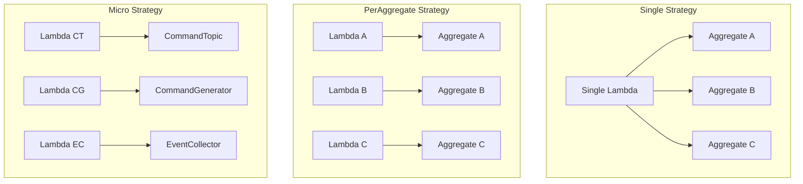
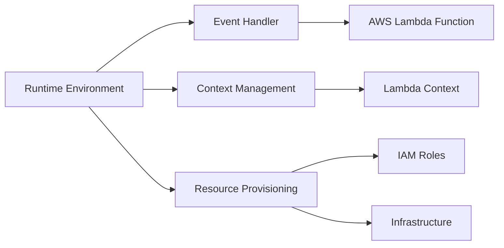
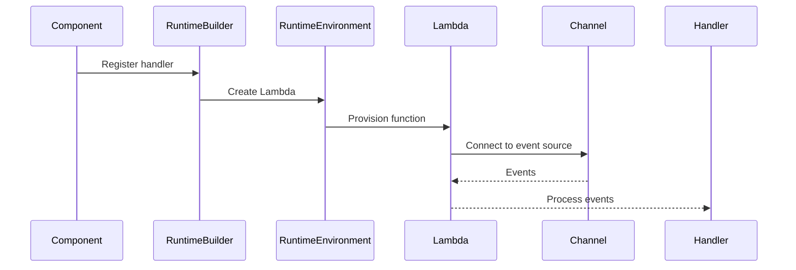

# Runtime & Deployment Strategies

This document explains how Reventless manages runtime environments and provides different deployment granularity strategies for optimal resource utilization and operational flexibility.

## Introduction

A **Runtime Environment** in Reventless is an abstraction layer that manages the execution context for your application components. It handles event processing, resource provisioning, and provides the bridge between your business logic and the underlying cloud infrastructure.

Reventless supports multiple **deployment granularity strategies** that allow you to optimize for different scenarios:
- **Development**: Simple, cost-effective single-function deployments
- **Production**: Balanced per-component isolation
- **Enterprise**: Maximum granularity with micro-function architecture

Each strategy offers different trade-offs between operational complexity, cost, performance, and isolation.

## Runtime Environment Concept

### Core Responsibilities

The Runtime Environment abstraction provides three key capabilities:

1. **Event Handling Abstraction**: Converts provider-specific events into framework-compatible formats
2. **Context Management**: Manages execution context, logging, and error handling
3. **Resource Provisioning**: Creates and configures cloud infrastructure resources

### Module Type Definition

The core runtime environment is defined in [`Runtime.res`](../../packages/reventless/src/adapter/Runtime/Runtime.res):

```rescript
module type Environment = {
  type event
  type context
  type parts
  let make: environmentMaker<event, context, 'result, parts>
  let groupBySource: event => dict<event>
  let asEventHandler: 'a => eventHandler<event, context, 'result>
}
```

### AWS Lambda Implementation

The AWS Lambda implementation ([`RuntimeEnvironment_Lambda.res`](../../packages/reventless-aws/src/adapter/Runtime/RuntimeEnvironment_Lambda.res)) provides:

```rescript
type event = PulumiAws.Lambda.CallbackFunction.event
type context = PulumiAws.Lambda.context
type parts = Util.Lambda.runtimeParts

let make: Reventless.Runtime.environmentMaker<'event, context, 'result, parts> = (
  ~name,
  ~handler,
  ~memorySize: int=1024,
  ~timeout: int=30,
  ~opts=?,
) => {
  // Creates Lambda function with IAM role
  // Configures memory, timeout, and tags
  // Returns runtime parts and resources
}
```

## Deployment Granularity Strategies



### Single Deployment Strategy

**Concept**: All components of the same type (e.g., all aggregates) share a single Lambda function.

**Pros**:
- **Lower Cold Starts**: Fewer Lambda functions mean fewer cold start penalties
- **Simpler Infrastructure**: Minimal AWS resources to manage
- **Cost Effective**: Shared compute resources reduce overall costs
- **Easier Debugging**: Single function to monitor and troubleshoot

**Cons**:
- **Less Isolation**: One component's issues can affect others
- **Larger Package Size**: All component code bundled together
- **Scaling Limitations**: Cannot scale components independently
- **Resource Contention**: Components compete for memory and CPU

**Use Cases**:
- Development and testing environments
- Small-scale applications with few components
- Cost-sensitive deployments
- Proof-of-concept implementations

**Configuration**:
```rescript
module AggregateRuntimeBuilder = Reventless.AggregateRuntime_Builder_Single.Make(
  RuntimeEnvironment,
  CommandTopicChannel,
  EventCollectorChannel,
)
```

### Per-Component Deployment Strategy

**Concept**: Each high-level component (aggregate, read model, extension point) gets its own Lambda function.

**Pros**:
- **Better Isolation**: Component failures don't affect others
- **Independent Scaling**: Each component scales based on its load
- **Optimized Resources**: Memory and timeout tuned per component
- **Clearer Monitoring**: Component-specific metrics and logs

**Cons**:
- **More Cold Starts**: Each component may experience cold starts
- **Increased Infrastructure**: More Lambda functions and IAM roles
- **Higher Complexity**: More resources to monitor and manage
- **Potential Over-Provisioning**: Underutilized functions still incur costs

**Use Cases**:
- Production environments with multiple aggregates
- Applications with varying component load patterns
- Teams requiring component-level isolation
- Gradual migration from monolithic architectures

**Configuration**:
```rescript
module AggregateRuntimeBuilder = Reventless.AggregateRuntime_Builder_PerAggregate.Make(
  RuntimeEnvironment,
  CommandTopicChannel,
  EventCollectorChannel,
)
```

### Micro Deployment Strategy

**Concept**: Each internal component (CommandTopic, CommandGenerator, EventCollector) gets its own Lambda function.

**Pros**:
- **Maximum Granularity**: Fine-grained control over each component
- **Optimal Resource Allocation**: Each function sized for its specific needs
- **Independent Optimization**: Tune memory, timeout per component type
- **Precise Scaling**: Scale exactly what needs scaling

**Cons**:
- **Highest Complexity**: Maximum number of functions to manage
- **Most Cold Starts**: Every component may experience cold starts
- **Infrastructure Overhead**: Significant AWS resource count
- **Operational Burden**: Complex monitoring and debugging

**Use Cases**:
- Large-scale production systems
- Performance-critical applications
- Organizations with dedicated DevOps teams
- Applications requiring component-specific optimizations

**Configuration**:
```rescript
module AggregateRuntimeBuilder = Reventless.AggregateRuntime_Builder_Micro.Make(
  RuntimeEnvironment,
  CommandTopicChannel,
  EventCollectorChannel,
)
```

## Runtime Builders

Runtime Builders are the mechanism that connects your application components to the chosen runtime environment and deployment strategy.



### Builder Module Types

Each component type has its own runtime builder:

#### AggregateRuntime_Builder.T
Manages runtime for aggregates and their internal components:
- `forCommandGenerator`: Registers command generation handlers
- `forCommandTopic`: Registers command processing handlers  
- `forEventCollector`: Registers event collection handlers
- `finish`: Finalizes runtime configuration

#### EventCollectorRuntime_Builder.T
Manages runtime for event collectors:
- `forEventCollector`: Registers event collection handlers
- `finish`: Finalizes runtime configuration

#### PluginRuntime_Builder.T
Manages runtime for plugin components:
- `forPluginEventCollector`: Registers plugin event handlers
- `forPluginHeartbeat`: Registers heartbeat handlers
- `finish`: Finalizes runtime configuration

### Handler Registration Flow



## Configuration Options

### Memory Size Tuning

Default: 1024 MB. Adjust based on component needs:

```rescript
// High-memory aggregate for complex processing
commandTopic->AggregateRuntimeBuilder.forCommandTopic(
  ~handler,
  ~connect,
  ~memorySize=3008,  // Maximum Lambda memory
  ~timeout=900,      // 15 minutes
  commandTopic,
)

// Lightweight event collector
eventCollector->EventCollectorRuntimeBuilder.forEventCollector(
  ~handler,
  ~eventTopics,
  ~resources,
  ~memorySize=512,   // Minimal memory
  ~timeout=30,       // Quick processing
  eventCollector,
)
```

### Timeout Configuration

Default: 30 seconds. Consider your processing requirements:

- **Quick Operations**: 10-30 seconds
- **Standard Processing**: 30-300 seconds  
- **Long-Running Tasks**: 300-900 seconds (15 minutes max)

### Event Routing and Grouping

The runtime environment groups events by source for efficient processing:

```rescript
let groupBySource = (event: event) => {
  let dict: dict<event> = Js.Dict.empty()
  event.records->Array.forEach(record => {
    let eventSourceArn = record.eventSourceARN
    let currentEvent = dict->Js.Dict.get(eventSourceArn)->Option.getOr({records: []})
    dict->Js.Dict.set(eventSourceArn, {records: currentEvent.records->Array.concat([record])})
  })
  dict
}
```

## Choosing a Deployment Strategy

### Decision Matrix

| Factor | Single | PerComponent | Micro |
|--------|--------|--------------|-------|
| **Development Speed** | ⭐⭐⭐ | ⭐⭐ | ⭐ |
| **Operational Simplicity** | ⭐⭐⭐ | ⭐⭐ | ⭐ |
| **Cost Efficiency** | ⭐⭐⭐ | ⭐⭐ | ⭐ |
| **Component Isolation** | ⭐ | ⭐⭐⭐ | ⭐⭐⭐ |
| **Independent Scaling** | ⭐ | ⭐⭐⭐ | ⭐⭐⭐ |
| **Performance Optimization** | ⭐ | ⭐⭐ | ⭐⭐⭐ |

### Performance Considerations

**Cold Start Impact**:
- Single: 1 cold start per component type
- PerComponent: 1 cold start per component instance
- Micro: 1 cold start per internal component

**Memory Efficiency**:
- Single: Shared memory pool, potential waste
- PerComponent: Component-optimized allocation
- Micro: Fine-grained optimization

**Concurrent Processing**:
- Single: Limited by single function concurrency
- PerComponent: Component-level concurrency
- Micro: Maximum concurrent processing

### Cost Considerations

**AWS Lambda Pricing Factors**:
- Number of requests
- Duration of execution
- Memory allocation
- Cold start frequency

**Cost Optimization Strategies**:
1. **Single Strategy**: Minimize request count and cold starts
2. **PerComponent Strategy**: Balance isolation with resource efficiency
3. **Micro Strategy**: Optimize each function individually

### Migration Paths

**Single → PerComponent**:
1. Identify high-load components
2. Migrate one component type at a time
3. Monitor performance and costs
4. Adjust memory/timeout settings

**PerComponent → Micro**:
1. Profile component internal performance
2. Identify bottleneck sub-components
3. Split high-impact components first
4. Fine-tune individual function settings

## Implementation Examples

### Using Single Strategy

From [`Aggregate_Builder_Single.res`](../../packages/reventless-aws/src/components/Aggregate_Builder_Single.res):

```rescript
module CommandTopicChannel = CommandTopicChannel.SQS
module EventCollectorChannel = EventCollectorChannel.DynamoDbStream
module RuntimeEnvironment = RuntimeEnvironment.Lambda

module AggregateRuntimeBuilder = Reventless.AggregateRuntime_Builder_Single.Make(
  RuntimeEnvironment,
  CommandTopicChannel,
  EventCollectorChannel,
)

include Reventless.Aggregate_Builder.Make(
  Spec,
  Config,
  CommandMappings,
  EventMappings,
  RuntimeEnvironment,
  CommandGeneratorResolvers,
  CommandTopicChannel,
  EventLogStorage.DynamoDb,
  EventTopicAdapter.SNS,
  EventCollectorChannel,
  AggregateRuntimeBuilder,
)
```

### Using PerAggregate Strategy

From [`Aggregate_Builder_PerAggregate.res`](../../packages/reventless-aws/src/components/Aggregate_Builder_PerAggregate.res):

```rescript
module AggregateRuntimeBuilder = Reventless.AggregateRuntime_Builder_PerAggregate.Make(
  RuntimeEnvironment,
  CommandTopicChannel,
  EventCollectorChannel,
)
```

### Using Micro Strategy

From [`Aggregate_Builder_Micro.res`](../../packages/reventless-aws/src/components/Aggregate_Builder_Micro.res):

```rescript
module AggregateRuntimeBuilder = Reventless.AggregateRuntime_Builder_Micro.Make(
  RuntimeEnvironment,
  CommandTopicChannel,
  EventCollectorChannel,
)
```

### Custom Configuration Example

```rescript
// High-performance aggregate with custom settings
module HighPerformanceAggregate = Reventless.Aggregate_Builder.Make(
  HighVolumeSpec,
  ProductionConfig,
  CommandMappings,
  EventMappings,
  RuntimeEnvironment,
  CommandGeneratorResolvers,
  CommandTopicChannel,
  EventLogStorage.DynamoDb,
  EventTopicAdapter.SNS,
  EventCollectorChannel,
  // Use micro strategy for maximum control
  Reventless.AggregateRuntime_Builder_Micro.Make(
    RuntimeEnvironment,
    CommandTopicChannel,
    EventCollectorChannel,
  ),
)

// Register with custom memory and timeout
commandTopic->AggregateRuntimeBuilder.forCommandTopic(
  ~handler,
  ~connect,
  ~memorySize=2048,  // 2GB for complex processing
  ~timeout=300,      // 5 minutes for long operations
  commandTopic,
)
```

## Advanced Topics

### Custom Runtime Environments

You can create custom runtime environments for different providers:

```rescript
module CustomRuntimeEnvironment: Runtime.Environment = {
  type event = CustomProvider.event
  type context = CustomProvider.context
  type parts = CustomProvider.runtimeParts
  
  let make = (~name, ~handler, ~memorySize=?, ~timeout=?, ~opts=?) => {
    // Custom implementation
  }
  
  let groupBySource = (event) => {
    // Custom event grouping logic
  }
  
  let asEventHandler = (handler) => {
    // Custom handler conversion
  }
}
```

### Event Batching and Grouping

The runtime environment automatically groups events by source ARN for efficient batch processing:

```rescript
let eventCollectorHandler = parentName => async (event: RuntimeEnvironment.event, context) => {
  let _ =
    await event
    ->RuntimeEnvironment.groupBySource
    ->Dict.toArray
    ->Array.map(async ((urn, event)) => {
      switch eventCollectorHandlers->Js.Dict.get(urn) {
      | Some(handlers) =>
        let _ = await handlers->Array.map(handler => handler(event, context))->Promise.all
      | None => Js.log2(`No handler found:`, urn)
      }
    })
    ->Promise.all
}
```

### Resource Optimization

**Memory Optimization**:
- Profile your functions using AWS CloudWatch
- Start with default 1024 MB and adjust based on usage
- Monitor memory utilization metrics

**Timeout Optimization**:
- Set timeouts based on 95th percentile execution time
- Add buffer for occasional spikes
- Consider downstream service latencies

**Cold Start Optimization**:
- Use provisioned concurrency for critical functions
- Minimize package size and dependencies
- Consider connection pooling for databases

## Troubleshooting

### Common Configuration Issues

**Handler Not Found**:
```
Error: No handler found for EventCollector
```
- Ensure handler is registered before `finish()` is called
- Check that component parent hierarchy is correct
- Verify event source ARN matches registered handlers

**Memory Limit Exceeded**:
```
Error: Runtime exited with error: signal: killed Runtime.ExitError
```
- Increase `memorySize` parameter
- Profile memory usage with CloudWatch
- Consider splitting large operations

**Timeout Errors**:
```
Error: Task timed out after 30.00 seconds
```
- Increase `timeout` parameter
- Optimize slow operations
- Consider async processing for long tasks

### Performance Debugging

**High Cold Start Times**:
1. Reduce package size by removing unused dependencies
2. Use provisioned concurrency for critical functions
3. Consider Single strategy to reduce cold start frequency

**Memory Issues**:
1. Monitor CloudWatch memory utilization metrics
2. Profile with AWS X-Ray for detailed memory usage
3. Optimize data structures and algorithms

**Concurrency Problems**:
1. Check Lambda concurrent execution limits
2. Monitor throttling metrics in CloudWatch
3. Consider reserved concurrency for critical functions

### Memory and Timeout Tuning

**Memory Sizing Guidelines**:
- **128-512 MB**: Simple event processing, lightweight operations
- **512-1024 MB**: Standard business logic, moderate data processing
- **1024-3008 MB**: Complex calculations, large data sets, ML inference

**Timeout Guidelines**:
- **10-30 seconds**: Quick API responses, simple event processing
- **30-300 seconds**: Standard business operations, database queries
- **300-900 seconds**: Batch processing, complex calculations, external API calls

## Related Documentation

- [**Component Structure Pattern**](./component-structure-pattern.md) - How components are organized and built
- [**Messages**](./messages.md) - How messages flow through the runtime system
- [**Pulumi Integration**](./pulumi.md) - Infrastructure deployment patterns
- [**Resources**](./resources.md) - Resource management and provisioning

### Component-Specific Documentation

- [**Aggregate Components**](../reventless-components/aggregate.md) - Aggregate runtime patterns
- [**EventLog Components**](../reventless-components/eventlog.md) - Event storage and retrieval
- [**CommandTopic Components**](../reventless-components/commandtopic.md) - Command processing
- [**Plugin System**](../reventless-components/plugin.md) - Plugin architecture and runtime
