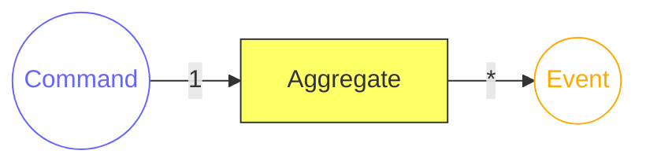
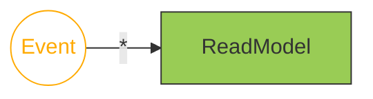
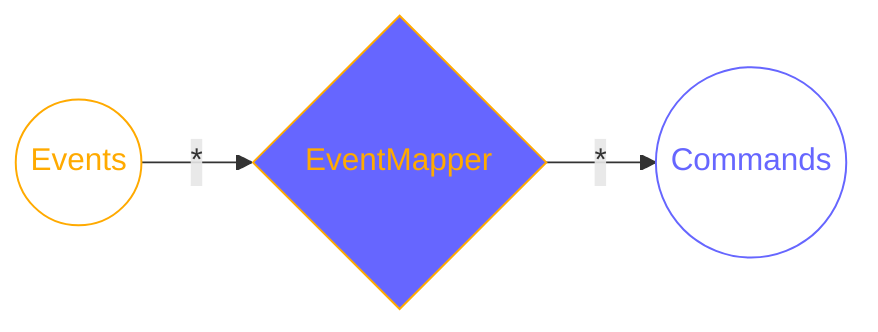
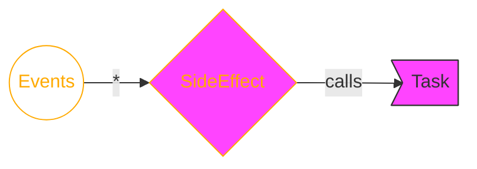

:::note[TODO]
- [ ] overview graphic of components
:::

### Aggregate

[*Aggregate*s](https://www.martinfowler.com/bliki/DDD_Aggregate.html) are the transactional units in your system.  
An Aggregate receives Commands and outputs Events based on the current State. A single Command can result in *any number* of Events.  
Only the Aggregate's Events will be stored. If a new Command gets handled the actual State will be calculated based on the previous Events ([Event Sourcing](https://martinfowler.com/eaaDev/EventSourcing.html)). The current State will never be persisted to storage.

- **responsibility**: ensure only valid Commands create Events having the necessary information attached; emit Events
- **in**: Command
- **out**: Events

[Read more about the Aggregate component.](./reventless-components/aggregate.md)

### ReadModel

A `ReadModel` is a queryable projection based on Events from one or more `Aggregate`s. It takes `Event`s and persists a State calculated on the previous State and the incoming Event.

Usually a `ReadModel` doesn't have any outputs.

- **responsibility**: create and persist State to be queried
- **in**: `Event`s
- **out**: -

[Read more about the ReadModel component.](./reventless-components/readmodel.md)

### EventMapper

An `EventMapper` attached to an `Aggregate` maps `Event`s of (potentially multiple `Aggregate`s) to `Command`s for this `Aggregate`. This is always needed if some `Event` in one `Aggregate` needs to trigger a reaction in another.

- **responsibility**: generate `Commands` for a given `aggregate` based on (multiple) other `aggregate`s' `Events`
- **in**: `Event`s
- **out**: `Command`s

[Read more about the EventMapper component.](./reventless-components/eventmapper.md)

### Task

`Task`s are the "escape-hatch" of the dogmatic Command/Event paradigm. They allow to implement logic loosely coupled to Events (or even not at all). An example would be some calculation, which needs to be done in some specific interval.

Another intention of `Task`s is to interface with the outside world (e.g. other systems). An example of this would be up-/downloads or calling foreign APIs.

`Task`s may be implemented provider specific, since it's not possible to provide adapter for any possible scenario.

[Read more about the Task component.](./reventless-components/task.md)

#### SideEffectHandler

A `SideEffectHandler` is similar to an `EventMapper`, but targeting `Task`s (and functions) outside of the Command/Event paradigm. For example: calling a foreign API everytime a specific `Event` occurs.
It takes `Event`s of (potentially multiple) `Aggregate`s as input and calls functions dependent on the `Event`.

- **responsibility**: execute `functions` of a given `task` based on (multiple) `aggregate`s' `Events`
- **in**: `Event`s
- **out**: -

[Read more about the SideEffectHandler component.](./reventless-components/sideeffecthandler.md)

### Plugin

A `Plugin` usually corresponds to a [`Bounded Context`](https://www.martinfowler.com/bliki/BoundedContext.html) in `DDD` (Domain Driven Design) as well to a single deployment unit. A `Plugin` is defined by it's configuration (name, version, etc) and it's child-components (`Aggregate`s, `ReadModel`s, `Task`s, etc)

[Read more about the Plugin component.](./reventless-components/plugin.md)

### ExtensionPoint

`ExtensionPoint`s (together with their relatign `Extension`s) are the mechanics to share data between several `Plugin`s. The `ExtensionPoint`'s `Spec` defines the `Event`s, which will be sent and the `Command`s which will be received by it.

[Read more about the ExtensionPoint component.](./reventless-components/extensionpoint.md)

#### ExtensionPointMapping
An `ExtensionPointMapping` defines a `Plugin`s border. It maps `Event`s from single `Aggregate`s to `Event`s of the `ExtensionPoint`. These are totally different Events (and therefore types), although they may seem similar. This is done to decouple outside dependencies from changes of the plugin and provide a simple interface to interact with.
A `Command` sent to the `ExtensionPoint` will be mapped to a specific `Command` inside the plugin by this component.

- **responsibility**: map plugin specific Command & Events to those of the `ExtensionPoint`
- **in**: `Plugin` sepcific `Event`s (from inside the `Plugin`) / `ExtensionPoint` Command`s (from `Extension`s)
- **out**: `ExtensionPoint` `Event`s (to `Extension`s) / `Plugin` specific `Command`s (to components inside the `Plugin`)

### Extension

> TODO

#### ExtensionMapping

> TODO
