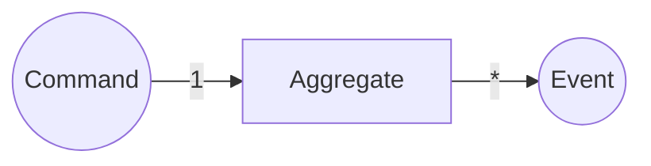
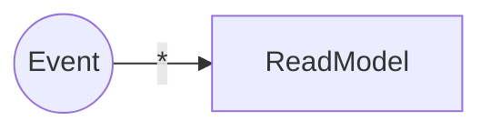
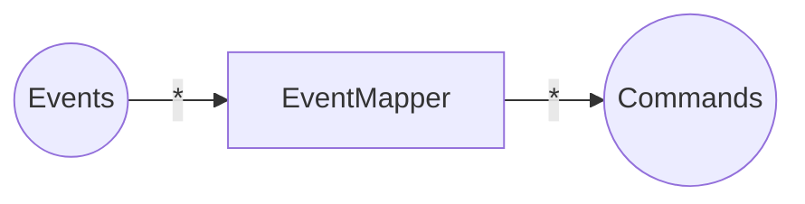
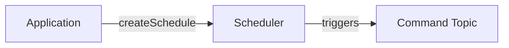
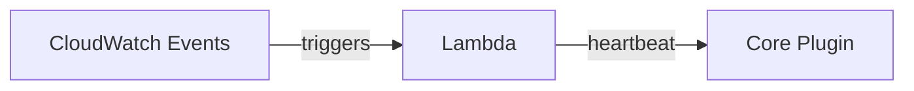
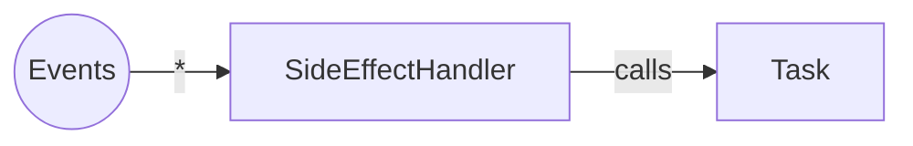
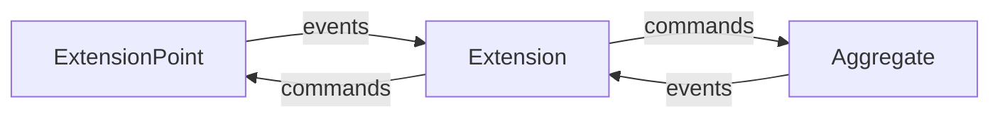

:::note[TODO]

- [ ] overview graphic of components
      :::

### Aggregate

[*Aggregate*s](https://www.martinfowler.com/bliki/DDD_Aggregate.html) are the transactional units in your system.  
An Aggregate receives Commands and outputs Events based on the current State. A single Command can result in _any number_ of Events.  
Only the Aggregate's Events will be stored. If a new Command gets handled the actual State will be calculated based on the previous Events ([Event Sourcing](https://martinfowler.com/eaaDev/EventSourcing.html)). The current State will never be persisted to storage.

- **responsibility**: ensure only valid Commands create Events having the necessary information attached; emit Events
- **in**: Command
- **out**: Events

[Read more about the Aggregate component.](./reventless-components/aggregate.md)

### ReadModel

A _ReadModel_ is a queryable persisted state: It takes Events from one or more Aggregates and persists a newly calculated state. The new state is based on the previous state and the incoming Event.

- **responsibility**: create and persist State to be queried
- **in**: Events
- **out**: -

[Read more about the ReadModel component.](./reventless-components/readmodel.md)

### EventMapper

An EventMapper attached to an Aggregate maps Events of (potentially multiple Aggregates) to Commands for this Aggregate. This is always needed if some Event in one Aggregate needs to trigger a reaction in another.

- **responsibility**: generate Commands for a given Aggregate based on (multiple) other Aggregates' Events
- **in**: Events
- **out**: Commands

[Read more about Event Mappings for Aggregates.](./reventless-components/aggregate.md#eventmappings)

### Task

Tasks are the "escape-hatch" of the dogmatic Command/Event paradigm. They allow to implement logic loosely coupled to Events (or even not at all). An example would be some calculation, which needs to be done in some specific interval.

Another intention of Tasks is to interface with the outside world (e.g. other systems). An example of this would be up-/downloads or calling foreign APIs.

Tasks may be implemented provider specific, since it's not possible to provide adapter for any possible scenario.

[Read more about the Task component.](./reventless-components/task.md)

### Scheduler

The Scheduler component provides time-based command publishing capabilities, enabling scheduled workflows, periodic tasks, and cron-like event generation. It allows applications to create and manage schedules dynamically at runtime.

- **responsibility**: manage time-based event scheduling and command publishing
- **in**: schedule definitions with timing patterns and payloads
- **out**: scheduled events/commands published to configured targets

[Read more about the Scheduler component.](./reventless-components/scheduler.md)

### Heartbeat

The Heartbeat component provides periodic health check signals and keepalive mechanisms, specifically designed to integrate with the Core Plugin's ExtensionPoint system. It enables health monitoring, periodic extension invocations, and watchdog timer functionality.

- **responsibility**: generate periodic heartbeat signals for health monitoring and extension triggering
- **in**: timeout configuration and Core Plugin connection details
- **out**: periodic heartbeat messages sent to Core Plugin ExtensionPoint

[Read more about the Heartbeat component.](./reventless-components/heartbeat.md)

#### SideEffectHandler

A `SideEffectHandler` is similar to an `EventMapper`, but targeting `Task`s (and functions) outside of the Command/Event paradigm. For example: calling a foreign API everytime a specific `Event` occurs.
It takes `Event`s of (potentially multiple) `Aggregate`s as input and calls functions dependent on the `Event`.

- **responsibility**: execute `functions` of a given `task` based on (multiple) `aggregate`s' `Events`
- **in**: `Event`s
- **out**: -

### Plugin

A `Plugin` usually corresponds to a [`Bounded Context`](https://www.martinfowler.com/bliki/BoundedContext.html) in `DDD` (Domain Driven Design) as well to a single deployment unit. A `Plugin` is defined by it's configuration (name, version, etc) and it's child-components (`Aggregate`s, `ReadModel`s, `Task`s, etc)

[Read more about the Plugin component.](./reventless-components/plugin.md)

### ExtensionPoint

`ExtensionPoint`s (together with their relatign `Extension`s) are the mechanics to share data between several `Plugin`s. The `ExtensionPoint`'s `Spec` defines the `Event`s, which will be sent and the `Command`s which will be received by it.

[Read more about the ExtensionPoint component.](./reventless-components/extensionpoint.md)

#### ExtensionPointMapping

An `ExtensionPointMapping` defines a `Plugin`s border. It maps `Event`s from single `Aggregate`s to `Event`s of the `ExtensionPoint`. These are totally different Events (and therefore types), although they may seem similar. This is done to decouple outside dependencies from changes of the plugin and provide a simple interface to interact with.
A `Command` sent to the `ExtensionPoint` will be mapped to a specific `Command` inside the plugin by this component.

- **responsibility**: map plugin specific Command & Events to those of the `ExtensionPoint`
- **in**: `Plugin` sepcific `Event`s (from inside the `Plugin`) / `ExtensionPoint` Command`s (from `Extension`s)
- **out**: `ExtensionPoint` `Event`s (to `Extension`s) / `Plugin` specific `Command`s (to components inside the `Plugin`)

### Extension

An `Extension` enables a `Plugin` to consume events from and send commands to another `Plugin`'s `ExtensionPoint`. It acts as the consumer side of cross-Plugin communication, translating external events into internal commands and optionally forwarding internal events back to the `ExtensionPoint`.

- **responsibility**: consume events from remote `ExtensionPoint`s and generate commands for local `Aggregate`s; optionally forward local events back to `ExtensionPoint`s
- **in**: `ExtensionPoint` `Event`s (from remote `Plugin`s)
- **out**: `Aggregate` `Command`s (to local `Aggregate`s) / `ExtensionPoint` `Command`s (to remote `Plugin`s)

[Read more about the Extension component.](./reventless-components/extension.md)

#### ExtensionMapping

An `ExtensionMapping` defines how a `Plugin` interacts with a remote `ExtensionPoint`. It maps incoming `ExtensionPoint` `Event`s to local `Aggregate` `Command`s and optionally maps outgoing `Aggregate` `Event`s to `ExtensionPoint` `Command`s.

- **responsibility**: translate between remote `ExtensionPoint` events/commands and local `Aggregate` commands/events
- **in**: `ExtensionPoint` `Event`s (from remote `Plugin`) / `Aggregate` `Event`s (from local `Aggregate`s)
- **out**: `Aggregate` `Command`s (to local `Aggregate`s) / `ExtensionPoint` `Command`s (to remote `Plugin`)

[Read more about Extension Mappings.](./reventless-components/extension.md#extension-mappings)
