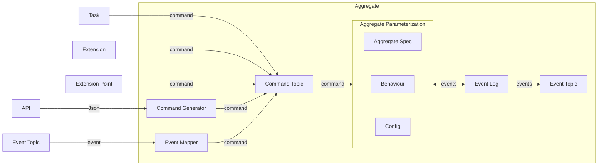
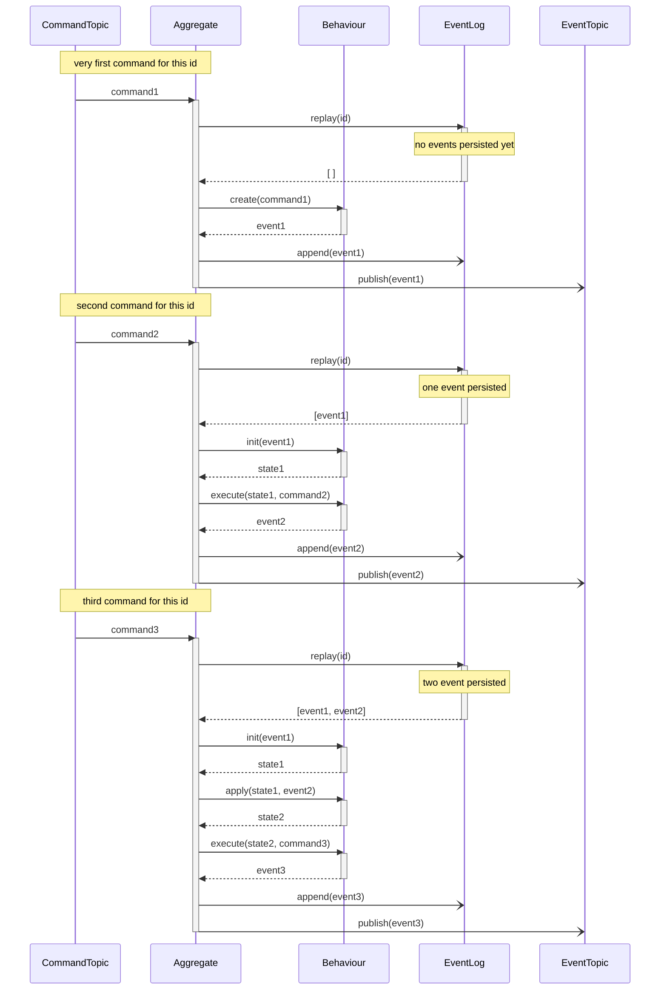

:::note[TODO]

- [ ] come up with consistent simple meaningfull demo examples throughout the documentation
- [ ] explain event log
- [ ] add highlighted text about naming convention in Pulumi components
- [ ] styling of mermaid diagrams
- [ ] explain @decco annotations

:::

:::note[notes for later]

- ad aggregate state: Because the State won't be persisted, you should only put data there, you _really_ need for validating incoming Commands.

:::

[For a short summary of an Aggregate, see Reventless Components Overview.](../reventless-components-overview.md)



An Aggregate's business logic is defined by it's **Spec** and **Behaviour**.

## Aggregate Spec

An Aggregate Spec defines the id, name, input and output types of an Aggregate in a declarataive manner. The Spec is used at any place, where a programmatic interaction with the aggregate is desired. ([Aggregate Behaviour](#behaviour), [EventMapper](eventmapper.md), [ReadModel Projections](readmodel.md#Projections), [Extensionpoint Mappings](extensionpoint.md#mappings), [Extension Mappings](extension.md#mappings))

The Aggregate Spec needs to adhere to the following [module type](../rescript-syntax.md#module-types):

```rescript title="reventless-spec/src/AggregateSpec.res"
module type T = {
  module Id: Id.T

  let name: string

  @decco
  type command

  @decco
  type event

  @decco
  type error
}
```

### `@decco` annotation

TODO

### Id

The `Id` module defines what kind of id will be used and implements interactions with it. For more information see the [Id documentation](Id.md). (For simple scenarios Reventless provides a default string implemenation `ReventlessSpec.Id.String`.)

### name

A name is a string which must be unique in the scope of one [plugin](./plugin.md) and should describe the aggregate aptly. The name will also be used "behind the scenes" to e.g. route payload to the right mappings etc.

### command

The command type declares the possible inputs of the aggregate.  
There are no explicit constraints for the command type (developer can choose whichever type is best suited - proivided the serialization library has support - currently [decco](https://github.com/rescript-labs/decco)), but usually [variants](../rescript-syntax.md#variant-type) are the ideal choice.

:::tip
Command Variant Constructors should be formulated as imperative.
:::

### event

The event type declares the possible results of the aggregate.  
There are no explicit constraints for the event type (developer can choose whichever type is best suited - proivided the serialization library has support - currently [decco](https://github.com/rescript-labs/decco)), but usually [variants](../rescript-syntax.md#variant-type) are the ideal choice.

:::tip
Event Variant Constructors should be formulated in past tense.
:::

### error

The error type declares possible unrecoverable errors of the aggregate.  
Only values of this type can be passed to the Behaviour's [error function](#errors). The semantic may be chossen by the developer, but usually [variants](../rescript-syntax.md#variant-type) are the ideal choice.

### Example

```rescript title="ExampleAggregate.res"
  module Id = ReventlessSpec.Id.String

  let name = "ExampleAggregate"

  @decco
  type command =
    | DoSomething(int)
    | DoSomethingElse(string)

  @decco
  type event =
    | SomethingHasHappened(int)
    | AnotherThingHasHappened(string)

  @decco
  type error =
    | IllegalState
    | ArbitaryError(string)
```

## Behaviour

The aggregate specific business logic is implemented in a behaviour module.

It defines:

- how to calculate the current state out of historic events.
- how to react to commands based on the current state.

The Behaviour needs to adhere to the following [module type](../rescript-syntax.md#module-types) `T`:

```rescript title="reventless/src/Behaviour.res"
type resolverConfig<'command> = {
  commandDecoder: Js.Json.t => Belt.Result.t<'command, Decco.decodeError>,
  fields: array<string>,
}

type init<'state, 'event> = (. 'event) => 'state
type apply<'state, 'event> = (. 'state, 'event) => 'state

type create<'command, 'event, 'error> = (
  . 'command,
  Message.context,
  Message.errorHandler<'error, 'command, 'event>,
) => array<'event>

type execute<'state, 'command, 'event, 'error> = (
  . 'state,
  'command,
  Message.context,
  Message.errorHandler<'error, 'command, 'event>,
) => array<'event>

// highlight-start
module type T = {
  module Spec: Spec

  type state

  let resolverConfig: resolverConfig<Spec.command>

  let init: init<state, Spec.event>
  let apply: apply<state, Spec.event>

  let create: create<Spec.command, Spec.event, Spec.error>
  let execute: execute<state, Spec.command, Spec.event, Spec.error>
}
// highlight-end
```

```rescript title="reventless/src/Message.res"
// more content above
type errorHandler<'error, 'command, 'event> = (
  'error,
  'command,
  ReventlessSpec.Message.context,
) => array<'event>
// more content below
```

```rescript title="reventless-spec/src/Message.res"
// more content above
@decco
type context = {
  id: string,
  meta: meta,
}
// more content below
```

### Spec

This is a module alias to the [Aggregate Spec](#aggregate-spec) to be used.

### state

Defines the type of the state, which will be calculated ([init](#init) / [apply](#apply) function) based on historic events.  
You can choose whatever type suites your needs. Very often this will be a [record](../rescript-syntax.md#record-type).

### resolverConfig

The `resolverConfig` controls the connections of the API to the Aggregate (the name comes from _GraphQL resolvers_).

`resolverConfig` is a record containing these fields:

- `commandDecoder`: function to decode incoming `json` into the `command` type (this usually equates to `Spec.command_decode`)
- `fields`: array of strings equal to mutations in the (GraphQL) [API schema](./Api.md#schema), that should trigger the creation of a command for this aggregate: by convention and to avoid naming collisions, the field is usually named in a pattern of `<AggregateName>_<commandName>`

### init

The `init` function calculates the initial state based on the first event for a specific Aggregate instance (selected by the aggregate id).

Further state updates are calculated by the [`apply`](#apply) function.

### apply

The `apply` function calculates the next state based on the current state and the next event.

### create

The `create` function calculates inital event(s) based on the given command. If necessary, the message's context is also available for processing. Validation of the command shall be done here as well.

#### errors

The create and execute functions supply an `errorHandler` function in it's arguments. The function takes `Spec.error` (describing the kind of observed error), `Spec.command` (the command, which was processed, when the error was detected) and `Message.context` (for further details).

As of now this function is implemented in the framework and can't be changed: It basically just logs out a well-formated error message.

### execute

The `execute` function calculates event(s) based on the current state and given command. If necessary, the message's context is also available for processing. Validation of the command shall be done here as well.

The [`errorHandler`](#errors) function is the same for the `create` and `execute` functions.

### Call Sequence



### Example

```rescript title="ExampleAggregateBehaviour.res"
module Spec = ExampleAggregate

type state = {count: int}

let resolverConfig = {
  commandDecoder: Spec.command_decode,
  fields: ["Example_DoSomething", "Example_DoSomethingElse"]
  }

let init = (. event) => switch event {
    | SomethingHasHappened(num) => {count: num}
    | AnotherThingHasHappened(_txt) => {count: 0}
  }
let apply = (. state, event) => switch (state, event) {
    | ({count: count}, SomethingHasHappened(num)) => {count: count+num}
    | (state, AnotherThingHasHappened(_txt)) => state
  }

let create = (. command, context, error) => switch command {
    | DoSomething(num) if num < 0 =>
        error(ArbitaryError("value less than 0"), command, context)
    | DoSomething(num) => SomethingHasHappened(num)
    | DoSomethingElse(txt) => AnotherThingHasHappened(txt)
  }

let execute = (.state, command, context, error) => switch (state, command) {
    | (_state, DoSomething(num)) if num < 0 =>
        error(ArbitaryError("value less than 0"), command, context)
    | (_state, DoSomething(num)) => SomethingHasHappened(num)
    | ({count: count}, DoSomethingElse(txt)) if count < 3 =>
        error(IllegalState, command, context)
    | ({count: count}, DoSomethingElse(txt)) => AnotherThingHasHappened(txt)
}
```

## EventMappings

## Initialize Component (AWS Defaults)

## Initialize Component (Generic)

```
(
  Config: Config.T,
  Spec: ReventlessSpec.AggregateSpec.T,
  Behaviour: Behaviour.T with module Spec := Spec,
  EventMappings: EventMapper.Mappings with module Target := Spec,
  CommandGeneratorResolvers: CommandGenerator.Adapter.Resolvers with type api := Config.api,
  CommandTopicConnector: CommandTopic.Adapter.Connector,
  EventLogStorage: EventLog.Adapter.Storage,
  EventTopicPublisher: EventTopic.Adapter.Publisher,
  EventCollectorConnector: EventCollector.Adapter.Connector,
)
```
