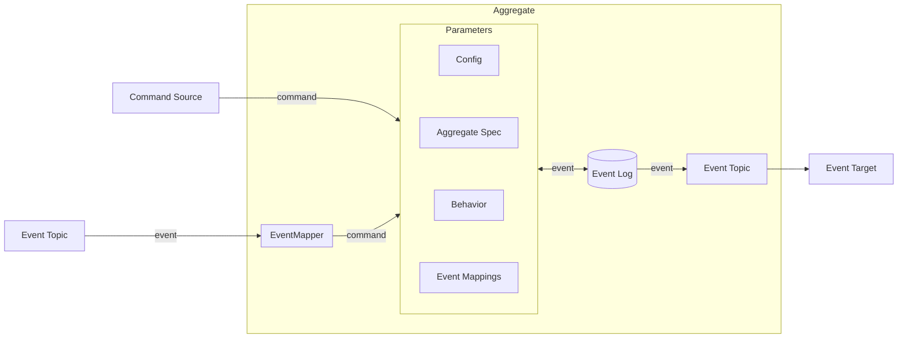
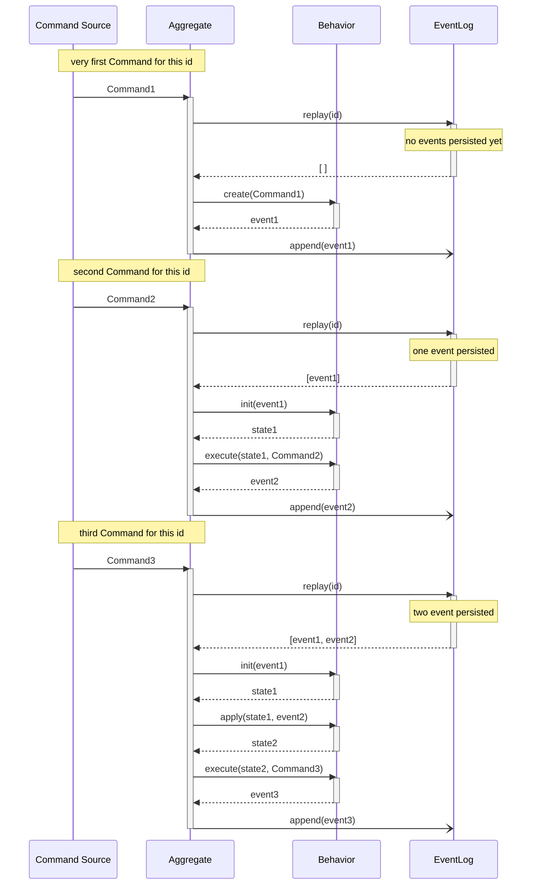
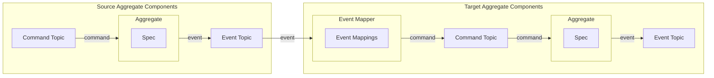

For a short summary of an Aggregate, see [Reventless Components Overview.](../component-overview.md#aggregate)

:::info Framework Implementation
This component follows the Reventless [Component Structure Pattern](../inner-workings/component-structure-pattern.md), using separate files for interface definitions ([`Aggregate.res`](../../reventless/src/components/Aggregate/Aggregate.res)), builder logic ([`Aggregate_Builder.res`](../../reventless/src/components/Aggregate/Aggregate_Builder.res)), and runtime callbacks ([`Aggregate_Callback.res`](../../reventless/src/components/Aggregate/Aggregate_Callback.res)).
:::



An Aggregate's business logic is defined by it's [**Spec**](#aggregate-spec), [**Behavior**](#behavior), [**Config**](../reventless-common-modules/config.md) and [**Event Mappings**](#eventmappings).

Commands are requests for change, which may be accepted (or not). Several Components can act as a Command Source: Command Generator, [Task](./task.md), [Event Mapper](#eventmappings), [Extension](./extension.md), and [Extension Point](./extensionpoint.md). Commands will never be stored. Accepted Commands result in any number of Events. Events are factual statements of the past, which cannot change. (Only new events may be created.) Events will be persisted in the Event Log. An Event Log is an "append-only" storage.
In an event-sourced system Events are the single source of truth. (note: any system based on Reventless is an event-sourced system!)

## Aggregate Spec

An Aggregate Spec defines the id, name, command and event types of an Aggregate in a declarataive manner. The Spec is used at any place, where a programmatic interaction with the aggregate is desired. ([Aggregate Behavior](#behavior), EventMapper, [ReadModel Projections](readmodel.md#projections), [Extensionpoint Mappings](extensionpoint.md#extensionpoint-mappings), [Extension Mappings](extension.md#extension-mappings))

### Example

```rescript title="Customer.res" showLineNumbers
//open Reventless

module Id = ReventlessSpec.Id.String

@decco
type id = Id.t

let name = "Customer"

@decco
type name = string
@decco
type address = string

@decco
type customer = {
  name: name,
  address: address,
}

@decco
type command =
  | Create(customer)
  | ChangeAddress(address)
  | ChangeName(name)
  | Delete

@decco
type event =
  | Created(customer)
  | AddressChanged(address)
  | NameChanged(name)
  | Unchanged
  | Deleted

@decco
type error =
  | AlreadyExisting
  | NotExisting
```

For information about `@schema` see [Schema annotation](../inner-workings/serialization.md#schema-annotation).

### Id

See [Id](../reventless-common-modules/Id.md).

### name

A name is a string which must be unique in the scope of Aggregate names in one [plugin](./plugin.md) and should describe the aggregate aptly. The name will also be used "behind the scenes" to e.g. route payload to the right mappings etc.

### command

The command type declares the possible inputs of the aggregate.  
There are no explicit constraints for the command type (developer can choose whichever type is best suited - proivided the serialization library has support - currently [decco](https://github.com/rescript-labs/decco)), but usually [variants](../rescript-syntax.md#variant-type) are the ideal choice.

:::tip
Command Variant Constructors should be formulated as imperative.
:::

### event

The event type declares the possible results of the aggregate.  
There are no explicit constraints for the event type (developer can choose whichever type is best suited - proivided the serialization library has support - currently [decco](https://github.com/rescript-labs/decco)), but usually [variants](../rescript-syntax.md#variant-type) are the ideal choice.

:::tip
Event Variant Constructors should be formulated in past tense.
:::

### error

The error type declares possible unrecoverable errors of the aggregate.  
Only values of this type can be passed to the Behavior's [error function](#errors). The semantic may be chossen by the developer, but usually [variants](../rescript-syntax.md#variant-type) are the ideal choice.

## Behavior

The aggregate specific business logic is implemented in a behavior module.

It defines:

- how to calculate the current state out of historic events.
- how to react to commands based on the current state.

### Example

```rescript title="Customer_Behavior.res" showLineNumbers
open Reventless
open Customer

let resolverConfig = {
  open Behavior
  {
    commandDecoder: command_decode,
    fields: ["Customer_Create", "Customer_ChangeAddress", "Customer_ChangeName", "Customer_Delete"],
  }
}

let atomicCounter = None

let invalidEvent = event =>
  Js.Exn.raiseError("InvalidEvent: " ++ event_encode(event)->Js.Json.stringify)

@decco
type state = {
  address: address,
  name: name,
  deleted: bool,
}

// command => list(event)
let create: Behavior.create<command, event, error> = (. command, context, error) =>
  switch command {
  | Create(customer) => [Created(customer)]
  | ChangeAddress(_)
  | ChangeName(_)
  | Delete =>
    error(NotExisting, command, context)
  }

// (state, command) => list(event)
let execute: Behavior.execute<state, command, event, error> = (. state, command, context, error) =>
  switch (command, state) {
  | (Create(customer), {deleted: true}) => [Created(customer)]
  | (Create(_), {deleted: false}) => error(AlreadyExisting, command, context)

  | (ChangeAddress(_), {deleted: true}) => error(NotExisting, command, context)
  | (ChangeAddress(address), {address: oldAddress}) if address != oldAddress => [
      AddressChanged(address),
    ]
  | (ChangeAddress(_), _) => [Unchanged]

  | (ChangeName(_), {deleted: true}) => error(NotExisting, command, context)
  | (ChangeName(name), {name: oldName}) if name != oldName => [NameChanged(name)]
  | (ChangeName(_), _) => [Unchanged]

  | (Delete, {deleted: true}) => [Unchanged]
  | (Delete, {deleted: false}) => [Deleted]
  }

// event => state
let init: Behavior.init<state, event> = (. event) =>
  switch event {
  | Created({Customer.address: address, name}) => {address, name, deleted: false}
  | AddressChanged(_)
  | NameChanged(_)
  | Unchanged
  | Deleted =>
    invalidEvent(event)
  }

// (state, event) => state
let apply: Behavior.apply<state, event> = (. state: state, event) =>
  switch event {
  | AddressChanged(address) => {...state, address}
  | NameChanged(name) => {...state, name}
  | Unchanged => state
  | Deleted => {...state, deleted: true}
  | Created(_) => {...state, deleted: false}
  }
```

### Spec

This is a module alias to the [Aggregate Spec](#aggregate-spec) to be used.

### state

Defines the type of the state, which will be calculated ([init](#init) / [apply](#apply) function) based on historic events.  
You can choose whatever type suites your needs. Very often this will be a [record](../rescript-syntax.md#record-type).

### resolverConfig

The `resolverConfig` controls the connections of the API to the Aggregate (the name comes from _GraphQL resolvers_).

`resolverConfig` is a record containing these fields:

- `commandDecoder`: function to decode incoming `json` into the `command` type (this usually equates to `Spec.command_decode`)
- `fields`: array of strings equal to mutations in the (GraphQL) [API schema](./api.md#schema), that should trigger the creation of a command for this aggregate: by convention and to avoid naming collisions, the field is usually named in a pattern of `<AggregateName>_<commandName>`

### init

The `init` function calculates the initial state based on the first event for a specific Aggregate instance (selected by the aggregate id).

Further state updates are calculated by the [`apply`](#apply) function.

### apply

The `apply` function calculates the next state based on the current state and the next event.

### create

The `create` function calculates inital event(s) based on the given command. If necessary, the message's context is also available for processing. Validation of the command shall be done here as well.

#### errors

The create and execute functions supply an `errorHandler` function in it's arguments. The function takes `Spec.error` (describing the kind of observed error), `Spec.command` (the command, which was processed, when the error was detected) and `Message.context` (for further details).

As of now this function is implemented in the framework and can't be changed: It basically just logs out a well-formated error message.

### execute

The `execute` function calculates event(s) based on the current state and given command. If necessary, the message's context is also available for processing. Validation of the command shall be done here as well.

The [`errorHandler`](#errors) function is the same for the `create` and `execute` functions.

### Call Sequence



## EventMappings



Each `Aggregate` can specify `EventMapping`s from one ore more source Aggregates:

```rescript title="Customer_EventMappings.res" showLineNumbers
open ReventlessSpec

module Target = Customer

module CustomerMapping = {
  module Source = Customer

  let map = (. customerId, event, _queryEngine) =>
    switch event {
    | Customer.Created(customer) => [
        EventMapping.Publish(customerId, Customer.ChangeAddress(customer.address ++ " Suffix")),
      ]
    | _ => []
    }
}

module type Mapping = EventMapping.T with module Target := Target

let mappings: array<module(Mapping)> = [module(CustomerMapping)]

let counter = None
```

### Target

Each `EventMapping`s file has to define one `Target` module alias to its `Aggregate Spec` that all mappings are targeting to.

### Mapping module

For each source Aggregate a separate Mapping module has to be defined.

#### Source

Module alias to the source `Aggregate Spec`.

#### map

Mapping function from source `Event` to target `Command`.

### Mapping module type

For the following array of mappings a Mapping module type has to be defined, which constrains the `Target` to the `Target` module type defined above. This has to be done due to [ReScript Functor Syntax](../rescript-syntax.md#functors).

### mappings

This array has to include all mappings for this `Aggregate`.

### counter

`counter` defines if a counter should be used for this mapping. In this example no counter is needed, so it is `None`.

See [Counter](../reventless-common-modules/counter.md#usage-in-eventmappings) component for further details.

## Generate Aggregate (AWS Defaults)

Finally the `Aggregate` has to be generated by providing the previously generated Modules:

```rescript title="Customer_EventMappings.res" showLineNumbers
include ReventlessAws.Aggregate.Make(Config, Customer, Customer_Behavior, Customer_EventMappings)
```

## Pulumi

The aggregate's Pulumi root component is named in this pattern: `Spec.name` and has a type of `reventless:Aggregate`.

## Related Components

- **[EventLog](./eventlog.md)** - Stores events generated by the Aggregate
- **[CommandTopic](./commandtopic.md)** - Delivers commands to the Aggregate
- **[EventTopic](./eventtopic.md)** - Distributes events from the Aggregate's EventLog
- **[CommandGenerator](./commandgenerator.md)** - Generates commands for the Aggregate from API mutations
- **[EventMapper](./eventmapper.md)** - Maps events from other Aggregates to commands for this Aggregate
- **[ReadModel](./readmodel.md)** - Consumes events from the Aggregate to build read models
- **[Extension](./extension.md)** - Can send commands to the Aggregate via ExtensionPoints
- **[ExtensionPoint](./extensionpoint.md)** - Can receive commands from Extensions for the Aggregate
- **[Counter](./counter.md)** - Used by EventMappers for deduplication when mapping to this Aggregate
