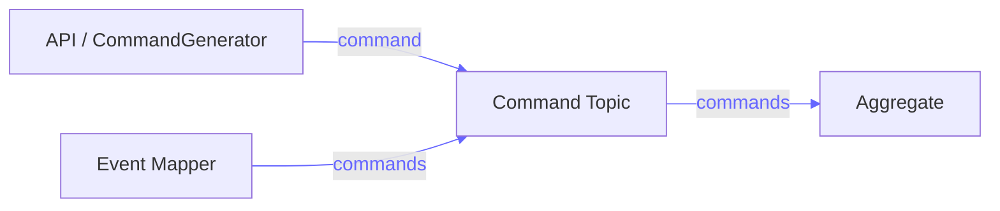
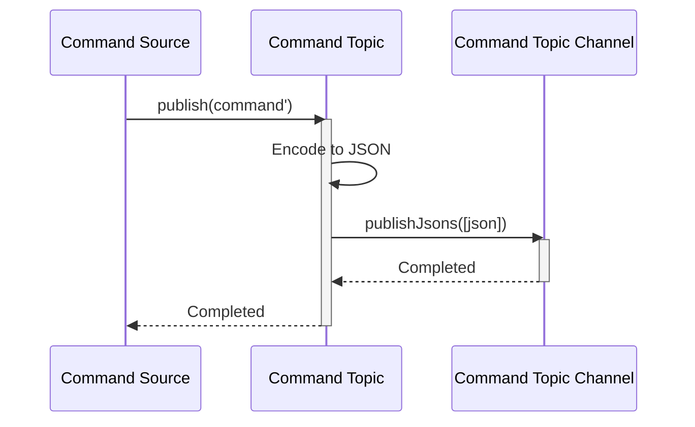
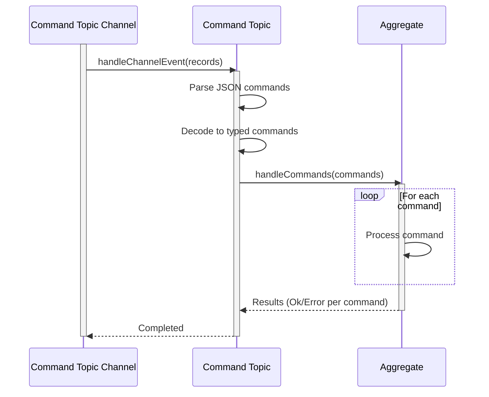
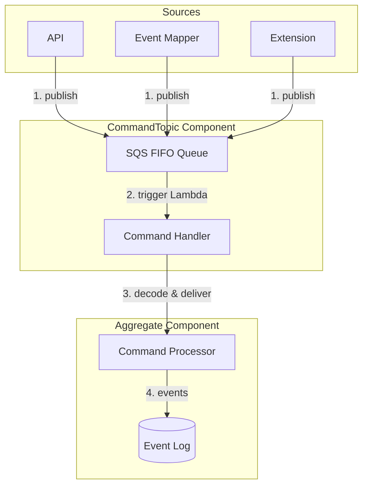

For a short summary of CommandTopic, see [Reventless Components Overview.](../component-overview.md#commandtopic)

:::info Framework Implementation
This component follows the Reventless [Component Structure Pattern](../inner-workings/component-structure-pattern.md), using separate files for interface definitions ([`CommandTopic.res`](../../reventless/src/components/CommandTopic/CommandTopic.res)), builder logic ([`CommandTopic_Builder.res`](../../reventless/src/components/CommandTopic/CommandTopic_Builder.res)), adapter interface ([`CommandTopic_Adapter.res`](../../reventless/src/components/CommandTopic/CommandTopic_Adapter.res)), runtime operations ([`CommandTopic_Operations.res`](../../reventless/src/components/CommandTopic/CommandTopic_Operations.res)), and callback handlers ([`CommandTopic_Callback.res`](../../reventless/src/components/CommandTopic/CommandTopic_Callback.res)).
:::

## Overview



The **CommandTopic** is the message queue component that delivers commands to Aggregates with strict ordering guarantees and reliable delivery. It ensures commands are processed exactly once per aggregate instance, in the order they were sent.

## Purpose and Responsibilities

- **Responsibility**: Queue commands for delivery to Aggregates; ensure FIFO ordering per aggregate; provide exactly-once delivery guarantees; handle retries and dead letter processing
- **In**: Commands from API (via CommandGenerator), EventMapper, Extensions, or ExtensionPoints
- **Out**: Commands to Aggregate command handlers

## Component Spec

The CommandTopic requires a spec defining the Aggregate's id type and command type:

```rescript
module type Spec = {
  module Id: ReventlessSpec.Id.T

  @schema
  type command
}
```

Take the following spec for a Customer aggregate as an example:
```rescript title="Customer.res"
module Id = ReventlessSpec.Id.String

@schema
type command =
  | Create({name: string, address: string})
  | ChangeAddress(string)
  | ChangeName(string)
  | Delete
```

This spec is used to create a type-safe CommandTopic for the Customer aggregate.

## Usage Pattern

CommandTopics are typically created as part of an Aggregate component and used internally by the framework for command delivery.

### Creating a CommandTopic

To create a CommandTopic module you have to provide the spec and a channel adapter:

```rescript title="Customer_Aggregate.res"
module CustomerCommandTopic = Reventless.CommandTopic_Builder.Make(
  Customer,
  CommandTopicChannel_SQS_FIFO,
)

let commandTopic = CustomerCommandTopic.make(
  ~name="Customer",
  ~opts=pulumiOptions,
)
```

### CommandTopic Operations

The CommandTopic provides operations for publishing and handling commands:

#### Publish a Single Command

The `publish` operation sends a single typed command to the topic:

```rescript
type publish<'id, 'command> = (
  Message.command'<'id, 'command>
) => promise<unit>
```

**Usage:**

```rescript
await commandTopic.publish({id, meta, command})
```

#### Publish Multiple Commands

The `publishJsons` operation sends multiple JSON commands efficiently:

```rescript
type publishJsons = (
  array<ReventlessSpec.Message.commandJson>
) => promise<unit>
```

This is used internally for batch command publishing (e.g. from EventMappers). Each command is a record with the following structure (as defined in the reventless-spec package):

```rescript
type commandJson = {
  id: string,
  meta: meta,
  commandJson: Js.Json.t,
  delay?: int,
}
```


## Runtime Behavior

### Command Publishing Flow



### Command Handling Flow



## Integration with Aggregate

The CommandTopic is the delivery mechanism between command sources and Aggregates:



**Flow:**
1. Command sources publish commands to the CommandTopic queue
2. Lambda is triggered when messages arrive
3. Handler decodes commands and calls the Aggregate's command handler
4. Aggregate processes commands and appends events to EventLog

## Command Structure

All commands include metadata for traceability:

```rescript
type command'<'id, 'command> = {
  id: 'id,                // Aggregate instance id
  meta: meta,             // Metadata
  command: 'command,      // The actual command
}

type meta = {
  service: service,       // service name that created event or is addressed by command
  time: string,           // when message was created
  ip: string,             // IP of service that created message
  user: string,           // user name that initiated message (if any)
  msgId: string,          // unique message id
  correlationId: string,  // id of message that caused this message
}
```

This metadata enables:
- **Command tracing** across the system
- **Debugging** command flows
- **Auditing** who initiated commands
- **Causality tracking** for event sourcing

## Related Components

- **[Aggregate](./aggregate.md)** - Consumes commands from CommandTopic
- **[CommandGenerator](./commandgenerator.md)** - Publishes commands to CommandTopic from API
- **[EventMapper](./eventmapper.md)** - Publishes commands to CommandTopic based on events
- **[Extension](./extension.md)** - Publishes commands to ExtensionPoint CommandTopics
- **[EventTopic](./eventtopic.md)** - Similar pattern for event distribution

## AWS Implementation

For detailed implementation, see [CommandTopic AWS Adapter Documentation](../aws-adapters/commandtopic.md).

