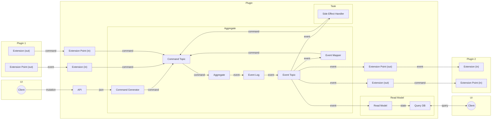
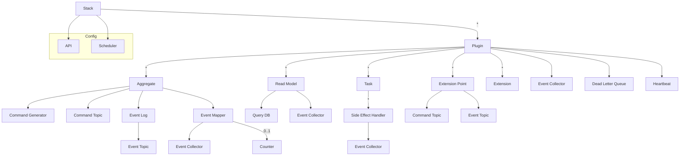

:::note[TODO]

- adapt existing diagram to desired representation

:::

## Runtime Communication

```mermaid
flowchart LR
subgraph Plugin1 [Plugin 1]
  Plugin1Extension["Extension (out)"]
  Plugin1ExtensionPoint["Extension Point (out)"]
end

subgraph UiRequest [UI]
  UiClientRequest((Client))
end

subgraph Plugin
  Api[API]
  ExtensionIn["Extension (in)"]
  ExtensionOut["Extension (out)"]
  ExtensionPointIn["Extension Point (in)"]
  ExtensionPointOut["Extension Point (out)"]

  subgraph AggregateSub [Aggregate]
    Aggregate[Aggregate]:::aggregate
    CommandGenerator[Command Generator]
    CommandTopic[Command Topic]
    EventLog[Event Log]
    EventMapper[Event Mapper]:::eventmapper
    EventTopic[Event Topic]

    Aggregate -->|event| EventLog
    EventLog -->|event| EventTopic
  end
  AggregateSub:::aggregate

  subgraph ReadModelSub [Read Model]
    ReadModel[Read Model]:::readmodel
    QueryDb[Query DB]

    ReadModel -->|state| QueryDb
  end
  ReadModelSub:::readmodel

  subgraph Task
    SideEffectHandler[Side Effect Handler]:::sideeffecthandler

    SideEffectHandler -->|command| CommandTopic
    EventTopic -->|event| SideEffectHandler
  end
  Task:::task

  Api -->|json| CommandGenerator
  CommandGenerator -->|command| CommandTopic
  CommandTopic -->|command| Aggregate
  EventMapper -->|command| CommandTopic
  EventTopic --->|event| ExtensionOut
  EventTopic --->|event| ExtensionPointOut
  EventTopic --->|event| ReadModel
  EventTopic -->|event| EventMapper
  ExtensionIn --->|command| CommandTopic
  ExtensionPointIn --->|command| CommandTopic
  Plugin1Extension -->|command| ExtensionPointIn
  Plugin1ExtensionPoint -->|event| ExtensionIn
  UiClientRequest -->|mutation| Api
end

subgraph Plugin2 [Plugin 2]
  Plugin2Extension["Extension (in)"]
  Plugin2ExtensionPoint["Extension Point (in)"]

  ExtensionOut --->|command| Plugin2ExtensionPoint
  ExtensionPointOut --->|event| Plugin2Extension
end

subgraph UiQuery [UI]
  UiClientQuery((Client))
  QueryDb <-->|query| UiClientQuery
end

```

## Pulumi Component Hierarchy

```mermaid
flowchart TB


%% AGGREGATE
Aggregate[Aggregate]:::aggregate
CommandGenerator[Command Generator]
CommandTopic[Command Topic]
EventLog[Event Log]
EventMapper[Event Mapper]:::eventmapper
EventTopic[Event Topic]
AggregateEventCollector[Event Collector]
Counter[Counter]


Aggregate --> CommandGenerator
Aggregate -->CommandTopic
Aggregate --> EventLog
Aggregate --> EventMapper

EventLog --> EventTopic
EventMapper --> AggregateEventCollector
EventMapper -->|0..1| Counter


%% READMODEL
ReadModel[Read Model]:::readmodel
QueryDb[Query DB]
ReadModelEventCollector[Event Collector]

ReadModel --> QueryDb
ReadModel --> ReadModelEventCollector

%% TASK
Task[Task]:::task
SideEffectHandler[Side Effect Handler]:::sideeffecthandler
SideEffectEventCollector[Event Collector]

Task -->|*| SideEffectHandler

SideEffectHandler --> SideEffectEventCollector

%% ExtensionPoint
ExtensionPoint[Extension Point]
ExtensionPointCommandTopic[Command Topic]
ExtensionPointEventTopic[Event Topic]

ExtensionPoint --> ExtensionPointCommandTopic
ExtensionPoint --> ExtensionPointEventTopic

%% Extension
Extension[Extension]


%% PLUGIN

Plugin[Plugin]
PluginEventCollector[Event Collector]
DeadLetterQueue[Dead Letter Queue]
Heartbeat[Heartbeat]

Plugin -->|*| Aggregate
Plugin -->|*| ReadModel
Plugin -->|*| Task
Plugin -->|*| ExtensionPoint
Plugin -->|*| Extension
Plugin --> PluginEventCollector

Plugin --> DeadLetterQueue
Plugin --> Heartbeat

%% STACK
Stack[Stack]

subgraph Config
  Api[API]
  Scheduler[Scheduler]
end

Stack -->|*| Plugin
Stack --> Api
Stack --> Scheduler
```
