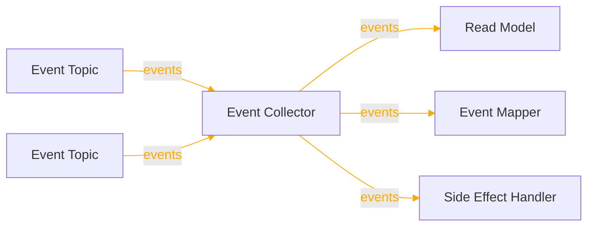
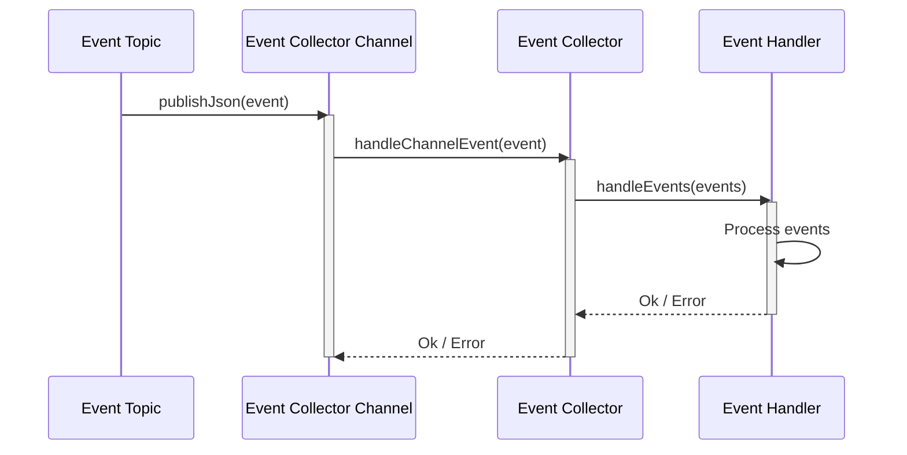
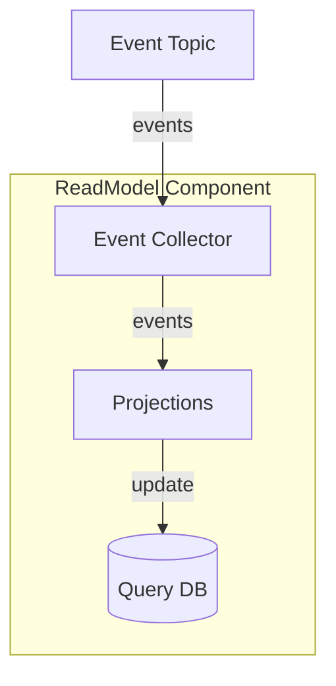
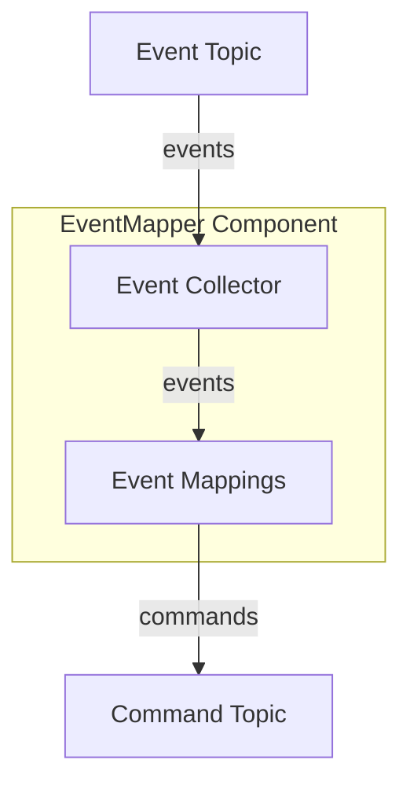
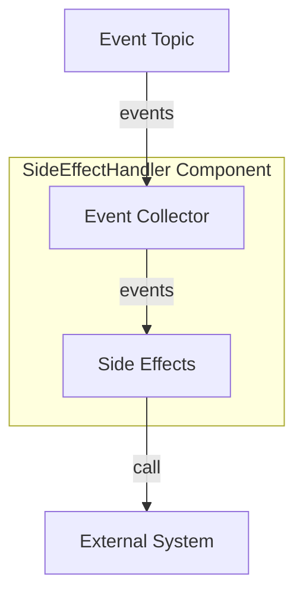

For a short summary of EventCollector, see [Reventless Components Overview.](../component-overview.md#eventcollector)

:::info Framework Implementation
This component follows the Reventless [Component Structure Pattern](../inner-workings/component-structure-pattern.md), using separate files for interface definitions ([`EventCollector.res`](../../reventless/src/components/EventCollector/EventCollector.res)), builder logic ([`EventCollector_Builder.res`](../../reventless/src/components/EventCollector/EventCollector_Builder.res)), and adapter interface ([`EventCollector_Adapter.res`](../../reventless/src/components/EventCollector/EventCollector_Adapter.res)).
:::

## Overview



The **EventCollector** is the event consumption component that receives events from EventTopics . It provides a unified interface for components like ReadModels, EventMappers, and SideEffectHandlers to consume events with ordering guarantees.

## Purpose and Responsibilities

- **Responsibility**: Subscribe to EventTopics; buffer events; deliver events to handlers with ordering guarantees; handle retries and dead letter processing
- **In**: Events from EventTopics
- **Out**: Events to ReadModel projections, EventMapper mappings, or SideEffectHandler functions

## Usage Pattern

EventCollectors are typically created as part of higher-level components (ReadModel, EventMapper, SideEffectHandler) and are not used directly by application code.

### Creating an EventCollector

- create an EventCollector module by providing an EventCollectorChannel adapter
- call make() on that module and provide the name and the EventTopics to subscribe to

```rescript title="Customer_ReadModel.res"
module CustomerEventCollector = Reventless.EventCollector_Builder.Make(
  EventCollectorChannel_SQS,
)

let eventCollector = CustomerEventCollector.make(
  ~name="CustomerReadModel",
  ~eventTopics=allEventTopics,
  ~opts=pulumiOptions,
)
```

### EventCollector Operations

The EventCollector provides operations for event handling:

#### Enqueue Event Operation

The `enqueueEvent` operation allows programmatic event injection:

```rescript
type enqueueEvent = (
  int,      // delay in seconds
  string,   // aggregate id
  string    // message content
) => promise<unit>
```

**Usage:**

```rescript
// Enqueue an event with 5 second delay
await eventCollector.enqueueEvent(5, "customer-123", eventJson)
```

#### Events Handler

The `jsonEventsHandler` type defines how events are processed:

```rescript
type jsonEventsHandler = array<Js.Json.t> => promise<unit>
```

This handler receives batches of events and processes them.

## Runtime Behavior

### Event Collection Flow



## Integration with Components

### ReadModel Integration



### EventMapper Integration



### SideEffectHandler Integration



**Resource Naming:**
- Component type: `reventless:EventCollector`
- Resource name pattern: `{componentName}EventCollector`

**Dependencies:**
- EventCollector subscribes to EventTopics
- ReadModel/EventMapper/SideEffectHandler depend on EventCollector
- Lambda execution role needs `sqs:ReceiveMessage`, `sqs:DeleteMessage` permissions

## Related Components

- **[EventTopic](./eventtopic.md)** - Publishes events that EventCollector subscribes to
- **[EventLog](./eventlog.md)** - Source of DynamoDB Stream events
- **[ReadModel](./readmodel.md)** - Uses EventCollector for projection updates
- **[EventMapper](./eventmapper.md)** - Uses EventCollector for event-to-command mapping
- **[SideEffectHandler](./sideeffecthandler.md)** - Uses EventCollector for side effect execution
- **[CommandTopic](./commandtopic.md)** - Similar pattern for command consumption

## AWS Implementation

For detailed implementation, see [EventCollector AWS Adapter Documentation](../inner-workings/aws-adapters/eventcollector.md).
