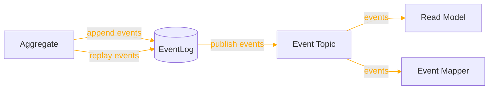
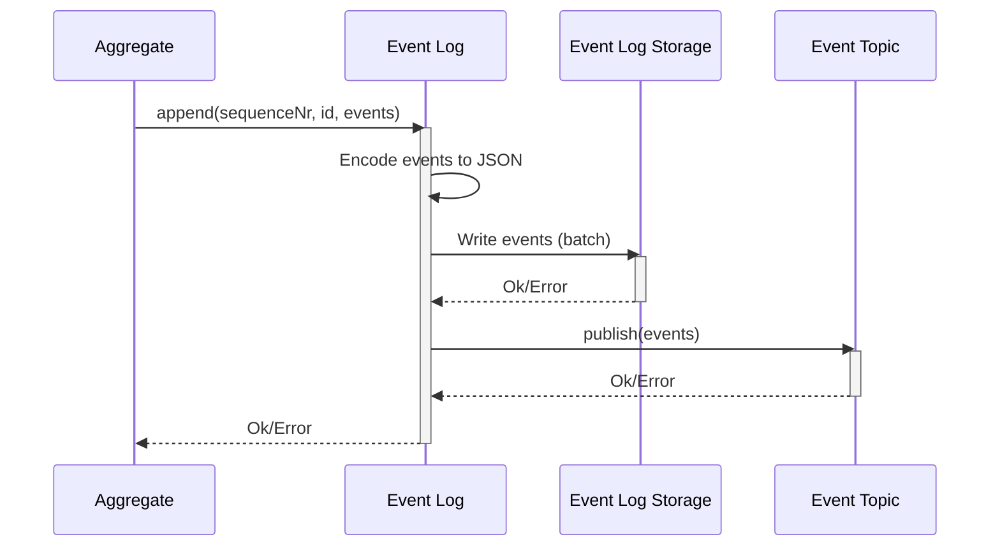
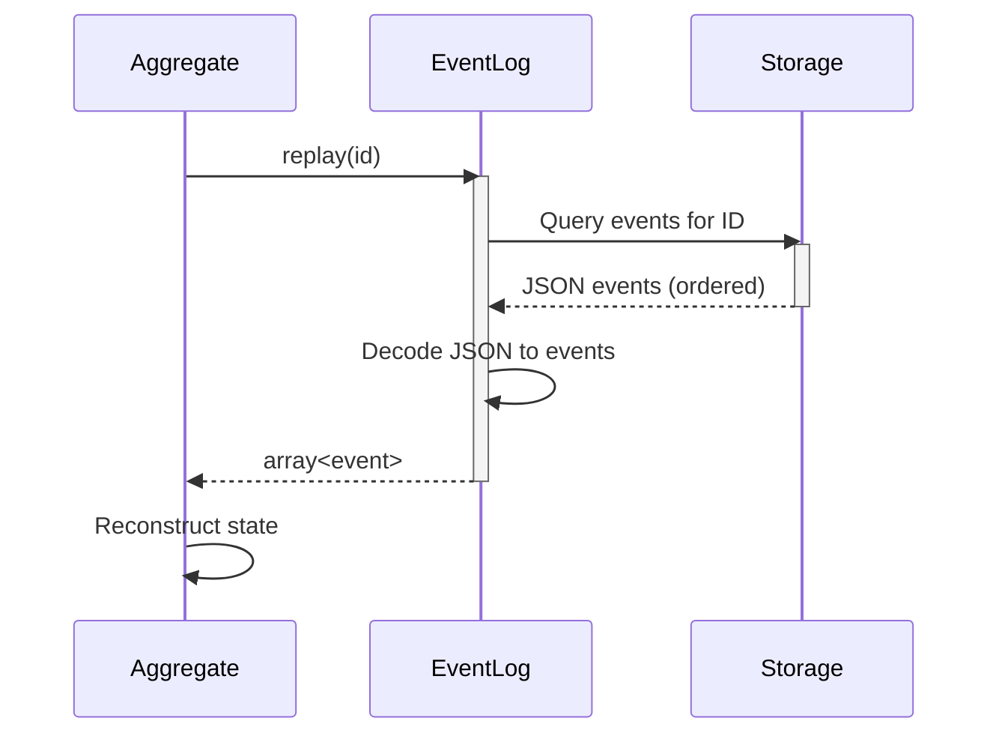
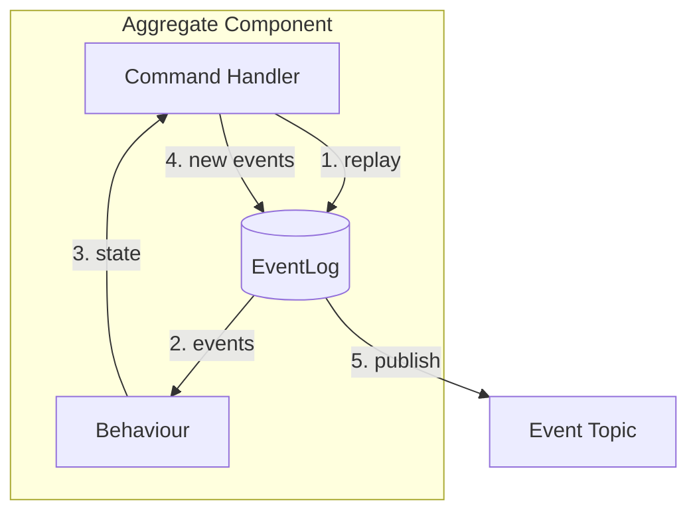

For a short summary of EventLog, see [Reventless Components Overview.](../reventless-components-overview.md#eventlog)

:::info Framework Implementation
This component follows the Reventless [Component Structure Pattern](../inner-workings/component-structure-pattern.md), using separate files for interface definitions ([`EventLog.res`](../../reventless/src/components/EventLog/EventLog.res)), builder logic ([`EventLog_Builder.res`](../../reventless/src/components/EventLog/EventLog_Builder.res)), adapter interface ([`EventLog_Adapter.res`](../../reventless/src/components/EventLog/EventLog_Adapter.res)), and runtime operations ([`EventLog_Operations.res`](../../reventless/src/components/EventLog/EventLog_Operations.res)).
:::

## Overview



The **EventLog** is the foundational storage component for event sourcing in Reventless. It provides append-only event storage with efficient replay capabilities, ensuring that all domain events are durably persisted and can be replayed to reconstruct aggregate state.

## Purpose and Responsibilities

- **Responsibility**: Durably store events in append-only fashion; provide event replay for aggregate state reconstruction; publish events to EventTopic for distribution
- **In**: Events from Aggregate (via `append` operation)
- **Out**: Events to EventTopic (automatic); Events to Aggregate (via `replay` operation)

## Component Spec

The EventLog component requires a spec that defines the EventLog's name, id type, and event type:

```rescript
module type Spec = {
  let name: string

  module Id: ReventlessSpec.Id.T

  @schema
  type event
}
```

For example, a Customer aggregate might define its spec as follows:

```rescript title="Customer.res"
let name = "Customer"

module Id = ReventlessSpec.Id.String

@schema
type event =
  | Created({name: string, address: string})
  | AddressChanged(string)
  | NameChanged(string)
  | Deleted
```

This spec is passed to the EventLog builder to create a type-safe EventLog component for the Customer aggregate.

## Usage Pattern

The EventLog is typically created as part of an Aggregate component and is not used directly by application code. The Aggregate handles all interactions with the EventLog internally.

### Creating an EventLog

```rescript title="Customer_Aggregate.res"
module CustomerEventLog = Reventless.EventLog_Builder.Make(
  Customer,
  EventLogStorage_DynamoDb,
  EventTopicPublisher_SNS,
)

let eventLog = CustomerEventLog.make(
  ~name="Customer",
  ~opts=pulumiOptions,
)
```

### EventLog Operations

The EventLog provides two core operations available at runtime:

#### Append Operation

The `append` operation stores new events and publishes them to the EventTopic:

```rescript
type append<'id, 'event> = (
  int,                                // sequenceNr
  'id,                                // aggregate id
  array<Message.event'<'id, 'event>>  // events to append
) => promise<result<unit, string>>
```

**Parameters:**
- `sequenceNr` - The expected sequence number for optimistic concurrency control
- `id` - The aggregate instance identifier
- `events` - Array of events to append (with metadata)

**Behavior:**
1. Encodes events to JSON format with metadata
2. Writes events to storage (DynamoDB)
3. If successful, publishes events to EventTopic for distribution
4. Returns `Ok()` on success or `Error(message)` on failure

#### Replay Operation

The `replay` operation retrieves all historical events for an aggregate instance:

```rescript
type replay<'id, 'event> = (
  'id                                 // aggregate id
) => promise<array<'event>>
```

**Parameters:**
- `id` - The aggregate instance identifier

**Behavior:**
1. Queries storage for all events with the given ID
2. Events are returned in sequence order
3. Decodes JSON events back to typed event values
4. Returns array of events (empty array if aggregate doesn't exist)

## Runtime Behavior

The EventLog integrates with the Aggregate's event sourcing lifecycle:

### Event Append Sequence



Please note that typical EventLogStorages publish changes themself, so the corresponding EventTopic will typically ignore the published events. But for the case that the EventLogStorage does not publish events, the EventTopic will publish them. Take care, that this manual publishing is not recommended, because it is not atomic with the storage operation. 
### Event Replay Sequence



## Integration with Aggregate

The EventLog is an integral part of the Aggregate component. The Aggregate uses it to:

1. **Store command results** - When a command is processed, resulting events are appended
2. **Reconstruct state** - Before processing a command, events are replayed to rebuild current state
3. **Publish events** - Automatically publishes appended events to interested components



**Sequence:**
1. Aggregate requests event replay for the aggregate ID
2. EventLog returns historical events
3. Behaviour reconstructs current state from events
4. Aggregate appends new events from command processing
5. EventLog publishes new events to EventTopic

## Event Structure

Events stored in the EventLog include both the domain event and metadata:

```rescript
type event'<'id, 'event> = {
  id: 'id,                // Aggregate instance ID
  meta: meta,             // Metadata
  event: 'event,          // The actual domain event
}

type meta = {
  service: service,       // service name that created event or is addressed by command
  time: string,           // when message was created
  ip: string,             // IP of service that created message
  user: string,           // user name that initiated message (if any)
  msgId: string,          // unique message id
  correlationId: string,  // id of message that caused this message
}
```

The EventLog handles encoding/decoding between the typed events and JSON storage format, preserving all metadata for event traceability.

## Common Patterns

### Event Sourced State Reconstruction

Every time an Aggregate processes a command, it follows this pattern:

```rescript
// 1. Replay historical events
let events = await eventLog.replay(customerId)

// 2. Reconstruct current state
let state = events->Array.reduce(initialState, (state, event) => 
  applyEvent(state, event)
)

// 3. Process command with current state
let newEvents = executeCommand(state, command)

// 4. Append new events
let _ = await eventLog.append(sequenceNr, customerId, newEvents)
```

### Optimistic Concurrency Control

The `sequenceNr` parameter in `append` enables optimistic concurrency:

```rescript
// Current sequence number from replay
let currentSeqNr = events->Array.length

// Attempt append with expected sequence
switch await eventLog.append(currentSeqNr, id, newEvents) {
| Ok() => // Success - our sequence number was correct
| Error(_) => // Conflict - another process modified the aggregate
}
```

If two processes try to append events concurrently, only one will succeed. The other will receive an error and must retry.

### Event Publishing

The EventLog automatically publishes events to the EventTopic after successful append:

```rescript
let append = async (sequenceNr, id, events') => {
  // 1. Write to storage
  let appendResult = await storage.append(sequenceNr, id, eventsJson)
  
  // 2. If successful, publish to EventTopic
  switch appendResult {
  | Ok() => 
    await eventTopic.publish(events')
    Ok()
  | Error(e) => Error(e)
  }
}
```

This ensures events are never published unless they're durably stored, maintaining consistency.

## Error Handling

The EventLog includes comprehensive error handling:

**Append Errors:**
- Storage write failures (network, permissions, etc.)
- Sequence number conflicts (optimistic concurrency violations)
- Event publishing failures

**Replay Errors:**
- Decoding errors (event schema mismatch)
- Storage query failures
- Automatic retry with exponential backoff

All errors are logged with detailed context including aggregate name, ID, and error details.

## Pulumi

The EventLog component creates these infrastructure resources:

```rescript
type outputs = {
  resources: array<resource>,           // DynamoDB table resources
  eventTopic: EventTopic.outputs,      // Associated EventTopic
}
```

**Resource Naming:**
- Component type: `reventless:EventLog`
- Resource name pattern: `{aggregateName}EventLog`

**Dependencies:**
- EventLog depends on EventTopic (events published after storage)
- Aggregate depends on EventLog (cannot exist without event storage)

## Related Components

- **[Aggregate](./aggregate.md)** - Uses EventLog for event sourcing
- **[EventTopic](./eventtopic.md)** - Receives events from EventLog for distribution
- **[EventCollector](./eventcollector.md)** - Can consume events via DynamoDB Streams or EventTopic
- **[ReadModel](./readmodel.md)** - Consumes events published by EventLog

## AWS Implementation

For detailed implementation, see [EventLog AWS Adapter Documentation](../inner-workings/aws-adapters/eventlog.md).
