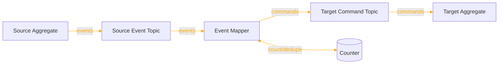
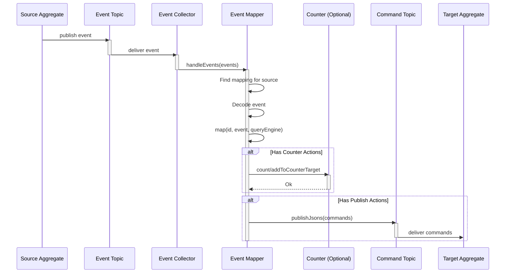
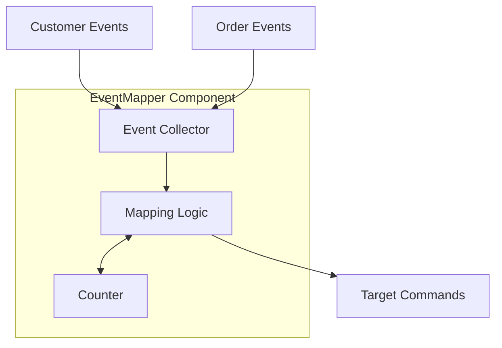

For a short summary of EventMapper, see [Reventless Components Overview.](../reventless-components-overview.md#eventmapper)

:::info Framework Implementation
This component follows the Reventless [Component Structure Pattern](../inner-workings/component-structure-pattern.md), using separate files for interface definitions ([`EventMapper.res`](../../reventless/src/components/EventMapper/EventMapper.res)), builder logic ([`EventMapper_Builder.res`](../../reventless/src/components/EventMapper/EventMapper_Builder.res)), and runtime callbacks ([`EventMapper_Callback.res`](../../reventless/src/components/EventMapper/EventMapper_Callback.res)).
:::

## Overview



The **EventMapper** enables event-driven command generation by mapping events from one or more source aggregates to commands for a target aggregate. This is a key component for implementing saga patterns, process managers, and reactive business logic across aggregate boundaries.

## Purpose and Responsibilities

- **Responsibility**: Listen to events from source aggregates; transform source events into target commands; optionally use Counter for deduplication/coordination; publish commands to target aggregate
- **In**: Events from source EventTopics (via EventCollector)
- **Out**: Commands to target CommandTopic

## Event Mapping Spec

The EventMapper requires a mappings specification that defines how events are transformed into commands:

```rescript
module type Mappings = {
  module Target: ReventlessSpec.Aggregate.Spec  // Target aggregate
  module type Mapping = ReventlessSpec.EventMapping.T with module Target := Target
  let mappings: array<module(Mapping)>          // Array of event mappings
  let counter: option<module(Counter.T)>        // Optional counter for coordination
}
```

### EventMapping Interface

Each mapping defines how to transform events from one source aggregate:

```rescript
module type EventMapping = {
  module Source: Spec                           // Source aggregate spec
  module Target: Spec                           // Target aggregate spec
  
  let map: (
    Source.Id.t,                                // Source aggregate ID
    Source.event,                               // Source event
    QueryEngine.operations,                     // Query operations
  ) => array<action<Target.Id.t, Target.command>>
}
```

### Mapping Actions

The `map` function returns an array of actions that specify what to do with the event:

```rescript
type action<'id, 'command> =
  | Publish('id, 'command)                      // Publish command immediately
  | PublishDelayed('id, 'command, int)          // Publish command after delay (seconds)
  | PublishAsync(promise<array<('id, 'command)>>) // Async command generation
  | AddToCounterTarget(counterTarget)           // Add counter target
  | Count(counterId)                            // Increment counter
  | CountMulti(counterId, int)                  // Increment counter by N
```

## Usage Pattern

### Basic Event Mapping Example

Here's a complete example of mapping Customer events to Order commands:

```rescript title="Order_EventMappings.res"
open ReventlessSpec

// Define the target aggregate
module Target = Order

// Mapping from Customer events to Order commands
module CustomerMapping = {
  module Source = Customer
  
  let map = (customerId, event, queryEngine) =>
    switch event {
    | Customer.Created({name, address}) => [
        // When customer is created, create a welcome order
        EventMapping.Publish(
          Order.Id.make(),
          Order.CreateWelcomeOrder({
            customerId: customerId,
            customerName: name,
            deliveryAddress: address,
          })
        ),
      ]
    | Customer.AddressChanged(newAddress) => {
        // When address changes, update pending orders
        // Use async pattern to query for orders first
        let ordersPromise = queryEngine.query(
          ~table="PendingOrders",
          ~key="customerId",
          ~value=customerId->Customer.Id.toString,
        )
        [
          EventMapping.PublishAsync(
            ordersPromise->Promise.then(orders =>
              orders->Array.map(order => (
                order.orderId,
                Order.UpdateDeliveryAddress(newAddress)
              ))
            )
          ),
        ]
      }
    | Customer.Deleted => [
        // When customer is deleted, cancel their orders
        EventMapping.Publish(
          customerId->Customer.Id.toString->Order.Id.fromString,
          Order.CancelAllForCustomer
        ),
      ]
    | _ => []  // Other events don't trigger order commands
    }
}

// Define the module type constraint
module type Mapping = EventMapping.T with module Target := Target

// Register all mappings for this target
let mappings: array<module(Mapping)> = [
  module(CustomerMapping),
]

// No counter needed for this simple case
let counter = None
```

### Event Mapping with Counter

For more complex scenarios requiring deduplication or coordination across multiple events:

```rescript title="Invoice_EventMappings.res"
open ReventlessSpec

module Target = Invoice

module OrderMapping = {
  module Source = Order
  
  let map = (orderId, event, queryEngine) =>
    switch event {
    | Order.ItemAdded({itemId, quantity, price}) => [
        // Add this item to the invoice counter
        EventMapping.AddToCounterTarget({
          counterId: orderId->Order.Id.toString,
          target: {
            itemId: itemId,
            quantity: quantity,
            price: price,
          }
        }),
        // Increment the counter
        EventMapping.Count(orderId->Order.Id.toString),
      ]
    | Order.Completed({expectedItems}) => [
        // When order is complete, we expect counter to reach expectedItems
        // Counter will trigger invoice generation when count matches
        EventMapping.Count(orderId->Order.Id.toString),
      ]
    | _ => []
    }
}

module CounterMapping = {
  module Source = Counter.Source
  
  let map = (counterId, event, _queryEngine) =>
    switch event {
    | Counter.Source.Triggered({targets}) => {
        // Counter triggered - all items collected, generate invoice
        let items = targets->Array.map(target => {
          itemId: target.itemId,
          quantity: target.quantity,
          price: target.price,
        })
        [
          EventMapping.Publish(
            counterId->Invoice.Id.fromString,
            Invoice.Generate({items: items})
          ),
        ]
      }
    | _ => []
    }
}

module type Mapping = EventMapping.T with module Target := Target

let mappings: array<module(Mapping)> = [
  module(OrderMapping),
  module(CounterMapping),
]

// Enable counter for coordination
let counter = Some(module(Invoice_Counter: Counter.T))
```

## Runtime Behavior

### Event Processing Sequence



## Integration Points

### With EventCollector

The EventMapper uses an EventCollector to subscribe to source EventTopics:



### With Aggregate

EventMappers are typically defined as part of an Aggregate's EventMappings:

```rescript title="Order.res"
// In the aggregate module, include EventMappings
include ReventlessAws.Aggregate.Make(
  Config,
  Order,
  Order_Behaviour,
  Order_EventMappings,  // EventMapper configuration
)
```

The framework automatically creates and wires the EventMapper as part of the Aggregate deployment.

## Common Patterns

### Saga Pattern - Order Fulfillment

```rescript
// Order aggregate triggers fulfillment saga
module InventoryMapping = {
  module Source = Order
  
  let map = (orderId, event, _queryEngine) =>
    switch event {
    | Order.Created({items}) => 
        items->Array.map(item =>
          EventMapping.Publish(
            item.inventoryId,
            Inventory.Reserve({orderId, quantity: item.quantity})
          )
        )
    | Order.Cancelled => [
        EventMapping.Publish(
          orderId->getInventoryId,
          Inventory.Release({orderId})
        ),
      ]
    | _ => []
    }
}
```

### Process Manager - Multi-Step Workflow

```rescript
// Coordinate payment after inventory reservation
module PaymentMapping = {
  module Source = Inventory
  
  let map = (_inventoryId, event, queryEngine) =>
    switch event {
    | Inventory.Reserved({orderId}) => {
        // Check if all inventory is reserved
        let checkPromise = queryEngine.query(
          ~table="OrderInventory",
          ~key="orderId", 
          ~value=orderId,
        )->Promise.then(items => {
          if items->allReserved {
            // All reserved, proceed with payment
            [(orderId, Payment.Process({orderId}))]
          } else {
            // Still waiting for more reservations
            []
          }
        })
        [EventMapping.PublishAsync(checkPromise)]
      }
    | _ => []
    }
}
```

### Delayed Command Execution

```rescript
// Send reminder email after 24 hours
module ReminderMapping = {
  module Source = Order
  
  let map = (orderId, event, _queryEngine) =>
    switch event {
    | Order.Created(_) => [
        EventMapping.PublishDelayed(
          orderId,
          Order.SendReminder,
          24 * 60 * 60  // 24 hours in seconds
        ),
      ]
    | _ => []
    }
}
```

### Cross-Aggregate Consistency

```rescript
// Keep customer aggregate in sync with orders
module CustomerSyncMapping = {
  module Source = Order
  
  let map = (_orderId, event, _queryEngine) =>
    switch event {
    | Order.Completed({customerId, totalAmount}) => [
        EventMapping.Publish(
          customerId,
          Customer.UpdateOrderTotal(totalAmount)
        ),
      ]
    | _ => []
    }
}
```

## Error Handling

The EventMapper includes comprehensive error handling:

**Mapping Errors:**
- Invalid event JSON → logged, event skipped
- Missing mapping for source → logged, event skipped
- Decoding errors → logged with context, event skipped
- Map function exceptions → caught, logged, event skipped

**Publishing Errors:**
- Command publishing failures → retried by CommandTopic
- Counter operation failures → automatic retry with exponential backoff

**Recovery:**
- Failed events remain in EventCollector queue for retry
- Poison messages can be configured to move to dead-letter queue
- All errors logged with full context (source, event, error details)

## Pulumi

The EventMapper component creates these infrastructure resources:

```rescript
type outputs = {
  name: string,
  eventCollector: Pulumi.Output.t<EventCollector.outputs>,
  counter?: Counter.outputs,
}
```

**Resource Naming:**
- Component type: `reventless:EventMapper`
- Resource name pattern: `{targetAggregateName}EventMapper`

**Dependencies:**
- EventMapper depends on target Aggregate's CommandTopic
- EventMapper depends on source Aggregates' EventTopics
- EventMapper optionally depends on Counter component

**Configuration:**
- `memorySize` - Lambda memory allocation (default: 2048 MB)
- `timeout` - Lambda timeout (default: 180 seconds)

## Best Practices

### Keep Mappings Pure and Focused

```rescript
// ❌ Bad: Complex logic in mapping
let map = (id, event, queryEngine) => {
  // Don't do complex calculations here
  let result = await someComplexCalculation()
  // Don't make unnecessary queries
  let data = await queryEngine.query(...)
  [EventMapping.Publish(id, SomeCommand(result))]
}

// ✅ Good: Simple, focused transformation
let map = (id, event, _queryEngine) =>
  switch event {
  | SourceEvent(data) => [
      EventMapping.Publish(id, TargetCommand(data))
    ]
  | _ => []
  }
```

### Use QueryEngine for Read-Side Queries Only

```rescript
// ✅ Good: Query read models for decision-making
let map = (id, event, queryEngine) =>
  switch event {
  | OrderCreated({customerId}) => {
      let customerPromise = queryEngine.query(
        ~table="CustomerReadModel",
        ~key="id",
        ~value=customerId,
      )
      [
        EventMapping.PublishAsync(
          customerPromise->Promise.then(customer =>
            if customer.vipStatus {
              [(id, ApplyVipDiscount)]
            } else {
              []
            }
          )
        ),
      ]
    }
  | _ => []
  }
```

### Handle Missing Mappings Gracefully

```rescript
// Always include a default case
let map = (id, event, _queryEngine) =>
  switch event {
  | EventWeCarAbout(data) => [/* commands */]
  | _ => []  // Explicitly ignore other events
  }
```

### Use Counter for Complex Coordination

When multiple events must be collected before taking action, use a Counter instead of trying to track state in the mapping function.

## Related Components

- **[Aggregate](./aggregate.md)** - Defines EventMappings as part of its configuration
- **[EventCollector](./eventcollector.md)** - Subscribes to source EventTopics
- **[CommandTopic](./commandtopic.md)** - Receives generated commands
- **[Counter](./counter.md)** - Optional coordination for multi-event scenarios
- **[EventTopic](./eventtopic.md)** - Source of events for mapping

## AWS Implementation

For detailed AWS implementation, see EventMapper AWS adapter documentation (TBD).