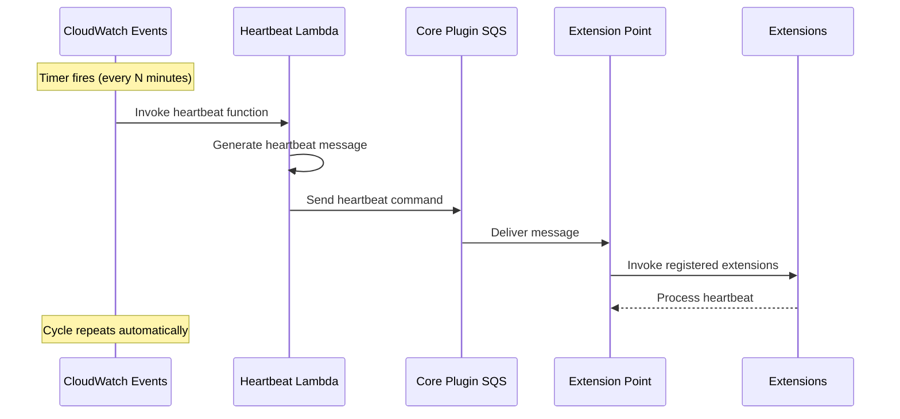
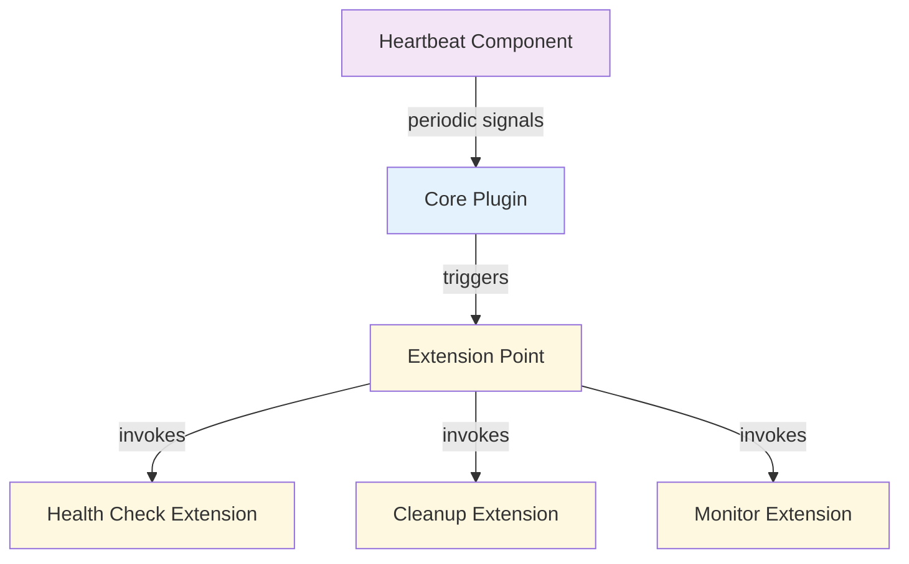

For a short summary of a Heartbeat, see [Reventless Components Overview.](../reventless-components-overview.md#heartbeat)

:::info Framework Implementation
This component follows the Reventless [Component Structure Pattern](../inner-workings/component-structure-pattern.md), using separate files for interface definitions ([`Heartbeat.res`](../../reventless/src/components/Heartbeat/Heartbeat.res)), builder logic ([`Heartbeat_Builder.res`](../../reventless/src/components/Heartbeat/Heartbeat_Builder.res)), adapter interface ([`Heartbeat_Adapter.res`](../../reventless/src/components/Heartbeat/Heartbeat_Adapter.res)), and callback handlers ([`Heartbeat_Callback.res`](../../reventless/src/components/Heartbeat/Heartbeat_Callback.res)).
:::

## Overview

The Heartbeat component provides periodic health check signals and keepalive mechanisms, specifically designed to integrate with the Core Plugin's ExtensionPoint system. It enables health monitoring, periodic extension invocations, and watchdog timer functionality.

```mermaid
flowchart LR
    CloudWatch[CloudWatch Events]:::aws
    Lambda[Lambda Function]:::aws
    CoreSQS[Core Plugin SQS]:::core
    ExtensionPoint[Extension Point]:::extension
    Extensions[Extensions]:::extension
    
    CloudWatch -->|triggers| Lambda
    Lambda -->|heartbeat message| CoreSQS
    CoreSQS -->|processes| ExtensionPoint
    ExtensionPoint -->|invokes| Extensions
    
    classDef aws fill:#fff3e0
    classDef core fill:#e3f2fd
    classDef extension fill:#f3e5f5
```



## Purpose and Responsibilities

- **Responsibility:** Generate periodic heartbeat signals for health monitoring and extension triggering
- **In:** Timeout configuration and Core Plugin connection details
- **Out:** Periodic heartbeat messages sent to Core Plugin ExtensionPoint

## Component Configuration

The Heartbeat component requires minimal configuration, focusing on timing and Core Plugin integration:

### Basic Setup

```rescript
// Create a heartbeat component
let heartbeat = Reventless.Heartbeat.make(~name="system-heartbeat")

// Connect to Core Plugin with timeout configuration
let connectHeartbeat = (~coreCommandTopic, ~runtime) => {
  heartbeat->Reventless.Heartbeat.connect(
    ~runtime,
    ~remoteChannel=coreCommandTopic.outputs,
    ~timeout=5, // Send heartbeat every 5 minutes
  )
}
```

### Handler Creation

```rescript
// Create a heartbeat handler for runtime use
let heartbeatHandler = Reventless.Heartbeat.makeHandler(
  ~id="health-monitor",
  ~timeout=10, // 10 minute timeout
  ~publishToCorePluginExtensionPoint=corePublisher,
)
```

## Runtime Behavior

The Heartbeat component operates through a simple, automated flow:

### Heartbeat Generation Flow



### Message Structure

The heartbeat generates standardized messages for the Core Plugin:

```rescript
// Generated heartbeat message structure
{
  Message.id: "health-monitor", // Configured ID
  meta: {
    service: "CorePluginExtensionPoint",
    time: "2024-01-26T10:30:00.000Z", // Current timestamp
    ip: "",
    user: "Heartbeat",
    msgId: "uuid-generated",
    correlationId: "uuid-generated",
  },
  commandJson: "Heartbeat(10)", // Timeout value encoded
}
```

## Integration Points

The Heartbeat component is specifically designed to integrate with the Core Plugin architecture:

### Core Plugin Integration



### Extension Response Patterns

Extensions can respond to heartbeat signals in various ways:

```rescript
// Health check extension responding to heartbeat
let healthCheckExtension = (heartbeatCommand) => {
  switch heartbeatCommand {
  | Heartbeat(timeout) => 
    // Perform health checks
    checkDatabaseConnection()
    ->Promise.then(dbStatus => 
      checkExternalAPIs()
      ->Promise.then(apiStatus => {
        // Publish health status events
        publishHealthStatus(dbStatus, apiStatus)
      })
    )
  }
}
```

## Common Patterns

### Health Monitoring Pattern

```rescript
// Set up heartbeat for health monitoring
let healthMonitorHeartbeat = Reventless.Heartbeat.make(~name="health-monitor")

// Connect with appropriate timeout for health checks
healthMonitorHeartbeat->Reventless.Heartbeat.connect(
  ~runtime,
  ~remoteChannel=coreCommandTopic.outputs,
  ~timeout=5, // Check health every 5 minutes
)
```

### Cleanup Pattern

```rescript
// Heartbeat for periodic cleanup tasks
let cleanupHeartbeat = Reventless.Heartbeat.make(~name="cleanup-scheduler")

cleanupHeartbeat->Reventless.Heartbeat.connect(
  ~runtime,
  ~remoteChannel=coreCommandTopic.outputs,
  ~timeout=60, // Run cleanup every hour
)
```

### Watchdog Pattern

```rescript
// Short-interval heartbeat for watchdog functionality
let watchdogHeartbeat = Reventless.Heartbeat.make(~name="watchdog")

watchdogHeartbeat->Reventless.Heartbeat.connect(
  ~runtime,
  ~remoteChannel=coreCommandTopic.outputs,
  ~timeout=1, // Check every minute for quick response
)
```

### Multi-Purpose Monitoring

```rescript
// Single heartbeat triggering multiple monitoring extensions
let systemHeartbeat = Reventless.Heartbeat.make(~name="system-monitor")

// Extensions can differentiate based on heartbeat ID
let multiHandler = Reventless.Heartbeat.makeHandler(
  ~id="system-monitor",
  ~timeout=15,
  ~publishToCorePluginExtensionPoint=corePublisher,
)
```

## Comparison with Scheduler

The Heartbeat component serves a specific purpose compared to the general-purpose Scheduler:

| Feature | Heartbeat | Scheduler |
|---------|-----------|-----------|
| **Target** | Core Plugin ExtensionPoint only | Any component/service |
| **Purpose** | Health monitoring, keepalive | General scheduled workflows |
| **Configuration** | Fixed at deploy-time | Dynamic at runtime |
| **Operations** | None (automatic) | `createSchedule`, `deleteSchedule` |
| **Message Format** | Standardized heartbeat | Custom payload |
| **Integration** | Tightly coupled to Core Plugin | Loosely coupled |

### When to Use Heartbeat

**Choose Heartbeat for:**
- Health monitoring and system checks
- Periodic extension invocations via Core Plugin
- Simple, fixed-interval triggers
- Framework-level monitoring needs
- Keepalive mechanisms

**Choose Scheduler for:**
- Application-specific scheduled workflows
- Dynamic schedule management
- Custom payload delivery
- Flexible target configuration
- User-configurable timing

## Pulumi

The Heartbeat component is deployed as infrastructure that creates CloudWatch Event Rules, Lambda permissions, and IAM policies. All execution happens automatically once deployed.

```rescript
// Deployment creates all necessary infrastructure
let heartbeat = Reventless.Heartbeat.make(~name="system-heartbeat", ~opts=pulumiOpts)

// Connection configures the runtime integration
heartbeat->Reventless.Heartbeat.connect(~runtime, ~remoteChannel, ~timeout=10)
```

## AWS Implementation

For detailed AWS-specific implementation including CloudWatch Events integration, Lambda permissions, IAM policies, and Core Plugin SQS integration, see [Heartbeat → EventBridge Rule + Lambda](../inner-workings/aws-adapters/heartbeat.md).