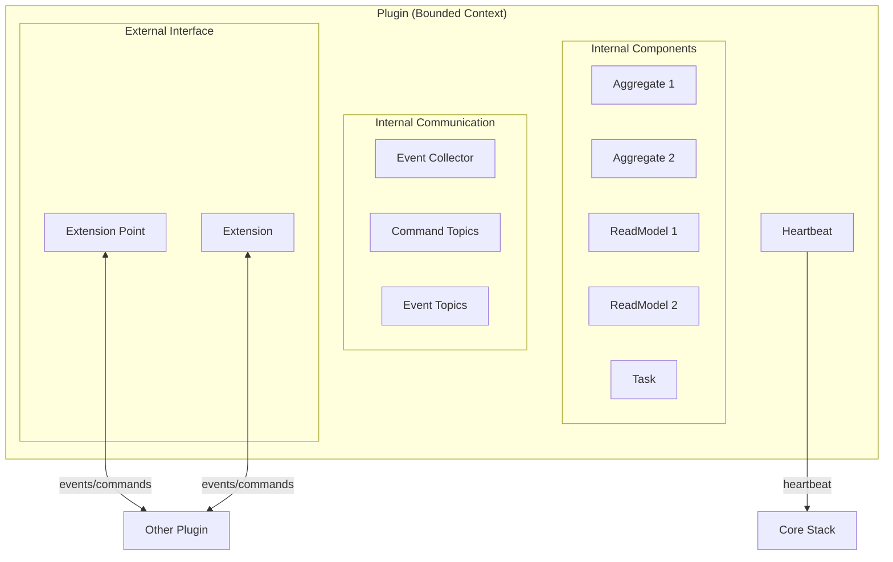
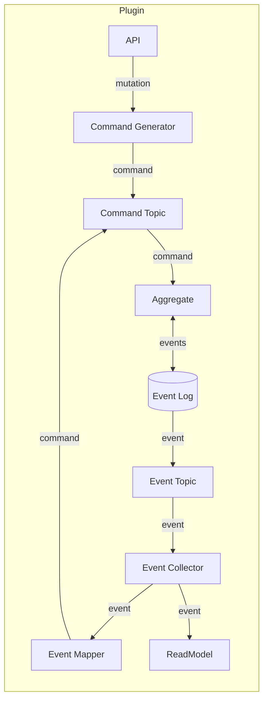
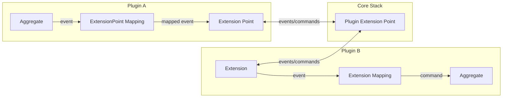
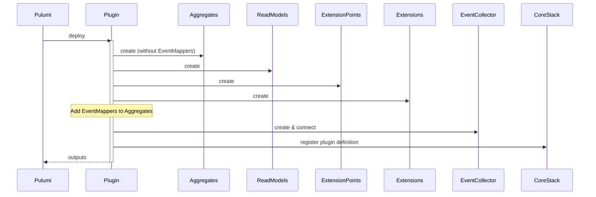
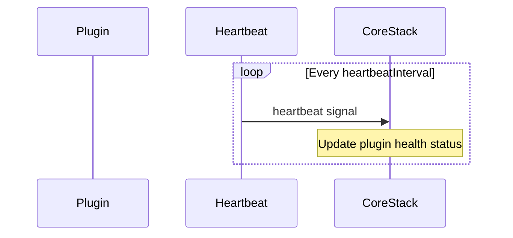

[For a short summary of a Plugin, see Reventless Components Overview.](../reventless-components-overview.md#plugin)

:::info Framework Implementation
This component follows the Reventless [Component Structure Pattern](../inner-workings/component-structure-pattern.md), using separate files for interface definitions ([`Plugin.res`](../../reventless/src/components/Plugin/Plugin.res)), builder logic ([`Plugin_Builder.res`](../../reventless/src/components/Plugin/Plugin_Builder.res)), and helper functions ([`Plugin_Helpers.res`](../../reventless/src/components/Plugin/Plugin_Helpers.res)).
:::

## Overview

A **Plugin** is the top-level organizational unit in a Reventless application, corresponding to a [Bounded Context](https://martinfowler.com/bliki/BoundedContext.html) in Domain-Driven Design (DDD). It serves as both a logical boundary for domain concepts and a deployment unit for infrastructure.



## Purpose and Responsibilities

- **Bounded Context:** Establishes clear boundaries for domain concepts, naming, and functionality
- **Deployment Unit:** Groups all related components for unified deployment
- **Component Container:** Contains and orchestrates Aggregates, ReadModels, Tasks, ExtensionPoints, and Extensions
- **Cross-Plugin Communication:** Manages communication with other Plugins via ExtensionPoints and Extensions
- **Health Monitoring:** Provides heartbeat signals to the Core Stack for monitoring

## Plugin Structure

A Plugin contains and manages the following components:

| Component | Purpose | Quantity |
|-----------|---------|----------|
| [Aggregates](./aggregate.md) | Business logic and event sourcing | 0..n |
| [ReadModels](./readmodel.md) | Query-optimized projections | 0..n |
| [Tasks](./task.md) | File processing and external integrations | 0..n |
| [ExtensionPoints](./extensionpoint.md) | External interface for other Plugins | 0..n |
| [Extensions](./extension.md) | Consume other Plugins' ExtensionPoints | 0..n |
| [EventCollector](./eventcollector.md) | Centralized event consumption | 1 |
| [Heartbeat](./heartbeat.md) | Health monitoring | 1 |

## Plugin Configuration

A Plugin is configured with the following parameters:

```rescript
let make: (
  ~name: string,                                    // Unique plugin name
  ~version: string,                                 // Semantic version
  ~heartbeatInterval: int,                          // Health check interval (ms)
  ~extensionPoints: array<module(ExtensionPoint.T)>,
  ~extensions: array<module(Extension.T)>,
  ~aggregates: array<module(Aggregate.T)>,
  ~readModels: array<module(ReadModel.T)>,
  ~tasks: array<module(Task.T)>,
  ~scheduler: Pulumi.Output.t<Scheduler.operations>,
  ~opts: Pulumi.ComponentResource.options=?,
) => component
```

### Parameters

| Parameter | Type | Description |
|-----------|------|-------------|
| `name` | `string` | Unique identifier for the Plugin within the system |
| `version` | `string` | Semantic version string (e.g., "1.0.0") |
| `heartbeatInterval` | `int` | Interval in milliseconds for health check signals |
| `extensionPoints` | `array<module(ExtensionPoint.T)>` | ExtensionPoints exposed by this Plugin |
| `extensions` | `array<module(Extension.T)>` | Extensions consuming other Plugins' ExtensionPoints |
| `aggregates` | `array<module(Aggregate.T)>` | Aggregates contained in this Plugin |
| `readModels` | `array<module(ReadModel.T)>` | ReadModels for query projections |
| `tasks` | `array<module(Task.T)>` | Tasks for file processing and integrations |
| `scheduler` | `Pulumi.Output.t<Scheduler.operations>` | Scheduler for time-based operations |

## Plugin Outputs

When deployed, a Plugin produces the following outputs:

```rescript
type outputs = {
  id: Pulumi.Output.t<string>,                              // Plugin identifier (name@version)
  version: Pulumi.Output.t<string>,                         // Version string
  heartbeatInterval: Pulumi.Output.t<int>,                  // Configured heartbeat interval
  eventCollector: Pulumi.Output.t<EventCollector.outputs>,  // Event collector outputs
  extensionPoints: Pulumi.Output.t<dict<ExtensionPoint.outputs>>,
  extensions: Pulumi.Output.t<dict<Extension.outputs>>,
  aggregates: Pulumi.Output.t<dict<Aggregate.outputs>>,
  readModels: Pulumi.Output.t<dict<ReadModel.outputs>>,
  tasks: Pulumi.Output.t<dict<Task.outputs>>,
  resolvers: Pulumi.Output.t<array<ReventlessSpec.Adapter.resource>>,
  heartbeat: Pulumi.Output.t<Heartbeat.outputs>,
}
```

## Internal Communication

Within a Plugin, components communicate through internal messaging infrastructure:



### Communication Rules

1. **Aggregates within the same Plugin** can communicate directly via EventMappings
2. **Aggregates in different Plugins** must communicate via ExtensionPoints and Extensions
3. **ReadModels** receive events through the Plugin's EventCollector
4. **Tasks** can publish commands to Aggregates within the same Plugin

## Cross-Plugin Communication

Plugins communicate with each other through ExtensionPoints and Extensions:



### Communication Flow

1. **Outgoing Events:** Aggregate events are mapped to ExtensionPoint events via ExtensionPointMappings
2. **Event Distribution:** ExtensionPoint publishes events to the Core Stack's Plugin ExtensionPoint
3. **Event Reception:** Extensions receive events from ExtensionPoints they subscribe to
4. **Command Generation:** Extension mappings transform incoming events to commands for local Aggregates
5. **Command Forwarding:** Extensions can also send commands back to ExtensionPoints

## Plugin Definition

At runtime, each Plugin registers itself with the Core Stack using a plugin definition:

```rescript
type pluginDefinition = {
  id: string,                                    // Unique identifier (name@version)
  name: string,                                  // Plugin name
  version: string,                               // Version string
  extensionPoints: array<extensionPointDefinition>,
  extensions: array<extensionDefinition>,
  mutable eventCollector: string,                // Event collector URN
}
```

This definition enables:
- **Discovery:** Other Plugins can discover available ExtensionPoints
- **Routing:** The Core Stack routes events between Plugins
- **Monitoring:** Health status tracking via heartbeats

## Example Plugin Setup

```rescript title="MyPlugin.res" showLineNumbers
// Include the AWS-specific Plugin builder
include ReventlessAws.Plugin.Make(
  Config,
  {
    let name = "MyDomain"
    let version = "1.0.0"
    let heartbeatInterval = 30000  // 30 seconds
    
    let extensionPoints = [
      module(MyDomain_ExtensionPoint),
    ]
    
    let extensions = [
      module(OtherDomain_Extension),
    ]
    
    let aggregates = [
      module(Customer_Aggregate),
      module(Order_Aggregate),
    ]
    
    let readModels = [
      module(CustomerList_ReadModel),
      module(OrderHistory_ReadModel),
    ]
    
    let tasks = [
      module(ImportCustomers_Task),
    ]
  }
)
```

## Runtime Behavior

### Initialization Sequence



### Heartbeat Monitoring

The Plugin sends periodic heartbeat signals to the Core Stack:



## Best Practices

### Plugin Design

1. **Single Responsibility:** Each Plugin should represent one bounded context
2. **Cohesive Components:** Group related Aggregates and ReadModels together
3. **Clear Boundaries:** Use ExtensionPoints to define explicit external interfaces
4. **Version Management:** Use semantic versioning for Plugin versions

### Cross-Plugin Communication

1. **Minimize Dependencies:** Limit the number of Extensions per Plugin
2. **Stable Interfaces:** Design ExtensionPoint specs to be stable over time
3. **Event Translation:** Always translate internal events to ExtensionPoint events
4. **Loose Coupling:** Avoid direct dependencies between Plugin internals

### Deployment

1. **Independent Deployment:** Design Plugins to be deployable independently
2. **Version Compatibility:** Ensure ExtensionPoint compatibility across versions
3. **Health Monitoring:** Configure appropriate heartbeat intervals

## Pulumi

The Plugin's Pulumi root component is named using the pattern: `{name}@{version}` and has a type of `reventless:Plugin`.

### Stack Outputs

A Plugin deployment exports the following stack outputs:

- `extensionPoints`: Dictionary of ExtensionPoint outputs for cross-stack references
- `pluginDefinition`: The plugin's registration information

## Related Components

- [Aggregate](./aggregate.md) - Business logic components within a Plugin
- [ReadModel](./readmodel.md) - Query projections within a Plugin
- [Task](./task.md) - File processing and external integrations
- [ExtensionPoint](./extensionpoint.md) - External interface for cross-Plugin communication
- [Extension](./extension.md) - Consume other Plugins' ExtensionPoints
- [EventCollector](./eventcollector.md) - Centralized event consumption
- [Heartbeat](./heartbeat.md) - Health monitoring
