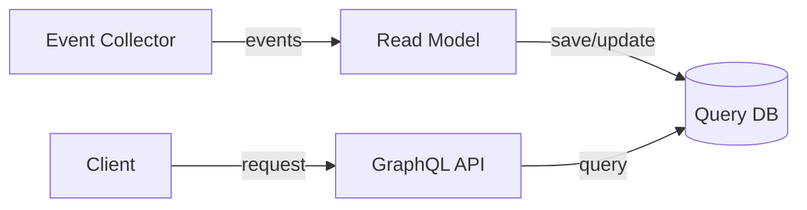
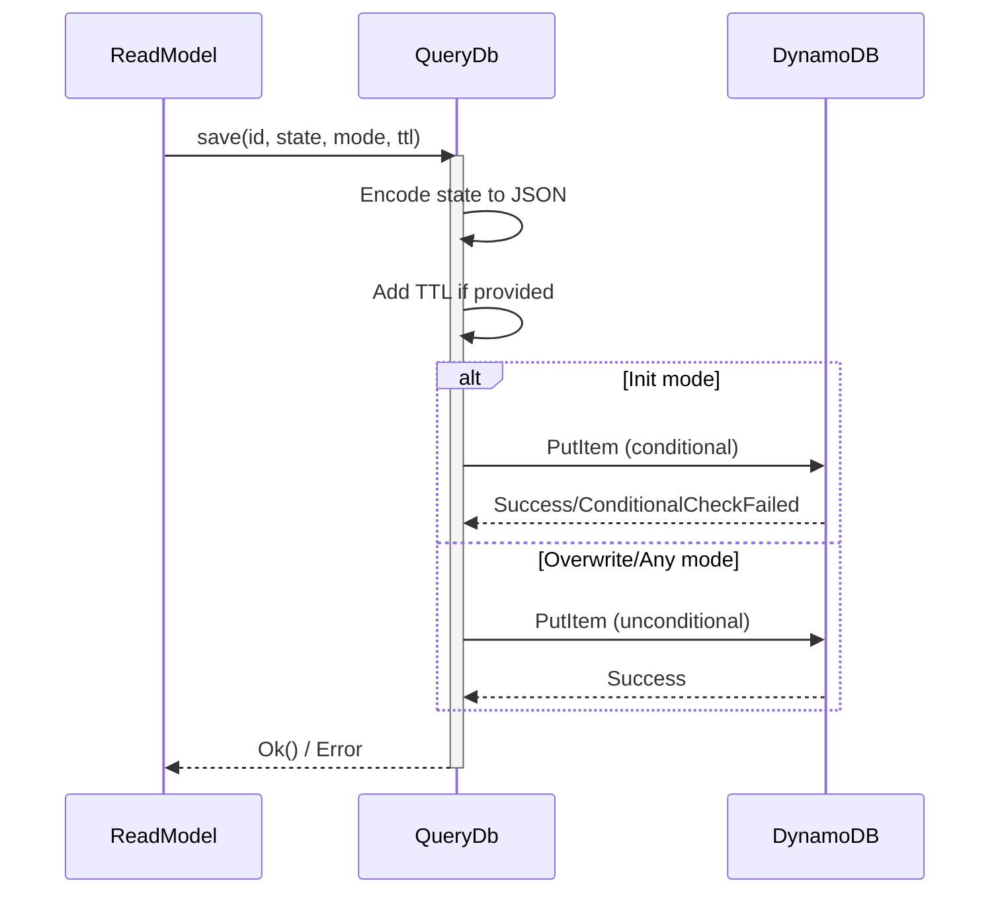
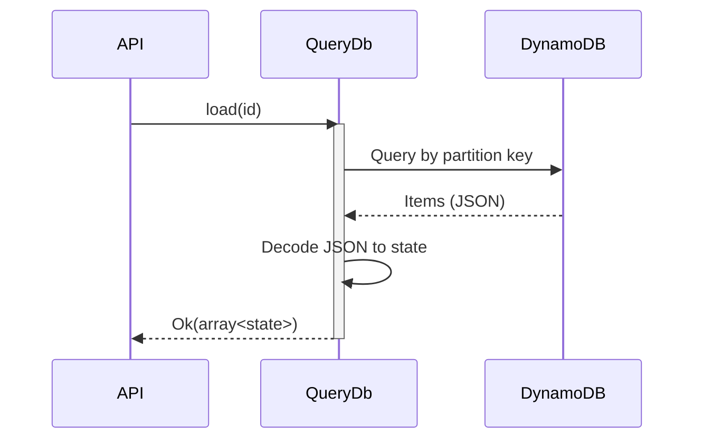
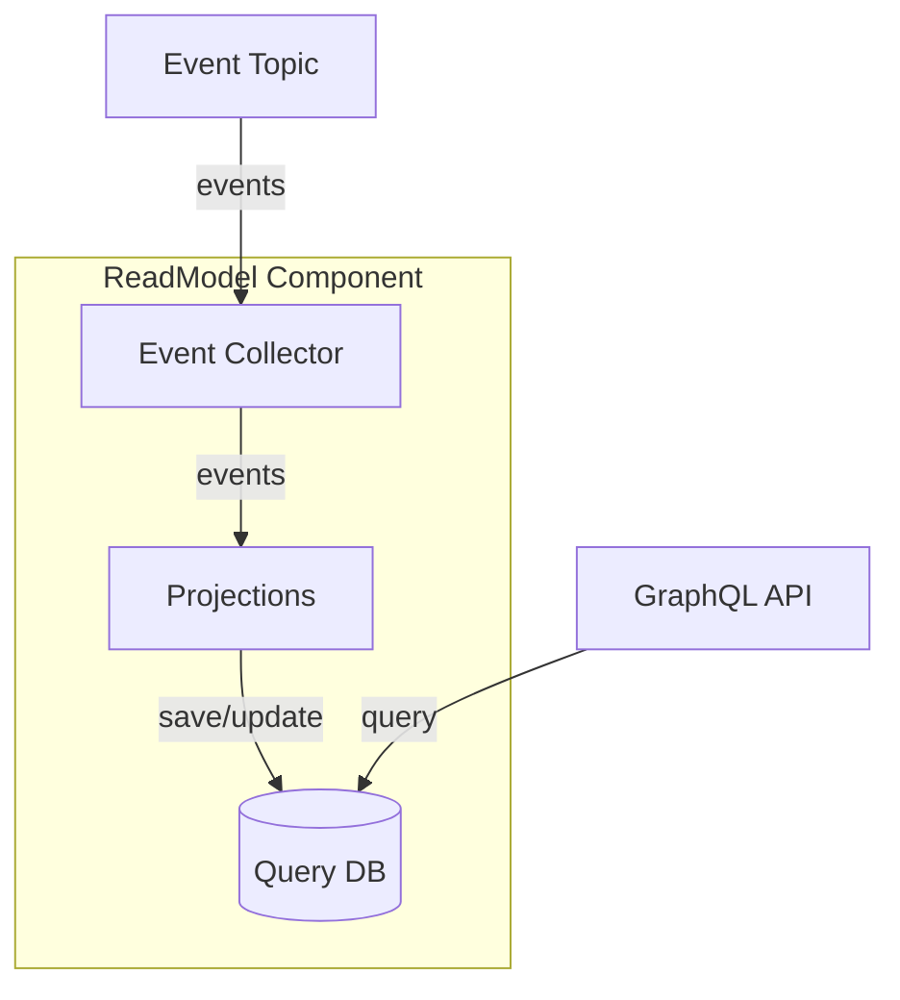

[For a short summary of QueryDb, see Reventless Components Overview.](../reventless-components-overview.md#querydb)

:::info Framework Implementation
This component follows the Reventless [Component Structure Pattern](../inner-workings/component-structure-pattern.md), using separate files for interface definitions ([`QueryDb.res`](../../reventless/src/components/QueryDb/QueryDb.res)), builder logic ([`QueryDb_Builder.res`](../../reventless/src/components/QueryDb/QueryDb_Builder.res)), adapter interface ([`QueryDb_Adapter.res`](../../reventless/src/components/QueryDb/QueryDb_Adapter.res)), and runtime operations ([`QueryDb_Operations.res`](../../reventless/src/components/QueryDb/QueryDb_Operations.res)).
:::

## Overview



The **QueryDb** is the read model storage component that provides efficient querying of projected state. It stores denormalized views of aggregate data, enabling fast queries without replaying events. QueryDb integrates with AWS AppSync for GraphQL APIs and supports configurable indexes, TTL, and batch operations.

## Purpose and Responsibilities

- **Responsibility**: Store projected read model state; provide efficient query operations; support multiple access patterns via indexes; integrate with GraphQL APIs; handle automatic data expiration via TTL
- **In**: State updates from ReadModel projections (via `save`, `saveBatch` operations)
- **Out**: Query results to API resolvers (via `load` operation)

## Component Spec

The QueryDb uses the ReadModel spec which defines the QueryDb's name, Id module and state type:

```rescript title="CustomerReadModel_Spec.res"
let name = "Customer"

module Id = ReventlessSpec.Id.String

@schema
type state = {
  id: id,
  name: string,
  address: string,
}
```

This spec is used to create a type-safe QueryDb for the Customer read model.

## Usage Pattern

QueryDb is typically created as part of a ReadModel component and used by projections to store and retrieve state.

### Creating a QueryDb

```rescript title="Customer_ReadModel.res"
module CustomerQueryDb = Reventless.QueryDb_Builder.Make(
  CustomerReadModel_Spec,
  QueryDbStorage_DynamoDb,
)

let queryDb = CustomerQueryDb.make(
  ~ttl=?None,  // Optional TTL in seconds
  ~opts=pulumiOptions,
)
```

### QueryDb Operations

The QueryDb provides six core operations:

#### Load Operation

Retrieves all items with a specific partition key:

```rescript
type load<'id, 'state> = 'id => promise<
  result<array<'state>, storageError>
>
```

**Usage:**

```rescript
switch await queryDb.load(customerId) {
| Ok([state]) => // Single item found
| Ok([]) => // No items found
| Ok(states) => // Multiple items (with sort key)
| Error(NotLoadedFromStorage(msg)) => // Error
}
```

#### Save Operation

Saves a single item with configurable write behavior:

```rescript
type save<'id, 'state> = (
  'id,                    // Partition key
  'state,                 // State to save
  saveMode,               // Init | Overwrite | Any
  option<int>,            // Optional TTL (Unix timestamp)
) => promise<result<unit, storageError>>
```

**Save Modes:**

- **`Init`** - Conditional write; only succeeds if item doesn't exist
- **`Overwrite`** - Unconditional write; always overwrites
- **`Any`** - Same as Overwrite

**Usage:**

```rescript
// Initialize new state (fails if exists)
await queryDb.save(customerId, initialState, Init, None)

// Update existing state
await queryDb.save(customerId, updatedState, Overwrite, None)

// Save with TTL (expires in 1 hour)
let ttl = Date.now() / 1000.0 + 3600.0
await queryDb.save(customerId, state, Any, Some(ttl->Int.fromFloat))
```

#### Save Batch Operation

Saves multiple items efficiently:

```rescript
type saveBatch<'id, 'state> = array<(
  'id,                    // Partition key
  'state,                 // State to save
  option<int>,            // Optional TTL
)> => promise<result<unit, storageError>>
```

**Usage:**

```rescript
let items = [
  (customerId1, state1, None),
  (customerId2, state2, None),
  (customerId3, state3, Some(ttl)),
]
await queryDb.saveBatch(items)
```

#### Count Operation

Performs atomic counter increments:

```rescript
type count<'id> = (
  'id,                    // Partition key
  string,                 // Field name to increment
  int,                    // Increment value (can be negative)
) => promise<result<int, storageError>>
```

**Usage:**

```rescript
// Increment order count by 1
let newCount = await queryDb.count(customerId, "orderCount", 1)

// Decrement by 1
let newCount = await queryDb.count(customerId, "orderCount", -1)
```

#### Delete Operation

Deletes a single item:

```rescript
type delete<'id> = (
  'id,                              // Partition key
  option<(string, string)>,         // Optional (sortField, sortValue)
) => promise<result<unit, storageError>>
```

**Usage:**

```rescript
// Delete by partition key only
await queryDb.delete(customerId, None)

// Delete with sort key
await queryDb.delete(customerId, Some(("timestamp", "2024-01-15")))
```

#### Delete Batch Operation

Deletes multiple items efficiently:

```rescript
type deleteBatch<'id> = array<(
  'id,                              // Partition key
  option<(string, string)>,         // Optional sort key
)> => promise<result<unit, storageError>>
```

**Usage:**

```rescript
let items = [
  (customerId1, None),
  (customerId2, Some(("timestamp", "2024-01-15"))),
]
await queryDb.deleteBatch(items)
```

## Runtime Behavior

### State Update Flow



### Query Flow



## Integration with ReadModel

The QueryDb is the storage backend for ReadModel projections:



**Projection Example:**

```rescript
let projection = async (event, queryDb) => {
  switch event {
  | Customer.Created(customer) =>
    await queryDb.save(
      event.id,
      {
        id: event.id,
        name: customer.name,
        address: customer.address,
        orderCount: 0,
        lastOrderDate: None,
      },
      Init,
      None,
    )
  | Customer.AddressChanged(address) =>
    switch await queryDb.load(event.id) {
    | Ok([state]) =>
      await queryDb.save(event.id, {...state, address}, Overwrite, None)
    | _ => ()
    }
  | Customer.Deleted =>
    await queryDb.delete(event.id, None)
  | _ => ()
  }
}
```

## Table Structure

### Primary Key

- **Partition Key**: `id` (String) - The primary entity identifier
- **Optional Sort Key**: Configurable secondary key for range queries

### Global Secondary Indexes (GSIs)

GSIs enable alternative query patterns:

```rescript
type indexConfig = {
  index: string,                    // Index name
  type_: string,                    // Key type: "S", "N", "B"
  idField: option<string>,          // Custom hash key
  subIdField: option<string>,       // Optional range key
  projectionType: projectionType,   // ALL | KEYS_ONLY | INCLUDE
}
```

**Projection Types:**

- **`ALL`** - Project all attributes (highest storage, fastest queries)
- **`KEYS_ONLY`** - Project only keys (lowest storage, requires fetch)
- **`INCLUDE(fields)`** - Project specific attributes (balanced)

### TTL (Time-to-Live)

Automatic data expiration:

```rescript
// Save with TTL (expires in 1 hour)
let ttl = Date.now() / 1000.0 + 3600.0
await queryDb.save(id, state, Any, Some(ttl->Int.fromFloat))
```

DynamoDB automatically deletes items when TTL timestamp is reached.

## Error Handling

### Storage Errors

```rescript
type storageError =
  | NotSavedToStorage(string)
  | NotLoadedFromStorage(string)
  | NotCountedOnStorage(string)
  | NotDeletedFromStorage(string)
  | BatchNotFullyWrittenToStorage(string)
  | StaleState
  | MissingSubIdConfig
```

### Error Handling Pattern

```rescript
switch await queryDb.save(id, state, Overwrite, None) {
| Ok() => // Success
| Error(NotSavedToStorage(msg)) =>
  Logger.error(~loc=__LOC__, "Failed to save", msg)
| Error(StaleState) =>
  // Optimistic concurrency conflict
  // Reload and retry
| Error(err) =>
  Logger.error(~loc=__LOC__, "Storage error", QueryDb.storageErrorToString(err))
}
```

### Automatic Retries

All operations include automatic retry logic:

- **Exponential backoff** for transient failures
- **Throttling handling** for DynamoDB capacity limits
- **Network error recovery**

## Common Patterns

### User Profile Read Model

```rescript
// Partition key: userId
// No sort key needed
type state = {
  id: string,
  name: string,
  email: string,
  preferences: preferences,
}
```

### Order History Read Model

```rescript
// Partition key: customerId
// Sort key: orderTimestamp
// GSI: orderStatus
type state = {
  id: string,
  customerId: string,
  orderTimestamp: string,
  status: string,
  total: float,
}
```

### Session Storage with TTL

```rescript
// Partition key: sessionId
// TTL: sessionExpiration
type state = {
  id: string,
  userId: string,
  data: sessionData,
}

// Save with 24-hour TTL
let ttl = Date.now() / 1000.0 + 86400.0
await queryDb.save(sessionId, state, Any, Some(ttl->Int.fromFloat))
```

### Atomic Counters

```rescript
// Increment view count atomically
await queryDb.count(articleId, "viewCount", 1)

// Decrement stock atomically
await queryDb.count(productId, "stockCount", -1)
```

## Performance Considerations

### Throughput

- **On-demand**: Automatic scaling, pay per request
- **Provisioned**: Predictable cost, manual capacity management
- **Batch operations**: Up to 25 items per batch

### Latency

- **Single-digit milliseconds** for point queries
- **GSI queries**: Similar latency to base table
- **Batch operations**: Parallel execution

### Cost Optimization

- **Right-size GSIs**: Use appropriate projection types
- **TTL cleanup**: Automatic deletion of expired items
- **Batch operations**: Reduce API calls
- **On-demand vs provisioned**: Choose based on traffic patterns

## Pulumi

The QueryDb component creates these infrastructure resources:

```rescript
type outputs = {
  resources: array<resource>,              // adapter resources
  resolversMaker: resolversResourcesMaker, // resolver factory
}
```

**Resource Naming:**
- Component type: `reventless:QueryDb`
- Resource name pattern: `{readModelName}QueryDb`

**Dependencies:**
- ReadModel depends on QueryDb
- AppSync DataSource created for GraphQL integration
- IAM policies for AppSync access

## Related Components

- **[ReadModel](./readmodel.md)** - Uses QueryDb for state storage
- **[EventCollector](./eventcollector.md)** - Delivers events to ReadModel projections
- **[API](./api.md)** - Queries QueryDb via AppSync DataSource
- **[EventLog](./eventlog.md)** - Similar storage pattern for events

## AWS Implementation

For detailed implementation, see [QueryDb AWS Adapter Documentation](../inner-workings/aws-adapters/querydb.md).

