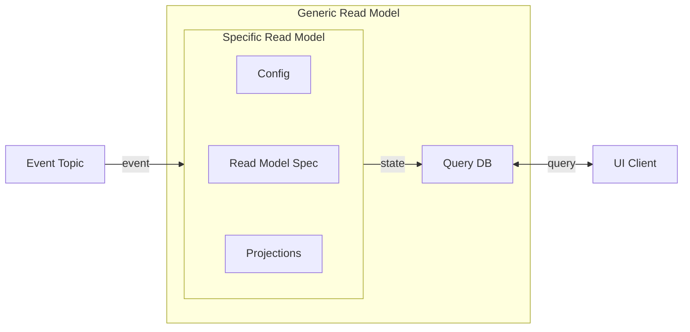

[For a short summary of a ReadModel, see Reventless Components Overview.](../reventless-components-overview.md#readmodel)



A Read Model's business logic is defined by it's [**Spec**](#read-model-spec), [**Projections**](#projections) and [**Config**](./config.md).

Events may trigger updates to the state of a Read Model. A Read Model may act on Events of several different [Aggregates](./aggregate.md). The logic how to react to Events is implemented in a [Projection](#projections) per Aggregate. A Read Model's state is persisted in the Query DB and can be made available to the API. The state is mutable (many events may change the data of the same state - one after another) and [eventual consistent](https://en.wikipedia.org/wiki/Eventual_consistency).

## Read Model Spec

### Example

```rescript title="Customer_ReadModelSpec.res" showLineNumbers
open Customer

let name = "Customer"

module Id = ReventlessSpec.Id.String

@decco
type state = {
  name: name,
  address: address,
}

let config = ReventlessSpec.ReadModel.Spec.config(
  ~indexes=[
    {
      index: "name",
      _type: "S",
      projectionType: #ALL,
    },
  ],
  (),
)

let subIdConfig = None
```

For information about `@decco` see [Decco annotation](../inner-workings/serialization.md#decco-annotation).

### Id

See [Id](./Id.md).

### name

A name is a string which must be unique in the scope of Read Model names in one [plugin](./plugin.md) and should describe the Read Model aptly. The name will also be used "behind the scenes".

### state

The record type (shape) of values, which will be persisted into the database (Query DB).

:::warning
This needs to be a [record type](../rescript-syntax.md#record-type). Other types lead to runtime errors upon storing the state into the database!
:::

### config

[`ReventlessSpec.ReadModel.Spec.config`](https://gitlab.com/reventless/reventless-universe/-/blob/master/packages/reventless-spec/src/components/ReadModel/ReadModel_Spec.res#L75) is a convenience function to create the actual config value. The function takes these optional arguments:

- `idResolvers`:
- `idsResolvers`:
- `indexes`: enable performant access to the Read Model via different ids - an additional id may be any field of the state type  
  An index is a record with these fields:
  - `index`: name of the state's field to act as an additional id, needs to be unique in all indexes of this Read Model
  - `_type`: [data type descriptor](https://docs.aws.amazon.com/amazondynamodb/latest/developerguide/HowItWorks.NamingRulesDataTypes.html#HowItWorks.DataTypeDescriptors) of the state's field type (e.g: `S`= string, `N` = number)
  - `projectionType`: [projection type](DDB-Type-Projection-ProjectionType), defines which fields will be copied to the index (and therefore accessable by queries using this index)  
    either:
    - `#KEYS_ONLY`: only the keys will be copied to the index
    - `#ALL`: all fields will be copied to the index
    - `#INCLUDE(array<string>)`: all keys and the specified fields will be copied to the index

### subIdConfig

TODO

## Projections

## Generate Read Model (AWS Defaults)

## Pulumi

## Advanced Applications of Read Model Spec Config

TODO: describe all possible variations of the Spec.config
