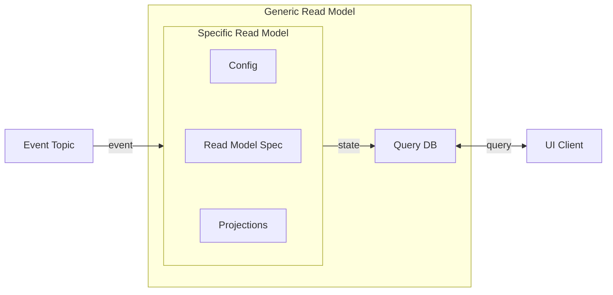
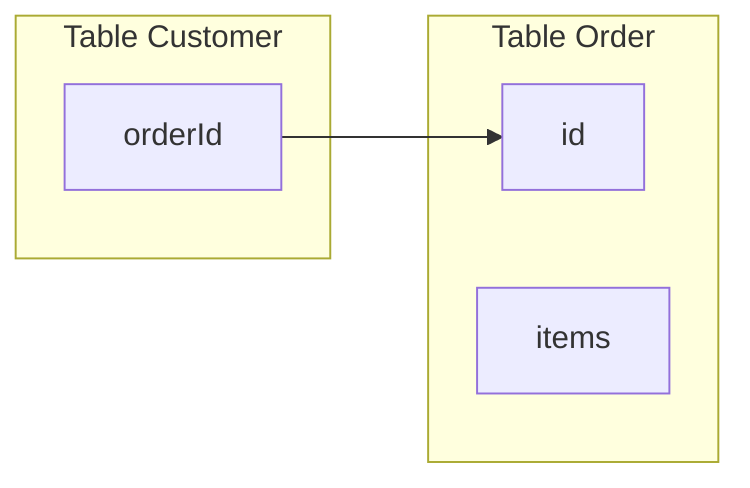

[For a short summary of a ReadModel, see Reventless Components Overview.](../reventless-components-overview.md#readmodel)



A Read Model's business logic is defined by it's [**Spec**](#read-model-spec), [**Projections**](#projections) and [**Config**](./config.md).

Events may trigger updates to the state of a Read Model. A Read Model may act on Events of several different [Aggregates](./aggregate.md). The logic how to react to Events is implemented in a [Projection](#projections) per Aggregate. A Read Model's state is persisted in the Query DB and can be made available to the [API](./api.md). The state is mutable (many events may change the data of the same state - one after another) and [eventual consistent](https://en.wikipedia.org/wiki/Eventual_consistency).

## Read Model Spec

### Example

```rescript title="Customer_ReadModelSpec.res" showLineNumbers
open Customer

let name = "Customer"

module Id = ReventlessSpec.Id.String

@decco
type state = {
  name: name,
  address: address,
}

let subIdConfig = None

let config = ReventlessSpec.ReadModel.Spec.config(
  ~indexes=[
    {
      index: "name",
      _type: "S",
      projectionType: #ALL,
    },
  ],
  (),
)
```

For information about `@decco` see [Decco annotation](../inner-workings/serialization.md#decco-annotation).

### Id

See [Id](./Id.md).

### name

A name is a string which must be unique in the scope of Read Model names in one [plugin](./plugin.md) and should describe the Read Model aptly. The name will also be used "behind the scenes".

### state

The record type (shape) of values, which will be persisted into the database (Query DB).

:::warning
This needs to be a [record type](../rescript-syntax.md#record-type). Other types lead to runtime errors upon storing the state into the database!
:::

### subIdConfig

In the Read Model, a sub id field can be used additionally to the id field. If you only provide the (primary) id value, then multiple items may be returned, sorted by the sub id value.

In this example, there is no sub id used, therefore `None` is provided

### config

[`ReventlessSpec.ReadModel.Spec.config`](https://gitlab.com/reventless/reventless-universe/-/blob/master/packages/reventless-spec/src/components/ReadModel/ReadModel_Spec.res#L75) is a convenience function to create the actual config value. The function takes these optional arguments:

- `indexes`: enable performant access to the Read Model via different ids - an additional id may be any field of the state type  
  An index configuration is a record with these fields:
  - `index`: name of the state's field to act as an additional id, needs to be unique in all indexes of this Read Model
  - `_type`: [data type descriptor](https://docs.aws.amazon.com/amazondynamodb/latest/developerguide/HowItWorks.NamingRulesDataTypes.html#HowItWorks.DataTypeDescriptors) of the state's field type (e.g: `S`= string, `N` = number)
  - `projectionType`: [projection type](DDB-Type-Projection-ProjectionType), defines which fields will be copied to the index (and therefore accessable by queries using this index)  
    either:
    - `#KEYS_ONLY`: only the keys will be copied to the index
    - `#ALL`: all fields will be copied to the index
    - `#INCLUDE(array<string>)`: all keys and the specified fields will be copied to the index
- other optional configurations see [Advanced Read Model Spec](#advanced-read-model-spec)

### Advanced Read Model Spec

### Example

```rescript title="Customer_ReadModelSpec.res" showLineNumbers
let subIdConfig = Some({
  subIdField: "subId",
  getSubId: state => state.subId,
})

let config = ReventlessSpec.ReadModel.Spec.config(
  ~idResolvers=[
    {
      source: {
        idField: "orderId",
        subId: NoSubId,
        resolvedField: "order",
      },
      target: {
        tableName: "Order",
        idField: "id"
      }
    }
  ],
  (),
)
```

### subIdConfig

In this example, there is a sub id field `subId` used, therefore the following fields are provided:

- `subIdField`: name of the sub id field
- `getSubId`: function to extract the sub id out of the state

### config

- `idResolvers`: Other Read Models can be referenced by id in the state . If you (additionally to the id) want to provide the data of that referenced Read Model over the [API](./api.md), you have to specify how to resolve those ids here.
  The idResolvers configuration is an array of records with these fields:
  - `source`: specification, which id has to be resolved, by providing these fields:
    - `idField`: name of the id field to be resolved
    - `subId`:
      - `Field(<fieldName>)`: field name for sub id
      - `Argument(<argumentName>)`: argument name (provided by query) to be used as sub id
      - `NoSubId`: no sub id
    - `resolvedField`: name of the field in the [API](./api.md) response data, where the referenced data is provided
  - `target`: specification, how to resolve the given source:
    - `tableName`: name of the table to get the resolved data from
    - `idField`: field name in the target table to match with source id
    - `subIdField`: (optional) field name of the target table to match with source sub id
    - `pluginName`: (optional) name of the plugin to find the given table. If not provided, the same plugin as the source is used
- `idsResolvers`: To resolve an array of reference ids (no sub ids supported) you can specify an array of records with these fields:
  - `source`: specification, which id has to be resolved, by providing these fields:
    - `idField`: name of the id field to be resolved
    - `resolvedField`: name of the field in the [API](./api.md) response data, where the referenced data is provided
  - `target`: specification, how to resolve the given source:
    - `tableName`: name of the table to get the resolved data from
    - `idField`: field name in the target table to match with source id

The following diagram depicts the relations between the Query DB tables for the given example:



Example result of `customer("1234")` API query:

```json
{
  "customer": {
    "id": "customer-1234"",
    "orderId" : "order-5678",
    "order": {
      "id: "order-5678",
      "items" :[]
    }
  }
}
```

## Projections

### Example

```rescript title="Customer_Projection.res" showLineNumbers
open ReventlessSpec.Message
open ReventlessSpec.Projection.Spec
open Customer_ReadModelSpec

module Mapping = Reventless.Projection.Mapping.Make(
  Customer,
  Customer_ReadModelSpec,
  {
    let map = ({event, id}) => {
      switch event {
      | Customer.Created({Customer.name: name, address}) => Create(id, {name, address})
      | AddressChanged(address) => Update(id, state => {...state, address})
      | NameChanged(name) => Update(id, state => {...state, name})
      | Deleted => Delete(id)
      | Unchanged => Ignore
      }
    }
  },
)

include Mapping
```

In order to update a Read Model by Events from an Aggregate, a Projection from that Aggregate to the Read Model must be provided.

You do so by calling the Reventless.Projection.Mapping.Make [functor](../rescript-syntax.md#functors) with the [Aggregate Spec](aggregate.md#aggregate-spec), the [Read Model Spec](#read-model-spec) and a `map` function to create a `Mapping` module. The `map` function receives the event, the id and the event meta data and returns an `action` that is applied to the Query DB. These actions are supported:

- **Single state**
  - Create:
    - `Create(<id>, <state>)`: Create new state if none exists
  - Update
    - `Update(<id>, <old state> => <new state>)`: Update existing state
    - `UpdateWithDefault(<id>, <default state>, <old state> => <new state>)`: Update existing state or use default if not existing
  - Set
    - `Set(<id>, <state>)`: Set fixed state
  - Delete
  - `Delete(<id>)`: Delete state
  - `DeleteIf(<id>, <state> => bool)`: Delete state (conditional)
- **Many States (different ids)**
  - Create:
    - `CreateMany([(<id>, <state>)])`: Create many new states if none exists
  - Update
    - `UpdateMany([<id>], (<id>, <old state>) => <new state>)`: Update many existing states
    - `UpdateManyWithDefault([<id>], <default state>, (<id>, <old state>) => <new state>)`: Update many existing states or use default if not existing
  - Set
    - `SetMany([<id>], <id> => <state>)`: Set many fixed states
  - Delete
  - `DeleteMany([<id>])`: Delete many states
  - `DeleteManyIf([<id>], <state> => bool)`: Delete many states (conditional)
- **MultiState (same id, different sub ids)**
  - Create:
    - `CreateMultiState(<id>, [<state>])`: Create multiStates (multiple sub states with same id)
  - Update
    - `UpdateMultiState(<id>, [<old state>] => [<new state>])`: Update multiState (Create/Update/Delete multiple sub states with same id)
- `Ignore`: Ignore event

## Generate Read Model (AWS Defaults)

```rescript title="Customer_ReadModel.res" showLineNumbers
module MappingTypes = Reventless.Projection.Mappings.Make(Customer_ReadModelSpec)
module Mappings = {
  module type Mapping = MappingTypes.Mapping
  let mappings: array<module(Mapping)> = [module(Customer_Projection)]
}

include ReventlessAws.ReadModel.Make(Config, Customer_ReadModelSpec, Mappings)
```

In the Mappings module you have to specify an array of all Projections for the ReadModel.

Finally the Read Model has to be generated by using the ReventlessAws.ReadModel.Make [functor](../rescript-syntax.md#functors) by providing the [Config](./config.md), the [Read Model Spec](read-model-spec) and the Mappings module.

## Pulumi

The Read Model's Pulumi root component is named in this pattern: `Spec.name` and has a type of `reventless:ReadModel`.
