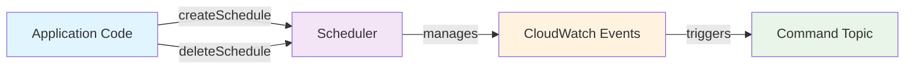
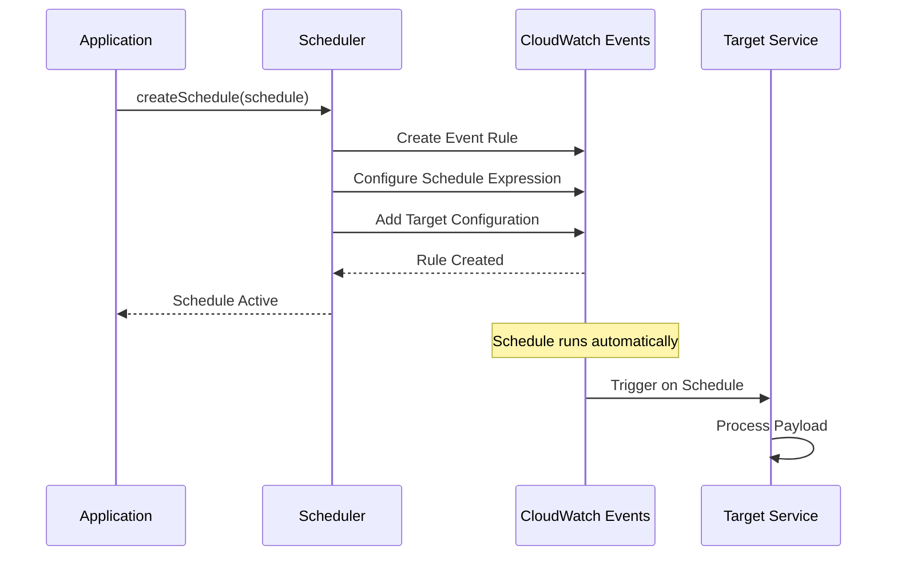
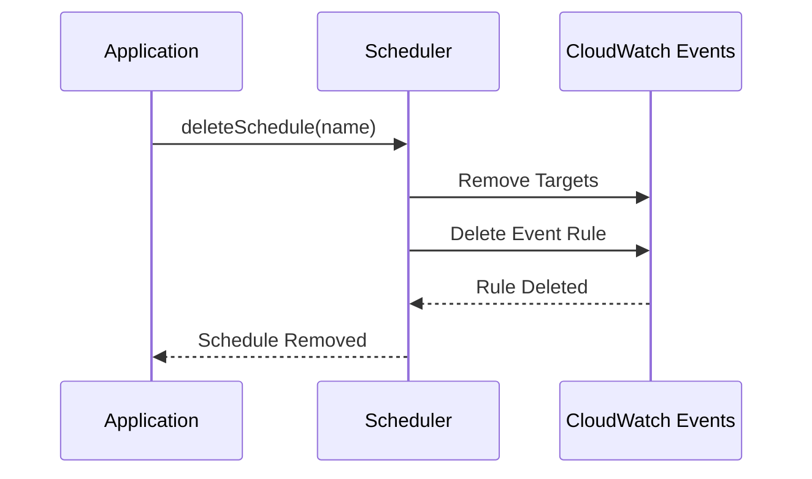
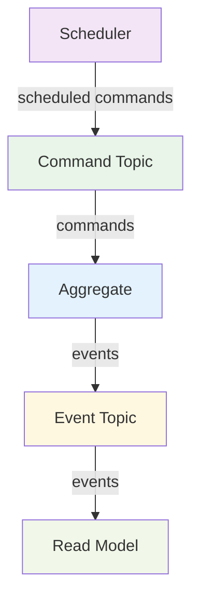

For a short summary of a Scheduler, see [Reventless Components Overview.](../component-overview.md#scheduler)

:::info Framework Implementation
This component follows the Reventless [Component Structure Pattern](../inner-workings/component-structure-pattern.md), using separate files for interface definitions ([`Scheduler.res`](../../reventless/src/components/Scheduler/Scheduler.res)), builder logic ([`Scheduler_Builder.res`](../../reventless/src/components/Scheduler/Scheduler_Builder.res)), and adapter interface ([`Scheduler_Adapter.res`](../../reventless/src/components/Scheduler/Scheduler_Adapter.res)).
:::

## Overview

The Scheduler component provides time-based command publishing capabilities, enabling scheduled workflows, periodic tasks, and cron-like event generation. It allows applications to create and manage schedules dynamically at runtime.



## Purpose and Responsibilities

- **Responsibility:** Manage time-based event scheduling and command publishing
- **In:** Schedule definitions with timing patterns and payloads
- **Out:** Scheduled events/commands published to configured targets

## Schedule Specification

The Scheduler uses a flexible schedule specification that supports various timing patterns:

### Schedule Types

```rescript
type rate =
  | Single(year, month, day, hour, minute)     // One-time execution
  | Minutes(int)                               // Every N minutes
  | Hours(int)                                 // Every N hours  
  | Days(int)                                  // Every N days
  | Daily(hour, minute)                        // Daily at specific time
  | Weekdays(hour, minute)                     // Monday-Friday at specific time
  | WeekdaysAndSaturday(hour, minute)          // Monday-Saturday at specific time

type schedule = {
  name: string,      // Unique identifier for the schedule
  rate: rate,        // Timing pattern
  payload: string,   // Data to publish when schedule triggers
}
```

### Example Schedule Definitions

```rescript
// Daily report generation at 9:00 AM
let dailyReport = {
  ReventlessSpec.Schedule.name: "daily-report",
  rate: Daily(9, 0),
  payload: `{"type": "GenerateReport", "reportType": "daily"}`,
}

// Cleanup task every 6 hours
let cleanupTask = {
  name: "cleanup-task", 
  rate: Hours(6),
  payload: `{"type": "CleanupTempFiles"}`,
}

// One-time reminder
let reminder = {
  name: "meeting-reminder",
  rate: Single(2024, 12, 25, 14, 30),
  payload: `{"type": "SendReminder", "meetingId": "abc123"}`,
}
```

## Usage Patterns

### Basic Scheduler Setup

```rescript
// In your plugin definition
module MyPlugin = {
  let scheduler = Reventless.Scheduler.make()
  
  // Access scheduler operations at runtime
  let scheduleOperations = scheduler.operations
}
```

### Runtime Schedule Management

```rescript
// Create a schedule dynamically
let createDailyBackup = async () => {
  let schedule = {
    ReventlessSpec.Schedule.name: "daily-backup",
    rate: Daily(2, 0), // 2:00 AM daily
    payload: `{"type": "StartBackup", "target": "database"}`,
  }
  
  await scheduler.operations.createSchedule([], schedule)
}

// Remove a schedule when no longer needed
let removeSchedule = async (scheduleName) => {
  await scheduler.operations.deleteSchedule([], scheduleName)
}
```

## Runtime Behavior

The Scheduler component operates through two main runtime operations:

### Schedule Creation Flow



### Schedule Deletion Flow



## Integration Points

The Scheduler integrates with other Reventless components to enable time-based workflows:

### Common Integration Patterns



### Integration with Command Topics

```rescript
// Scheduler publishes to CommandTopic for aggregate processing
let scheduleAggregateCommand = {
  name: "process-orders",
  rate: Hours(1),
  payload: `{"aggregateId": "order-processor", "command": "ProcessPendingOrders"}`,
}
```

### Integration with Event Topics

```rescript
// Scheduler can trigger event publication for system monitoring
let healthCheckSchedule = {
  name: "health-check",
  rate: Minutes(5),
  payload: `{"type": "HealthCheckEvent", "timestamp": "${Date.now()}"}`,
}
```

## Common Patterns

### Periodic Data Processing

```rescript
// Process batch data every hour
let batchProcessor = {
  name: "batch-processor",
  rate: Hours(1),
  payload: `{"type": "ProcessBatch", "batchSize": 1000}`,
}
```

### Business Hours Scheduling

```rescript
// Send daily reports only on weekdays
let businessReport = {
  name: "business-report",
  rate: Weekdays(17, 0), // 5:00 PM on weekdays
  payload: `{"type": "GenerateBusinessReport"}`,
}
```

### Cleanup and Maintenance

```rescript
// Daily cleanup at midnight
let dailyCleanup = {
  name: "daily-cleanup",
  rate: Daily(0, 0),
  payload: `{"type": "CleanupExpiredData"}`,
}
```

### Dynamic User Schedules

```rescript
// Create user-specific reminder schedules
let createUserReminder = async (userId, reminderTime) => {
  let schedule = {
    name: `user-reminder-${userId}`,
    rate: Single(reminderTime.year, reminderTime.month, reminderTime.day, 
                reminderTime.hour, reminderTime.minute),
    payload: `{"type": "UserReminder", "userId": "${userId}"}`,
  }
  
  await scheduler.operations.createSchedule([], schedule)
}
```

## Pulumi

The Scheduler component is deployed as infrastructure that creates the necessary IAM roles and permissions for CloudWatch Events management. The actual event rules are created dynamically at runtime through the component's operations.

```rescript
// Deployment creates IAM role with CloudWatch Events permissions
let scheduler = Reventless.Scheduler.make(~opts=pulumiOpts)

// Runtime operations use the deployed role to manage schedules
let operations = scheduler.outputs.resource
```

## AWS Implementation

For detailed AWS-specific implementation including CloudWatch Events integration, IAM role configuration, and runtime operations, see [ScheduledPublisher → EventBridge Scheduler](../aws-adapters/scheduledpublisher.md).