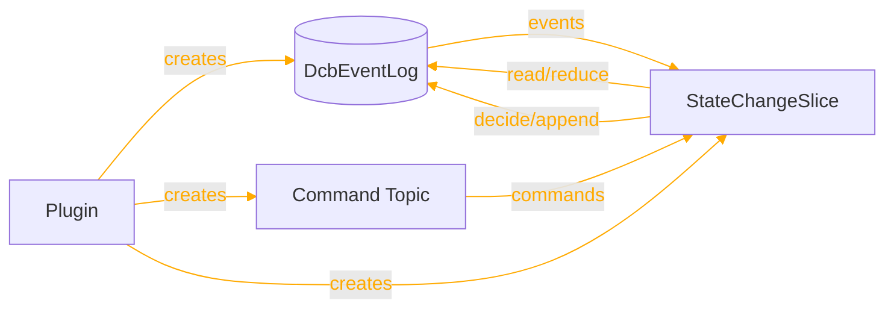
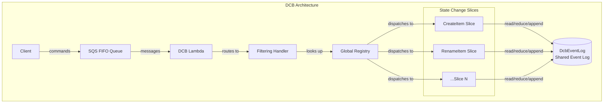
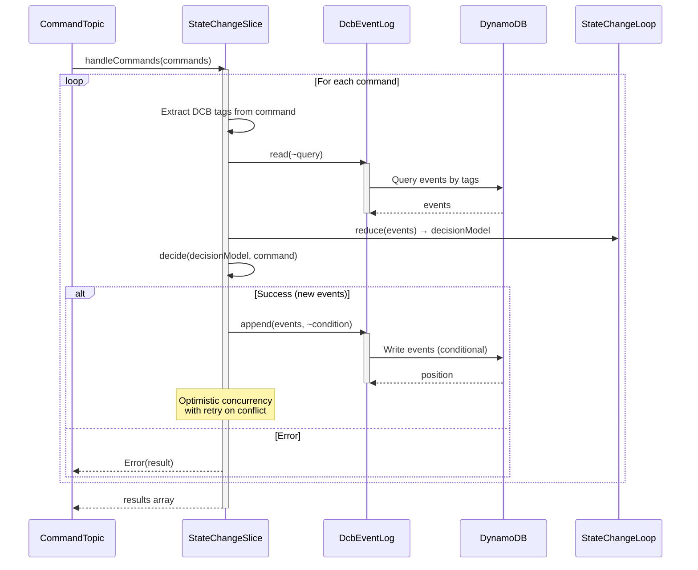

For a short summary of StateChangeSlice, see [Reventless Components Overview.](../component-overview.md#statechangeslice)

:::info Framework Implementation
This component follows the Reventless [Component Structure Pattern](../inner-workings/component-structure-pattern.md), using separate files for interface definitions ([`StateChangeSlice.res`](../../reventless/src/components/StateChangeSlice/StateChangeSlice.res)), builder logic ([`StateChangeSlice_Builder.res`](../../reventless/src/components/StateChangeSlice/StateChangeSlice_Builder.res)), and callback/handler logic ([`StateChangeSlice_Callback.res`](../../reventless/src/components/StateChangeSlice/StateChangeSlice_Callback.res)).
:::

## Overview



The **StateChangeSlice** is a DCB (Dynamic Consistency Boundary) component that processes commands against a shared event-sourced state. It implements a decision model pattern where commands are evaluated against accumulated events to produce new events or errors.

## Purpose and Responsibilities

- **Responsibility**: Process commands using a decision model built from event history; append new events to the shared DcbEventLog; handle optimistic concurrency conflicts
- **In**: Commands from CommandTopic (routed by command type)
- **Out**: Events to DcbEventLog (via append operation)
- **Key Feature**: Multiple slices can coexist in a single plugin, each handling different command types but sharing the same event log

## Relationship with DCB

StateChangeSlice is a core component of the DCB architecture:



## Component Spec

The StateChangeSlice component requires a spec that defines its name, command type, error type, and decision logic:

```rescript
module type Spec = {
  let name: string

EventLogSpec:  module Dcb DcbEventLog.Spec

  @schema
  type command

  @schema
  type error

  type decisionModel
  let initialDecisionModel: decisionModel

  let reduce: (decisionModel, DcbEventLogSpec.event) => decisionModel
  let decide: (decisionModel, command) => result<array<DcbEventLogSpec.event>, error>
}
```

### Spec Fields Explained

| Field | Type | Description |
|-------|------|-------------|
| `name` | `string` | Unique identifier for this slice |
| `DcbEventLogSpec` | `module(DcbEventLog.Spec)` | Reference to the shared event log spec |
| `command` | `@schema type` | Command type using `@schema` ppx for auto-generated schema |
| `error` | `@schema type` | Error type for command processing failures |
| `decisionModel` | `type` | The state type built from accumulated events |
| `initialDecisionModel` | `decisionModel` | Starting state for new aggregates/entities |
| `reduce` | `(decisionModel, event) => decisionModel` | Fold function to accumulate events into state |
| `decide` | `(decisionModel, command) => result<events, error>` | Business logic to produce events from command |

## Runtime Behavior

### Command Processing Flow



### Optimistic Concurrency Control

StateChangeSlice implements optimistic concurrency to handle concurrent command processing:

```rescript
// The callback reads the current head position
let readResult = await dcbEventLog.read(~query)

// Uses the position as a condition for append
let condition: DcbTag.appendCondition = {
  query,
  after: ?readResult.headPosition,
}

// If another process appended between read and write, retry
switch await dcbEventLog.append(newEvents, ~condition) {
| Ok(position) => // Success
| Error(err) =>
  if retries > 0 {
    // Retry with fresh read
    await attempt(~retries=retries - 1)
  } else {
    // Exhausted retries
    Error("conflict: retries exhausted")
  }
}
```

**Key points:**
- Reads event log state before processing
- Records `headPosition` (sequence position of last event)
- Uses conditional append: only succeeds if no events were added after `headPosition`
- Retries up to 3 times on conflict
- Provides detailed logging for debugging

## Error Handling

### Error Types

StateChangeSlice defines error types for business logic failures:

```rescript
@schema
type error =
  | ItemNotFound
  | ItemAlreadyExists
  | InsufficientStock(int)  // With payload
  | ValidationError(string)
```

### Error Processing

Errors are:
1. Returned from the `decide` function
2. Logged with full context (slice name, command, error details)
3. Converted to JSON using the error schema
4. Passed back to the caller via CommandTopic reference

```rescript
| Error(error) =>
  let errorJson = error->S.reverseConvertToJsonOrThrow(Spec.errorSchema)->JSON.stringify
  Logger.error(~loc=__LOC__, `StateChangeSlice(${Spec.name}): decide error`, errorJson)
  Error(errorJson)
```

### Conflict Resolution

When concurrent modifications cause conflicts:

```rescript
| Error(err) =>
  if retries > 0 {
    Logger.info(~loc=__LOC__, `StateChangeSlice(${Spec.name}): conflict, retrying`, err)
    await attempt(~retries=retries - 1)
  } else {
    Logger.error(
      ~loc=__LOC__, 
      `StateChangeSlice(${Spec.name}): conflict, retries exhausted`, 
      err,
    )
    Error("conflict: retries exhausted")
  }
```

## Pulumi Outputs

```rescript
type outputs = {
  resources: array<ReventlessSpec.Adapter.resource>,
}
```

The StateChangeSlice reuses resources from the shared DcbEventLog:
- DynamoDB table for event storage
- SNS topic for event publishing
- Related IAM roles and policies

## Related Components

- **[DcbEventLog](./dcbeventlog.md)** - Shared event log for DCB slices
- **[CommandTopic](./commandtopic.md)** - Command routing and filtering
- **[Plugin](./plugin.md)** - Hosts DCB slices and creates shared infrastructure
- **[EventCollector](./eventcollector.md)** - Consumes events from DcbEventLog
- **[ReadModel](./readmodel.md)** - Builds read models from DcbEventLog events
- **[Event Modeling: Usage](./event-modeling-statechangeslice-usage.md)** - How to use StateChangeSlice in your application

## AWS Implementation

For detailed implementation with AWS services (DynamoDB for storage, SNS for publishing, SQS for commands), see [StateChangeSlice AWS Adapter Documentation](../aws-adapters/statetopic.md) (reuses EventLog infrastructure).
