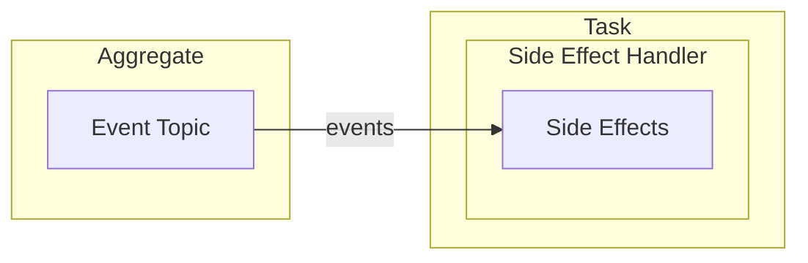

The Task's business logic is defined in it's setup function. Contrary to the Command/Event paradigm used across the other components, the Task is free to be implemented in any way. Often Tasks are used to interact with third party systems (e.g. API calls, upload/download).

In the setup function, resources may be instantiated using [Pulumi](../inner-workings/pulumi.md). Additionally a Side [Effect Handler](#side-effect-handler) can react to events.

## Creating a Task

While most other Reventless components use [Functors](../rescript-syntax.md#functors), every task is created by calling `Reventless.Task.make`. A task name and a setup function needs to be passed into the make function:

```rescript
let name = "ProfilePictureTask"
let setup = ... // TODO
//highlight-start
let make: Reventless.Task.maker = Reventless.Task.make(~name, ~setup)
//highlight-end
```

### Task Setup

The setup function is run during _deploy time_ by the Pulumi runtime. An example why that might be useful is to create external resources. Code that needs to be executed at runtime needs to be deployed as a function as a service (e.g. Lambda on AWS) or another cloud resource.

```rescript
let setup = (.
  queryEngine: ReventlessSpec.QueryEngine.t,
  scheduler: ReventlessSpec.Scheduler.t,
  publishCommands: Reventless.Task.publishCommands,
  queryBucketName: Reventless.Task.queryBucketName,
  allEventTopics: ReventlessSpec.EventTopic.allOutputs,
  opts: Pulumi.CustomResourceOptions.t,
) => {
// implementation
}
```

All arguments of the setup function are provided by the framework, when the Task is actually created. The developer is free to use them (or not) as needed.

:::warning
The setup function is called during deploy time by Pulumi. The functions provided as arguments (`queryEngine`, `scheduler`, `publishCommands`, `queryBucketName`) can only be called during runtime inside of a cloud resource created by the bucket (e.g. Lambda function)
:::

#### queryEngine

The `queryEngine` provides two functions (`scan` & `query`) to send requests to the Plugin's [Read Models](./readmodel.md) during _runtime_.

##### query

Efficiently retrieve all entries for a single id, which (optionally) satisfy given filter criteria.

:::note
You should use query over scan whenever possible, since it's much more performant.
:::

###### example

TODO: example

##### scan

Retrieve all entries in the Read Model, which satisfy the given filter criteria.

#### scheduler

Provides the functions (`createSchedule` & `deleteSchedule`) of the Scheduler, which is created in the [Config](./config.md).

##### createSchedule

This function takes several [resources](../inner-workings/resources.md#adapter-resources) and a schedule [record](../rescript-syntax.md#record-type).

- The `resources` will be used as the target for the scheduler.
- The `schedule` defines the Scheduler's name, rate (how often / when to trigger) and payload (json to trigger the resource with - e.g. hardcoded serialized command).

:::warning
The current AWS Scheduler Adapter (`ReventlessAws.ScheduledPublisher.CloudWatchEvents`) only uses the first element of the resources array and discards all other resources!
:::

###### example

```rescript
// inside of a cloud resource in run-time
let promise = { // promise<unit>
  open ReventlessSpec.Schedule

  createSchedule(
    [queue],  // queue was created somewhere else during deploy-time
    {
      name: 'example',
      rate: Daily(8, 0),
      payload: `{ "id": "0db74314-c3e0-4ef8-bf0e-3b19da3852e2", "event": ["SendDailyUpdateNotification", "2024-08-24"] }`
    }
  )
}
```

##### deleteSchedule

Schedulers can be deleted using the deleteSchedule function (TODO: When would this actually be used during deployment? Or is this just a runtime thing?)

TODO

#### publishCommands

Using the publishCommands function, a command can be published to a target Aggregate. The command sent is placed into the Command Topic of the Aggregate. 

TODO

#### queryBucketName

TODO

#### opts

TODO

## Example

```rescript title="CustomerTask.res" showLineNumbers
/**
  Assumed process:
    - (fictional) UI offers upload of profile picture (directly to S3)
      - uploaded file needs to adher to this convention: <customerId>.<fileExtension>
    - lambda triggered by file upload (or deletion) publishes `ChangeProfilePicture` command to customer aggregate
*/
// highlight-start
let taskName = "ProfilePictureTask"
// highlight-end

let idFromKey = key => key->Js.String2.split(".")->Belt.Array.getExn(0)

let publishCommand = (publishCommands, id, command) => {
  publishCommands(.
    Customer.name,
    [
      {
        Reventless.Message.id,
        meta: Reventless.Message.generateMeta(~service=Customer.name, ~user=taskName, ()),
        commandJson: command->Customer.command_encode,
        delay: None,
      },
    ],
  )
}

// highlight-start
let setup = (.
  _queryEngine: ReventlessSpec.QueryEngine.t,
  _scheduler: ReventlessSpec.Scheduler.t,
  publishCommands: Reventless.Task.publishCommands,
  _queryBucketName,
  _allEventTopics,
  opts,
) => {
// highlight-end
  let bucket = {
    open PulumiAws.S3.Bucket
    make(
      ~name=taskName ++ "Bucket",
      ~args=Args.make(
        ~corsRules=[
          CorsRule.make(
            ~allowedHeaders=["*"],
            ~allowedMethods=["HEAD", "GET"],
            ~allowedOrigins=["*"],
            ~exposeHeaders=[
              "x-amz-server-side-encryption",
              ">x-amz-request-id",
              "x-amz-id-2",
              "ETag",
            ],
            ~maxAgeSeconds=3000,
          ),
        ]->Pulumi.Input.make,
        (),
      ),
      ~opts,
      (),
    )
  }

  let callback = async (event, _) => {
    // retrieve relevant data from lambda event (AWS Infra Event - NOT event defined by codebase)
    let record = event["_Records"][0]
    let eventName = record["eventName"]
    let key = Js.Global.decodeURIComponent(record["s3"]["_object"]["key"]) // s3 object key
    // calculate id - by convention the image file has to be named like this: <customerId>.<fileExtension>

    // for possible event names, see: https://docs.aws.amazon.com/AmazonS3/latest/userguide/notification-how-to-event-types-and-destinations.html#supported-notification-event-types
    let isDeletion = eventName->Js.String2.indexOf("ObjectRemoved") >= 0
    let isCreation = eventName->Js.String2.indexOf("ObjectCreated") >= 0

    Js.log2(`${taskName} triggered:`, key)
    Js.log2("eventName:", eventName)
    Js.log4("isDeletion: ", isDeletion, "isCreation:", isCreation)

    if isCreation {
      let id = idFromKey(key)
      switch await publishCommand(publishCommands, id, Customer.ChangeProfilePicture(Some(key))) {
      | result => Reventless.Logger.info(~loc=__LOC__, "success on publishCommand", result)
      | exception Js.Exn.Error(e) =>
        Reventless.Logger.error(~loc=__LOC__, "exception on publishCommand", e)
      }
    } else if isDeletion {
      let id = idFromKey(key)
      switch await publishCommand(publishCommands, id, Customer.ChangeProfilePicture(None)) {
      | result => Reventless.Logger.info(~loc=__LOC__, "success on publishCommand", result)
      | exception Js.Exn.Error(e) =>
        Reventless.Logger.error(~loc=__LOC__, "exception on publishCommand", e)
      }
    } else {
      Reventless.Logger.warn(
        ~loc=__LOC__,
        "no command published",
        `eventName: ${eventName}, isDeletion: ${isDeletion->Js.String2.make}, isCreation: ${isCreation->Js.String2.make}`,
      )
    }
    // TODO: meaningful error handling of promises etc.
  }

  let handler = {
    open PulumiAws.Lambda.CallbackFunction
    make(
      ~name=taskName,
      ~args=Args.make(
        ~callback,
        ~memorySize=4096->Pulumi.Input.make,
        ~timeout=600->Pulumi.Input.make,
        (),
      ),
      ~opts,
      (),
    )
  }

  bucket
  ->PulumiAws.S3.Bucket.onObjectCreated(~name=taskName ++ "Created", ~handler, ~opts, ())
  ->ignore
  bucket
  ->PulumiAws.S3.Bucket.onObjectRemoved(~name=taskName ++ "Deleted", ~handler, ~opts, ())
  ->ignore
  //highlight-start
  {
    "bucket": Some(bucket),
    "name": taskName,
    "sideEffectHandler": None,
  }
  //highlight-end
}

//highlight-start
let make: Reventless.Task.maker = Reventless.Task.make(~name=taskName, ~setup)
//highlight-end
```

First, we define a name for the function. For now, ignore the idFromKey and publishCommand functions.
Then as usual, the setup function is defined. Note that unused parameter variables can be underscored to get rid of compiler warnings.

In this setup function, an AWS S3 Bucket gets created using pulumi. By defining a callback and a handler, we can start a lambda and execute code when a file is placed into the bucket.

Note the publishCommand function in the callback which will send a command to an aggregate for the given id. This is how reventless can observe events coming from external systems.

Using a Task to generate and use Cloud resources is not the only way how a Task can be used. Other common use cases could be:

- Scheduling
- HTTP Calls
- DNS Routing
- etc.

## Side Effect Handler

TODO: Move to own File?



TODO

In the ProfilePictureTask example we have seen how external Systems can act as Command or Event Sources in Reventless. But what about the other way around? For this, we can make use of a Side Effect Handler. It registers on an Event Topic and in response to an Event, executes code.

:::warning
Bear in mind that Read Models and Tasks are eventual consistent.
TODO
:::

### createSchedule

TODO:

Provided function to schedule a payload to be sent directly to this Side Effect Handler.
