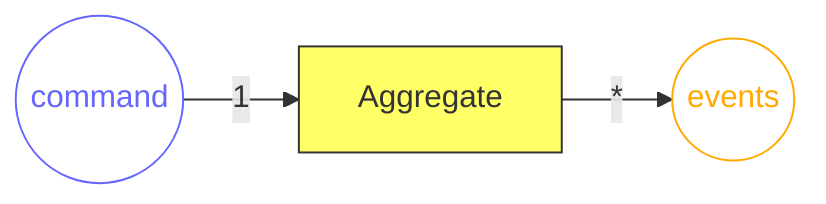
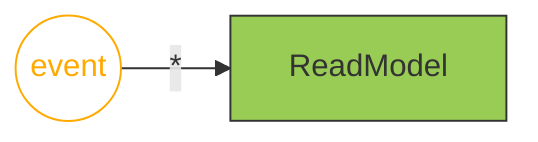
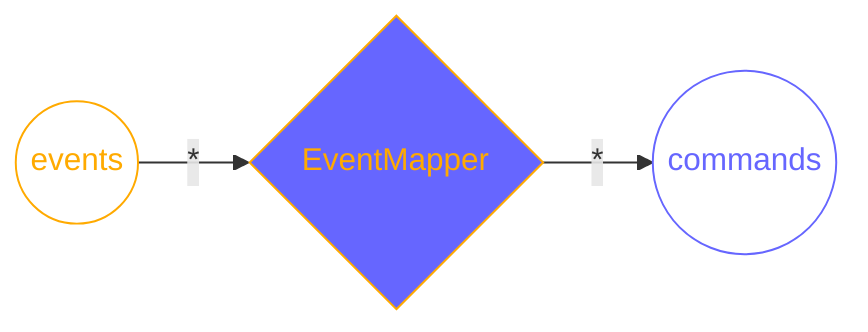
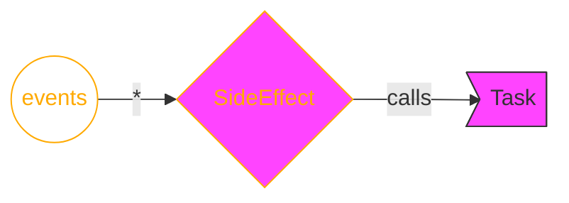

# Get Started

## Basics

When implementing a system based on Reventless you should only think about `commands` and `events`. These provide easy to understand reasoning for anything happening.  
Great care should go into naming these according to the [ubiquitous language](https://www.martinfowler.com/bliki/UbiquitousLanguage.html) of the project / context.  
`Command`s are usually named in imperative, while `event`s are usually named in past tense. (e.g: doSomething vs somethingDone).

Since `command`s are only a formulated desire for change, they can potentially be rejected with an `error`. `Event`s are absolute facts and the result of `command`s, which will never change once issued.

## Reventless Components

### Aggregate

[`Aggregate`s](https://www.martinfowler.com/bliki/DDD_Aggregate.html) are the entities in your system.  
An `Aggregate` receives `command`s and outputs `event`s (or `error`s) based on the current state. (`(command + current state) => (new event or error)`). A single `command` can result in *any number* of `event`s.  
The current `state` will never be persisted to storage. Only the Aggregate's events will be stored. If a new `command` gets handled the actual `state` will be calculated based on the previous `event`s. ([Event-Sourcing](https://martinfowler.com/eaaDev/EventSourcing.html)) Because the `state` won't be persisted, you should only put data there, you *really* need for validating incoming `command`s.

- **responsibility**: ensure only valid commands create events having the necessary information attached
- **in**: `command`
- **out**: `event`s

### ReadModel

A `ReadModel` is a queryable projection based on events per `Aggregate` id. It takes `event`s and persists a state calculated on the previous state and the incoming event to some storage.

Usually a `ReadModel` doesn't have any outputs, although some infrastructure services may offer "lower level" data, which may be used in some provider specific `adapter`s.

- **responsibility**: create and persist state to be queried
- **in**: `event`s
- **out**: -

### EventMapper

One `EventMapper` maps `event`s of (potentially multiple `Aggregate`s) to `command`s for a single `Aggregate`. This is always needed if some occurrence in one `Aggregate` needs to trigger a reaction for another.

- **responsibility**: generate `commands` for a given `aggregate` based on (multiple) other `aggregate`s' `events`
- **in**: `event`s
- **out**: `command`s

### Task

`Task`s are the "escape-hatch" of the dogmatic command/event paradigm. They allow to implement logic loosely coupled to events (or even not at all). An example would be some calculation, which needs to be done in some specific interval.

Another intention of `Task`s is to interface with the outside world (e.g. other systems). An example of this would be up-/downloads or calling foreign APIs.

`Task`s may be implemented provider specific, since it's not possible to provide adapter for any possible scenario.

#### SideEffectHandler

A `SideEffectHandler` is similar to an `EventMapper`, but targeting `Task`s (and functions) outside of the command/event paradigm. For example: calling a foreign API everytime a specific `event` occurs.
It takes `event`s of (potentially multiple) `Aggregate`s as input and calls functions dependent on the `event`.

- **responsibility**: execute `functions` of a given `task` based on (multiple) `aggregate`s' `events`
- **in**: `event`s
- **out**: -

### Plugin

A `Plugin` usually corresponds to a [`Bounded Context`](https://www.martinfowler.com/bliki/BoundedContext.html) in `DDD` (Domain Driven Design) as well to a single deployment unit. A `Plugin` is defined by it's configuration (name, version, etc) and it's child-components (`Aggregate`s, `ReadModel`s, `Task`s, etc)

### ExtensionPoint

`ExtensionPoint`s (together with their relatign `Extension`s) are the mechanics to share data between several `Plugin`s. The `ExtensionPoint`'s `Spec` defines the `event`s, which will be sent and the `command`s which will be received by it.

#### ExtensionPointMapping
An `ExtensionPointMapping` defines a `Plugin`s border. It maps `event`s from single `Aggregate`s to `event`s of the `ExtensionPoint`. These are totally different events (and therefore types), although they may seem similar. This is done to decouple outside dependencies from changes of the plugin and provide a simple interface to interact with.
A `command` sent to the `ExtensionPoint` will be mapped to a specific `command` inside the plugin by this component.

- **responsibility**: map plugin specific command & events to those of the `ExtensionPoint`
- **in**: `Plugin` sepcific `event`s (from inside the `Plugin`) / `ExtensionPoint` command`s (from `Extension`s)
- **out**: `ExtensionPoint` `event`s (to `Extension`s) / `Plugin` specific `command`s (to components inside the `Plugin`)

### Extension

> TODO

## Development Setup

### Install VS Code

- install [Visual Studio Code](https://code.visualstudio.com)
- install [reason-vscode](https://marketplace.visualstudio.com/items?itemName=jaredly.reason-vscode) (extension id: `jaredly.reason-vscode`)

### Install Node

- install [Node 12.x](https://nodejs.org/download/release/latest-v12.x/) (as of this writing, this version is the current LTS version in maintainance untill 30.04.2022)

### Initialize a new Project

Run `npm init` in the directory you want to create the new project and answer all questions.

### Install Dependencies

Run `npm i @bs-platform@5.2.1 @pulumi/pulumi @pulumi/aws @reventless/reventless-spec` inside your project directory.

### Choose a Cloud Provider

The Reventless-Framework is cloud-provider agnostic. Therefore there is a different package per provider, which contains pre-configured default components and the necessary adapters to configure the components yourself when needed.  
The packages are called `@reventless/reventless-<providerName>` (e.g. `@reventless/reventless-aws`)

> Currently we support only AWS out of the box, but plan to increase the supported provider in the future.

Choose the according package and install it by running e.g. `npm i @reventless/reventless-aws` inside your project directory.

### Core- & API-Stack

A [`Stack`](https://www.pulumi.com/docs/intro/concepts/stack/) is the actual deployment unit used by our infrastructure as code tool of choice [Pulumi](https://www.pulumi.com).  
The foundation of any platform built using Reventless is a Core-Stack. This is the central piece providing the necessary functionalities for `Plugins` to interact with each other.

> **TODO**: complete this area and below!

## Create a new Plugin

### `Plugin`

Deployment-unit

### `Aggregate`

### `ReadModel`

#### Update API Schema

### `Aggregate` #2

### `EventMapper`

Aggregate1.event >> EventMapper >> Aggregate2.command

### `Task`
