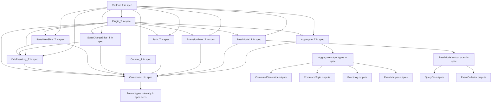

# Plan: Move Platform to Reventless Spec

## Goal

Application developers should only depend on `reventless-spec`. The composition root is the only place that imports `reventless-aws`, and `reventless` should be a transitive dependency only.

**Current state:** Application code must depend on `reventless` for `Platform.T`, `Behavior.T`, `EventMapper.Mappings`, and all component output types (`Aggregate.T`, `ReadModel.T`, etc.).

**Target state:** Application code depends only on `reventless-spec` for everything — specs, behaviors, mappings, AND plugin assembly. Only `index.res` (the composition root) imports `reventless-aws`.

---

## What Is Holding Us Back

### The Core Problem: Component Output Types

The current [`Platform.T`](packages/reventless/src/Platform.res:19) in `reventless` defines builder functors that return component output types like [`Aggregate.T`](packages/reventless/src/components/Aggregate/Aggregate.res:34), [`ReadModel.T`](packages/reventless/src/components/ReadModel/ReadModel.res:13), etc. These output types contain:

1. **`Component.t<...>`** — the abstract component wrapper type from [`Component.res`](packages/reventless/src/components/Component.res:1), which uses `Pulumi.Output.t` for operations and `Pulumi.ComponentResource` for construction
2. **Internal adapter module types** — e.g., `AggregateRuntimeBuilder: AggregateRuntime_Builder.T` in `Aggregate.T`, `EventCollectorRuntimeBuilder: EventCollectorRuntime_Builder.T` in `ReadModel.T`
3. **Pulumi infrastructure types** — `Pulumi.ComponentResource.options` in `make` signatures, `Pulumi.Output.t<Scheduler.operations>` in `Plugin.T.make`

### Specific Blockers

| Blocker | Where | Why it matters |
|---------|-------|----------------|
| `Component.t<...>` type | Used by every component output type | Wraps Pulumi resource, uses `Pulumi.Output.t` for operations |
| `AggregateRuntimeBuilder` in `Aggregate.T` | [`Aggregate.res:36`](packages/reventless/src/components/Aggregate/Aggregate.res:36) | Internal adapter type, not needed by app developers |
| `EventCollectorRuntimeBuilder` in `ReadModel.T` | [`ReadModel.res:15`](packages/reventless/src/components/ReadModel/ReadModel.res:15) | Internal adapter type |
| `Pulumi.ComponentResource.options` in `make` | Every component `T.make` signature | Infrastructure concern |
| `Pulumi.Output.t<Scheduler.operations>` in `Plugin.T.make` | [`Plugin.res:47`](packages/reventless/src/components/Plugin/Plugin.res:47) | Scheduler is infrastructure |
| `Counter.T` in `EventMapper.Mappings` | [`EventMapper.res:31`](packages/reventless/src/components/EventMapper/EventMapper.res:31) | Counter has Pulumi types in its `make` |
| `Plugin.DcbSpec` references `StateChangeSlice.T` and `StateViewSlice.T` | [`Plugin.res:29-30`](packages/reventless/src/components/Plugin/Plugin.res:29) | These T types have `Component.t` and `DcbEventLog.component` |
| `type api` and `type role` in `Aggregate.T`, `ReadModel.T`, `Plugin.T` | Various | Abstract types that get concretized to AWS-specific types |

### The Subtyping Problem

Even if we define simplified abstract output types in `reventless-spec`, the concrete `Plugin.T.make` in `reventless` needs `array<module(Aggregate.T)>` — the full type with `AggregateRuntimeBuilder`, not a simplified version. A module satisfying `Aggregate.T` also satisfies a simplified `Aggregate_Output.T`, but **not vice versa**. So the concrete plugin builder cannot accept the abstract type.

---

## Approach Analysis

### Approach A: Abstract Output Types in Spec

**Idea:** Define minimal output module types in `reventless-spec` that strip internal details. `Platform.T` in spec uses these abstract types.

```rescript
// reventless-spec/src/components/Aggregate_Output.T
module type T = {
  module Spec: Aggregate.Spec
  // No AggregateRuntimeBuilder, no Pulumi types
}
```

**Pros:**
- Keeps `reventless-spec` clean — no Pulumi dependency growth
- Application code sees only what it needs

**Cons:**
- **Fatal flaw:** `Plugin.T.make` needs `array<module(Aggregate.T)>` with the full type. If `Platform.T` returns `Aggregate_Output.T`, the plugin builder cannot use it. This requires either:
  - Rewriting `Plugin_Builder` to accept abstract types (massive refactoring)
  - Using unsafe coercions (fragile, defeats type safety)
- Two parallel type hierarchies to maintain
- Structural subtyping in OCaml/ReScript module types is limited — you cannot easily upcast

**Verdict: Not feasible** without fundamentally restructuring how Plugin assembly works.

### Approach B: Move Component Output Types to Spec

**Idea:** Move `Component.t`, all component output types, and their dependencies to `reventless-spec`.

**What would need to move:**
- `Component.t<...>` — the abstract component wrapper
- `Component.res` — the JS interop for Pulumi ComponentResource
- `ComponentType.res` — component type enum
- All component output types: `Aggregate.T`, `ReadModel.T`, `Plugin.T`, `ExtensionPoint.T`, `Extension.T`, `Task.T`, `Counter.T`, `StateChangeSlice.T`, `StateViewSlice.T`, `DcbEventLog.T`
- Supporting types: `EventTopic.outputs`, `CommandTopic.outputs`, `EventCollector.outputs`, `QueryDb.outputs`, `Scheduler.operations`, `EventLog.outputs`, `Heartbeat.outputs`
- Adapter types: `Runtime.environment`, `Runtime.eventHandler`, `AggregateRuntime_Builder.T`, `EventCollectorRuntime_Builder.T`
- `EventMapper.Mappings`, `ExtensionPoint.Mappings`

**Pros:**
- Complete solution — `Platform.T` can live in spec
- No type compatibility issues
- Single source of truth

**Cons:**
- **Massive scope:** Essentially moves most of `reventless` into `reventless-spec`
- `reventless-spec` would need `Pulumi.Output.t`, `Pulumi.ComponentResource`, `Pulumi.Resource.t` — it already has `rescript-pulumi-pulumi` as a dependency, but the surface area grows significantly
- Blurs the line between spec and implementation — `AggregateRuntimeBuilder` is an internal adapter concern, not a developer-facing spec
- `reventless` becomes a thin shell with only builder implementations

**Verdict: Technically possible but defeats the purpose** of having a clean spec package. Moving internal adapter types like `AggregateRuntimeBuilder.T` to spec pollutes the developer-facing API.

### Approach C: Hybrid — Restructure Component Types with Abstract Module Types (Recommended)

**Idea:** Restructure component output types to separate the **developer-facing surface** from **internal implementation details**, then move only the developer-facing parts to spec. Use OCaml's abstract module types within `Platform.T` to hide internals.

The key insight is that `Plugin.T.make` doesn't actually need `AggregateRuntimeBuilder` from the application developer's perspective — it only needs it internally. We can restructure `Plugin.T.make` to accept a **simplified component type** that contains only what the plugin assembly needs.

#### What the Plugin Actually Needs from Components

Analyzing [`Plugin_Builder.res`](packages/reventless/src/components/Plugin/Plugin_Builder.res:31):

From **Aggregate**: `Spec.name`, `make(~api, ~opts)`, and the resulting `component` (for `Component.outputs` and `Component.operations`)
From **ReadModel**: `Spec.name`, `make(~api, ~apiRole, ~allEventTopics, ~opts)`, and the resulting `component`
From **ExtensionPoint**: `make(~aggregateResources, ~publishToAggregates, ~scheduler, ~queryEngine, ~resourceNaming, ~opts)`
From **Task**: `Spec.name`, `make(~queryBucketName, ~scheduler, ~publishToAggregates, ~queryEngine, ~resourceNaming, ~allAggregates, ~opts)`

The `AggregateRuntimeBuilder` and `EventCollectorRuntimeBuilder` are used **inside** the aggregate/readmodel builders, not by the plugin assembly code.

#### The Restructuring

**Step 1:** Define component output types in `reventless-spec` WITHOUT internal adapter modules:

```rescript
// reventless-spec/src/components/Aggregate_T.res
module type T = {
  module Spec: Aggregate.Spec
  type api
  let make: (~api: api, ~opts: Pulumi.ComponentResource.options=?) => component
}
```

Where `component` is defined as an abstract type in spec that wraps the Pulumi component.

**Step 2:** The existing `Aggregate.T` in `reventless` becomes a **superset** that includes the internal fields:

```rescript
// reventless/src/components/Aggregate/Aggregate.res
module type T = {
  include ReventlessSpec.Aggregate_T.T  // developer-facing surface
  module AggregateRuntimeBuilder: AggregateRuntime_Builder.T  // internal
}
```

**Step 3:** `Plugin.T.make` is updated to accept the spec-level types:

```rescript
// Plugin.T.make accepts ReventlessSpec.Aggregate_T.T, not Reventless.Aggregate.T
~aggregates: array<module(ReventlessSpec.Aggregate_T.T with type api = api)>=?
```

**Step 4:** `Platform.T` moves to `reventless-spec`:

```rescript
// reventless-spec/src/Platform.res
module type T = {
  module Aggregate: {
    module Make: (
      Spec: Aggregate.Spec,
      Behavior: Behavior.T with module Spec := Spec,
      Mappings: EventMapper_Spec.Mappings with module Target := Spec,
    ) => Aggregate_T.T
  }
  // ...
}
```

#### Critical Challenge: `Component.t`

The `component` type in every output type is `Component.t<t, outputs, operations>`. This type is defined in [`Component.res`](packages/reventless/src/components/Component.res:1) and uses:
- `Pulumi.Output.t<'operations>` for the operations getter
- `Pulumi.ComponentResource.options` for construction
- `Pulumi.Resource.t` for the underlying resource

Since `reventless-spec` already depends on `rescript-pulumi-pulumi`, these types ARE available. The `Component.res` file itself is mostly `@external` bindings to a JS class. This file could be moved to spec or duplicated.

#### Critical Challenge: `EventMapper.Mappings` and `Counter.T`

[`EventMapper.Mappings`](packages/reventless/src/components/EventMapper/EventMapper.res:27) includes `let counter: option<module(Counter.T)>`. [`Counter.T`](packages/reventless/src/components/Counter/Counter.res:39) has `~opts: Pulumi.ComponentResource.options=?` — which IS available in spec.

The real issue is that `Counter.T.make` returns `Counter.component` which is `Component.t<t, outputs, operations>`. If `Component.t` moves to spec, this is solvable.

#### Critical Challenge: `Plugin.DcbSpec`

[`Plugin.DcbSpec`](packages/reventless/src/components/Plugin/Plugin.res:25) references `StateChangeSlice.T` and `StateViewSlice.T`. These reference `DcbEventLog.component<DcbEventLog.operations<dcbEvent>>` in their `make` signatures. If `Component.t` and `DcbEventLog` output types move to spec, this chain resolves.

---

## Recommended Plan: Approach C — Hybrid Restructuring

### Dependency Chain to Resolve



### Phase 1: Foundation — Move Component Infrastructure Types to Spec

Move the foundational types that all components depend on.

1. **Move `Component.t` and `Component.res` to `reventless-spec`**
   - This is the abstract component wrapper type
   - Only depends on `Pulumi.Output.t`, `Pulumi.ComponentResource`, `Pulumi.Resource.t` — all available
   - The JS file `Component.js` also needs to move (it defines the Pulumi ComponentResource subclass)
   - `reventless` would then import `Component` from `reventless-spec`

2. **Move `ComponentType.res` to `reventless-spec`**
   - Simple enum type with string conversions
   - No external dependencies

3. **Move component output record types to `reventless-spec`**
   - `EventTopic.outputs`, `CommandTopic.outputs`, `EventCollector.outputs`, `EventLog.outputs`, `QueryDb.outputs`, `Scheduler.outputs/operations`, `Heartbeat.outputs`, `DcbEventLog.outputs`, `StateChangeSlice.outputs`, `StateViewSlice.outputs`, `Aggregate.outputs`, `ReadModel.outputs`, `Plugin.outputs`, `Task.outputs`, `Extension.outputs`, `ExtensionPoint.outputs`
   - These are record types containing `Pulumi.Output.t<...>` and `ReventlessSpec.Adapter.resource` — both available in spec
   - Also move the simple type aliases: `CommandTopic.publishJsons`, `EventCollector.enqueueEvent`, `EventTopic.publishJson`, etc.

### Phase 2: Move Component Module Types to Spec

With the foundation in place, move the `module type T` definitions.

4. **Create simplified component `T` types in spec WITHOUT internal adapter modules**
   - `Aggregate_T.res` — `module type T` with `Spec`, `type api`, `make`
   - `ReadModel_T.res` — `module type T` with `Spec`, `type api`, `type role`, `make`
   - `ExtensionPoint_T.res` — `module type T` with `make`
   - `Task_T.res` — `module type T` with `Spec`, `make`
   - `Counter_T.res` — `module type T` with `make`
   - `DcbEventLog_T.res` — `module type T` with `Spec`, `make`
   - `StateChangeSlice_T.res` — `module type T` with `Spec`, `type dcbEvent`, `make`
   - `StateViewSlice_T.res` — `module type T` with `Spec`, `type dcbEvent`, `make`
   - `Extension_T.res` — `module type T` with `make`
   - `Plugin_T.res` — `module type T` with `type api`, `type role`, `make`

5. **Update `reventless` component `T` types to extend spec types**
   - Each `Aggregate.T` in reventless becomes: `include ReventlessSpec.Aggregate_T.T` + internal fields
   - This ensures backward compatibility — existing code using `Reventless.Aggregate.T` still works

6. **Move `EventMapper.Mappings` to spec**
   - Requires `Counter_T.T` to be in spec first (step 4)
   - Create `EventMapper_Mappings.res` in spec

7. **Move `ExtensionPoint.Mappings` to spec**
   - Already mostly uses spec types

8. **Move `Plugin.DcbSpec` to spec**
   - Requires `StateChangeSlice_T.T` and `StateViewSlice_T.T` in spec (step 4)
   - Create `Plugin_DcbSpec.res` in spec

### Phase 3: Move Platform.T to Spec

9. **Create `Platform.T` in `reventless-spec`**
   - Uses the spec-level component types from Phase 2
   - Remove `Platform.T` from `reventless` (or keep as re-export)

10. **Update `ReventlessAws.Platform.Make` to satisfy `ReventlessSpec.Platform.T`**
    - The concrete builders return `Reventless.Aggregate.T` which is a superset of `ReventlessSpec.Aggregate_T.T`
    - ReScript structural typing should allow this — a module satisfying the superset also satisfies the subset

### Phase 4: Update Plugin Assembly to Use Spec Types

11. **Update `Plugin_Builder.res` to accept spec-level component types**
    - Change `~aggregates: array<module(Aggregate.T with type api = api)>` to `~aggregates: array<module(ReventlessSpec.Aggregate_T.T with type api = api)>`
    - Same for readModels, extensionPoints, tasks, etc.
    - This is the key change that enables the whole chain

12. **Update `Plugin.T.make` signature to use spec types**
    - The `Plugin.T` module type in reventless should reference spec-level component types in its `make` signature

### Phase 5: Verification and Cleanup

13. **Verify the full chain compiles**
    - `reventless-spec` builds with all new types
    - `reventless` builds with updated references
    - `reventless-aws` builds with Platform satisfying spec type
    - All tests pass

14. **Create example application structure**
    - Demonstrate that app code only imports `reventless-spec`
    - Only `index.res` imports `reventless-aws`

15. **Update documentation**
    - Update spec-impl-split-guide.md
    - Document the new application dependency model

---

## Risk Assessment

### High Risk: `Component.t` Move
Moving `Component.t` and its JS implementation is the riskiest step. It is the foundation type used everywhere. If the JS interop breaks, everything breaks.

**Mitigation:** Move the `.res` and `.js` files together. Run full test suite after this step before proceeding.

### Medium Risk: Structural Subtyping Compatibility
When `Plugin_Builder` accepts `ReventlessSpec.Aggregate_T.T` but the concrete builders return `Reventless.Aggregate.T` (which includes `AggregateRuntimeBuilder`), ReScript needs to accept the superset as satisfying the subset.

**Mitigation:** Test this with a small proof-of-concept before committing to the full refactoring. Create a minimal test case with two module types where one includes the other.

### Medium Risk: `type api` and `type role` Abstract Types
`Aggregate.T` has `type api` which gets concretized to `Types.AppSync.api` in AWS. The spec-level type must keep this abstract. When `Plugin.T.make` accepts `array<module(Aggregate_T.T with type api = api)>`, the `api` type must unify correctly.

**Mitigation:** Verify that the `with type api = api` constraint works across the spec/impl boundary.

### Low Risk: Circular Dependencies
Moving types to spec could create circular dependencies if spec types reference each other in unexpected ways.

**Mitigation:** The dependency graph above shows no cycles. Component output types form a DAG.

---

## Proof of Concept: Validate Before Full Implementation

Before starting the full migration, validate the critical assumption:

**Can a module satisfying `Reventless.Aggregate.T` (superset with `AggregateRuntimeBuilder`) be used where `ReventlessSpec.Aggregate_T.T` (subset without it) is expected?**

Create a test file:
```rescript
// test: Can superset satisfy subset?
module type Subset = {
  module Spec: ReventlessSpec.Aggregate.Spec
  type api
  let make: (~api: api, ~opts: Pulumi.ComponentResource.options=?) => Aggregate.component
}

module type Superset = {
  include Subset
  module AggregateRuntimeBuilder: AggregateRuntime_Builder.T
}

// This must compile:
let test = (module(M: Superset)): module(Subset) => (module(M): module(Subset))
```

If this compiles, Approach C is viable. If not, we need to use module type coercion or a different strategy.

---

## Summary

| What | Current | Target |
|------|---------|--------|
| Domain code (Specs, Behaviors) | `reventless-spec` | `reventless-spec` (no change) |
| Plugin assembly code | `reventless` (for Platform.T, component T types) | `reventless-spec` (Platform.T and component T types moved) |
| Composition root | `reventless-aws` | `reventless-aws` (no change) |
| `reventless` role | Types + builders + adapters | Builders + adapters + internal types only |
| `reventless-spec` role | Spec types only | Spec types + component output types + Platform.T |
